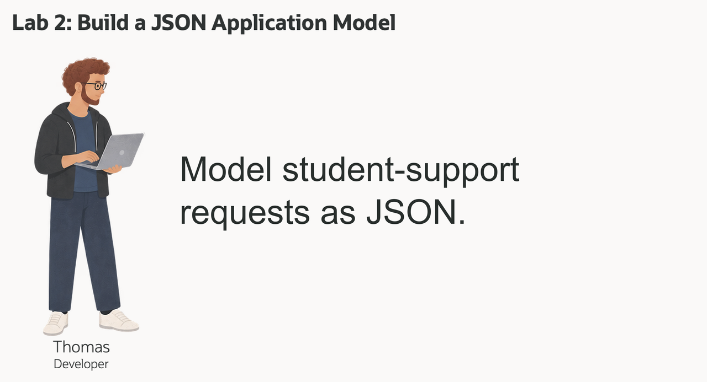
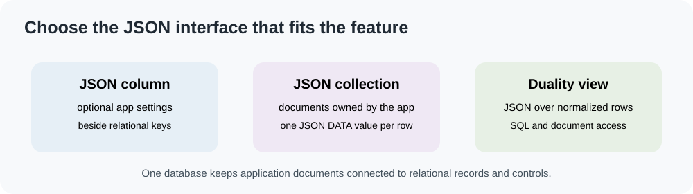
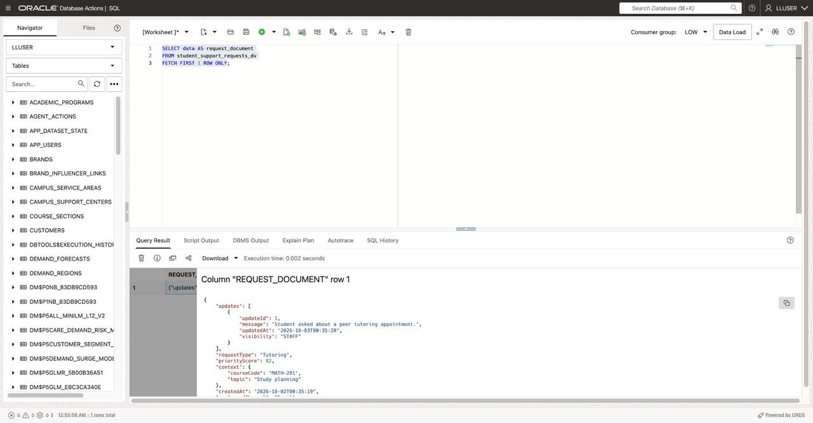
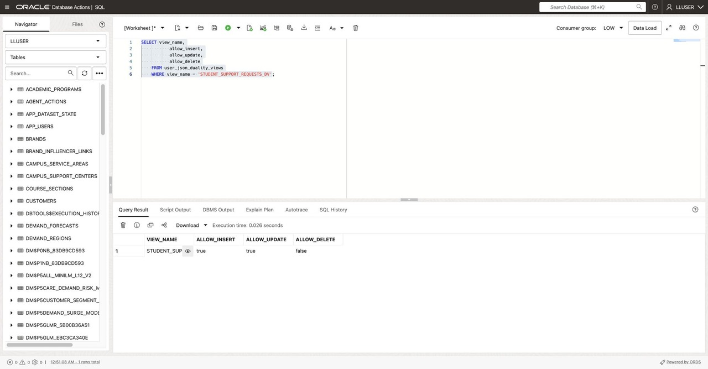

# Model Student-Support Requests as JSON

## Introduction



Thomas Brune builds a web application for Seer Higher Education's advising and support teams. The application needs request details in a document shape, while the database team needs keys, constraints, SQL, and transaction controls.

Thomas and Jessica compare three patterns: a JSON column for application settings, a JSON Collection Table for independently stored advising notes, and a JSON Relational Duality View over existing request rows. The collection stores a separate sample document; the duality view exposes the relational request without copying it.


### Objectives

- Store flexible application settings in a JSON column.
- Create and query a JSON Collection Table.
- Read and update relational request data through a JSON Relational Duality View.
- Choose a JSON pattern based on what the application needs to own.

Estimated Time: **10 minutes**

### Hands-on Scenario

| Step | Higher Education focus |
| --- | --- |
| Business Problem | Thomas needs an application-friendly request document for advising and support workflows. |
| Technical Challenge | The app needs flexible attributes while the database retains relational keys and controls. |
| Persona Focus | You work with Thomas and Jessica to compare JSON approaches. |
| What You Will See | JSON values, collections, and a duality view over the same request data. |
| Database Capability | Native JSON, SQL/JSON functions, and JSON Relational Duality. |
| Outcome | The application uses documents without a separate copy of request records. |

> **SQL Worksheet reminder:** Run these statements as `LLUSER`. Several tasks create objects or sample rows in the workshop schema.

## Task 1: Store flexible application settings as JSON

Thomas begins with settings that belong to the application rather than the core request record.

1. Create a table with a native JSON column and add preferences for one existing student:

    ```sql
    <copy>
    CREATE TABLE thomas_student_app_settings (
        student_id NUMBER PRIMARY KEY,
        app_settings JSON NOT NULL
    );

    INSERT INTO thomas_student_app_settings (student_id, app_settings)
    SELECT student_id,
           JSON_OBJECT(
               'screen' VALUE 'support-request',
               'showUpdates' VALUE 'true' FORMAT JSON,
               'topics' VALUE JSON_ARRAY('advising', 'tutoring')
               RETURNING JSON
           )
    FROM students
    FETCH FIRST 1 ROW ONLY;

    COMMIT;
    </copy>
    ```

2. Read the values with SQL/JSON functions:

    ```sql
    <copy>
    SELECT student_id,
           JSON_VALUE(app_settings, '$.screen') AS screen_name,
           JSON_VALUE(app_settings, '$.showUpdates' RETURNING BOOLEAN) AS show_updates,
           JSON_QUERY(app_settings, '$.topics') AS selected_topics
    FROM thomas_student_app_settings;
    </copy>
    ```

`STUDENT_ID` remains a relational key. The optional settings can evolve with the application without adding a column for every preference.

## Task 2: Create a JSON Collection Table

Thomas has a separate collection of short advising notes. These documents belong to the application and are not relational request records.

1. Create the collection and seed one document from an existing request:

    ```sql
    <copy>
    CREATE JSON COLLECTION TABLE thomas_advising_notes
    WITH ETAG;

    INSERT INTO thomas_advising_notes (data)
    SELECT JSON_OBJECT(
               '_id' VALUE r.request_id,
               'studentId' VALUE r.student_id,
               'topic' VALUE r.request_type,
               'status' VALUE r.request_status,
               'note' VALUE 'Review available campus support options',
               'tags' VALUE JSON_ARRAY('advising', 'follow-up')
               RETURNING JSON
           )
    FROM student_support_requests r
    FETCH FIRST 1 ROW ONLY;

    COMMIT;
    </copy>
    ```

2. Query the note document:

    ```sql
    <copy>
    SELECT JSON_SERIALIZE(data PRETTY) AS advising_note
    FROM thomas_advising_notes;
    </copy>
    ```

A collection is useful when the application owns a set of documents. It is not a replacement for the normalized request tables.

## Task 3: Read a request as a JSON document

The workshop provides `STUDENT_SUPPORT_REQUESTS_DV`, a duality view over request rows and request updates. Read one document:

```sql
<copy>
SELECT data AS request_document
FROM student_support_requests_dv
FETCH FIRST 1 ROW ONLY;
</copy>
```



Thomas sees request fields and nested updates together. Jessica can still query the underlying tables with ordinary SQL.

## Task 4: Check the duality view's write contract

The view definition determines which document changes can be written back to relational rows.

1. Inspect the view's capabilities:

    ```sql
    <copy>
    SELECT view_name,
           allow_insert,
           allow_update,
           allow_delete
    FROM user_json_duality_views
    WHERE view_name = 'STUDENT_SUPPORT_REQUESTS_DV';
    </copy>
    ```

    

2. Review the definition in the appendix. It allows inserts and updates to request rows and their nested request-update rows. The application can use the document interface while the database writes the corresponding normalized rows.

## Task 5: Create and update a support request through JSON

1. Insert a synthetic request document if request `990101` is not already present by using **Run Script (F5)**:

    ```sql
    <copy>
    INSERT INTO student_support_requests_dv (data)
    SELECT JSON(
      '{
        "_id": 990101,
        "studentId": 1001,
        "requestType": "Tutoring",
        "status": "OPEN",
        "priorityScore": 55,
        "preferredChannel": "Email",
        "followUpWindow": "This week",
        "context": {"courseCode": "MATH-201", "topic": "Study planning"},
        "updates": []
      }'
    )
    WHERE NOT EXISTS (
      SELECT 1 FROM student_support_requests WHERE request_id = 990101
    );

    COMMIT;
    </copy>
    ```

2. Verify the relational rows behind the document:

    ```sql
    <copy>
    SELECT request_id,
           request_type,
           request_status,
           priority_score,
           preferred_channel
    FROM student_support_requests
    WHERE request_id = 990101;
    </copy>
    ```

3. Update the request status through the duality view by using **Run Script (F5)**:

    ```sql
    <copy>
    UPDATE student_support_requests_dv
    SET data = JSON_TRANSFORM(data, SET '$.status' = 'IN_PROGRESS')
    WHERE JSON_VALUE(data, '$._id' RETURNING NUMBER) = 990101;

    COMMIT;
    </copy>
    ```

4. Run both queries with **Run Script (F5)**. Confirm that the document and relational row both show `IN_PROGRESS`:

    ```sql
    <copy>
    SELECT JSON_VALUE(data, '$.status') AS document_status
    FROM student_support_requests_dv
    WHERE JSON_VALUE(data, '$._id' RETURNING NUMBER) = 990101;

    SELECT request_id, request_status
    FROM student_support_requests
    WHERE request_id = 990101;
    </copy>
    ```

Both results show `IN_PROGRESS` because the document and relational query use the same request row.

## Task 6: Project JSON fields with SQL

A reporting query can project selected document fields into columns:

```sql
<copy>
SELECT JSON_VALUE(d.data, '$._id' RETURNING NUMBER) AS request_id,
       JSON_VALUE(d.data, '$.requestType') AS request_type,
       JSON_VALUE(d.data, '$.status') AS request_status,
       JSON_VALUE(d.data, '$.preferredChannel') AS preferred_channel,
       JSON_VALUE(d.data, '$.context.courseCode') AS course_code
FROM student_support_requests_dv d
WHERE JSON_VALUE(d.data, '$._id' RETURNING NUMBER) = 990101;
</copy>
```

## Conclusion: Choose the JSON pattern that fits

A JSON column is useful for optional application settings. A JSON Collection Table stores documents the application owns. A JSON Relational Duality View presents normalized request data as JSON while preserving relational storage and controls.

## Appendix: Student-support request duality view

The workshop setup creates the view below. The nested `updates` array is backed by `STUDENT_SUPPORT_UPDATES` rows.

```sql
<copy>
CREATE OR REPLACE JSON RELATIONAL DUALITY VIEW student_support_requests_dv AS
SELECT JSON {
    '_id'               : r.request_id,
    'studentId'         : r.student_id,
    'requestType'       : r.request_type,
    'status'            : r.request_status,
    'priorityScore'     : r.priority_score,
    'preferredChannel'  : r.preferred_channel,
    'followUpWindow'    : r.follow_up_window,
    'context'           : r.request_context,
    'createdAt'         : r.created_at,
    'updates' : [
        SELECT JSON {
            'updateId' : u.update_id,
            'message'  : u.update_text,
            'updatedAt': u.updated_at,
            'visibility': u.visibility
        }
        FROM student_support_updates u WITH INSERT UPDATE
        WHERE u.request_id = r.request_id
    ]
}
FROM student_support_requests r WITH INSERT UPDATE;
</copy>
```

## Acknowledgements

* **Author** - Linda Foinding
* **Contributor** - Teodor Constantin Nechita
* **Last Updated By/Date** - Teodor Constantin Nechita, October 2026
