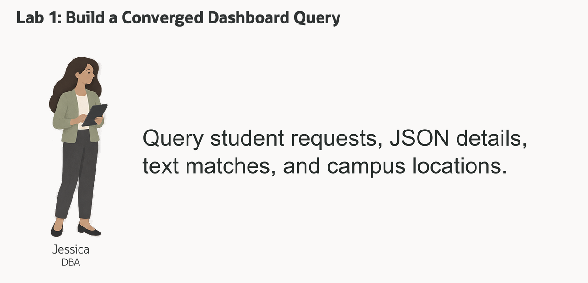
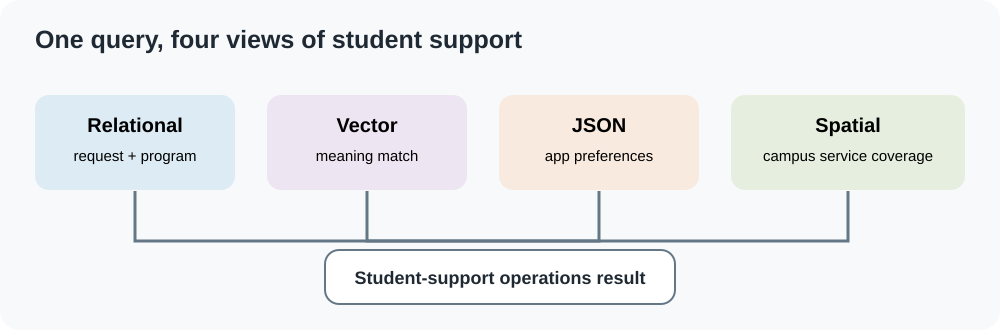
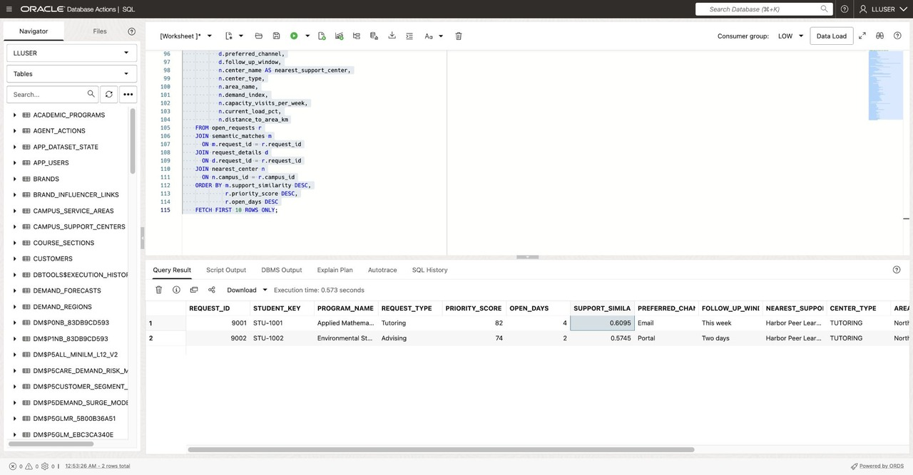

# Build a Converged Student-Support Query

<!-- markdownlint-configure-file
{
  "MD013": {
    "code_blocks": false,
    "tables": false
  }
}
-->

## Introduction



Jessica Chan is the database administrator at Seer Higher Education. Each
morning, student-support staff ask which open requests need attention and which
services can help. Jessica wants one query that brings together the request, its
flexible application details, a match between the request text and a support
question, and campus service coverage.

The information is stored in different forms. Request and program details are
relational. An application reads request updates as JSON. The service team
searches support descriptions by meaning, and campus centers and service areas
use spatial data. The records still belong to one governed database.

In this lab, you build the query behind a student-support operations view. It
combines relational request data, vector search, a JSON Relational Duality View,
and Oracle Spatial in one SQL statement.



### Objectives

* Explain convergence through a student-support operations question.
* Run one query that combines relational, vector, JSON, and spatial data.
* Change the search phrase and compare the requests that rank highest.

Estimated Time: **10 minutes**

### Hands-on Scenario

| Step | Higher Education focus |
| --- | --- |
| Business Problem | Support staff need a clear view of open requests, useful services, and campus coverage. |
| Technical Challenge | The answer crosses request rows, natural-language descriptions, JSON application details, and locations. |
| Persona Focus | You take Jessica's role and build a query the support team can review. |
| What You Will Do | Combine several Oracle Database capabilities in one SQL statement. |
| Database Capability | Relational SQL, AI Vector Search, JSON Relational Duality, and Oracle Spatial. |
| Outcome | Staff can review a request with service and location context from one database query. |

> **SQL Worksheet reminder:** Open SQL Worksheet as `LLUSER` using [Getting Started](?lab=getting-started).

## Task 1: Run a converged support query

The query ranks open requests with priority scores of at least 60 by similarity
to a support question. It adds contact preferences from JSON and the active
center nearest to North Quad on the same campus. The center is selected for the
area, not separately for each request.

1. Run the query:

    ```sql
    <copy>
    -- RELATIONAL: summarize open requests and their program context.
    WITH open_requests AS (
        SELECT c.request_id,
               c.campus_id,
               c.student_key,
               c.program_name,
               c.request_type,
               c.priority_score,
               c.open_days,
               c.campus_name
        FROM student_support_cases_v c
        WHERE c.request_status = 'OPEN'
          AND c.priority_score >= 60
    ),
    -- VECTOR: rank support signals by meaning, not exact wording.
    semantic_matches AS (
        SELECT e.request_id,
               ROUND(1 - VECTOR_DISTANCE(
                   e.embedding,
                   VECTOR_EMBEDDING(
                       ADMIN.ALL_MINILM_L12_V2
                       USING 'student needs tutoring, advising, or help finding campus services' AS DATA
                   ),
                   COSINE
               ), 4) AS support_similarity
        FROM student_support_signal_embeddings e
    ),
    -- JSON: project application preferences from the duality document.
    request_details AS (
        SELECT jt.request_id,
               jt.preferred_channel,
               jt.follow_up_window
        FROM student_support_requests_dv d
        CROSS APPLY JSON_TABLE(
            d.data,
            '$'
            COLUMNS (
                request_id NUMBER PATH '$._id',
                preferred_channel VARCHAR2(40) PATH '$.preferredChannel',
                follow_up_window VARCHAR2(40) PATH '$.followUpWindow'
            )
        ) jt
    ),
    -- SPATIAL: find the active center closest to a campus service area.
    nearest_center AS (
        SELECT campus_id,
               center_name,
               campus_name,
               center_type,
               capacity_visits_per_week,
               current_load_pct,
               area_name,
               demand_index,
               distance_to_area_km
        FROM (
            SELECT c.campus_id,
                   c.center_id,
                   c.center_name,
                   c.campus_name,
                   c.center_type,
                   c.capacity_visits_per_week,
                   c.current_load_pct,
                   a.area_name,
                   a.demand_index,
                   ROUND(SDO_GEOM.SDO_DISTANCE(
                       c.location,
                       a.boundary,
                       0.005,
                       'unit=KM'
                   ), 2) AS distance_to_area_km,
                   ROW_NUMBER() OVER (
                       PARTITION BY c.campus_id
                       ORDER BY SDO_GEOM.SDO_DISTANCE(
                           c.location,
                           a.boundary,
                           0.005,
                           'unit=KM'
                       ), c.center_id
                   ) AS center_rank
            FROM campus_support_centers c
            JOIN campus_service_areas a
              ON a.campus_id = c.campus_id
            WHERE a.area_name = 'North Quad'
              AND c.is_active = 1
        )
        WHERE center_rank = 1
    )
    -- CONVERGED RESULT: put the four kinds of evidence in one result.
    SELECT r.request_id,
           r.student_key,
           r.program_name,
           r.request_type,
           r.priority_score,
           r.open_days,
           m.support_similarity,
           d.preferred_channel,
           d.follow_up_window,
           n.center_name AS nearest_support_center,
           n.center_type,
           n.area_name,
           n.demand_index,
           n.capacity_visits_per_week,
           n.current_load_pct,
           n.distance_to_area_km
    FROM open_requests r
    JOIN semantic_matches m
      ON m.request_id = r.request_id
    JOIN request_details d
      ON d.request_id = r.request_id
    JOIN nearest_center n
      ON n.campus_id = r.campus_id
    ORDER BY m.support_similarity DESC,
             r.priority_score DESC,
             r.open_days DESC
    FETCH FIRST 10 ROWS ONLY;
    </copy>
    ```

    

2. Review the result. Each row combines request fields, text similarity, JSON
    contact preferences, and a center selected for North Quad. The query does
    not match a center’s service type to the request. In the prepared data, both
    Harbor centers are inside North Quad, so their distance is zero and the
    center identifier breaks the tie. Review service fit and capacity before
    recommending a center.

The source records remain in Oracle AI Database. The team can inspect the
request and supporting context without reconciling a separate search index,
document store, and campus map.

## Task 2: Change the support question

The first query searches for general tutoring and advising help. Change the text
passed to `VECTOR_EMBEDDING` to:

```text
quiet study space and peer tutoring near the science buildings
```

Run the query again and compare the top results.

1. Which requests move up the list?
2. Which requests remain high priority even when their descriptions are less
    similar to the new phrase?
3. What does the selected center’s current load tell you, and what additional
    demand and availability information would you need before routing a request?

Only the semantic question changed. The relational, JSON, and spatial parts
continue to use the same governed records.

## Conclusion: Keep the evidence together

Jessica's query brings request priority, semantic relevance, JSON application
details, and campus coverage into one result. Staff can use it as a starting
point for a support discussion and inspect the records behind each row.

## Next Steps

Next, Thomas compares JSON columns, JSON collections, and JSON Relational
Duality for a student-support application.

## Acknowledgements

* **Author** - Linda Foinding
* **Contributor** - Teodor Constantin Nechita
* **Last Updated By/Date** - Teodor Constantin Nechita, October 2026
