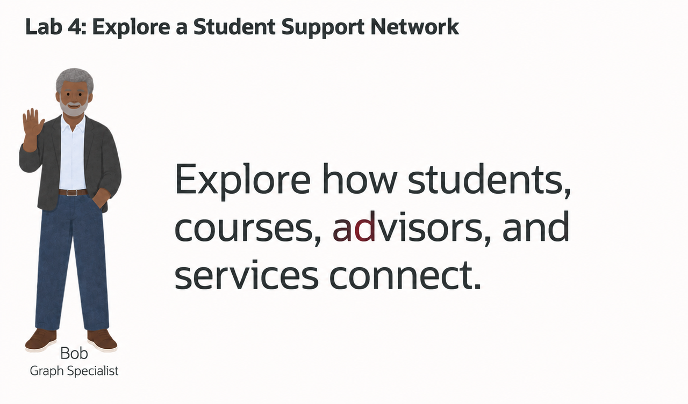
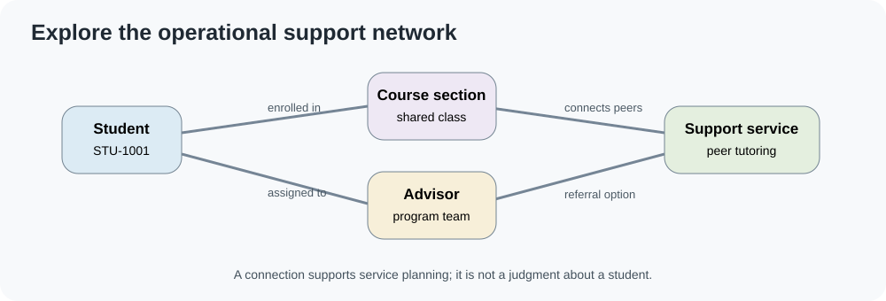
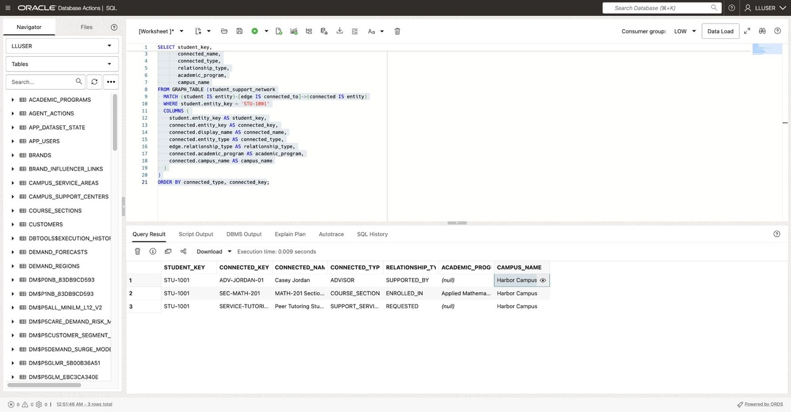

# Explore the Student-Support Network

## Introduction



Bob Green is a graph specialist at Seer Higher Education. Advisors already work with students, course sections, and campus services, but those relationships are spread across relational records. Bob uses a property graph to make useful paths easier to query and explore.

The graph is a projection of synthetic student, course, advisor, and support-service records. A connection can help staff understand which services are used by a course community; it is not evidence that a student has a particular academic outcome or is eligible for a service.



<details>
<summary><strong>Key terms: property graph, vertex, edge, and SQL/PGQ</strong></summary>

> - A **property graph** represents entities and the relationships between them.
> - A **vertex** is a graph node, such as a student, course section, advisor, or campus service.
> - An **edge** connects two vertices and can carry properties such as relationship type, academic term, or evidence score.
> - A **hop** is one step across an edge. A multi-hop path follows a chain of relationships.
> - **SQL Property Graph Queries (SQL/PGQ)** describe graph patterns in SQL and return ordinary SQL result columns.

</details>

### Objectives

- Identify vertices and edges in a student-support property graph.
- Compare a relational join with a SQL/PGQ pattern.
- Follow relationships for up to four hops.
- Find students connected through a course section or support service.
- Import and run a Graph Studio notebook.

Estimated Time: **15 minutes**

### Hands-on Scenario

| Step | Higher Education focus |
| --- | --- |
| Business Problem | Advisors need to understand how course communities and support services connect. |
| Technical Challenge | Multi-step relationships are difficult to express as repeated joins. |
| Persona Focus | You follow Bob's graph design and review its results. |
| What You Will See | SQL/PGQ returns connected entities, and Graph Studio displays selected paths. |
| Database Capability | Oracle Property Graph, `GRAPH_TABLE`, and SQL/PGQ. |
| Outcome | Staff can explore service connections while keeping the source records in Oracle AI Database. |

> **SQL Worksheet reminder:** Run the SQL blocks as `LLUSER`.

## Task 1: Read direct relationships with relational SQL

The graph's source data uses `STUDENT_SUPPORT_NETWORK_ENTITIES` for vertices and `STUDENT_SUPPORT_NETWORK_LINKS` for edges. Start with one synthetic student key and list the entities directly connected to it.

```sql
<copy>
SELECT seed.entity_key AS student_key,
       reached.entity_key AS connected_key,
       reached.display_name AS connected_name,
       reached.entity_type AS connected_type,
       link.relationship_type,
       reached.academic_program,
       reached.campus_name
FROM student_support_network_entities seed
JOIN student_support_network_links link
  ON link.from_entity_id = seed.entity_id
JOIN student_support_network_entities reached
  ON reached.entity_id = link.to_entity_id
WHERE seed.entity_key = 'STU-1001'
ORDER BY reached.entity_type, reached.entity_key;
</copy>
```

This join is clear for one step. Following a path through a course section, another student, and a service requires more joins and aliases. Each additional step makes the query longer.

## Task 2: Read the same relationship with SQL/PGQ

The workshop setup provides the `STUDENT_SUPPORT_NETWORK` property graph over those relational tables.

```sql
<copy>
SELECT student_key,
       connected_key,
       connected_name,
       connected_type,
       relationship_type,
       academic_program,
       campus_name
FROM GRAPH_TABLE (student_support_network
  MATCH (student IS entity)-[edge IS connected_to]->(connected IS entity)
  WHERE student.entity_key = 'STU-1001'
  COLUMNS (
    student.entity_key AS student_key,
    connected.entity_key AS connected_key,
    connected.display_name AS connected_name,
    connected.entity_type AS connected_type,
    edge.relationship_type AS relationship_type,
    connected.academic_program AS academic_program,
    connected.campus_name AS campus_name
  )
)
ORDER BY connected_type, connected_key;
</copy>
```



The result has the same shape as the relational query. The graph pattern states that the query starts at one student vertex, follows one edge, and returns the connected vertex.

## Task 3: Follow paths up to four hops

A course section may connect a student to peers, advisors, and services. This query returns paths that reach entities in one to four relationships.

```sql
<copy>
SELECT student_key,
       path_entity_keys,
       relationship_hops
FROM GRAPH_TABLE (student_support_network
  MATCH (seed IS entity) (-[edge IS connected_to]-> (reached IS entity)){1,4}
  WHERE seed.entity_key = 'STU-1001'
  COLUMNS (
    seed.entity_key AS student_key,
    LISTAGG(reached.entity_key, ' -> ') AS path_entity_keys,
    COUNT(edge.relationship_type) AS relationship_hops
  )
)
ORDER BY relationship_hops, path_entity_keys
FETCH FIRST 25 ROWS ONLY;
</copy>
```

A value of `1` means the path contains one relationship. Larger values show additional steps. The path lists the connected entity keys in order. The graph is an operational map of connections; it should not be used to infer a student's academic standing.

## Task 4: Find students connected through a shared resource

Bob now asks which students connect to the same course section or support service. The pattern begins at one student, follows an edge to a shared entity, and follows another edge back to a second student.

```sql
<copy>
SELECT student_a,
       shared_entity,
       shared_type,
       student_b,
       program_a,
       program_b,
       relationship_a,
       relationship_b
FROM GRAPH_TABLE (student_support_network
  MATCH (a IS entity)-[edge_a IS connected_to]->(shared IS entity)
        <-[edge_b IS connected_to]-(b IS entity)
  WHERE a.entity_type = 'STUDENT'
    AND b.entity_type = 'STUDENT'
    AND a.entity_id < b.entity_id
    AND shared.entity_type IN ('COURSE_SECTION', 'SUPPORT_SERVICE')
  COLUMNS (
    a.entity_key AS student_a,
    shared.entity_key AS shared_entity,
    shared.entity_type AS shared_type,
    b.entity_key AS student_b,
    a.academic_program AS program_a,
    b.academic_program AS program_b,
    edge_a.relationship_type AS relationship_a,
    edge_b.relationship_type AS relationship_b
  )
)
ORDER BY shared_type, shared_entity, student_a
FETCH FIRST 25 ROWS ONLY;
</copy>
```

A shared course or service can help an advisor plan group support. It does not prove that two students know each other or need the same intervention.

## Task 5: Open Graph Studio

1. Open **Database Actions** and confirm that the signed-in account is `LLUSER`.
2. Select **Development**, then **Graph Studio**.
3. If prompted, sign in with the workshop user and reservation password.
4. Open **Notebooks**. The landing page also includes graph, template, and job tools.

## Task 6: Import and run the student-support notebook

The supplied `.dsnb` file contains SQL/PGQ paragraphs and graph visualizations for the same synthetic network.

1. Download [seer-student-support-network.dsnb](files/seer-student-support-network.dsnb).
2. In Graph Studio, select **Notebooks**, then **Import**.
3. Choose the downloaded file and select **Import**.
4. Open **Student Support Network** and run the first SQL paragraph.
5. Run the graph visualization paragraph anchored on `STU-1001`, then the service-centered paragraph anchored on `SERVICE-TUTORING-01`.

Compare the table result with the visualization. Node placement can change between runs; the entity keys and relationship evidence are the details to review.

## Conclusion: Use graph paths to explore service connections

The relational query reads a direct relationship. SQL/PGQ expresses the multi-step path more directly, and Graph Studio provides a visual view of selected connections. Both approaches use the graph projection backed by the workshop's relational records.

## Appendix: Property graph definition

The workshop setup creates this graph over its relational projection. The graph definition maps the entity table to vertices and the link table to directed edges.

```sql
<copy>
CREATE PROPERTY GRAPH student_support_network
  VERTEX TABLES (
    student_support_network_entities KEY (entity_id)
      LABEL entity
      PROPERTIES (
        entity_id,
        entity_key,
        display_name,
        entity_type,
        academic_program,
        campus_name,
        priority_score,
        open_request_count
      )
  )
  EDGE TABLES (
    student_support_network_links KEY (link_id)
      SOURCE KEY (from_entity_id)
        REFERENCES student_support_network_entities (entity_id)
      DESTINATION KEY (to_entity_id)
        REFERENCES student_support_network_entities (entity_id)
      LABEL connected_to
      PROPERTIES (
        relationship_type,
        evidence_score,
        academic_term
      )
  );
</copy>
```

## Acknowledgements

* **Author** - Linda Foinding
* **Last Updated** - October 2026
