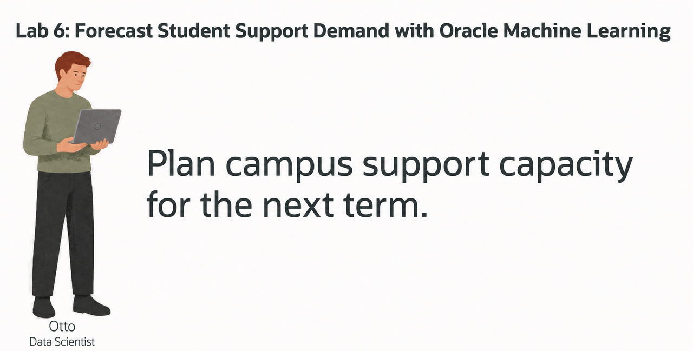
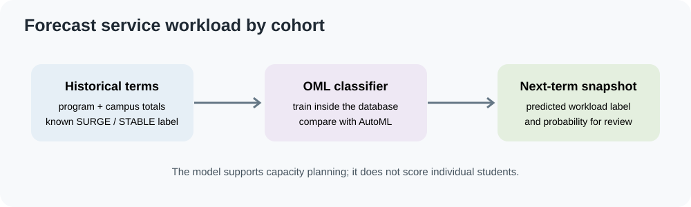
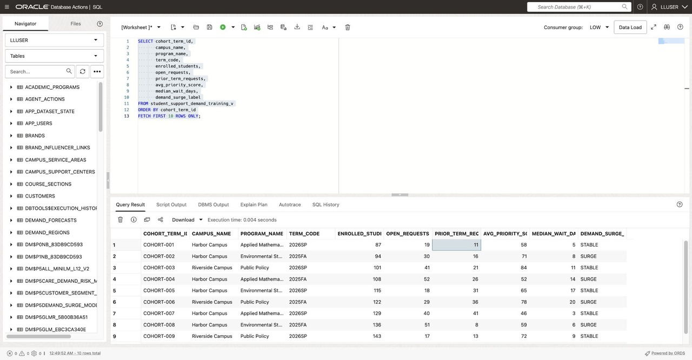
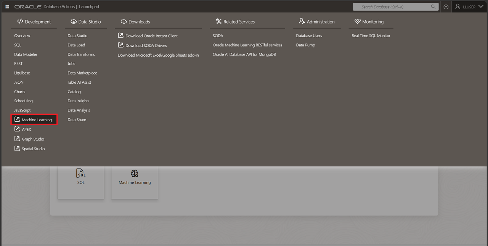
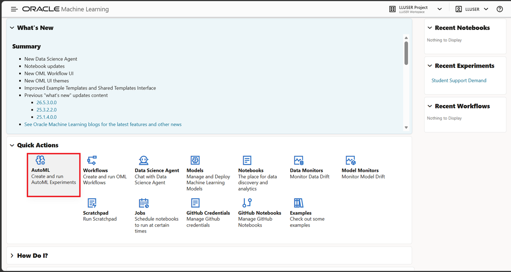
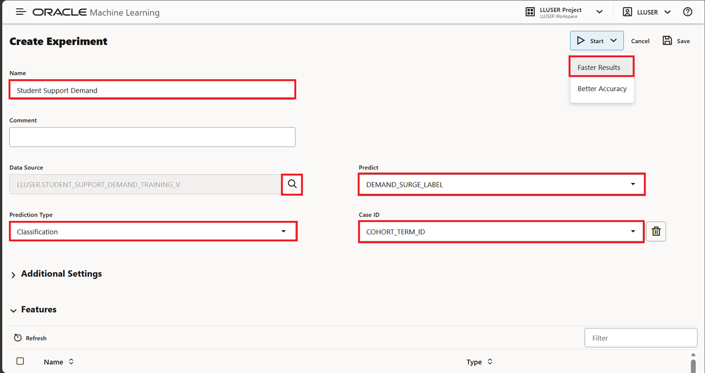
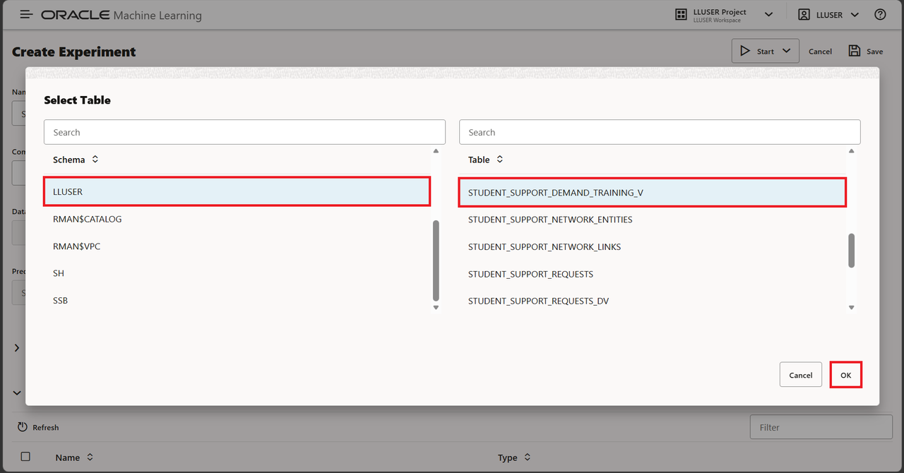
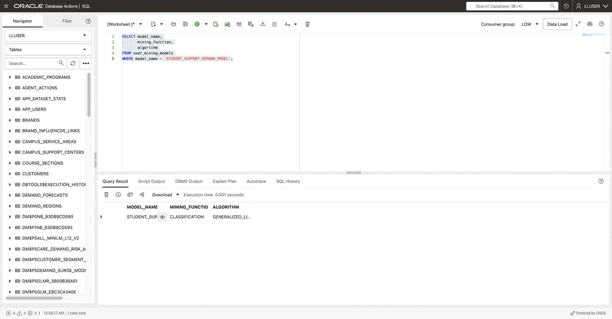

# Forecast Student-Support Demand with Oracle Machine Learning

## Introduction



Otto Spencer is a data scientist at Seer Higher Education. Student-support leaders need to plan staffing for upcoming terms. Otto builds a model that flags program-and-campus cohorts whose service workload may surge.

The model predicts an operational workload label from aggregated, synthetic term data. It does not score individual students or make admissions, advising, or academic decisions. Training, scoring, and the supporting data stay in Oracle AI Database.



<details>
<summary><strong>Key terms: model, feature, classification, and probability</strong></summary>

> - A **model** learns patterns from examples and uses them to produce a prediction.
> - A **feature** is an input column used by the model, such as open request counts or average wait days.
> - **Classification** predicts a label. This lab predicts `SURGE` or `STABLE` for an aggregated program-and-campus term.
> - A **probability** is the model's value for a possible label. It helps rank results; it is not a guarantee.
> - **In-database machine learning** trains or scores data where it already lives.

</details>

### Objectives

- Read the prepared support-demand training view.
- Optionally compare classifiers with Oracle Machine Learning AutoML.
- Create a Generalized Linear Model in Oracle AI Database.
- Score a separate next-term snapshot with `PREDICTION` and `PREDICTION_PROBABILITY`.
- Interpret the output as an operations-planning signal, not an individual student decision.

Estimated Time: **15 minutes**

### Hands-on Scenario

| Step | Higher Education focus |
| --- | --- |
| Business Problem | Operations needs an early view of programs that may need more support capacity. |
| Technical Challenge | Otto needs to train and score without exporting the aggregated workload data. |
| Persona Focus | You follow Otto as he checks the training data and tests a model. |
| What You Will See | AutoML can compare candidates; SQL creates and scores the selected model. |
| Database Capability | AutoML, `DBMS_DATA_MINING`, `PREDICTION`, and `PREDICTION_PROBABILITY`. |
| Outcome | A workload watchlist combines a model label with the operational data behind it. |

> **SQL Worksheet reminder:** Run the SQL blocks as `LLUSER`. The optional AutoML task uses Database Actions.

## Task 1: Read the training data

The prepared `STUDENT_SUPPORT_DEMAND_TRAINING_V` view contains one row per program, campus, and term. The input columns describe aggregated service workload. `DEMAND_SURGE_LABEL` is the known training label.

```sql
<copy>
SELECT cohort_term_id,
       campus_name,
       program_name,
       term_code,
       enrolled_students,
       open_requests,
       prior_term_requests,
       avg_priority_score,
       median_wait_days,
       demand_surge_label
FROM student_support_demand_training_v
ORDER BY cohort_term_id
FETCH FIRST 10 ROWS ONLY;
</copy>
```



The rows are aggregated by cohort; they do not represent individual students. In this synthetic training data, the label follows the historical term exactly. Keep `TERM_CODE` for reporting, but exclude it from model inputs so an unseen future term does not drive every prediction to the same label.

Create the feature view used by AutoML and the SQL model. It retains the known label and omits `TERM_CODE`:

```sql
<copy>
CREATE OR REPLACE VIEW student_support_demand_features_v AS
SELECT cohort_term_id,
       campus_name,
       program_name,
       enrolled_students,
       open_requests,
       prior_term_requests,
       avg_priority_score,
       median_wait_days,
       demand_surge_label
FROM student_support_demand_training_v;
</copy>
```

## Task 2: Compare models with AutoML (optional)

Otto uses Oracle Machine Learning AutoML to compare candidate models and see how well they identify the two support-demand labels.

AutoML may take several minutes. Skip to Task 3 to create the workshop’s example model directly in SQL Worksheet.

1. Open **Machine Learning** from Database Actions.

2. Sign in with the credentials in **View Login Info**.

    

3. Select **AutoML**.

    

4. Create a new experiment with these settings:

    | Setting | Value |
    | --- | --- |
    | Experiment name | `Student Support Demand` |
    | Data source | `STUDENT_SUPPORT_DEMAND_FEATURES_V` |
    | Predict | `DEMAND_SURGE_LABEL` |
    | Prediction type | `Classification` |
    | Case ID | `COHORT_TERM_ID` |

    **Note:** The **Predict**, **Prediction Type**, and **Case ID** fields become available after you enter a data source.

    

5. Enter `Student Support Demand` in the **Name** field. Select the magnifying-glass icon beside **Data Source**. In **Select Table**, choose schema `LLUSER`, table `STUDENT_SUPPORT_DEMAND_FEATURES_V`, and then **OK**.

    

6. Select `DEMAND_SURGE_LABEL` for **Predict**, `Classification` for **Prediction Type**, and `COHORT_TERM_ID` for **Case ID**.

7. Choose **Start → Faster Results** and wait for the leaderboard. Runtime varies; the leaderboard may take several minutes.

8. Review the leaderboard and model details.

With the supplied data, AutoML can produce a leaderboard with Decision Tree and Support Vector Machine (Gaussian) among the leading candidates. Model names and scores may vary between runs. Open candidate model details and inspect the confusion matrix. Check whether the model identifies both `SURGE` and `STABLE` rows. A model that predicts only `STABLE` cannot identify potential workload surges, even if its overall accuracy looks high. Check false positives and missed surges before choosing a candidate.

The training rows are synthetic and aggregated by program, campus, and term. Scores on this data do not establish accuracy on future terms, and the rows do not represent individual students.

Review feature impact as a diagnostic. It shows which values influenced predictions; it does not prove that a feature causes a change in demand.

Task 3 trains a Generalized Linear Model separately in SQL.

## Task 3: Create the model in SQL

Create a settings table and train a database model from the prepared view by using **Run Script (F5)**:

```sql
<copy>
CREATE TABLE student_support_model_settings (
    setting_name  VARCHAR2(30),
    setting_value VARCHAR2(4000)
);

INSERT INTO student_support_model_settings (setting_name, setting_value)
VALUES ('ALGO_NAME', 'ALGO_GENERALIZED_LINEAR_MODEL');

INSERT INTO student_support_model_settings (setting_name, setting_value)
VALUES ('PREP_AUTO', 'ON');

INSERT INTO student_support_model_settings (setting_name, setting_value)
VALUES ('ODMS_RANDOM_SEED', '20261005');

COMMIT;

BEGIN
  DBMS_DATA_MINING.CREATE_MODEL(
    model_name           => 'STUDENT_SUPPORT_DEMAND_MODEL',
    mining_function      => DBMS_DATA_MINING.CLASSIFICATION,
    data_table_name      => 'STUDENT_SUPPORT_DEMAND_FEATURES_V',
    case_id_column_name  => 'COHORT_TERM_ID',
    target_column_name   => 'DEMAND_SURGE_LABEL',
    settings_table_name  => 'STUDENT_SUPPORT_MODEL_SETTINGS'
  );
END;
/
</copy>
```

Confirm that Oracle created the model:

```sql
<copy>
SELECT model_name,
       mining_function,
       algorithm
FROM user_mining_models
WHERE model_name = 'STUDENT_SUPPORT_DEMAND_MODEL';
</copy>
```



The expected mining function is `CLASSIFICATION`, and the algorithm is `GENERALIZED_LINEAR_MODEL`.

## Task 4: Score a next-term workload snapshot

The separate scoring table contains the model inputs for a future term and does not contain the training label.

1. Create a scoring table and seed it from the prepared aggregated data by using **Run Script (F5)**:

    ```sql
    <copy>
    CREATE TABLE student_support_scoring_data (
        cohort_term_id       VARCHAR2(60),
        campus_name          VARCHAR2(100),
        program_name         VARCHAR2(150),
        term_code            VARCHAR2(30),
        enrolled_students    NUMBER,
        open_requests        NUMBER,
        prior_term_requests  NUMBER,
        avg_priority_score   NUMBER,
        median_wait_days     NUMBER
    );

    INSERT INTO student_support_scoring_data (
        cohort_term_id,
        campus_name,
        program_name,
        term_code,
        enrolled_students,
        open_requests,
        prior_term_requests,
        avg_priority_score,
        median_wait_days
    )
    SELECT 'NEXT-' || cohort_term_id,
           campus_name,
           program_name,
           '2027SP',
           enrolled_students + 20,
           open_requests + 4,
           prior_term_requests,
           avg_priority_score,
           median_wait_days + 1
    FROM (
        SELECT cohort_term_id,
               campus_name,
               program_name,
               enrolled_students,
               open_requests,
               prior_term_requests,
               avg_priority_score,
               median_wait_days,
               ROW_NUMBER() OVER (ORDER BY cohort_term_id) AS row_num
        FROM student_support_demand_training_v
    )
    WHERE row_num <= 12;

    COMMIT;
    </copy>
    ```

2. Score the rows and order the potential surges first:

    ```sql
    <copy>
    SELECT cohort_term_id,
           campus_name,
           program_name,
           term_code,
           PREDICTION(
             STUDENT_SUPPORT_DEMAND_MODEL USING
             campus_name,
             program_name,
             enrolled_students,
             open_requests,
             prior_term_requests,
             avg_priority_score,
             median_wait_days
           ) AS predicted_demand,
           ROUND(
             PREDICTION_PROBABILITY(
               STUDENT_SUPPORT_DEMAND_MODEL,
               'SURGE' USING
               campus_name,
               program_name,
               enrolled_students,
               open_requests,
               prior_term_requests,
               avg_priority_score,
               median_wait_days
             ), 4
           ) AS surge_probability,
           open_requests,
           median_wait_days
    FROM student_support_scoring_data
    ORDER BY surge_probability DESC, cohort_term_id;
    </copy>
    ```

With the supplied data, expect both labels in the scoring result: 9 `SURGE` cohorts and 3 `STABLE` cohorts. Compare the probabilities to rank cohorts within each label. Values may vary if the training or scoring data changes.

`PREDICTED_DEMAND` is the selected label. `SURGE_PROBABILITY` helps operations rank cohorts for review, but it does not guarantee a future workload change. Staff should check the counts and local context before adjusting capacity.

## Conclusion: Keep the prediction beside the workload data

Otto reviewed aggregated training rows, optionally compared candidates with AutoML, created a Generalized Linear Model, and scored a separate next-term snapshot. The result combines a workload signal with the inputs a planner can review, all inside Oracle AI Database.

## Acknowledgements

* **Author** - Linda Foinding
* **Contributor** - Teodor Constantin Nechita
* **Last Updated By/Date** - Teodor Constantin Nechita, October 2026
