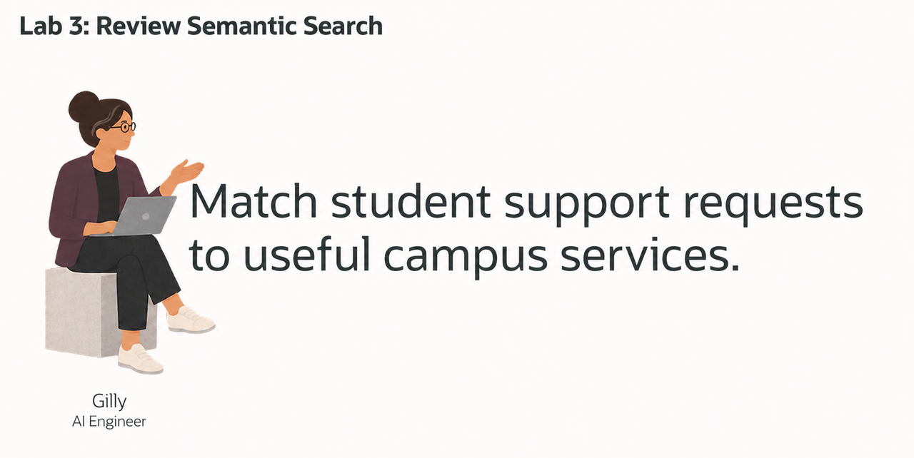
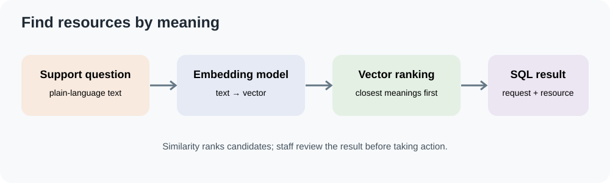
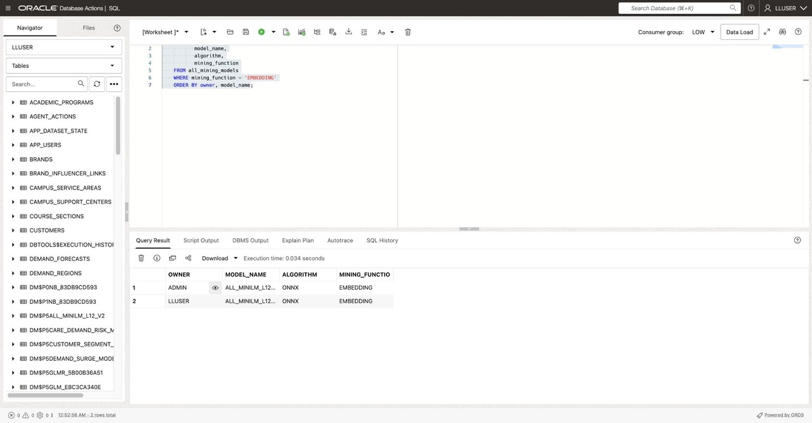
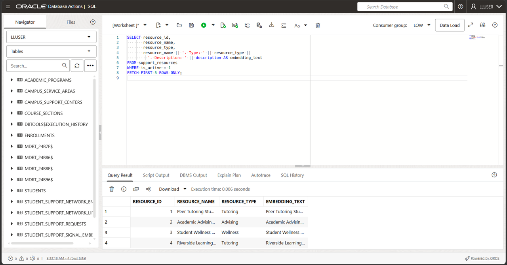
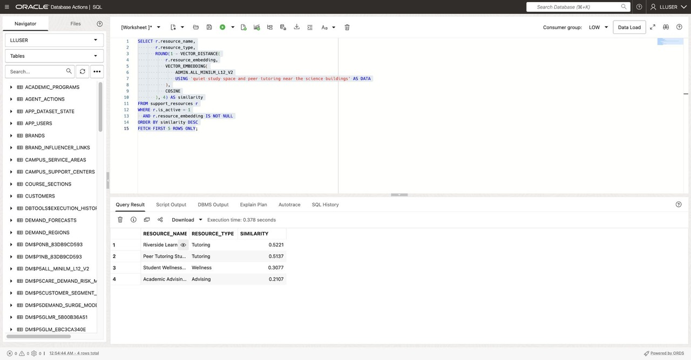

# Find Support Resources with AI Vector Search

<!-- markdownlint-configure-file
{
  "MD013": {
    "code_blocks": false,
    "tables": false
  }
}
-->

## Introduction



Gilly Bourne is an AI engineer at Seer Higher Education. The advising team wants
to find useful campus services from a student's request, even when the request
uses different wording from the resource catalog.

Gilly uses an embedding model to turn support-resource descriptions into
vectors. Oracle AI Database can compare the meaning of a request with those
vectors, then use SQL to connect the best matches to open requests and program
details.



### Objectives

* Check for an in-database embedding model.
* Create vectors from support-resource text.
* Rank resources by semantic similarity to a support question.
* Join the matches to open request and program details.

Estimated Time: **10 minutes**

### Hands-on Scenario

| Step | Higher Education focus |
| --- | --- |
| Business Problem | Staff need to find relevant support resources without relying on exact keywords. |
| Technical Challenge | Gilly must search resource descriptions by meaning and return records staff can review. |
| Persona Focus | You review Gilly's vector-search implementation. |
| What You Will See | Vector distance ranks service matches; SQL adds request and program context. |
| Database Capability | `VECTOR_EMBEDDING`, vector columns, and `VECTOR_DISTANCE`. |
| Outcome | A support team can find possible resources without copying descriptions to a separate search service. |

> **SQL Worksheet reminder:** Run the statements as `LLUSER`.

## Task 1: Check the embedding model

1. List the embedding models accessible to the workshop account:

    ```sql
    <copy>
    SELECT owner,
           model_name,
           algorithm,
           mining_function
    FROM all_mining_models
    WHERE mining_function = 'EMBEDDING'
    ORDER BY owner, model_name;
    </copy>
    ```

    

The prepared workshop environment should include `ADMIN.ALL_MINILM_L12_V2`, an
ONNX embedding model that returns 384-dimensional vectors.

## Task 2: Choose text for the embedding

Gilly embeds each resource's name, category, and description. These fields
describe the service; operational values such as appointment counts are better
left as relational columns.

```sql
<copy>
SELECT resource_id,
       resource_name,
       resource_type,
       resource_name || '. Type: ' || resource_type ||
         '. Description: ' || description AS embedding_text
FROM support_resources
WHERE is_active = 1
FETCH FIRST 5 ROWS ONLY;
</copy>
```

  

## Task 3: Create resource vectors in the database

1. Add a vector column for the 384-dimensional model output:

    ```sql
    <copy>
    ALTER TABLE support_resources
      ADD (resource_embedding VECTOR(384));
    </copy>
    ```

2. Create a vector for each active resource and commit the update by using **Run
    Script (F5)**:

    ```sql
    <copy>
    UPDATE support_resources
    SET resource_embedding = VECTOR_EMBEDDING(
        ADMIN.ALL_MINILM_L12_V2 USING
          resource_name || '. Type: ' || resource_type ||
          '. Description: ' || description AS DATA
    )
    WHERE is_active = 1
      AND resource_embedding IS NULL;

    COMMIT;
    </copy>
    ```

3. Check the populated vectors:

    ```sql
    <copy>
    SELECT resource_id,
           resource_name,
           resource_embedding
    FROM support_resources
    WHERE resource_embedding IS NOT NULL
    ORDER BY resource_id;
    </copy>
    ```
  

Each vector stays beside the resource record it describes. The resource text
does not need to be copied to a separate vector database.

## Task 4: Rank resources for a plain-language question

Gilly asks for help finding tutoring and quiet study space near the science
buildings. The database embeds the question at run time and compares it with the
stored resource vectors.

```sql
<copy>
SELECT r.resource_name,
       r.resource_type,
       ROUND(1 - VECTOR_DISTANCE(
           r.resource_embedding,
           VECTOR_EMBEDDING(
               ADMIN.ALL_MINILM_L12_V2
               USING 'quiet study space and peer tutoring near the science buildings' AS DATA
           ),
           COSINE
       ), 4) AS similarity
FROM support_resources r
WHERE r.is_active = 1
  AND r.resource_embedding IS NOT NULL
ORDER BY similarity DESC
FETCH FIRST 5 ROWS ONLY;
</copy>
```



A higher similarity score means the resource text is closer in meaning to the
question. This query does not filter by campus or calculate distance to the
science buildings. Check the resource’s location, availability, and eligibility
requirements before recommending it.

## Task 5: Connect the matches to open requests

The service team also needs the open requests already linked to each resource.
`STUDENT_SUPPORT_CASES_V` supplies the stored recommended-resource identifier
and a synthetic student key. The join uses that existing recommendation; it does
not choose a new resource for each request.

```sql
<copy>
WITH ranked_resources AS (
    SELECT r.resource_id,
           r.resource_name,
           r.resource_type,
           ROUND(1 - VECTOR_DISTANCE(
               r.resource_embedding,
               VECTOR_EMBEDDING(
                   ADMIN.ALL_MINILM_L12_V2
                   USING 'help planning a study schedule and finding a peer tutor' AS DATA
               ),
               COSINE
           ), 4) AS similarity
    FROM support_resources r
    WHERE r.is_active = 1
      AND r.resource_embedding IS NOT NULL
)
SELECT c.request_id,
       c.student_key,
       c.program_name,
       c.request_type,
       c.priority_score,
       rr.resource_name,
       rr.resource_type,
       rr.similarity
FROM student_support_cases_v c
JOIN ranked_resources rr
  ON rr.resource_id = c.recommended_resource_id
WHERE c.request_status = 'OPEN'
ORDER BY rr.similarity DESC,
         c.priority_score DESC
FETCH FIRST 15 ROWS ONLY;
</copy>
```
  

## Conclusion: Search by meaning, then review the records

Gilly used an in-database model to find resources by meaning. SQL then connected
the ranked service matches to open requests and program context. Staff can
review the result and decide what follow-up is appropriate.

## Acknowledgements

* **Author** - Linda Foinding
* **Last Updated** - October 2026
