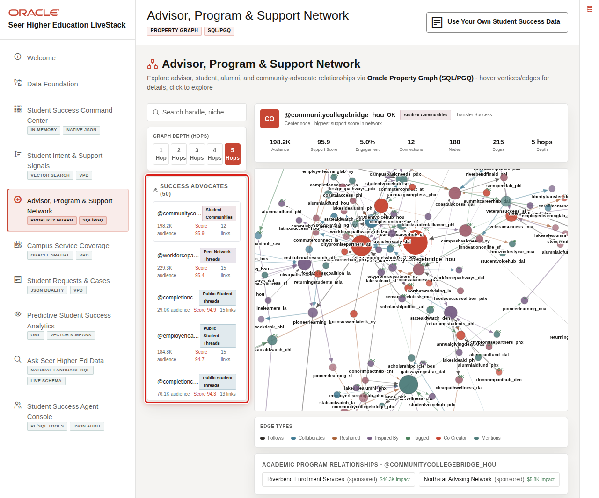

# Advisor, Program, and Support Network with Property Graph

## Introduction

A student-support decision can depend on relationships that a row-by-row report hides. Which advocates connect? Which program do they support? How can a message reach a student community?

In this lab, you act as a student-success analyst. You will inspect Oracle Property Graph and SQL/PGQ evidence. The graph stays connected to the operational rows for advocates and programs.

The image shows the Advisor, Program & Support Network page. An analyst uses it to explore advocates and programs. The SQL turns that visual network into reviewable evidence: direct connections, then a named advocate-to-program path.

<strong>Key terms: vertex, edge, path, and SQL/PGQ</strong>

> - A **vertex** is a thing in the network, such as a success advocate or academic program.
> - An **edge** is a relationship between vertices.
> - A **path** follows one or more connected edges.
> - SQL Property Graph Query (SQL/PGQ) lets SQL describe those relationships directly.

### Objectives

- Identify success advocates with the strongest support-network reach.
- Follow a one-hop program relationship with SQL/PGQ.

Estimated Time: **12 minutes**

### Business Scenario

| Step | Student-success focus |
| --- | --- |
| Business Problem | Teams need to understand who can help amplify a support response. |
| Technical Challenge | Relationship evidence is cumbersome when it requires many self-joins or a separate graph store. |
| Persona Focus | Student-success analyst. |
| What You Will Do | Review advocate reach and traverse a program-support relationship. |
| Database Capability | Oracle Property Graph and SQL/PGQ. |
| Outcome | Relationship evidence can inform outreach without leaving governed data. |

**Persona focus:** You are looking for a credible support-network path, not an automatic decision about who should be contacted.

## Task 1: Identify high-reach support advocates

1. Run this query to review advocates and their direct relationship counts.

    Read this query in three parts.

    1. The `LEFT JOIN` keeps every advocate, including one with no recorded connection.
    2. The `ON` condition counts a relationship whether the advocate is its source or destination.
    3. `GROUP BY` produces one row per advocate, and `FETCH FIRST 3 ROWS ONLY` keeps the review focused on the highest-reach seed advocates.

    ~~~sql
    <copy>
    SELECT a.display_name,
           a.advocate_focus,
           a.advocate_score,
           COUNT(c.connection_id) AS direct_connections
    FROM success_advocates_v a
    LEFT JOIN influencer_connections c
      ON c.from_influencer = a.advocate_id
      OR c.to_influencer = a.advocate_id
    GROUP BY a.display_name, a.advocate_focus, a.advocate_score
    ORDER BY direct_connections DESC, a.advocate_score DESC
    FETCH FIRST 3 ROWS ONLY;
    </copy>
    ~~~

    Expected output: Support Network Reach

    | Display Name | Advocate Focus | Advocate Score | Direct Connections |
    | --- | --- | ---: | ---: |
    | Maya Torres | First-generation student support | 94 | 2 |
    | Alex Rivera | Academic planning | 89 | 2 |
    | Sam Brooks | Peer tutoring | 84 | 2 |

## Task 2: Traverse a program-support path

1. Run this SQL/PGQ query to show advocates connected to academic programs.

    Read this SQL/PGQ query in three parts.

    1. `MATCH` starts at an `influencer` vertex, follows a `promotes` edge, and reaches a `brand` vertex.
    2. `COLUMNS` gives the returned graph properties readable SQL column names.
    3. `ORDER BY` creates a stable, easy-to-review relationship list.

    ~~~sql
    <copy>
    SELECT *
    FROM GRAPH_TABLE (
      influencer_network
      MATCH (a IS influencer)-[r IS promotes]->(p IS brand)
      COLUMNS (
        a.display_name AS advocate,
        p.brand_name AS academic_program,
        r.relationship_type AS relationship_type
      )
    )
    ORDER BY advocate, academic_program;
    </copy>
    ~~~

    Expected output: Program Support Relationships

    | Advocate | Academic Program | Relationship Type |
    | --- | --- | --- |
    | Maya Torres | Student Success Office | advocate |
    | Alex Rivera | College of Engineering | partner |

    Graph evidence makes a relationship visible without another data copy. A team can combine it with program ownership and service demand before planning outreach.

2. 🎯 **Interactive challenge: focus on one program relationship.**

    Starting with the graph query above, add `WHERE academic_program = 'College of Engineering'` after the `GRAPH_TABLE` closing parenthesis and before `ORDER BY`. Run your revised query. Which advocate becomes the outreach-review candidate, and what additional evidence would you check first?

    

    
<strong>Challenge answer: program fit narrows the review</strong>

    **Expected output: Engineering Program Support Relationship**

    | Advocate | Academic Program | Relationship Type |
    | --- | --- | --- |
    | Alex Rivera | College of Engineering | partner |

    > Alex Rivera is the current relationship candidate because the graph records a direct `partner` path to the College of Engineering. Before recommending outreach, review audience fit, availability, relationship strength, privacy requirements, and current program needs. Oracle Property Graph keeps the relationship beside governed advocate and program records; it supports investigation but does not authorize contact automatically.

    If you need the runnable solution, use this query:

    ~~~sql
    <copy>
    SELECT *
    FROM GRAPH_TABLE (
      influencer_network
      MATCH (a IS influencer)-[r IS promotes]->(p IS brand)
      COLUMNS (
        a.display_name AS advocate,
        p.brand_name AS academic_program,
        r.relationship_type AS relationship_type
      )
    )
    WHERE academic_program = 'College of Engineering'
    ORDER BY advocate, academic_program;
    </copy>
    ~~~

    

## Acknowledgements

* **Last Updated By/Date** - Oracle Database Product Management, August 2026
