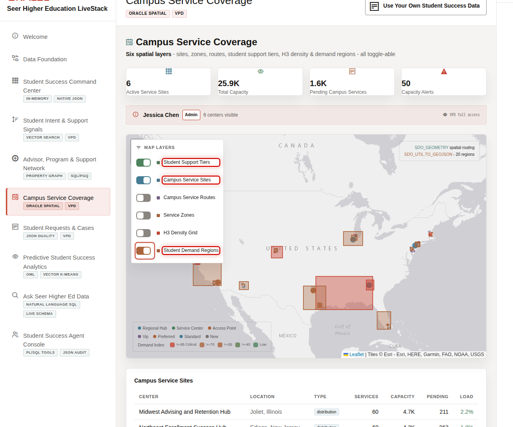

# Campus Service Coverage with Oracle Spatial

## Introduction

Students need support where they are. Campus teams need the nearest service site and its current capacity before they route a request.

In this lab, you act as a campus operations planner. You will use Oracle Spatial to connect a student location to nearby campus-service sites.

The image shows the Campus Service Coverage page. A campus operations planner uses it to compare sites, demand areas, and capacity. The SQL uses the same pattern: compare load, then calculate each site's distance from Maya Chen.

<strong>Key terms: spatial point, tolerance, and distance</strong>

> A **spatial point** stores a location using coordinates. This lab stores one point for a student and one for each service site.
>
> **Tolerance** is the small distance value Oracle uses for geometry calculations. The loader uses the same coordinate precision for these points.
>
> `SDO_GEOM.SDO_DISTANCE` returns the distance between two geometries. The `unit=MILE` option asks Oracle to return miles.

### Objectives

- Review campus-service sites and their current load.
- Find service sites near a student using a spatial distance calculation.

Estimated Time: **12 minutes**

### Business Scenario

| Step | Student-success focus |
| --- | --- |
| Business Problem | Students need a timely route to an appropriate nearby service. |
| Technical Challenge | Location and capacity evidence should be queryable with the operational request data. |
| Persona Focus | Campus operations planner. |
| What You Will Do | Inspect current load and calculate distance from a student to service sites. |
| Database Capability | Oracle Spatial, points, and spatial distance. |
| Outcome | Routing decisions can use governed location and capacity evidence. |

**Persona focus:** You balance proximity with service capacity; the nearest site is not automatically the best option if it is overloaded.

## Task 1: Review service-site capacity

1. Run this query to see each campus-service site and its current load.

    `CAMPUS_SERVICE_SITES_V` gives each operational location a higher-education name. The query sorts the highest load first, so planners can spot pressure.

    ~~~sql
    <copy>
    SELECT campus_service_site_name,
           city,
           capacity_units,
           current_load_pct
    FROM campus_service_sites_v
    WHERE is_active = 1
    ORDER BY current_load_pct DESC;
    </copy>
    ~~~

Expected output: Campus Service Capacity

| Campus Service Site Name | City | Capacity Units | Current Load Pct |
| --- | --- | ---: | ---: |
| North Campus Advising Hub | Boston | 120 | 82 |
| Central Student Services | Boston | 180 | 61 |

## Task 2: Calculate nearby service sites

1. Run this query to calculate distance from Maya Chen to active service sites.

    Read this query in three parts.

    1. `CROSS JOIN` pairs Maya Chen's location with each active service site. The filters identify the intended student and sites.
    2. `SDO_GEOM.SDO_DISTANCE` compares each pair of points, and `ROUND` makes the mileage easy to discuss.
    3. `ORDER BY distance_miles` places the nearest site first, while `current_load_pct` keeps the capacity trade-off visible.

    ~~~sql
    <copy>
    SELECT site.campus_service_site_name,
           ROUND(
             SDO_GEOM.SDO_DISTANCE(
               student.location,
               site.location,
               0.005,
               'unit=MILE'
             ),
             1
           ) AS distance_miles,
           site.current_load_pct
    FROM highered_students_v student
    CROSS JOIN campus_service_sites_v site
    WHERE student.first_name = 'Maya'
      AND student.last_name = 'Chen'
      AND site.is_active = 1
    ORDER BY distance_miles;
    </copy>
    ~~~

Expected output: Nearby Service Sites

| Campus Service Site Name | Distance Miles | Current Load Pct |
| --- | ---: | ---: |
| Central Student Services | 0.8 | 61 |
| North Campus Advising Hub | 3.6 | 82 |

    Location data stays with the same service and request evidence. A planner can explain both distance and capacity before recommending a route.

2. 🎯 **Interactive challenge: add a capacity guardrail.**

    Starting with the nearby-service-sites query above, add `AND site.current_load_pct < 70` after the active-site filter. Run your revised query. Which site remains for review, and what information is still missing before you recommend it to Maya?

    

    
<strong>Challenge answer: capacity narrows the location evidence</strong>

    **Expected output: Nearby Site Below 70 Percent Load**

    | Campus Service Site Name | Distance Miles | Current Load Pct |
    | --- | ---: | ---: |
    | Central Student Services | 0.8 | 61 |

    > Central Student Services remains because it is active and its current load is below 70 percent. North Campus Advising Hub is excluded at 82 percent. Distance and current load narrow the review, but the planner must still confirm service fit, actual availability, operating hours, accessibility, and request urgency. Oracle Spatial keeps location and load evidence with the governed service records used for that decision.

    If you need the runnable solution, use this query:

    ~~~sql
    <copy>
    SELECT site.campus_service_site_name,
           ROUND(
             SDO_GEOM.SDO_DISTANCE(
               student.location,
               site.location,
               0.005,
               'unit=MILE'
             ),
             1
           ) AS distance_miles,
           site.current_load_pct
    FROM highered_students_v student
    CROSS JOIN campus_service_sites_v site
    WHERE student.first_name = 'Maya'
      AND student.last_name = 'Chen'
      AND site.is_active = 1
      AND site.current_load_pct < 70
    ORDER BY distance_miles;
    </copy>
    ~~~

    

## Acknowledgements

* **Last Updated By/Date** - Oracle Database Product Management, August 2026
