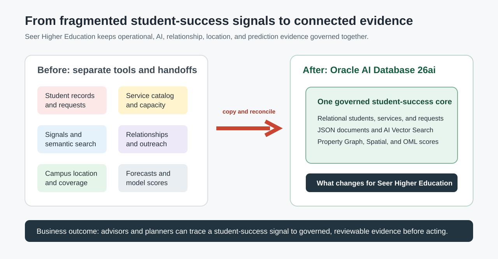

# Student Success Data Foundation with Relational SQL

## Introduction

Student-success work starts with trusted context. Advisors need student records, programs, services, requests, signals, locations, and predictions to describe one situation. They should not have to reconcile competing versions.

In this lab, you act as a database developer. You will inspect business-ready views that present the Higher Education tables in consistent reporting shapes.

<strong>Key terms: semantic view and governed data</strong>

> A **semantic view** presents stored data in a consistent, business-ready shape without creating another copy. Here, views organize student, service, request, program, and campus-site data for reporting.
>
> **Governed data** means access, definitions, and changes can be managed from the same database foundation.

### Objectives

- Map the Oracle Database capabilities used in later labs.
- Compare the current support workload by academic program.

Estimated Time: **10 minutes**

### Business Scenario

| Step | Student-success focus |
| --- | --- |
| Business Problem | Staff need a complete view of student support demand. |
| Technical Challenge | Operational data is easier to govern when teams do not copy it into separate specialist stores. |
| Decision Owner | Database developer supporting student-success applications and analysts. |
| Decision | Are the required workshop capability families available, and where is current program pressure concentrated? |
| Information Needed | Available object families, academic programs, services, request volumes, open work, and demand scores. |
| Next Action | Confirm that the required workshop objects are available, then direct the operations team to the programs with the greatest current pressure. |
| What You Will Do | Map the governed object families, then compare program-level service demand. |
| Database Capability | Relational SQL, semantic views, JSON, vector, graph, spatial, and OML catalog views. |
| Outcome | A shared capability map and a first view of the support pressure that later labs explain. |

**Persona focus:** You make the underlying data model understandable without hiding the SQL evidence that teams need to review.

## Task 1: Map the student-success capability families

1. Run this query to map the database capabilities used in the workshop.

    > **SQL Worksheet reminder:** Need a reminder on how to use SQL Worksheet? Return to [Getting Started Task 2: Open SQL Worksheet](?lab=getting-started#Task2:OpenSQLWorksheet).

    This is the workshop capability map. Each `UNION ALL` branch counts one object family used later: semantic views for reporting, a JSON duality view for request documents, a property graph for relationships, a vector index for meaning-based search, spatial metadata for distance, and an OML model for prediction.

    Read the result as an evidence checklist. The counts come from Oracle catalog views, not from a separate application inventory. That is what makes the later command-center, vector, graph, spatial, JSON, and model queries part of one governed foundation.

    ~~~sql
    <copy>
    SELECT 'Student-success semantic views' AS capability,
           COUNT(*) AS object_count
    FROM user_views
    WHERE view_name IN (
      'HIGHERED_STUDENTS_V',
      'ACADEMIC_PROGRAMS_V',
      'STUDENT_SERVICES_V',
      'STUDENT_SERVICE_REQUESTS_V',
      'STUDENT_SIGNAL_POSTS_V',
      'CAMPUS_SERVICE_SITES_V'
    )
    UNION ALL
    SELECT 'JSON duality views',
           COUNT(*)
    FROM user_json_duality_views
    WHERE view_name = 'STUDENT_SERVICE_REQUESTS_DV'
    UNION ALL
    SELECT 'Property graphs',
           COUNT(*)
    FROM user_property_graphs
    WHERE graph_name = 'STUDENT_SUPPORT_NETWORK'
    UNION ALL
    SELECT 'Vector indexes',
           COUNT(*)
    FROM user_indexes
    WHERE index_name = 'IDX_SERVICE_VEC'
    UNION ALL
    SELECT 'Spatial metadata layers',
           COUNT(*)
    FROM user_sdo_geom_metadata
    WHERE table_name IN ('STUDENTS', 'CAMPUS_SERVICE_SITES')
    UNION ALL
    SELECT 'OML mining models',
           COUNT(*)
    FROM user_mining_models
    WHERE model_name = 'DEMAND_SURGE_MODEL';
    </copy>
    ~~~

Expected output: Foundation Capability Map

| Capability | Object Count |
| --- | ---: |
| Student-success semantic views | 6 |
| JSON duality views | 1 |
| Property graphs | 1 |
| Vector indexes | 1 |
| Spatial metadata layers | 2 |
| OML mining models | 1 |

    This map explains why later labs do not need separate stores for application documents, meaning-based search, relationship analysis, location calculations, or model scores.

## Task 2: Compare current service pressure by program

1. Run this query to compare service ownership and current request pressure.

    This query turns the foundation into a decision. It combines service ownership with request demand, so a planner can see which program has more services, more requests, and more open work.

    1. The first `LEFT JOIN` attaches each service to its request line. The second attaches the request status and demand score.
    2. `COUNT(DISTINCT s.service_id)` prevents a requested service from being counted more than once.
    3. The `CASE` expression counts only open requests. `AVG(r.demand_score)` shows the average pressure for the program.

    ~~~sql
    <copy>
    SELECT academic_program,
           COUNT(DISTINCT s.service_id) AS service_count,
           COUNT(r.request_id) AS request_count,
           SUM(
             CASE
               WHEN r.request_status = 'OPEN' THEN 1
               ELSE 0
             END
           ) AS open_request_count,
           ROUND(AVG(r.demand_score), 1) AS average_demand_score
    FROM student_services_v s
    LEFT JOIN student_request_lines_v l
      ON l.service_id = s.service_id
    LEFT JOIN student_service_requests_v r
      ON r.request_id = l.request_id
    GROUP BY academic_program
    ORDER BY open_request_count DESC,
             average_demand_score DESC;
    </copy>
    ~~~

Expected output: Program Service Pressure

| Academic Program | Service Count | Request Count | Open Request Count | Average Demand Score |
| --- | ---: | ---: | ---: | ---: |
| Student Success Office | 3 | 3 | 2 | 84.7 |
| College of Engineering | 2 | 2 | 1 | 58.0 |

    Student Success Office has more open work and the higher average demand score in this starter dataset. Lab 2 drills from this program-level picture into the specific student-service requests that need review.

## Business outcome checkpoint

The result reveals where current support pressure is concentrated and confirms that the named workshop capability families are available for later labs. It does not establish production or data readiness. A student-success operations leader can use the program summary to decide where to investigate first.

- **Demonstrates:** Catalog and relational queries can establish the available foundation and compare current program-level workload.
- **Supports:** Less time spent locating and reconciling separate sources before reviewing student-service demand.
- **Candidate indicators:** Time to assemble a program-level workload view, open-request age, unresolved data-quality exceptions, and manual reconciliation steps.
- **Requires validation:** Institutional definitions, source completeness, data lineage, access controls, refresh timing, and reconciliation with operating systems.

With the shared context established, Lab 2 moves from program-level pressure to the individual requests behind the command-center totals.

## Acknowledgements

* **Last Updated By/Date** - Oracle Database Product Management, July 2026
