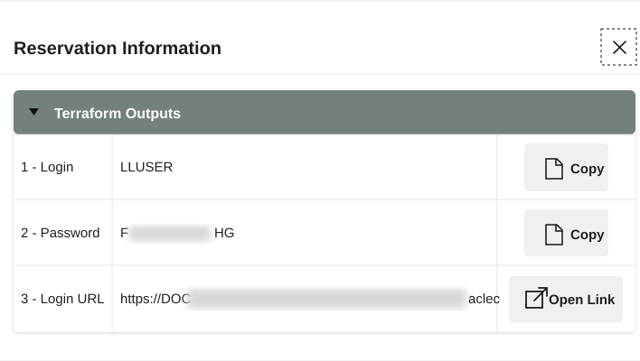

# Getting Started

## Introduction

Before you begin, open the LiveLabs environment and the Database Actions SQL Worksheet. You will run each query as the learner schema user, **LLUSER**. The worksheet is where you inspect the same student-success data that supports the LiveStack Demo.

### Objectives

- Find the reservation login information.
- Sign in as LLUSER.
- Open the SQL Worksheet and run a short readiness query.

Estimated Time: **8 minutes**

## Task 1: Open the reservation information

1. In the LiveLabs environment, open **Reservation Information**.

    The reservation page provides the Login URL, the LLUSER password, and the information you need for this lab.

    

2. Copy the password for **LLUSER** and open the Login URL in a new tab.

    Keep the reservation page open until you have signed in successfully.

## Task 2: Open SQL Worksheet

1. Sign in with the username **LLUSER** and the password from Reservation Information.

    

2. Select **Development**, then select **SQL**.

    

3. In SQL Worksheet, paste and run this query.

    The query confirms the connected database user. It does not change data.

    ~~~sql
    <copy>
    SELECT USER AS connected_user;
    </copy>
    ~~~

Expected output: Connected User

| Connected User |
| --- |
| LLUSER |

    If you do not see LLUSER, return to Reservation Information and sign in with the learner credentials.

## Acknowledgements

* **Last Updated By/Date** - Oracle Database Product Management, July 2026
