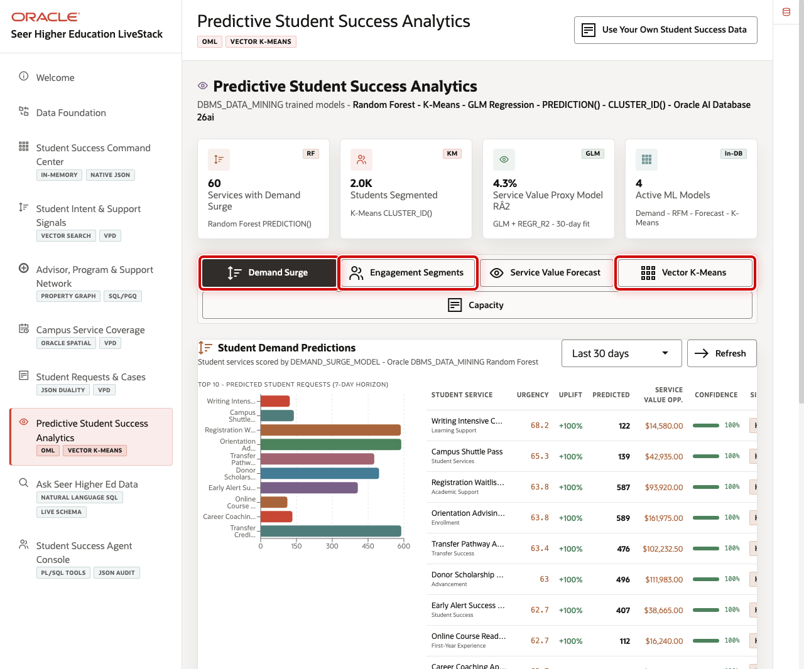

# Predictive Student-Service Demand with Oracle Machine Learning

## Introduction

Command-center evidence explains current demand. Student-success planners also need a careful way to identify where demand may rise so they can prepare advising, tutoring, financial-aid, and service capacity.

In this lab, you act as a database developer supporting an ML engineer and a student-success planner. You will inventory the persisted Oracle Machine Learning models and score the current service-demand training view.

The image shows the Predictive Student Success Analytics page, where a planner can compare demand signals and forecast-oriented measures. The SQL below keeps the model metadata and scored services visible in the same governed database as the request and service evidence.

<strong>Key terms: model, score, classification, and probability</strong>

> A **model** is a trained pattern that can score current records.
>
> A **classification** predicts a category, such as SURGE or STABLE.
>
> A **score** is the label returned when the model evaluates a row.
>
> **SURGE probability** is the probability the model assigns specifically to `SURGE`. It is not certainty or automatic confidence in a returned `STABLE` label. It helps rank review work and does not replace staff judgment.

### Objectives

- Inventory deployed OML models.
- Score student-service demand inside Oracle Database.

Estimated Time: **12 minutes**

### Business Scenario

| Step | Student-success focus |
| --- | --- |
| Business Problem | Teams need to anticipate support demand without exporting governed operating data. |
| Technical Challenge | Model scores must remain explainable alongside the service and signal evidence that supports them. |
| Decision Owner | Student-success service-capacity planner, supported by a database developer and ML engineer. |
| Decision | Which service-demand predictions or disagreements should staff investigate first? |
| Information Needed | Service, demand score, observed label, predicted label, surge probability, request history, and capacity context. |
| Next Action | Review the highest-priority disagreement, then decide whether to monitor demand, investigate the inputs, or prepare capacity. |
| What You Will Do | Inspect model metadata and score the demand training view. |
| Database Capability | Oracle Machine Learning. |
| Outcome | Planners can prioritize review using in-database predictive evidence. |

**Persona focus:** You make a model result reviewable by keeping the model, score, and supporting service data in the same database.

## Task 1: Inventory deployed models

1. Run this query to identify the predictive models available to the schema.

    `USER_MINING_MODELS` is the model catalog. The filter selects the one validated workshop model, and the result tells you what kind of prediction it supports before you include a score in a student-success decision.

    ~~~sql
    <copy>
    SELECT model_name,
           mining_function,
           algorithm
    FROM user_mining_models
    WHERE model_name = 'DEMAND_SURGE_MODEL'
    ORDER BY model_name;
    </copy>
    ~~~

    Expected output: OML Model Inventory

    | Model Name | Mining Function | Algorithm |
    | --- | --- | --- |
    | DEMAND\_SURGE\_MODEL | CLASSIFICATION | RANDOM\_FOREST |

## Task 2: Score student-service demand

1. Run this query to score current service demand.

    Read this query in three parts.

    1. `scored_demand` starts with `OML_DEMAND_TRAINING_V`, the repeatable feature set used by the model.
    2. `PREDICTION` returns a class label, while `PREDICTION_PROBABILITY` returns the probability assigned specifically to `SURGE`; neither is a guarantee.
    3. The final query adds the service name, and `ORDER BY` makes the review sequence stable when scores tie.

    ~~~sql
    <copy>
    WITH scored_demand AS (
      SELECT service_id,
             PREDICTION(DEMAND_SURGE_MODEL USING *) AS predicted_demand,
             ROUND(
               PREDICTION_PROBABILITY(
                 DEMAND_SURGE_MODEL,
                 'SURGE' USING *
               ),
               3
             ) AS surge_probability
      FROM oml_demand_training_v
    )
    SELECT s.service_name,
           scored.predicted_demand,
           scored.surge_probability
    FROM scored_demand scored
    JOIN student_services_v s
      ON s.service_id = scored.service_id
    ORDER BY scored.surge_probability DESC,
             s.service_name;
    </copy>
    ~~~

    **Expected output: Demand Priorities**

    | Service Name | Predicted Demand | Surge Probability |
    | --- | --- | ---: |
    | Academic Planning Appointment | STABLE | 0.428 |
    | Engineering Learning Lab | STABLE | 0.428 |
    | Financial Aid Navigation | STABLE | 0.428 |
    | First-Year Advising | STABLE | 0.428 |
    | Tutoring Appointment | STABLE | 0.428 |

    This is a representative fresh-run result set. The model-returned labels and `SURGE` probabilities can differ when the model is rebuilt or the feature values differ. If you completed the write task in the JSON Relational Duality lab, Tutoring Appointment has a second request in `OML_DEMAND_TRAINING_V`, so its probability or position can differ from this example. The predicted label and `SURGE` probability help a planner decide where to investigate; probability is not necessarily confidence in the returned label. The final response should still consider capacity, student context, and service evidence from earlier labs.

2. 🎯 **Interactive challenge: surface model disagreements.**

    Starting with the scoring query above, expose `surge_flag` as the observed demand label and keep only rows where it differs from the model prediction. Include `demand_score` and sort the disagreements from highest demand score to lowest. Which service should lead the human-review queue, and what context is still missing?

    **Hint:** Add `demand_score` and `surge_flag AS observed_demand` inside the scored subquery. Return those columns in the outer query, compare `observed_demand` with `predicted_demand` in a `WHERE` clause, then sort by `demand_score DESC`.

    

    
<strong>Challenge answer: disagreement creates a review queue</strong>

    **Expected output: Demand Prediction Disagreements**

    Every returned row has a different observed and predicted label. With a fresh starter dataset and model, `First-Year Advising` and `Financial Aid Navigation` are expected review candidates because their observed labels are `SURGE` while the model predicts `STABLE`. Completing the duality write task changes the Tutoring Appointment feature row, so that service may also move in or out of the disagreement queue. Exact disagreements, predicted labels, and probabilities can change with the current feature values or if the model is rebuilt.

    > Review the highest-demand disagreement first, then inspect request history, current capacity, student context, and service signals before drawing a conclusion. Oracle Machine Learning keeps features, observed labels, predictions, and service records in the same governed database for that review. A disagreement does not prove that either the model or the observed label is wrong.

    If you need the runnable solution, use this query:

    ~~~sql
    <copy>
    WITH scored_demand AS (
      SELECT service_id,
             demand_score,
             surge_flag AS observed_demand,
             PREDICTION(DEMAND_SURGE_MODEL USING *) AS predicted_demand,
             ROUND(
               PREDICTION_PROBABILITY(
                 DEMAND_SURGE_MODEL,
                 'SURGE' USING *
               ),
               3
             ) AS surge_probability
      FROM oml_demand_training_v
    )
    SELECT s.service_name,
           scored.demand_score,
           scored.observed_demand,
           scored.predicted_demand,
           scored.surge_probability
    FROM scored_demand scored
    JOIN student_services_v s
      ON s.service_id = scored.service_id
    WHERE scored.observed_demand <> scored.predicted_demand
    ORDER BY scored.demand_score DESC,
             s.service_name;
    </copy>
    ~~~

    

## Business outcome checkpoint

The scoring query ranks predicted service demand, while the challenge isolates places where the model and observed label disagree. The model predicts demand for student services; it does not predict an individual student's success or determine an intervention.

- **Demonstrates:** Oracle Machine Learning can score service-demand records and expose model disagreements beside operational service information.
- **Supports:** Earlier review of potential demand changes and capacity needs without exporting governed inputs.
- **Candidate indicators:** Forecast error, reviewed disagreements, planner override rate, capacity shortfalls, and model drift.
- **Requires validation:** Holdout performance, feature suitability, calibration, drift thresholds, retraining cadence, fairness, access controls, and human ownership of planning decisions.

The conclusion brings the complete route together so you can explain how connected information changes the student-support operating workflow.

## Acknowledgements

* **Last Updated By/Date** - Oracle Database Product Management, August 2026
