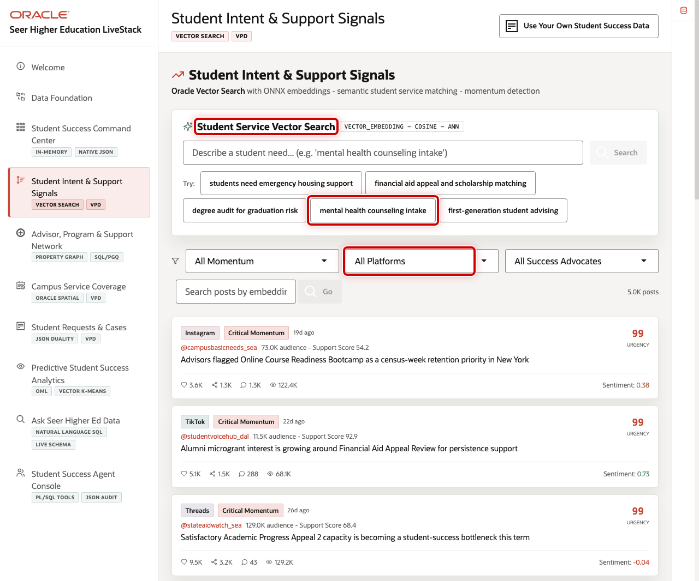

# Student Intent and Support Signals with AI Vector Search

## Introduction

Students often describe a need before it appears as a formal request. A search for help choosing courses and meeting an advisor should be able to find a relevant advising service even when the service catalog uses different words.

In this lab, you act as an AI engineer supporting the student-success team. You will use Oracle AI Vector Search to compare the meaning of a support phrase with stored service descriptions.

The image shows the Student Intent & Support Signals page, where an AI engineer or support analyst can search for a need in everyday language. The SQL below recreates the database evidence behind that experience by ranking the same kind of service catalog records by meaning.

<strong>Key terms: embedding, vector, distance, and similarity</strong>

> - An **embedding** is a numerical representation of text meaning.
> - A **vector** stores that representation in Oracle Database.
> - **Vector distance** measures how different two meanings are; lower distance means closer meaning.
> - This lab displays 1 - distance as a similarity score, so higher is easier to read as a better match.

### Objectives

- Inspect the service embeddings used for semantic matching.
- Search for a student need by meaning rather than exact wording.

Estimated Time: **12 minutes**

### Business Scenario

| Step | Student-success focus |
| --- | --- |
| Business Problem | A student signal may not use the exact words in a service catalog. |
| Technical Challenge | Meaning-based retrieval should remain connected to governed service records. |
| Decision Owner | Student-support analyst, supported by an AI engineer. |
| Decision | Which services should staff review as likely matches for the need expressed by a student? |
| Information Needed | The student's phrase, service descriptions, ranked matches, and similarity values. |
| Next Action | Review the highest-ranked candidates with the student's current request and circumstances before recommending a service. |
| What You Will Do | Generate a query embedding and compare it to stored service embeddings. |
| Database Capability | Oracle AI Vector Search. |
| Outcome | Staff can find relevant services from the intent expressed in a signal. |

**Persona focus:** You help support teams discover a relevant service without exporting student-success text to a separate search system.

## Task 1: Confirm the vector index

1. Run this query to inspect the vector index that supports service matching.

    > **SQL Worksheet reminder:** Need a reminder on how to use SQL Worksheet? Return to [Getting Started Task 2: Open SQL Worksheet](?lab=getting-started#Task2:OpenSQLWorksheet).

    USER_INDEXES inventories indexes owned by the learner schema. The vector index keeps semantic search close to the service rows it ranks.

    ~~~sql
    <copy>
    SELECT index_name,
           index_type
    FROM user_indexes
    WHERE index_name = 'IDX_SERVICE_VEC';
    </copy>
    ~~~

    Expected output: Vector Index

    | Index Name | Index Type |
    | --- | --- |
    | IDX\_SERVICE\_VEC | VECTOR |

## Task 2: Match a support need to services

1. Run this semantic search.

    Read this query in three parts.

    1. `VECTOR_EMBEDDING` turns the student's phrase into a query vector.
    2. `VECTOR_DISTANCE` compares that vector with each stored service embedding; `1 - distance` presents the result as a higher-is-better similarity score.
    3. The join supplies a service name and program, while `FETCH FIRST 3 ROWS ONLY` keeps the review list focused on the three best matches.

    ~~~sql
    <copy>
    SELECT s.service_name,
           s.academic_program,
           ROUND(
             1 - VECTOR_DISTANCE(
               se.embedding,
               VECTOR_EMBEDDING(ADMIN.ALL_MINILM_L12_V2
                 USING 'help choosing courses and meeting an advisor' AS DATA),
               COSINE
             ),
             3
           ) AS similarity
    FROM service_embeddings se
    JOIN student_services_v s ON s.service_id = se.service_id
    ORDER BY VECTOR_DISTANCE(
      se.embedding,
      VECTOR_EMBEDDING(ADMIN.ALL_MINILM_L12_V2
        USING 'help choosing courses and meeting an advisor' AS DATA),
      COSINE
    )
    FETCH FIRST 3 ROWS ONLY;
    </copy>
    ~~~

    **Expected output: Service Matches**

    | Service Name | Academic Program | Similarity |
    | --- | --- | ---: |
    | First-Year Advising | Student Success Office | 0.725 |
    | Tutoring Appointment | Student Success Office | 0.511 |
    | Academic Planning Appointment | College of Engineering | 0.402 |

    This is a representative result set. Your three-decimal similarity values, and sometimes the lower-ranked order, can vary by model environment. The important result is a three-row ranked list with advising-oriented services near the top. Use the ranking to identify candidates for human review; it does not assign a service automatically.

2. 🎯 **Interactive challenge: change the student-support question.**

    Starting with the semantic-search query above, replace both occurrences of `help choosing courses and meeting an advisor` with `financial aid form deadline and student account guidance`. Run your revised query. Which service moves to the top, and what changed match should a support analyst review?

    

    
<strong>Challenge answer: student intent changes the evidence queue</strong>

    **Expected output: Financial-Aid Service Matches**

    `Financial Aid Navigation` should move to the top because its stored description closely matches the revised phrase. A representative result set is:

    | Service Name | Academic Program | Similarity |
    | --- | --- | ---: |
    | Financial Aid Navigation | Student Success Office | 1.000 |
    | First-Year Advising | Student Success Office | 0.549 |
    | Tutoring Appointment | Student Success Office | 0.391 |

    Your three-decimal similarity values, and sometimes the lower-ranked order, can vary by model environment. The important result is that Financial Aid Navigation moves to the top of the revised evidence queue.

    > The revised phrase changes the meaning being compared, so the review queue changes without copying service descriptions or vectors to a separate search system. Use the ranking to find candidates for human review; it does not assign a service automatically.

    If you need the runnable solution, use this query:

    ~~~sql
    <copy>
    SELECT s.service_name,
           s.academic_program,
           ROUND(
             1 - VECTOR_DISTANCE(
               se.embedding,
               VECTOR_EMBEDDING(ADMIN.ALL_MINILM_L12_V2
                 USING 'financial aid form deadline and student account guidance' AS DATA),
               COSINE
             ),
             3
           ) AS similarity
    FROM service_embeddings se
    JOIN student_services_v s ON s.service_id = se.service_id
    ORDER BY VECTOR_DISTANCE(
      se.embedding,
      VECTOR_EMBEDDING(ADMIN.ALL_MINILM_L12_V2
        USING 'financial aid form deadline and student account guidance' AS DATA),
      COSINE
    )
    FETCH FIRST 3 ROWS ONLY;
    </copy>
    ~~~

    

## Business outcome checkpoint

Changing the phrase changes the ranked service candidates, showing how meaning-based retrieval can enrich the broader request workflow even when a student uses different wording from the catalog. A support analyst still reviews the matches with the student's circumstances before recommending a service.

- **Demonstrates:** Oracle AI Vector Search can rank governed service descriptions against two differently worded support needs.
- **Supports:** A shorter path from a student's words to relevant services for staff review.
- **Candidate indicators:** Time to identify a suitable service, reviewed-match relevance, search reformulation rate, and staff override rate.
- **Requires validation:** Retrieval quality with institutional language, privacy and retention for student text, approved model versions, access controls, and the effect of model changes on ranking.

After finding candidate services, Lab 5 examines which advocate and program relationships could help coordinate follow-up.

## Acknowledgements

* **Last Updated By/Date** - Oracle Database Product Management, August 2026
