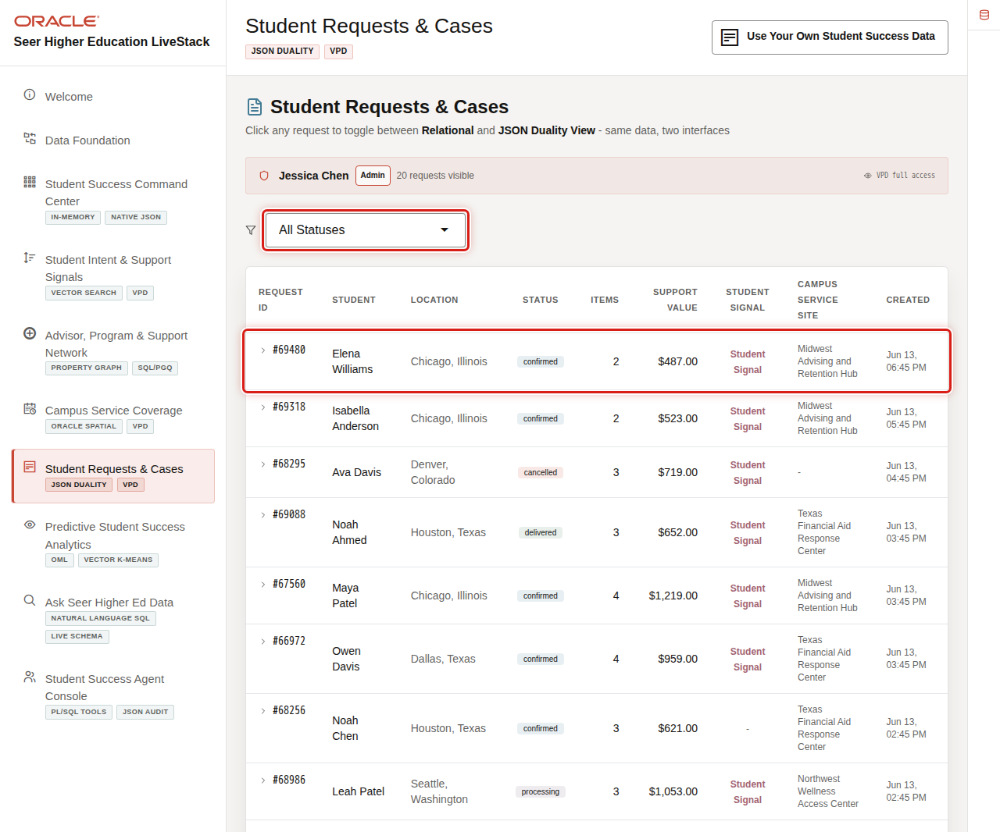

# Student Requests and Cases with JSON Relational Duality

## Introduction

Student-support applications often need a document-shaped request while campus teams still need reliable relational reporting. Oracle JSON Relational Duality lets both representations describe the same governed request data.

In this lab, you act as an application developer. You will inspect a request document, enable document inserts, create a new request, and verify how a JSON update changes the same relational rows.

The image shows the Student Requests & Cases page, where an application developer can work with a request in relational or JSON form. The SQL below verifies the same pattern in the database: one governed request record, presented as an application-friendly document.

<strong>Key terms: JSON Relational Duality and projection</strong>

> JSON Relational Duality lets an application work with a JSON document while Oracle continues to store and protect relational rows.
>
> A projection selects relational columns and presents them as named JSON fields. This avoids maintaining a separate document copy of the same request.

### Objectives

- Confirm the request JSON duality view.
- Inspect a student-service request as a formatted document.
- Enable document inserts while preserving updates.
- Create and update a request document, then verify the relational rows.

Estimated Time: **25 minutes**

### Business Scenario

| Step | Student-success focus |
| --- | --- |
| Business Problem | Applications need an easy-to-consume request document while staff need SQL reporting. |
| Technical Challenge | Separate document copies can drift from the operational request record. |
| Decision Owner | Application developer supporting the student-service request workflow. |
| Decision | How should the application create and update a complete request while keeping it available for relational reporting? |
| Information Needed | Permitted document operations, request fields, request-line fields, relational constraints, and the committed status. |
| Next Action | Move the committed request into staff follow-up while the application team evaluates the write contract for production use. |
| What You Will Do | Inspect the governed JSON representation, enable writes, and create and update a reserved student-service request. |
| Database Capability | JSON Relational Duality and SQL/JSON. |
| Outcome | Application and reporting teams can create and review one governed request through JSON and relational shapes. |

**Persona focus:** You want an application-friendly document without giving up relational integrity or SQL visibility.

## Task 1: Confirm the duality view

1. Run this catalog query.

    > **SQL Worksheet reminder:** Need a reminder on how to use SQL Worksheet? Return to [Getting Started Task 2: Open SQL Worksheet](?lab=getting-started#Task2:OpenSQLWorksheet).

    `USER_JSON_DUALITY_VIEWS` lists JSON Relational Duality views owned by LLUSER. `STUDENT_SERVICE_REQUESTS_DV` presents student-service requests as application-friendly JSON documents. The three `ALLOW_` columns show which document operations this starter view permits.

    ~~~sql
    <copy>
    SELECT view_name,
           allow_insert,
           allow_update,
           allow_delete
    FROM user_json_duality_views
    WHERE view_name = 'STUDENT_SERVICE_REQUESTS_DV';
    </copy>
    ~~~

    Expected output: Request Document Capability

    | View Name | Allow Insert | Allow Update | Allow Delete |
    | --- | --- | --- | --- |
    | STUDENT\_SERVICE\_REQUESTS\_DV | false | true | false |

## Task 2: Read a request as JSON

1. Run this statement with **Run Script** in SQL Worksheet.

    Run Script preserves formatted JSON output. Read this statement in two parts: `JSON_VALUE` selects the named request by its document identifier, and `JSON_SERIALIZE(... PRETTY)` formats the returned document for inspection.

    ~~~sql
    <copy>
    SELECT JSON_SERIALIZE(data PRETTY) AS request_document
    FROM student_service_requests_dv
    WHERE JSON_VALUE(data, '$._id' RETURNING NUMBER) = 1001;
    </copy>
    ~~~

    Expected output: Request Document Excerpt

    | Request Document |
    | --- |
    | { "_id" : 1001, "studentId" : 101, "requestStatus" : "OPEN", "demandScore" : 92, "services" : [ { "requestLineId" : 1, "serviceName" : "First-Year Advising" } ] } |

    The document is not a second request record. It is another governed representation of the same rows that the command-center lab queried with SQL.

2. 🎯 **Interactive challenge: inspect another governed request.**

    Starting with the JSON query above, change only the document identifier from `1001` to `1002`. Run the revised statement with **Run Script**. Which student-service request does the document represent, and which business fields changed?

    

    
<strong>Challenge answer: one document shape serves another request</strong>

    **Expected output: Financial-Aid Request Document**

    The document contains `_id` `1002`, `studentId` `102`, `requestStatus` `OPEN`, `demandScore` `84`, and the service `Financial Aid Navigation`. JSON whitespace and line wrapping can vary in SQL Worksheet.

    > The identifier, student, score, and service differ from request `1001`, but the governed document contract stays the same. Oracle projects another relational request through the same JSON shape instead of maintaining a separate document copy.

    If you need the runnable solution, use this query:

    ~~~sql
    <copy>
    SELECT JSON_SERIALIZE(data PRETTY) AS request_document
    FROM student_service_requests_dv
    WHERE JSON_VALUE(data, '$._id' RETURNING NUMBER) = 1002;
    </copy>
    ~~~

    

## Task 3: Enable document inserts and updates

Task 1 showed that the loaded `STUDENT_SERVICE_REQUESTS_DV` permits updates but not inserts. In this task, you extend the document contract so an application can also create a complete request with a nested request line. If you already completed this task, `Allow Insert` remains `true` because replacing a view is a data definition language operation that commits automatically.

1. Enable inserts and updates for the request and its nested request lines.

    You are changing the duality-view contract, not the loader or the relational tables. The two `WITH INSERT UPDATE` clauses let Oracle map permitted JSON writes to `STUDENT_SERVICE_REQUESTS` and `STUDENT_REQUEST_LINES` while preserving keys, foreign keys, data types, and other constraints.

    The added `serviceId` field maps the JSON request line to `STUDENT_REQUEST_LINES.SERVICE_ID`, which is required by the relational table.

    ~~~sql
    <copy>
    CREATE OR REPLACE JSON RELATIONAL DUALITY VIEW student_service_requests_dv AS
    SELECT JSON {
      '_id' : r.request_id,
      'studentId' : r.student_id,
      'requestStatus' : r.request_status,
      'demandScore' : r.demand_score,
      'services' : [
        SELECT JSON {
          'requestLineId' : l.request_line_id,
          'serviceId' : l.service_id,
          'serviceName' : l.service_name
        }
        FROM student_request_lines l WITH INSERT UPDATE
        WHERE l.request_id = r.request_id
      ]
    }
    FROM student_service_requests r WITH INSERT UPDATE;
    </copy>
    ~~~

    **Expected output: View Definition Updated**

    Oracle confirms that view `STUDENT_SERVICE_REQUESTS_DV` was created or replaced.

    Run the complete code block, including its final semicolon. Do not continue until the capability query in the next step shows `true`, `true`, and `false`. If Oracle reports an error, stop and capture the complete `ORA-` message.

2. Confirm the updated document capabilities.

    ~~~sql
    <copy>
    SELECT view_name AS "View Name",
           allow_insert AS "Allow Insert",
           allow_update AS "Allow Update",
           allow_delete AS "Allow Delete"
    FROM user_json_duality_views
    WHERE view_name = 'STUDENT_SERVICE_REQUESTS_DV';
    </copy>
    ~~~

    **Expected output: Document Capabilities Enabled**

    | View Name | Allow Insert | Allow Update | Allow Delete |
    | --- | --- | --- | --- |
    | STUDENT\_SERVICE\_REQUESTS\_DV | true | true | false |

    The application can now read, create, and update request documents. Delete remains disabled. The next task uses reserved identifiers so it does not overwrite a seeded request.

## Task 4: Create and update a request document

Now create one nested request document, inspect the relational rows Oracle creates, and update the request status through the same duality view.

> **Workshop data boundary:** This task commits reserved request `900001` and request line `990001`. They remain in the current workshop schema until it is reset. The rerun guard prevents a duplicate request, and no seeded request is overwritten.

1. Insert the reserved Higher Education request document.

    The document uses student `103`, Priya Shah, and service `13`, Tutoring Appointment. The demand score is `76`, below the existing score for that service, so the maximum service-demand score does not change.

    `SELECT ... FROM dual` generates one candidate JSON document without reading an application table. Keep `FROM dual` because `WHERE NOT EXISTS` evaluates the rerun guard for that one candidate row.

    ~~~sql
    <copy>
    INSERT INTO student_service_requests_dv (data)
    SELECT JSON(
      '{
        "_id": 900001,
        "studentId": 103,
        "requestStatus": "OPEN",
        "demandScore": 76,
        "services": [
          {
            "requestLineId": 990001,
            "serviceId": 13,
            "serviceName": "Tutoring Appointment"
          }
        ]
      }'
    )
    FROM dual
    WHERE NOT EXISTS (
      SELECT 1
      FROM student_service_requests
      WHERE request_id = 900001
    );
    </copy>
    ~~~

    **Expected output: Request Document Inserted**

    Oracle inserts one document. If reserved request `900001` already exists, the rerun guard safely inserts zero rows.

2. Commit the insert as its own SQL Worksheet action.

    In Database Actions SQL Worksheet, highlight this command and run it explicitly. `COMMIT` makes the new request visible to later statements and other worksheet connections.

    ~~~sql
    <copy>
    COMMIT;
    </copy>
    ~~~

    **Expected output: Commit Complete**

    Oracle reports `Commit complete.`

3. Verify that the JSON document created relational rows.

    This query reads `STUDENT_SERVICE_REQUESTS`, `STUDENTS`, and `STUDENT_REQUEST_LINES` directly. It verifies that the application-shaped document created one relational request row and one related request line.

    ~~~sql
    <copy>
    SELECT r.request_id AS "Request",
           r.request_status AS "Status",
           s.first_name || ' ' || s.last_name AS "Student",
           r.demand_score AS "Demand Score",
           l.request_line_id AS "Request Line",
           l.service_id AS "Service ID",
           l.service_name AS "Service Name"
    FROM student_service_requests r
    JOIN students s
      ON s.student_id = r.student_id
    JOIN student_request_lines l
      ON l.request_id = r.request_id
    WHERE r.request_id = 900001;
    </copy>
    ~~~

    **Expected output: Inserted Request as Relational Rows**

    | Request | Status | Student | Demand Score | Request Line | Service ID | Service Name |
    | ---: | --- | --- | ---: | ---: | ---: | --- |
    | 900001 | OPEN | Priya Shah | 76 | 990001 | 13 | Tutoring Appointment |

4. Update the document status through `STUDENT_SERVICE_REQUESTS_DV`.

    `JSON_TRANSFORM` changes only `requestStatus`. Oracle maps that field to `STUDENT_SERVICE_REQUESTS.REQUEST_STATUS`; no application-side JSON parsing, second request copy, or synchronization job is required.

    ~~~sql
    <copy>
    UPDATE student_service_requests_dv
    SET data = JSON_TRANSFORM(data, SET '$.requestStatus' = 'IN_PROGRESS')
    WHERE JSON_VALUE(data, '$._id' RETURNING NUMBER) = 900001;
    </copy>
    ~~~

    **Expected output: Request Status Updated**

    Oracle updates one document.

5. Commit the status update as its own SQL Worksheet action.

    Highlight and run this command explicitly before you verify the update.

    ~~~sql
    <copy>
    COMMIT;
    </copy>
    ~~~

6. Verify the relational status update.

    Run this query after the commit. It reads the request and request-line rows directly, so you can see that the JSON update changed the request status while keeping the student, demand score, and service evidence intact.

    ~~~sql
    <copy>
    SELECT r.request_id AS "Request",
           r.request_status AS "Status",
           s.first_name || ' ' || s.last_name AS "Student",
           r.demand_score AS "Demand Score",
           l.request_line_id AS "Request Line",
           l.service_id AS "Service ID",
           l.service_name AS "Service Name"
    FROM student_service_requests r
    JOIN students s
      ON s.student_id = r.student_id
    JOIN student_request_lines l
      ON l.request_id = r.request_id
    WHERE r.request_id = 900001;
    </copy>
    ~~~

    **Expected output: Updated Request as Relational Rows**

    | Request | Status | Student | Demand Score | Request Line | Service ID | Service Name |
    | ---: | --- | --- | ---: | ---: | ---: | --- |
    | 900001 | IN_PROGRESS | Priya Shah | 76 | 990001 | 13 | Tutoring Appointment |

7. 🎯 **Interactive challenge: explain the relational change.**

    Use the result you just returned. Which relational column changed because the JSON update targeted only `requestStatus`? Which request and service values stayed the same?

    

    
<strong>Challenge answer: one document, one governed request</strong>

    **Expected output: One Status Change, Stable Request Line**

    The relational request status changes. The demand score remains `76`, and the request line remains `990001 | 13 | Tutoring Appointment` because the JSON update did not change those fields.

    > `STUDENT_SERVICE_REQUESTS.REQUEST_STATUS` changes from `OPEN` to `IN_PROGRESS`. The related `STUDENT_REQUEST_LINES` row remains unchanged. The application and student-success analyst use two access shapes over the same governed request, so Oracle Database does not need to reconcile a document copy with a relational copy.

    

## Business outcome checkpoint

The insert and update show that an application can work with a request document while campus teams continue to report from relational rows. The two committed checks confirm the application and reporting views describe the same request rather than separately synchronized copies.

- **Demonstrates:** One JSON transaction creates and updates the related relational request data while preserving unchanged service details.
- **Supports:** Fewer application transformations, duplicate records, and document-to-report reconciliation steps.
- **Candidate indicators:** Request-processing cycle time, reconciliation defects, failed transactions, application transformation steps, and unauthorized update attempts.
- **Requires validation:** Application identity, authorization, concurrency behavior, transaction recovery, audit requirements, privacy, and institutional retention rules.

With a request workflow in place, Lab 4 adds the meaning of a student's words so staff can review services that may fit the expressed need.

## Acknowledgements

* **Last Updated By/Date** - Oracle Database Product Management, August 2026
