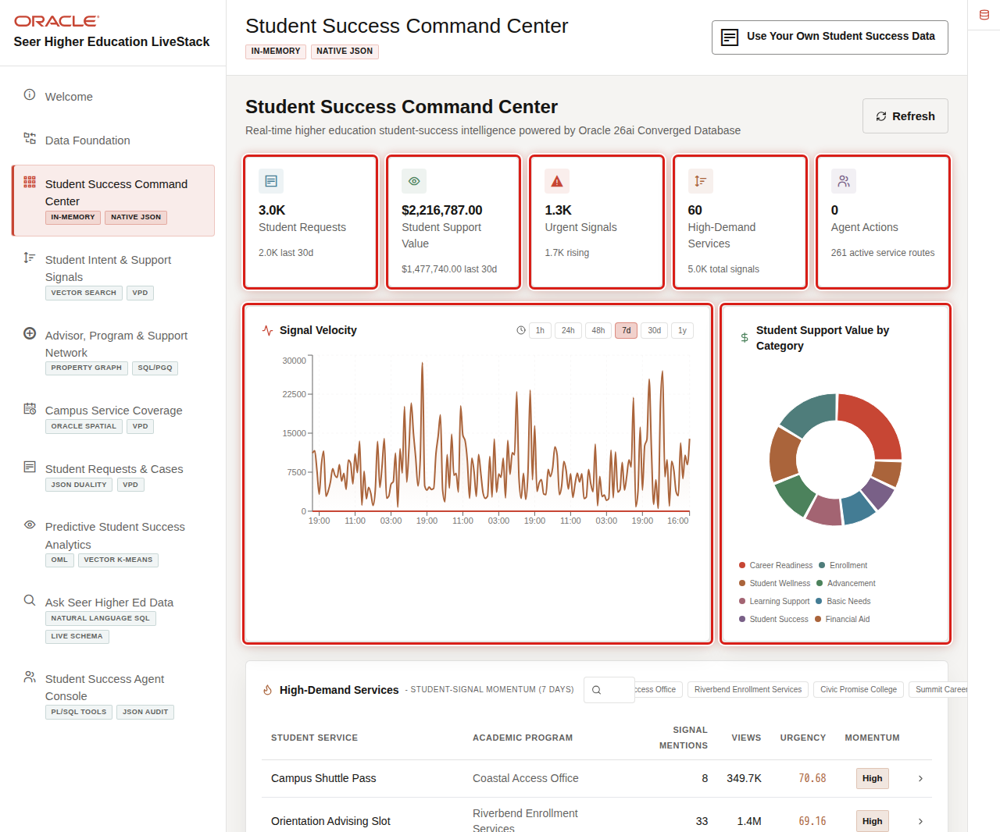

# Student Success Command Center with Relational SQL

## Introduction

Student-success leaders need a concise view of support demand. A dashboard total matters only when the team can drill into the student-service records behind it. This lab connects the command-center question to SQL evidence.

The image shows the Student Success Command Center. An operations leader uses it to notice demand and drill into services. The SQL follows the same pattern: summarize the queue, then open the records behind the total.

<strong>Key terms: KPI, drill-through, and demand score</strong>

> A **key performance indicator (KPI)** is a summary measure, such as the number of open requests.
>
> **Drill-through** moves from a summary to the individual records that produced it.
>
> A **demand score** is a demo measure of relative service pressure. It helps prioritize review; it does not decide an intervention.

### Objectives

- Summarize current student-service requests by status.
- Drill from a request summary to reviewable student and service rows.

Estimated Time: **12 minutes**

### Business Scenario

| Step | Student-success focus |
| --- | --- |
| Business Problem | Leaders need to see where student-service work is waiting. |
| Technical Challenge | A dashboard must remain traceable to the records that produced its totals. |
| Decision Owner | Student-success operations leader. |
| Decision | Which requests should staff review first? |
| Information Needed | Request status, student, requested service, demand score, and the rows behind each summary. |
| Next Action | Assign, investigate, escalate, or continue monitoring a request. |
| What You Will Do | Query the request summary, then drill into the services behind it. |
| Database Capability | Relational SQL and governed semantic views. |
| Outcome | Priorities can be reviewed instead of accepted as an unexplained KPI. |

**Persona focus:** You help an operations leader explain why a request queue is growing and which student services require attention.

## Task 1: Summarize the request queue

1. Run this query to count student-service requests by their current status.

    Read this query in three parts. `COUNT(*)` counts requests. `AVG(demand_score)` summarizes pressure. `GROUP BY request_status` keeps one row for each status.

    ~~~sql
    <copy>
    SELECT request_status,
           COUNT(*) AS request_count,
           ROUND(AVG(demand_score), 1) AS average_demand_score
    FROM student_service_requests_v
    GROUP BY request_status
    ORDER BY request_count DESC, request_status;
    </copy>
    ~~~

    Expected output: Request Queue Summary

    | Request Status | Request Count | Average Demand Score |
    | --- | ---: | ---: |
    | OPEN | 3 | 81.7 |
    | IN_PROGRESS | 2 | 62.5 |

    The summary identifies where staff should begin. A higher demand score does not decide an intervention; it helps the team prioritize review.

## Task 2: Drill into high-demand services

1. Run this query to show the student, requested service, and current request status for higher-demand work.

    Read this drill-through in three parts.

    1. The two `JOIN` clauses add the student name and service name to each request.
    2. `WHERE r.demand_score >= 70` limits the review list to the higher-pressure demo requests.
    3. `ORDER BY` places the highest score first, so the list explains the command-center priority.

    ~~~sql
    <copy>
    SELECT s.first_name || ' ' || s.last_name AS student,
           l.service_name,
           r.request_status,
           r.demand_score
    FROM student_service_requests_v r
    JOIN highered_students_v s ON s.student_id = r.student_id
    JOIN student_request_lines_v l ON l.request_id = r.request_id
    WHERE r.demand_score >= 70
    ORDER BY r.demand_score DESC, student;
    </copy>
    ~~~

    Expected output: High-Demand Service Requests

    | Student | Service Name | Request Status | Demand Score |
    | --- | --- | --- | ---: |
    | Maya Chen | First-Year Advising | OPEN | 92 |
    | Jordan Lee | Financial Aid Navigation | OPEN | 84 |
    | Priya Shah | Tutoring Appointment | IN_PROGRESS | 78 |

    Direct SQL makes a command-center metric reviewable. A larger production dashboard may use an index and summary view. This lab uses direct SQL to keep the evidence transparent.

2. 🎯 **Interactive challenge: focus the high-demand review queue.**

    Starting with the drill-through query above, change only `WHERE r.demand_score >= 70` to `WHERE r.demand_score >= 80`. Run your revised query. Which student-service requests remain, and why should the threshold guide review rather than decide whether a student receives support?

    

    
<strong>Challenge answer: a threshold prioritizes review</strong>

    **Expected output: Focused High-Demand Queue**

    | Student | Service Name | Request Status | Demand Score |
    | --- | --- | --- | ---: |
    | Maya Chen | First-Year Advising | OPEN | 92 |
    | Jordan Lee | Financial Aid Navigation | OPEN | 84 |

    > Maya Chen and Jordan Lee remain because their demand scores meet the revised threshold. Priya Shah's score of 78 falls outside this focused queue. The threshold is a review policy, not an intervention rule; staff still need the student's situation, service availability, and current support context. Oracle AI Database keeps the queue, student, service, and score evidence together for that review.

    If you need the runnable solution, use this query:

    ~~~sql
    <copy>
    SELECT s.first_name || ' ' || s.last_name AS student,
           l.service_name,
           r.request_status,
           r.demand_score
    FROM student_service_requests_v r
    JOIN highered_students_v s ON s.student_id = r.student_id
    JOIN student_request_lines_v l ON l.request_id = r.request_id
    WHERE r.demand_score >= 80
    ORDER BY r.demand_score DESC, student;
    </copy>
    ~~~

    

## Business outcome checkpoint

The summary shows where work is accumulating, and the drill-through identifies the students and services behind the totals. An operations leader can use the result to establish a review queue, but the demand threshold does not determine whether a student receives support.

- **Demonstrates:** A command-center measure can be reconciled to the governed request rows that produced it.
- **Supports:** Faster prioritization and fewer handoffs between dashboard review and request investigation.
- **Candidate indicators:** Time to first review, age of open requests, percentage of high-priority requests reviewed within the target period, reassignment rate, and escalation rate.
- **Requires validation:** The institution's priority definition, threshold governance, service capacity, urgency rules, equity review, and staff ownership.

After identifying requests that need attention, Lab 3 shows how an application can create and update the request while reporting continues from the same underlying data.

## Acknowledgements

* **Last Updated By/Date** - Oracle Database Product Management, August 2026
