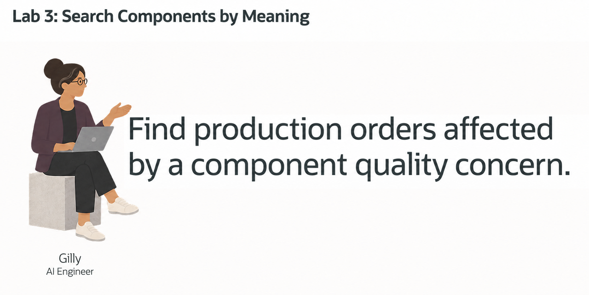
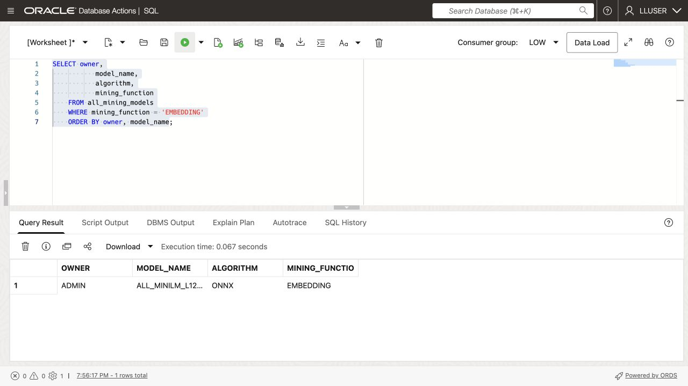
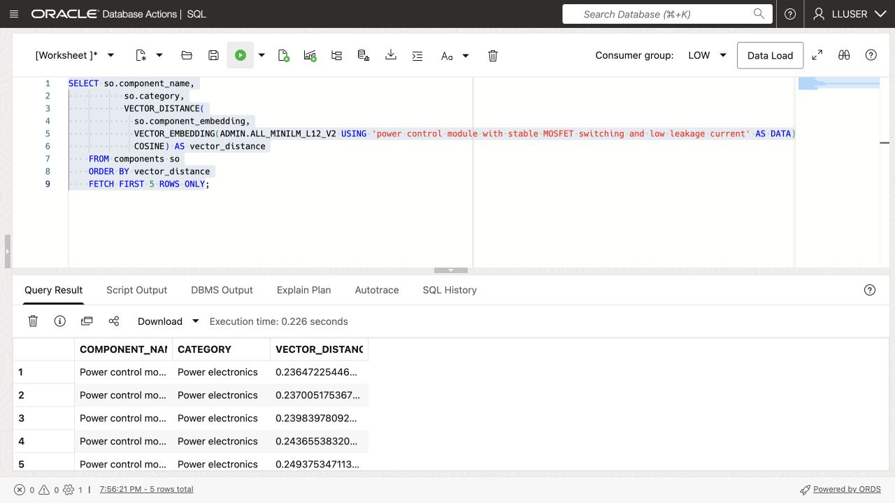
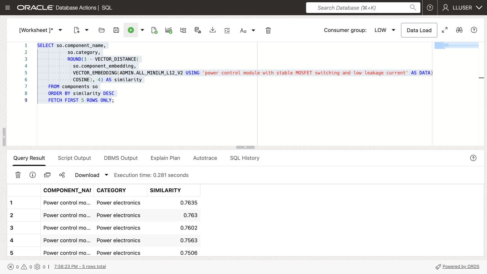
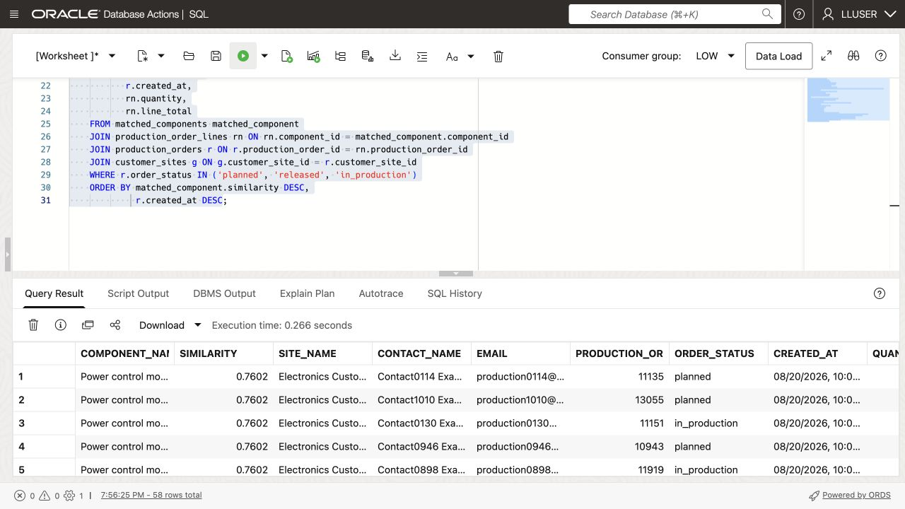

# Search Components by Meaning



## Introduction

Gilly Bourne, Seer HighTech’s AI engineer, needs to answer **which customer sites may be affected by a power-module leakage-current concern?** The inspection wording may differ from the component descriptions.

Help Gilly turn matches by meaning into a customer follow-up list.

<details>
<summary><strong>Key terms: embedding, vector, vector distance, and semantic search</strong></summary>

> - An **embedding** represents text meaning as numbers, placing related descriptions near each other even when their wording differs.
>
> - An **ONNX embedding model** turns text into vectors. ONNX (Open Neural Network Exchange) is a portable model format that Oracle AI Database can load and run.
>
> - A **vector** stores an embedding beside the component row it describes.
>
> - **Vector distance** measures similarity: smaller distances indicate closer meanings.
>
> - **Semantic search** finds matches by meaning rather than exact words.

</details>

### Objectives

- Check the embedding model Gilly needs for semantic search.
- Create a vector from component data inside the database.
- Search for components that match a production-quality concern.
- Turn component matches into a customer follow-up list.
- Explain why vector search belongs beside HighTech data and access controls.

Estimated Time: **10 minutes**

> **SQL Worksheet reminder:** See [Getting Started Task 2: Open SQL Worksheet](?lab=getting-started#Task2:OpenSQLWorksheet) for the steps to paste and run SQL.

## Task 1: Check the embedding model

Jessica has loaded an embedding model. Check that Gilly can use it.

1. Run this query to list the available embedding models:

    ```sql
    <copy>
    SELECT owner,
           model_name,
           algorithm,
           mining_function
    FROM all_mining_models
    WHERE mining_function = 'EMBEDDING'
    ORDER BY owner, model_name;
    </copy>
    ```

    

    Look for `ADMIN.ALL_MINILM_L12_V2` with function `EMBEDDING`. It produces 384-dimensional vectors.

    The next task calls this model with `VECTOR_EMBEDDING(...)`; component text stays in the database.

## Task 2: Create a component vector

Each component is short enough for one vector. Gilly combines its name, category, and subcategory.

1. Review the text Gilly will embed:

    ```sql
    <copy>
    SELECT component_id,
           component_name,
           category,
           subcategory,
           component_name || '. Category: ' || category ||
             '. Subcategory: ' || subcategory AS embedding_text
    FROM components
    FETCH FIRST 5 ROWS ONLY;
    </copy>
    ```

    Price and dates are omitted because they do not describe what the component is.

2. Add a vector column to `COMPONENTS`:

    ```sql
    <copy>
    ALTER TABLE components ADD (component_embedding VECTOR(384));
    </copy>
    ```

    The column has 384 dimensions because `ALL_MINILM_L12_V2` produces 384-dimensional vectors.

3. Create the component vectors inside Oracle Database:

    ```sql
    <copy>
    UPDATE components
    SET component_embedding = VECTOR_EMBEDDING(
      ADMIN.ALL_MINILM_L12_V2 USING
        component_name || '. Category: ' || category ||
        '. Subcategory: ' || subcategory AS DATA)
    WHERE component_embedding IS NULL;

    COMMIT;
    </copy>
    ```

4. Verify the new column and its data:

    ```sql
    <copy>
    SELECT component_id,
           component_name,
           component_embedding
    FROM components;
    </copy>
    ```

    

    > **Note:** Longer documents may need **chunking**: splitting sections into separate vectors so each can match a different question. These short component rows do not need it.

## Task 3: Test the component vector

Gilly tests whether the vectors find components related to the leakage-current concern.

1. Run the following query:

    This query embeds the concern, compares it with `COMPONENTS.COMPONENT_EMBEDDING`, and sorts by ascending cosine distance.

    ```sql
    <copy>
    SELECT so.component_name,
           so.category,
           VECTOR_DISTANCE(
             so.component_embedding,
             VECTOR_EMBEDDING(ADMIN.ALL_MINILM_L12_V2 USING 'power control module with stable MOSFET switching and low leakage current' AS DATA),
             COSINE) AS vector_distance
    FROM components so
    ORDER BY vector_distance
    FETCH FIRST 5 ROWS ONLY;
    </copy>
    ```

    

2. Review the ranked components.

    Which power control or gate driver modules rank closest to the concern? Note their distances before Gilly sends them for inspection; similarity alone does not confirm a defect.

3. Show the result as a similarity score:

    For the application display, Gilly uses `1 - cosine distance`: a higher score means a closer match. The query rounds it to four decimal places.

    ```sql
    <copy>
    SELECT so.component_name,
           so.category,
           ROUND(1 - VECTOR_DISTANCE(
             so.component_embedding,
             VECTOR_EMBEDDING(ADMIN.ALL_MINILM_L12_V2 USING 'power control module with stable MOSFET switching and low leakage current' AS DATA),
             COSINE), 4) AS similarity
    FROM components so
    ORDER BY similarity DESC
    FETCH FIRST 5 ROWS ONLY;
    </copy>
    ```

    

## Task 4: Find customer sites affected by a component concern

Gilly joins component matches to customer orders, limiting follow-up to planned, released, and in-production orders.

1. Run the following query for the concern `power control module with stable MOSFET switching and low leakage current`:

    ```sql
    <copy>
    WITH matched_components AS (
        SELECT so.component_id,
               so.component_name,
               ROUND(1 - VECTOR_DISTANCE(
                 so.component_embedding,
                 VECTOR_EMBEDDING(
                   ADMIN.ALL_MINILM_L12_V2
                   USING 'power control module with stable MOSFET switching and low leakage current' AS DATA
                 ),
                 COSINE), 4) AS similarity
        FROM components so
        ORDER BY similarity DESC
        FETCH FIRST 5 ROWS ONLY
    )
    SELECT matched_component.component_name,
           matched_component.similarity,
           g.site_name,
           g.first_name || ' ' || g.last_name AS contact_name,
           g.email,
           r.production_order_id,
           r.order_status,
           r.created_at,
           rn.quantity,
           rn.line_total
    FROM matched_components matched_component
    JOIN production_order_lines rn ON rn.component_id = matched_component.component_id
    JOIN production_orders r ON r.production_order_id = rn.production_order_id
    JOIN customer_sites g ON g.customer_site_id = r.customer_site_id
    WHERE r.order_status IN ('planned', 'released', 'in_production')
    ORDER BY matched_component.similarity DESC,
             r.created_at DESC;
    </copy>
    ```

    

    The joins connect the ranked components to order lines, production orders, and customer sites.

2. Identify customer sites for Gilly’s follow-up list.

    For each matched component, check the production order, status, date, and customer contact. The vectors find components; the joins supply the orders and contacts.

## Acknowledgements

* **Author** - Matt Kowalik
* **Contributor** - Kevin Lazarz
* **Last Updated By/Date** - Matt Kowalik, September 2026
