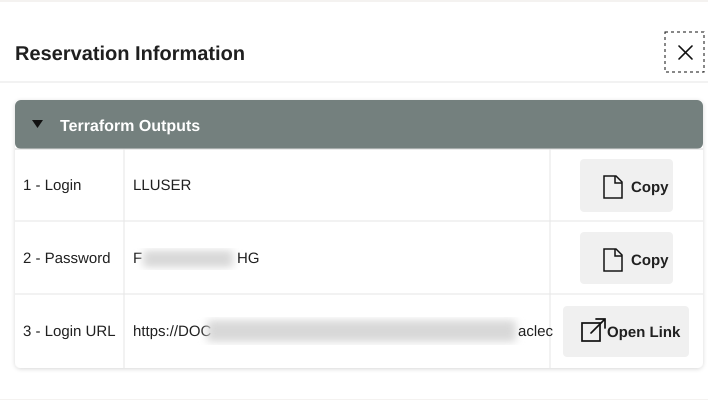
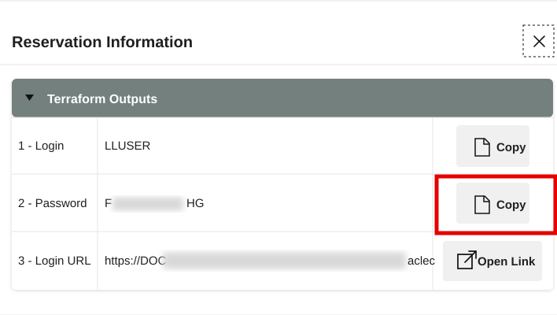
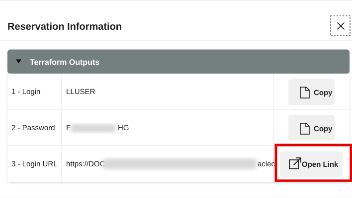
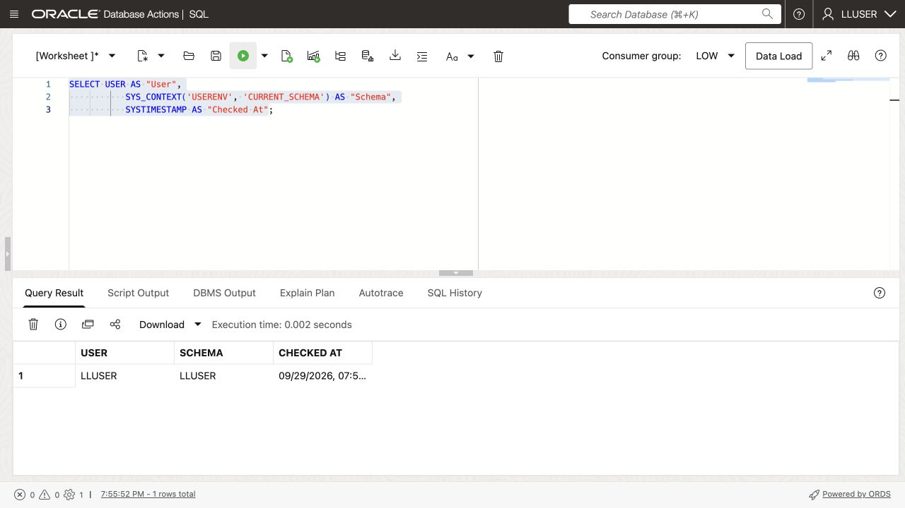

# Getting Started

<!-- markdownlint-configure-file
{
  "MD033": {
    "allowed_elements": [
      "details",
      "summary",
      "strong"
    ]
  }
}
-->

## Introduction

This workshop runs in a **LiveLabs Sandbox**, which prepares the database,
High-Tech data, workshop user, and services automatically.

<details>
<summary><strong>Key terms: Database Actions, SQL Worksheet, and LLUSER</strong></summary>

> * **Database Actions** is Oracle Database’s browser workspace for SQL,
>   objects, data, and development tools.
>
> * **SQL Worksheet** runs SQL and displays results, script output, and errors.
>
> * `LLUSER` owns the workshop’s High-Tech tables, views, and other hands-on objects.

</details>

Estimated Time: **5 minutes**

### Objectives

* Launch the LiveLabs workshop environment.
* Use the reservation login information to open Database Actions.
* Confirm that SQL Worksheet is connected as the workshop schema user.

## Task 1: Launch the LiveLabs environment

1. Sign in to [LiveLabs](https://livelabs.oracle.com) with your Oracle account.

2. Open this workshop, select **Start**, and select **Run on LiveLabs Sandbox**.

3. Wait for the sandbox environment to finish provisioning. In **My
    Reservations**, select **Launch Workshop** for this reservation.

4. Select **View Login Info** and keep the database credentials available for
    the next task.

    

## Task 2: Open SQL Worksheet

1. In the **Reservation Information** dialog, confirm that **1 - Login** shows `LLUSER`.

2. Select **Copy** for **2 - Password**.

    

3. Select **Open Link** for **3 - Login URL**.

    

4. On the Database Actions sign-in page, confirm that **Username** shows
    `LLUSER`, paste the password from the reservation information, and select
    **Sign in**.

    

5. Before SQL Worksheet opens, select **Development**, then select **SQL** from
    the tools menu.

    

6. Follow these steps whenever you use SQL Worksheet during the workshop.

    * Confirm the user dropdown shows the main workshop user, usually `LLUSER`.
    * Paste each workshop SQL block into the editor.
    * Select **Run Statement** or press **Ctrl+Enter** to run the current SQL statement.
    * Review the output in **Query Result** or **Script Output**, depending on
      the step.
    * Use **Navigator** only when you want to inspect tables, views, or other objects.

7. Run this check.

    `USER` identifies the signed-in user;
    `SYS_CONTEXT('USERENV', 'CURRENT_SCHEMA')` shows where table names resolve.
    Both should be `LLUSER`.

    ```sql
    <copy>
    SELECT USER AS "User",
           SYS_CONTEXT('USERENV', 'CURRENT_SCHEMA') AS "Schema",
           SYSTIMESTAMP AS "Checked At";
    </copy>
    ```

    

    | User | Schema | Checked At |
    | --- | --- | --- |
    | LLUSER | LLUSER | Current SQL Worksheet timestamp |

## Acknowledgements

* **Author** - Matt Kowalik
* **Contributor** - Kevin Lazarz
* **Last Updated By/Date** - Matt Kowalik, September 2026
