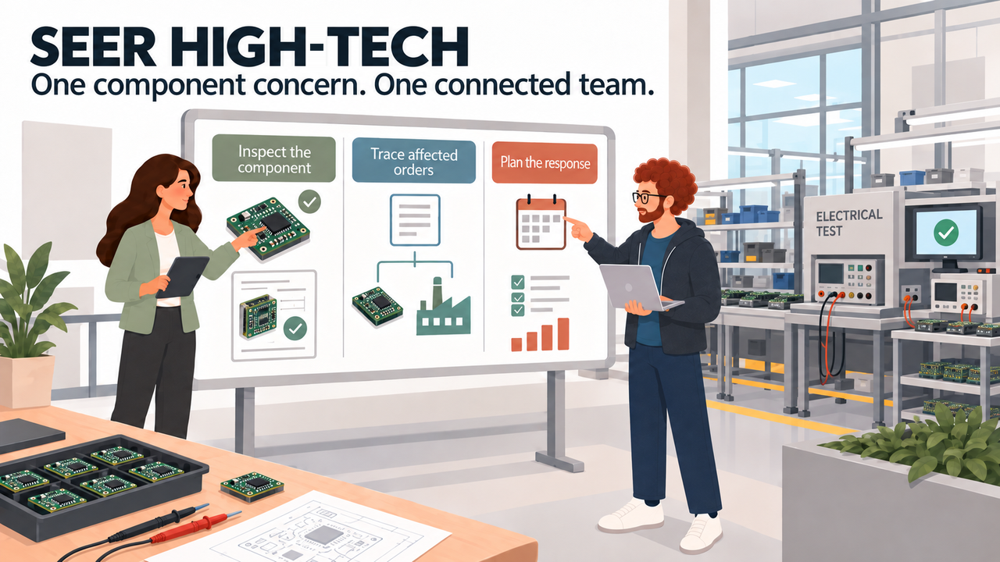
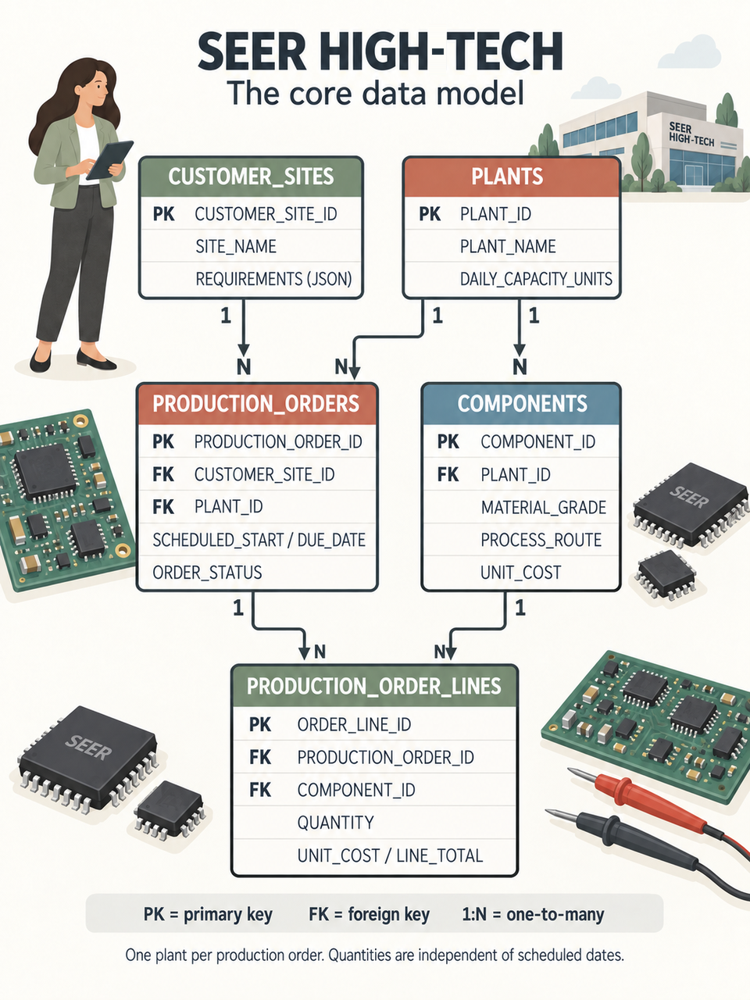
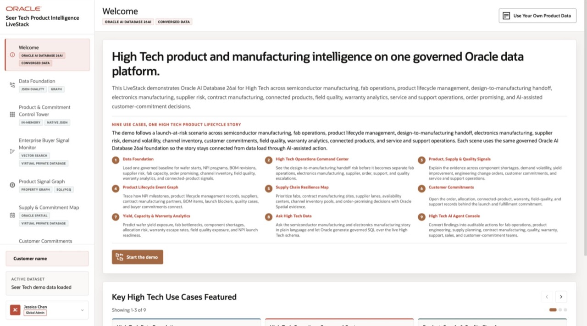

# Build Connected High-Tech Solutions with Oracle AI Database

<!-- markdownlint-configure-file
{
  "MD013": {
    "code_blocks": false,
    "tables": false
  },
  "MD033": {
    "allowed_elements": [
      "details",
      "summary",
      "strong"
    ]
  }
}
-->

## Introduction

Jessica Chan, the DBA at Seer High-Tech, starts the morning with a question from
the quality team. Electrical testing has flagged excessive leakage current in a
power control module assembled with a purchased semiconductor lot. Which
production orders use that component, and what should the team review before
work continues?

Follow Jessica’s team through JSON, vector search, graphs, spatial queries,
machine learning, and AI. Run their queries and inspect the results to decide
what the quality team should do next.

### Seer High-Tech data model

Seer High-Tech assembles and tests electronic control modules using purchased
packaged semiconductors. It does not fabricate wafers. `COMPONENTS` stores
module revisions specific to each plant; `PRODUCTION_ORDERS` records commitments
to build modules for customers. The graph links test observations to shared
lots, suppliers, equipment and lot certificates.

*One plant per production order. Each component revision belongs to one plant
and specifies a board material grade and assembly/test route. Production-order
lines record quantities and unit costs.* [Open the illustrated ERD][link-1] or
the [text-based schema diagram](images/seer-hightech-erd.svg).

### What the team builds

| Team member | Decision or result | Database capability |
| --- | --- | --- |
| Jessica, DBA | Rank quality concerns and affected orders. | One query combines relational alerts, vectors, JSON, and location data. |
| Thomas, application developer | Serve flexible production-order documents. | JSON columns, collections, and duality views. |
| Gilly, AI engineer | Match a quality concern to components and customer orders. | An ONNX model creates component vectors in the database. |
| Bob, graph specialist | Trace shared lots, equipment, and supporting records. | Property graph patterns over relational data. |
| Moon, spatial expert | Find nearby plants for customer sites. | Spatial relationships, distance, and GeoJSON. |
| Otto, data scientist | Build a watchlist with test measurements beside predictions. | In-database model training and scoring. |
| Nina, production analyst | Ask questions, inspect SQL, and review agent activity. | Select AI and an agent with an approved SQL tool. |

<strong>Learn more: What does "converged database" mean?</strong>

> A **converged database** handles several data types and kinds of work in one
> database. Here, teams use relational rows, JSON documents, vectors, graphs,
> geographic data, machine learning models, and AI-assisted SQL.
>
> These share records and access controls without requiring a separate store for
> each data type.

### Objectives

* Follow Jessica and her team as they investigate a component quality concern.
* Use relational SQL, JSON, vectors, graphs, spatial data, Oracle Machine
  Learning, Select AI, and Select AI Agent in practical tasks.
* See how one Oracle AI Database can support different data types without
  separate copies of the manufacturing records.
* Understand how database privileges, AI profile settings, approved tools, and
  execution history help teams control access and review AI results.
* Explain how each query would support a Seer High-Tech application.

Estimated Workshop Time: **90 minutes**

## Running the High-Tech demo

The LiveLabs sandbox prepares the database for these exercises. Explore the
[High-Tech LiveStack demo][link-2] to see these capabilities in an application.

<!-- markdownlint-disable-next-line MD036 -->
*LiveStack High-Tech Demo: Welcome*

## Acknowledgements

* **Author** - Matt Kowalik
* **Contributor** - Kevin Lazarz
* **Last Updated By/Date** - Matt Kowalik, September 2026

[link-1]: images/seer-hightech-erd-illustrated.png
[link-2]: https://livelabs.oracle.com/ords/r/dbpm/livelabs/view-workshop?wid=4461
