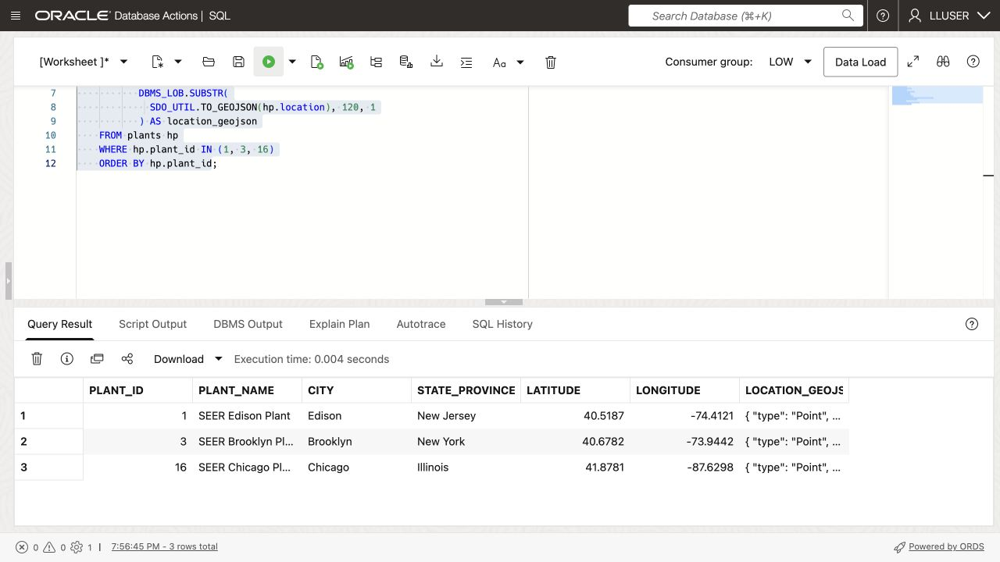
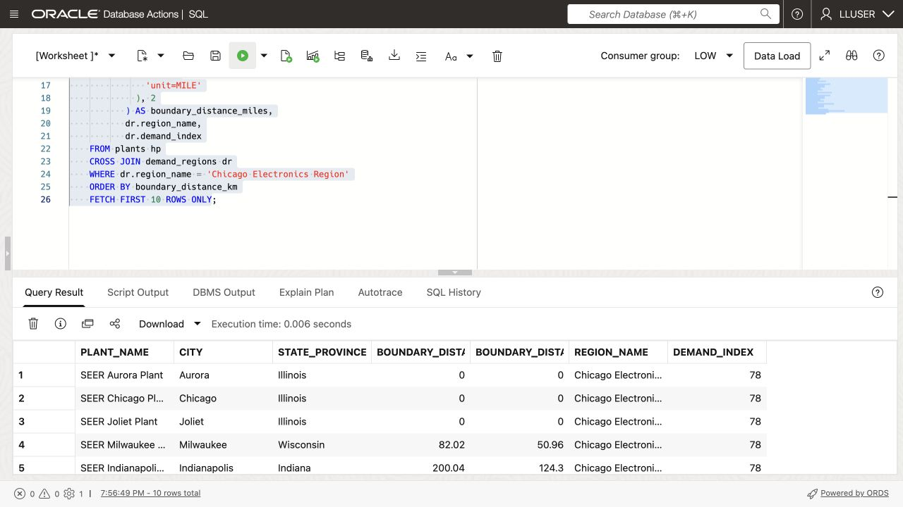
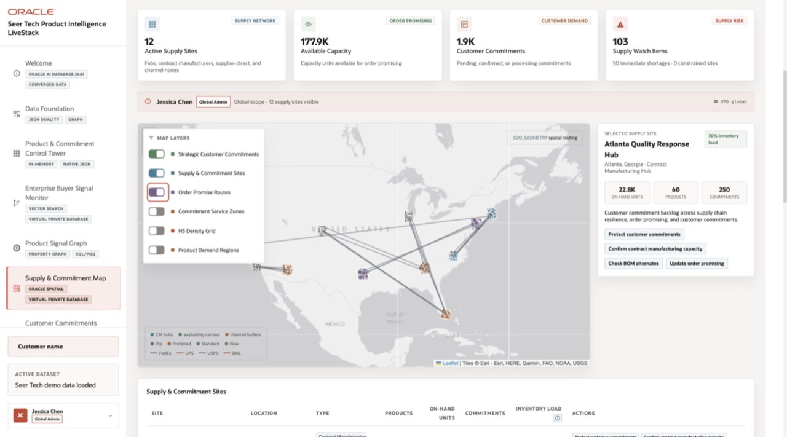

# Find the Closest Manufacturing Plant


## Introduction

Moon Kai, Seer HighTech’s spatial specialist, helps planners find alternative plants for customer sites in a high-demand region. **Which sites are inside the region, and which plant is closest to each?**

Help Moon route customer sites using points, region polygons, and distance queries.

<details>
<summary><strong>Key terms: point, polygon, distance, spatial relationship, and GeoJSON</strong></summary>

> - A **point** is a longitude/latitude location, stored here as `SDO_GEOMETRY`.
>
> - A **polygon** is an area bounded by connected points, such as a demand region.
>
> - **Distance** measures the shortest separation between shapes. A point inside or touching a polygon has distance zero.
>
> - A **spatial relationship** describes how shapes relate. `SDO_GEOM.RELATE` tests whether a site is inside or touches a region.
>
> - **GeoJSON** represents locations and shapes as JSON for map display.
>
</details>

### Objectives

- Identify spatial points and polygons in the HighTech data.
- Convert a database point to GeoJSON for an application map.
- Measure which plants are closest to a demand region.
- Find customer sites inside a demand region.
- Match each customer site to the closest active plant.

Estimated Time: **10 minutes**

> **SQL Worksheet reminder:** See [Getting Started Task 2: Open SQL Worksheet](?lab=getting-started#Task2:OpenSQLWorksheet) for the steps to paste and run SQL.

## Task 1: Look at the locations as points

Moon starts with **where are the plants?** Compare each stored point with its map-ready GeoJSON.

An `SDO_GEOMETRY` point stores its type, coordinate system, and coordinates.

1. Run this query:

    ```sql
    <copy>
    SELECT hp.plant_id,
           hp.plant_name,
           hp.city,
           hp.state_province,
           hp.latitude,
           hp.longitude,
           DBMS_LOB.SUBSTR(
             SDO_UTIL.TO_GEOJSON(hp.location), 120, 1
           ) AS location_geojson
    FROM plants hp
    WHERE hp.plant_id IN (1, 3, 16)
    ORDER BY hp.plant_id;
    </copy>
    ```

    

    `LOCATION` is the database point; `LOCATION_GEOJSON` is its map representation. `SDO_UTIL.TO_GEOJSON` returns a CLOB, so `DBMS_LOB.SUBSTR` limits the displayed text to 120 characters without changing the geometry.

2. Review the point data.

    Compare the point, latitude/longitude columns, and GeoJSON. Notice that GeoJSON places longitude first.

## Task 2: Find the closest plants to a demand region

The sample data gives New York Electronics Region a demand index of `91`. Moon measures the distance between each plant point and the region polygon.

1. Run the distance query:

    ```sql
    <copy>
    SELECT hp.plant_name,
           hp.city,
           hp.state_province,
           ROUND(
             SDO_GEOM.SDO_DISTANCE(
               hp.location,
               dr.boundary,
               0.005,
               'unit=KM'
             ), 2
           ) AS boundary_distance_km,
           dr.region_name,
           dr.demand_index
    FROM plants hp
    CROSS JOIN demand_regions dr
    WHERE dr.region_name = 'New York Electronics Region'
    ORDER BY boundary_distance_km
    FETCH FIRST 10 ROWS ONLY;
    </copy>
    ```

    

    `SDO_GEOM.SDO_DISTANCE` returns the shortest plant-to-region distance. Zero means the plant is inside or touching the region.

    The arguments are:

    - `hp.location`: plant point.
    - `dr.boundary`: region polygon.
    - `0.005`: tolerance for small coordinate differences.
    - `'unit=KM'`: distance in kilometers; use `'unit=MILE'` for miles.

    `ROUND(..., 2)` formats the answer to two decimal places.

    Which plant is closest to the New York region? Note its distance and the region’s `DEMAND_INDEX` before checking capacity.

2. Try another region.

    Change the region name to `Chicago Electronics Region`, add a miles calculation, and run the modified query:

    ```sql
    <copy>
    SELECT hp.plant_name,
           hp.city,
           hp.state_province,
           ROUND(
             SDO_GEOM.SDO_DISTANCE(
               hp.location,
               dr.boundary,
               0.005,
               'unit=KM'
             ), 2
           ) AS boundary_distance_km,
           ROUND(
             SDO_GEOM.SDO_DISTANCE(
               hp.location,
               dr.boundary,
               0.005,
               'unit=MILE'
             ), 2
           ) AS boundary_distance_miles,
           dr.region_name,
           dr.demand_index
    FROM plants hp
    CROSS JOIN demand_regions dr
    WHERE dr.region_name = 'Chicago Electronics Region'
    ORDER BY boundary_distance_km
    FETCH FIRST 10 ROWS ONLY;
    </copy>
    ```

    

    Chicago’s synthetic demand index is 78. Compare the kilometer and mile values, and check whether any plant has distance zero.

## Task 3: Route customer sites to the closest plant

Moon combines two checks: which customer sites lie inside New York Electronics Region, and which active plant is nearest to each?

1. Run the customer-site routing query:

    ```sql
    <copy>
    WITH regional_sites AS (
      SELECT dr.region_name,
             dr.demand_index,
             g.customer_site_id,
             g.site_name,
             g.first_name || ' ' || g.last_name AS contact_name,
             g.email,
             g.priority_class,
             g.location
      FROM customer_sites g
      CROSS JOIN demand_regions dr
      WHERE dr.region_name = 'New York Electronics Region'
        AND SDO_GEOM.RELATE(
              dr.boundary,
              'ANYINTERACT',
              g.location,
              0.005
            ) = 'TRUE'
    ), ranked_plants AS (
      SELECT rg.region_name,
             rg.demand_index,
             rg.customer_site_id,
             rg.site_name,
             rg.contact_name,
             rg.email,
             rg.priority_class,
             hp.plant_name,
             hp.city AS plant_city,
             hp.daily_capacity_units,
             hp.capacity_utilization_pct,
             ROUND(
               SDO_GEOM.SDO_DISTANCE(
                 rg.location,
                 hp.location,
                 0.005,
                 'unit=KM'
               ), 2
             ) AS site_plant_distance_km,
             ROW_NUMBER() OVER (
               PARTITION BY rg.customer_site_id
               ORDER BY SDO_GEOM.SDO_DISTANCE(
                          rg.location,
                          hp.location,
                          0.005,
                          'unit=KM'
                        ), hp.plant_id
             ) AS plant_rank
      FROM regional_sites rg
      CROSS JOIN plants hp
      WHERE hp.is_active = 1
    )
    SELECT region_name,
           demand_index,
           customer_site_id,
           site_name,
           contact_name,
           email,
           priority_class,
           plant_name,
           plant_city,
           daily_capacity_units,
           capacity_utilization_pct,
           site_plant_distance_km
    FROM ranked_plants
    WHERE plant_rank = 1
    ORDER BY site_plant_distance_km, customer_site_id
    FETCH FIRST 25 ROWS ONLY;
    </copy>
    ```

    

    `SDO_GEOM.RELATE` keeps customer sites whose point falls inside or touches the New York Electronics Region polygon. `SDO_GEOM.SDO_DISTANCE` then measures the distance from each matching customer site to every active plant. `ROW_NUMBER` keeps the nearest plant for each customer site.

2. Find the closest active plant for each customer site.

    Check the site contact, distance, `DAILY_CAPACITY_UNITS`, and `CAPACITY_UTILIZATION_PCT`. Which site would Moon investigate first for a possible reassignment?

3. Change the query to `Chicago Electronics Region`.

    Compare the customer sites and candidate plants with New York. The predicates stay the same; only the region changes.

Distance and a capacity snapshot are only a first pass. Before moving an order, Moon also needs to check whether the plant can build that component, has material and machine time, and can meet the delivery date.

## Next Steps

Explore further in the [Oracle Spatial LiveLabs workshop](https://livelabs.oracle.com/ords/r/dbpm/livelabs/view-workshop?clear=RR,180&wid=800).

## Application example

The [HighTech LiveStack demo](https://livelabs.oracle.com/ords/r/dbpm/livelabs/view-workshop?wid=4461) shows supply sites, customer commitments, and order routes on a map.



*LiveStack HighTech Demo: Supply & Commitment Map*

## Acknowledgements

* **Author** - Matt Kowalik
* **Contributor** - Kevin Lazarz
* **Last Updated By/Date** - Matt Kowalik, September 2026
