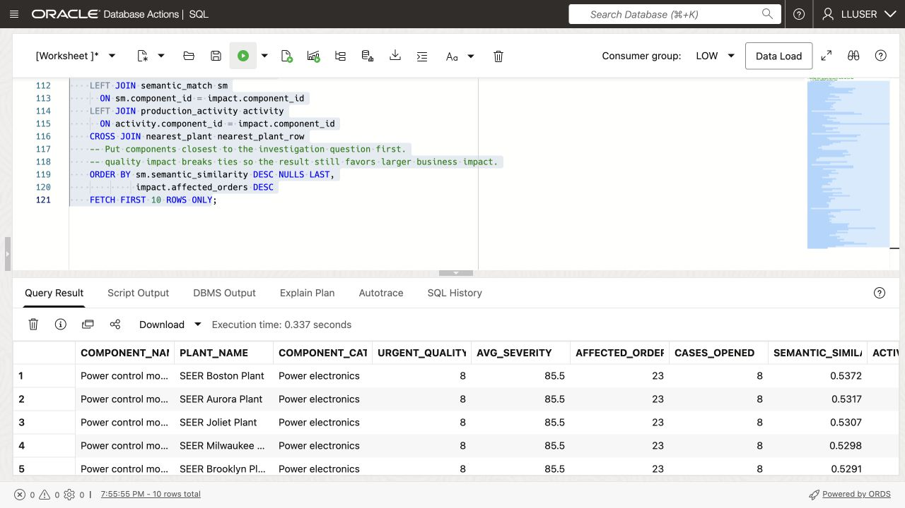
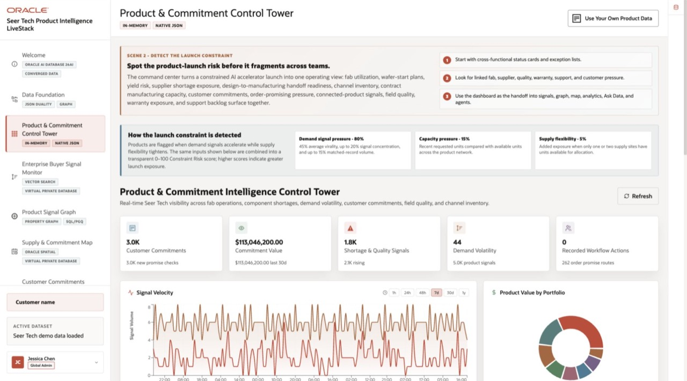
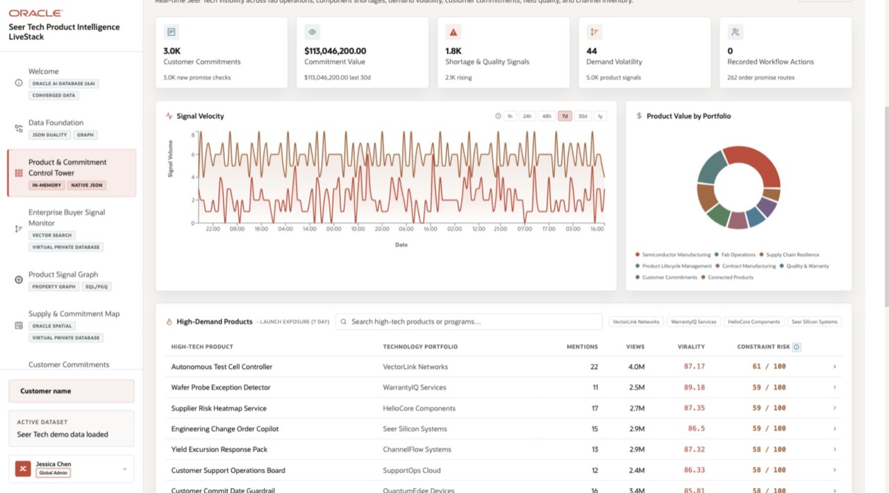

# Build a Converged Dashboard Query

<!-- markdownlint-configure-file
{
  "MD013": {
    "code_blocks": false,
    "tables": false
  }
}
-->

## Introduction

Jessica Chan, Seer High-Tech’s DBA, starts with the quality team’s morning
question: **which component needs attention first, and which production orders
and customer sites may be affected?**

Build Jessica’s dashboard query from relational alerts, JSON orders, component
vectors, and plant locations.


### Objectives

* Explain how one database query combines the data needed for a
  production-quality review.
* Run one query that combines relational, vector, JSON, and spatial database capabilities.
* Modify the query to investigate a different production-quality question and
  explain the change in results.

Estimated Time: **10 minutes**

> **SQL Worksheet reminder:** See
> [Getting Started Task 2: Open SQL Worksheet][link-1] for the steps to paste
> and run SQL.

## Task 1: Run a converged production investigation

Run the query to find components with severe quality alerts.

The query combines four data types:

* **Relational:** Calculate quality impact from alerts and the links between
  observations and components.
* **Vector:** `VECTOR_DISTANCE` ranks component embeddings against the
  investigation phrase.
* **JSON:** `JSON_TABLE` reads line items from `PRODUCTION_ORDERS_DV` as rows so
  the query can count order activity.
* **Spatial:** `SDO_GEOM.SDO_DISTANCE` finds the closest plant to New York
  Electronics Region.

1. Open SQL Worksheet as `LLUSER`.

2. Run the query; its comments identify each data type:

    ```sql
    <copy>
    -- RELATIONAL DATA: aggregate high-severity records and join them
    -- to shared component and plant views.
    WITH component_quality_impact AS (
        SELECT sov.component_id,
               sov.component_name,
               hpv.plant_name,
               sov.component_category,
               COUNT(DISTINCT sa.alert_id) AS urgent_quality_alerts,
               ROUND(AVG(sa.severity_score), 1) AS avg_severity,
               SUM(sa.affected_orders) AS affected_orders,
               SUM(sa.corrective_actions_opened) AS cases_opened
        FROM quality_alerts_v sa
        JOIN observation_components pom
          ON pom.observation_id = sa.alert_id
        JOIN components_v sov
          ON sov.component_id = pom.component_id
        JOIN plants_v hpv
          ON hpv.plant_id = sov.plant_id
        WHERE sa.severity_score >= 80
        GROUP BY sov.component_id,
                 sov.component_name,
                 hpv.plant_name,
                 sov.component_category
    ),
    -- VECTOR DATA: compare the investigation question with stored
    -- component embeddings to rank components by meaning, not exact wording.
    semantic_match AS (
        SELECT so.component_id,
               ROUND(1 - VECTOR_DISTANCE(
               oe.embedding,
                   VECTOR_EMBEDDING(
                       ADMIN.ALL_MINILM_L12_V2
                       USING 'power control module leakage current and switching faults requiring quality review' AS DATA
                   ),
                   COSINE
               ), 4) AS semantic_similarity
        FROM component_embeddings oe
        JOIN components so
          ON so.component_id = oe.component_id
    ),
    -- JSON DATA: read production_order documents from the duality view and
    -- project nested line items into relational rows with JSON_TABLE.
    production_activity AS (
        SELECT jt.component_id,
               COUNT(DISTINCT jt.production_order_id) AS active_orders,
               SUM(jt.quantity) AS active_units
        FROM production_orders_dv rd
        CROSS APPLY JSON_TABLE(
            rd.data,
            '$'
            COLUMNS (
                production_order_id NUMBER PATH '$._id',
                order_status VARCHAR2(30) PATH '$.status',
                NESTED PATH '$.items[*]' COLUMNS (
                    component_id NUMBER PATH '$.componentId',
                    quantity NUMBER PATH '$.quantity'
                )
            )
        ) jt
        WHERE jt.order_status IN ('planned', 'released')
        GROUP BY jt.component_id
    ),
    -- SPATIAL DATA: calculate the distance from each plant point
    -- to the New York Electronics Region demand-region boundary.
    nearest_plant AS (
        SELECT routing_plant.plant_name,
               routing_plant.city,
               routing_plant.state_province,
               dr.region_name,
               dr.demand_index,
               ROUND(
                   SDO_GEOM.SDO_DISTANCE(
                       hp.location,
                       dr.boundary,
                       0.005,
                       'unit=KM'
                   ),
                   2
               ) AS distance_to_demand_region_km
        FROM plants_v routing_plant
        JOIN plants hp
          ON hp.plant_id = routing_plant.plant_id
        CROSS JOIN demand_regions dr
        WHERE dr.region_name = 'New York Electronics Region'
          AND hp.is_active = 1
        ORDER BY SDO_GEOM.SDO_DISTANCE(
                     hp.location,
                     dr.boundary,
                     0.005,
                     'unit=KM'
                 ), hp.plant_id
        FETCH FIRST 1 ROW ONLY
    )
    -- CONVERGED RESULT: join the outputs of the four data-model operations
    -- into one dashboard investigation result.
    SELECT impact.component_name,
           impact.plant_name,
           impact.component_category,
           impact.urgent_quality_alerts,
           impact.avg_severity,
           impact.affected_orders,
           impact.cases_opened,
           sm.semantic_similarity,
           NVL(activity.active_orders, 0) AS active_orders,
           NVL(activity.active_units, 0) AS active_units,
           nearest_plant_row.plant_name AS nearest_plant,
           nearest_plant_row.city || ', ' || nearest_plant_row.state_province AS plant_location,
           nearest_plant_row.region_name AS demand_region,
           nearest_plant_row.demand_index,
           nearest_plant_row.distance_to_demand_region_km
    FROM component_quality_impact impact
    LEFT JOIN semantic_match sm
      ON sm.component_id = impact.component_id
    LEFT JOIN production_activity activity
      ON activity.component_id = impact.component_id
    CROSS JOIN nearest_plant nearest_plant_row
    -- Put components closest to the investigation question first.
    -- quality impact breaks ties so the result still favors larger business impact.
    ORDER BY sm.semantic_similarity DESC NULLS LAST,
             impact.affected_orders DESC
    FETCH FIRST 10 ROWS ONLY;
    </copy>
    ```

    

3. Which component ranks first? Compare its urgent alerts, active orders,
    average severity, and similarity score.

    `NEAREST_PLANT` gives regional context; it does not reassign an order. Do
    not add alert counts to estimate unique affected orders, since one order can
    have more than one alert.

## Task 2: Change the investigation question

Jessica now asks about assembly capacity. Replace the embedded investigation
phrase with:

```text
electronics assembly capacity and semiconductor availability
```

Run the query again and compare the top rows.

1. Which components moved into or out of the top ten?
2. Which components still have high quality impact in the relational data but
    match the new question less closely?
3. Which components have the most active production orders or units that may
    need review?

Which component would Jessica investigate first now?


## Next Steps

Next, use JSON Relational Duality to expose the same production order data as
JSON for an application while keeping SQL access for the database team.

## Application example

The [High-Tech LiveStack demo][link-2] shows these signals in a product and
commitment control tower.



<!-- markdownlint-disable-next-line MD036 -->
*LiveStack High-Tech Demo: Product & Commitment Control Tower*



<!-- markdownlint-disable-next-line MD036 -->
*LiveStack High-Tech Demo: Product & Commitment Control Tower*

## Acknowledgements

* **Author** - Matt Kowalik
* **Contributor** - Kevin Lazarz
* **Last Updated By/Date** - Matt Kowalik, September 2026

[link-1]: ?lab=getting-started#Task2:OpenSQLWorksheet
[link-2]: https://livelabs.oracle.com/ords/r/dbpm/livelabs/view-workshop?wid=4461
