# Trace a Production Quality Network

## Introduction

Bob Green, Seer High-Tech’s graph specialist, is investigating production order `PO-8841`. Shared material lots, inspection records, machines, and suppliers may connect it to other orders.

You will follow those connections with SQL/PGQ, then explore the same relationships in Graph Studio. SQL returns tables to compare; Graph Studio displays nodes, edges, and paths.

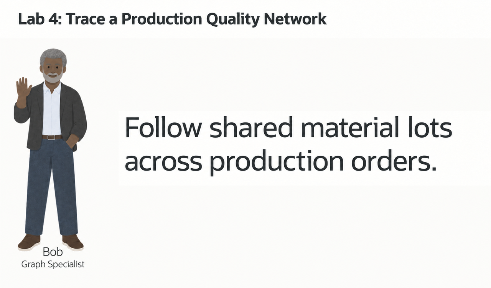

<details>
<summary><strong>Key terms: property graph, vertex, edge, and SQL Property Graph Queries (SQL/PGQ)</strong></summary>

> - A **property graph** represents entities and their connections, with properties attached to both.
>
> - A **vertex** is an entity such as an order, lot, or supplier. Here, vertices have the `entity` label and properties such as risk score and material value.
>
> - An **edge** connects two vertices. Here, edges have the `related_to` label and a relationship-type property.
>
> - A **hop** crosses one edge: order to lot is one hop; order to lot to another order is two. Hops measure graph steps, not physical distance or elapsed time.
>
> - **SQL Property Graph Queries (SQL/PGQ)** express connection patterns in SQL over the existing relational data.

</details>

### Objectives

- Identify vertices and edges in a property graph.
- Follow connections from a flagged production order.
- Find production order pairs that share traceability records.
- Open Graph Studio from Database Actions.
- Import and run the High-Tech production-quality-network notebook.
- Explain the results so a production analyst can decide what to investigate next.

Estimated Time: **10 minutes**

> **SQL Worksheet reminder:** See [Getting Started Task 2: Open SQL Worksheet](?lab=getting-started#Task2:OpenSQLWorksheet) for the steps to paste and run SQL.

## Task 1: Follow a flagged production order with SQL

Jessica’s query finds entities directly connected to `PO-8841`. Bob needs to follow connections several steps further.

1. Run Jessica's ordinary SQL query:

    ```sql
    <copy>
    SELECT production_order.entity_key AS production_order_key,
           connected.entity_key AS connected_key,
           connected.entity_type AS connected_type,
           rel.relationship_type,
           connected.risk_score AS connected_risk
    FROM trace_entities production_order
    JOIN trace_relationships rel
      ON rel.from_entity = production_order.entity_id
    JOIN trace_entities connected
      ON connected.entity_id = rel.to_entity
    WHERE production_order.entity_key = 'PO-8841'
    ORDER BY connected_risk DESC;
    </copy>
    ```

    The query joins `TRACE_ENTITIES` twice: once for the production order and once for the connected entity. `TRACE_RELATIONSHIPS` supplies the edge between them.

    The result lists the material lot, machine, inspection record, and plant directly connected to `PO-8841`. The supplier is reached through the material lot in the later multi-hop query.

2. Extend Jessica's query to follow one through four hops without using a graph query:

    ```sql
    <copy>
    SELECT production_order_key, connected_key, connected_type,
           relationship_path, connected_risk
    FROM (
      SELECT seed.entity_key AS production_order_key,
             reached.entity_key AS connected_key,
             reached.entity_type AS connected_type,
             r1.relationship_type AS relationship_path,
             reached.risk_score AS connected_risk
      FROM trace_entities seed
      JOIN trace_relationships r1
        ON r1.from_entity = seed.entity_id
      JOIN trace_entities reached
        ON reached.entity_id = r1.to_entity
      WHERE seed.entity_key = 'PO-8841'

      UNION

      SELECT seed.entity_key,
             reached.entity_key,
             reached.entity_type,
             r1.relationship_type || ' -> ' || r2.relationship_type,
             reached.risk_score
      FROM trace_entities seed
      JOIN trace_relationships r1
        ON r1.from_entity = seed.entity_id
      JOIN trace_entities v1
        ON v1.entity_id = r1.to_entity
      JOIN trace_relationships r2
        ON r2.from_entity = v1.entity_id
      JOIN trace_entities reached
        ON reached.entity_id = r2.to_entity
      WHERE seed.entity_key = 'PO-8841'

      UNION

      SELECT seed.entity_key,
             reached.entity_key,
             reached.entity_type,
             r1.relationship_type || ' -> ' ||
               r2.relationship_type || ' -> ' ||
               r3.relationship_type,
             reached.risk_score
      FROM trace_entities seed
      JOIN trace_relationships r1
        ON r1.from_entity = seed.entity_id
      JOIN trace_entities v1
        ON v1.entity_id = r1.to_entity
      JOIN trace_relationships r2
        ON r2.from_entity = v1.entity_id
      JOIN trace_entities v2
        ON v2.entity_id = r2.to_entity
      JOIN trace_relationships r3
        ON r3.from_entity = v2.entity_id
      JOIN trace_entities reached
        ON reached.entity_id = r3.to_entity
      WHERE seed.entity_key = 'PO-8841'

      UNION

      SELECT seed.entity_key,
             reached.entity_key,
             reached.entity_type,
             r1.relationship_type || ' -> ' ||
               r2.relationship_type || ' -> ' ||
               r3.relationship_type || ' -> ' ||
               r4.relationship_type,
             reached.risk_score
      FROM trace_entities seed
      JOIN trace_relationships r1
        ON r1.from_entity = seed.entity_id
      JOIN trace_entities v1
        ON v1.entity_id = r1.to_entity
      JOIN trace_relationships r2
        ON r2.from_entity = v1.entity_id
      JOIN trace_entities v2
        ON v2.entity_id = r2.to_entity
      JOIN trace_relationships r3
        ON r3.from_entity = v2.entity_id
      JOIN trace_entities v3
        ON v3.entity_id = r3.to_entity
      JOIN trace_relationships r4
        ON r4.from_entity = v3.entity_id
      JOIN trace_entities reached
        ON reached.entity_id = r4.to_entity
      WHERE seed.entity_key = 'PO-8841'
    ) paths
    ORDER BY connected_risk DESC;
    </copy>
    ```

    The four `SELECT` branches follow one through four hops. Each additional hop adds a relationship join and an entity join; `UNION` combines the results and removes duplicate rows.

3. Review how the SQL grows more complex when it does not use a graph query.

    Count the joins in the four-hop branch: four relationship joins and five instances of the entity table. Bob will express that path directly with a graph pattern.

## Task 2: Read the same connections as a graph

The workshop already contains `PRODUCTION_QUALITY_NETWORK`, mapped over the existing relational tables. Run the queries directly; the appendix shows its definition.

1. Run Bob's SQL/PGQ query:

    ```sql
    <copy>
    SELECT production_order_key,
           connected_key,
           connected_type,
           relationship_type,
           connected_risk
    FROM GRAPH_TABLE ( production_quality_network
      MATCH (production_order IS entity) -[edge IS related_to]-> (connected IS entity)
      WHERE production_order.entity_key = 'PO-8841'
      COLUMNS (
        production_order.entity_key AS production_order_key,
        connected.entity_key AS connected_key,
        connected.entity_type AS connected_type,
        edge.relationship_type AS relationship_type,
        connected.risk_score AS connected_risk
      )
    )
    ORDER BY connected_risk DESC;
    </copy>
    ```

    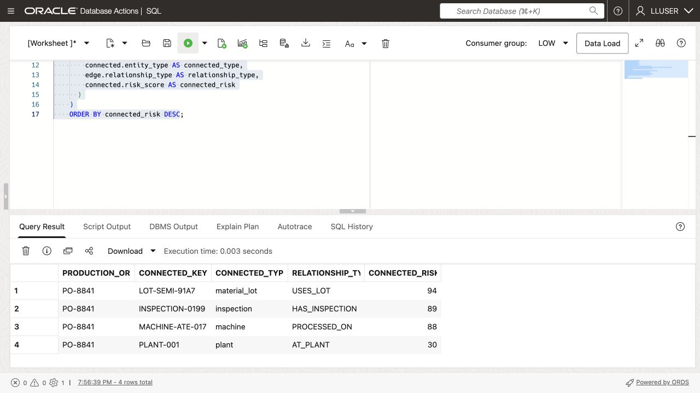

    In the `MATCH` pattern, `production_order` and `connected` are vertices. `edge` is the edge between them, so this pattern follows one hop. `IS entity` and `IS related_to` refer to the labels defined in `PRODUCTION_QUALITY_NETWORK`.

    Compare these rows with Jessica’s direct-connections query. The columns should match.

## Task 3: Trace four-hop quality traceability

Start from flagged production order `PO-8841` and trace the connected entities within four relationship hops.

1. Run the SQL/PGQ traversal from `PO-8841`.

    `(seed IS entity)` is the starting order; `-[e IS related_to]->{1,4}` follows one through four edges to `(reached IS entity)`. `COUNT(e.relationship_type)` counts those edges as `relationship_hops`.

    The `WHERE` clause anchors the search on `PO-8841`, and the `COLUMNS` clause returns graph properties in a normal SQL result table.

    ```sql
    <copy>
    SELECT DISTINCT entity_key, display_name, entity_type,
           relationship_hops, risk_score, risk_level,
           material_value, source_system
    FROM GRAPH_TABLE ( production_quality_network
      MATCH (seed IS entity) -[e IS related_to]->{1,4} (reached IS entity)
      WHERE seed.entity_key = 'PO-8841'
      COLUMNS (
        reached.entity_key AS entity_key,
        reached.display_name AS display_name,
        reached.entity_type AS entity_type,
        COUNT(e.relationship_type) AS relationship_hops,
        reached.risk_score AS risk_score,
        reached.risk_level AS risk_level,
        reached.material_value AS material_value,
        reached.source_system AS source_system
      )
    )
    ORDER BY risk_score DESC
    FETCH FIRST 25 ROWS ONLY;
    </copy>
    ```

    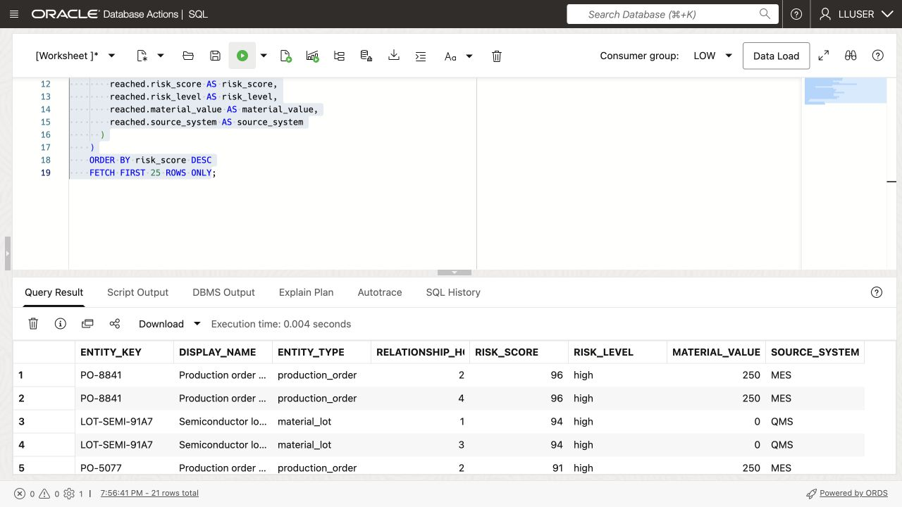

2. Find the highest-risk entities connected to `PO-8841`.

    Find lot `LOT-SEMI-91A7`, test station `MACHINE-ATE-017`, supplier `SUPPLIER-044`, and inspection `INSPECTION-0199`. Which connection would Bob investigate first? Risk and material value help him prioritize; they do not establish the cause of a defect.

## Task 4: Find production orders that share traceability records

Bob widens the investigation: **which order pairs share a material lot, supplier, inspection record, or lot certificate?**

1. Run Bob's production order-pair query:

    ```sql
    <copy>
    SELECT order_a, shared_entity, shared_type, order_b,
           a_risk, b_risk,
           ROUND((a_risk + b_risk) / 2, 1) AS combined_risk,
           e1_type, e2_type
    FROM GRAPH_TABLE ( production_quality_network
        MATCH (a IS entity)
              -[e1 IS related_to]-> (shared IS entity)
              <-[e2 IS related_to]- (b IS entity)
        WHERE a.entity_type = 'production_order'
          AND b.entity_type = 'production_order'
          AND a.entity_id < b.entity_id
          AND shared.entity_type IN ('material_lot','supplier','inspection','certificate')
          AND (a.risk_score >= 70 OR b.risk_score >= 70)
        COLUMNS (
            a.entity_key AS order_a,
            shared.entity_key AS shared_entity,
            shared.entity_type AS shared_type,
            b.entity_key AS order_b,
            a.risk_score AS a_risk,
            b.risk_score AS b_risk,
            e1.relationship_type AS e1_type,
            e2.relationship_type AS e2_type
        )
    )
    ORDER BY combined_risk DESC, shared_entity
    FETCH FIRST 25 ROWS ONLY;
    </copy>
    ```

    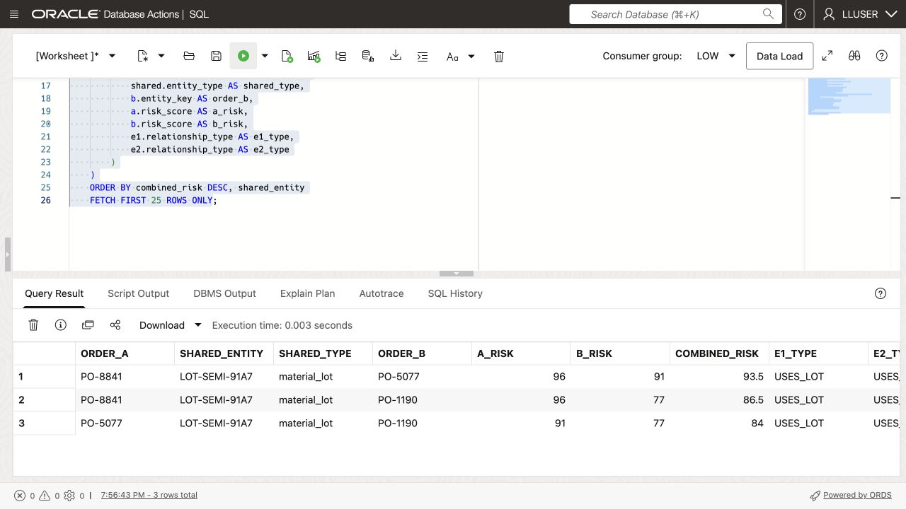

    The pattern connects orders `a` and `b` through a shared entity. `a.entity_id < b.entity_id` prevents returning the same pair in reverse order.

2. Find an order pair linked by a shared traceability record.

    Check the relationship types and `COMBINED_RISK`. Bob can investigate the two orders together, but a shared record does not prove that both orders are defective.

## Task 5: Visualize the relationship using Oracle Graph Studio

Bob opens Graph Studio to follow the `PO-8841` paths and shared material lots in an interactive network.

1. Start from the Database Actions Launchpad. Confirm that the upper-right corner shows `LLUSER`. If the dark-theme message appears, click **Done**.

    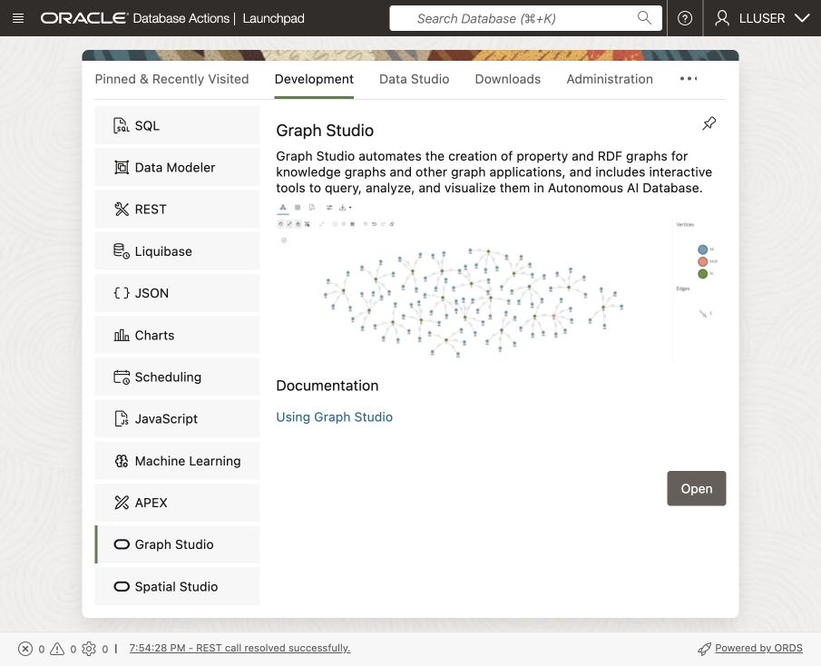

2. On the **Development** tab, select **Graph Studio** from the left-side tool list and click **Open**.

3. If prompted, sign in as `LLUSER` using the supplied workshop password.

4. Confirm that the Graph Studio home page opens. The landing page provides **Graphs**, **Notebooks**, **Templates**, and **Jobs**.

    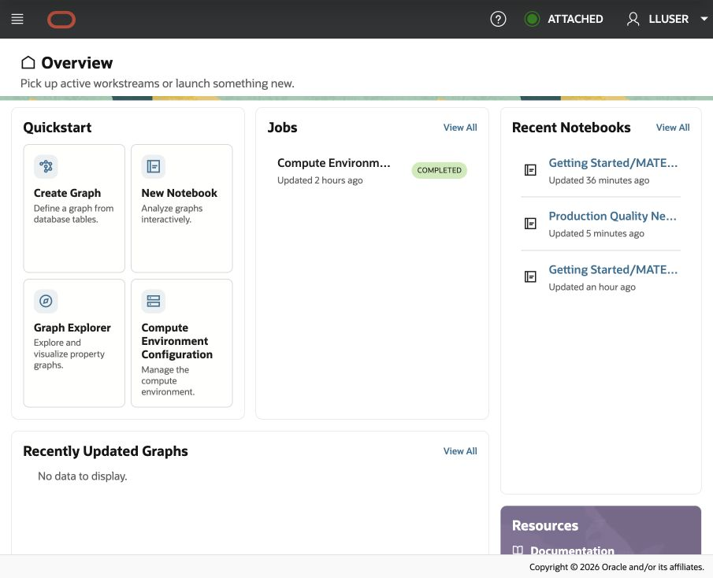

## Task 6: Download and import the High-Tech notebook

1. Download [hightech-production-quality-graph-studio.dsnb](files/hightech-production-quality-graph-studio.dsnb).

    If the notebook opens in your browser instead of downloading, right-click the link and select **Save Link As**.

2. In Graph Studio, click **Notebooks** on the landing page.

    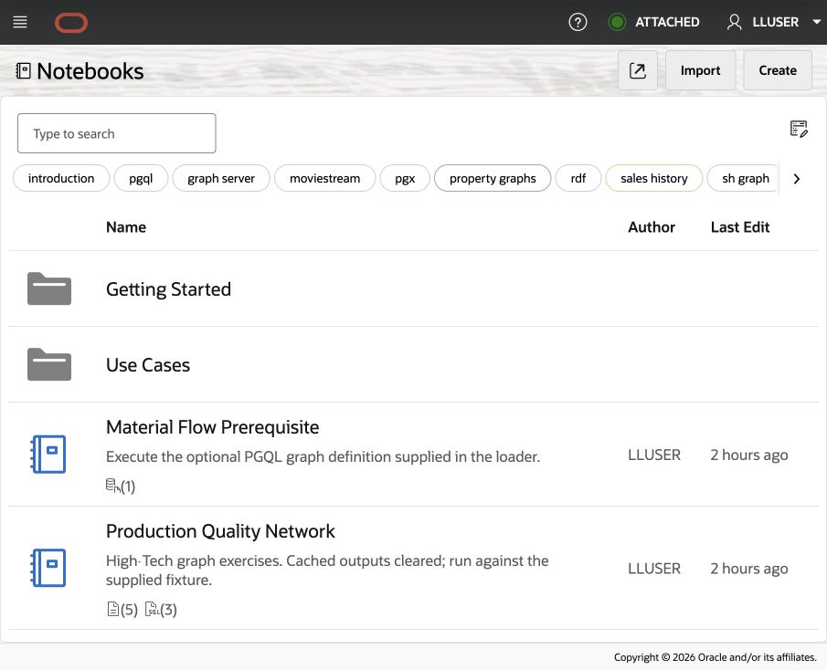

3. Select **Import** in the upper-right corner.

    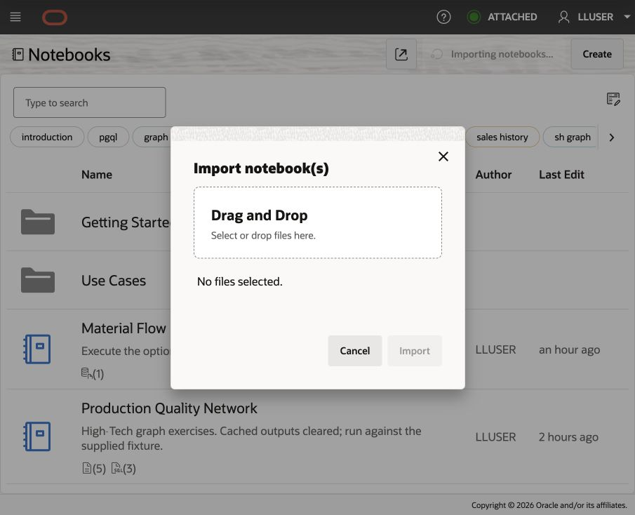

4. Drag the downloaded notebook into the import window or browse to it. Confirm the filename, select **Import**, then open **Production Quality Network**.

    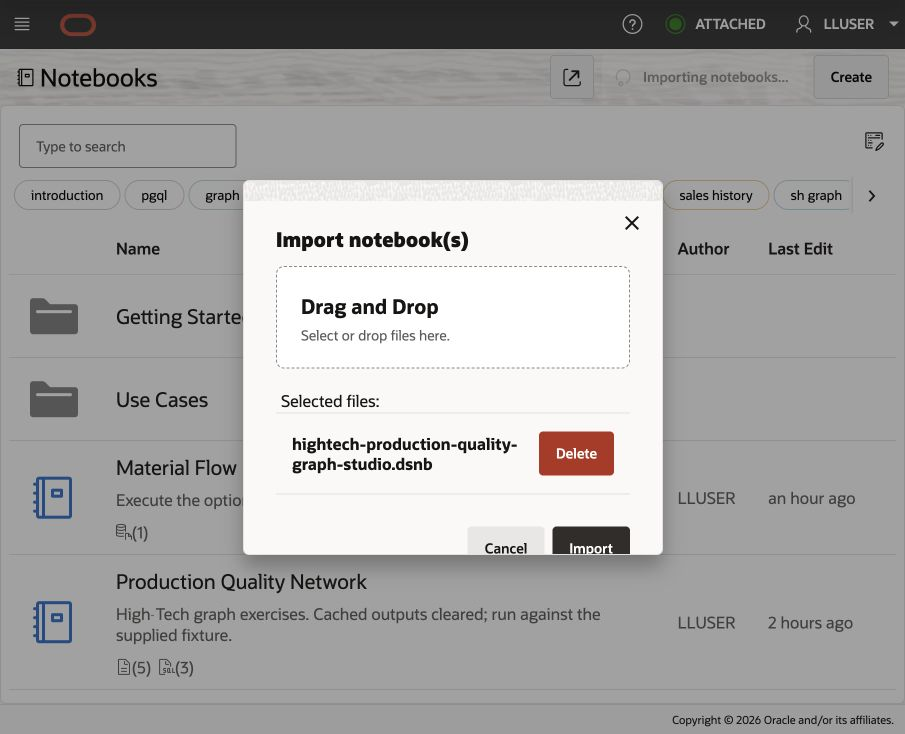

## Task 7: Run and interpret the Graph Studio notebook

Compare the SQL results with Graph Studio views of `PO-8841` and shared lot `LOT-SEMI-91A7`.

1. Start at the top of the **Production Quality Network** notebook. Read the explanation for the `PO-8841` traversal, then run the first SQL paragraph.

    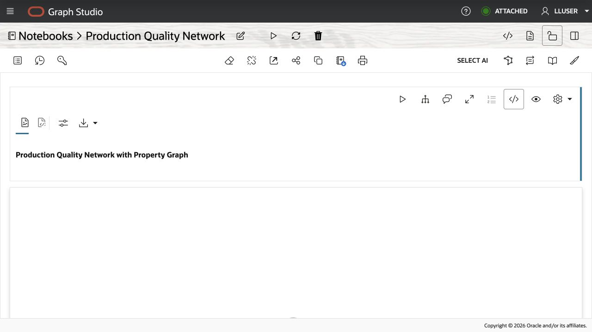

2. Review the ranked entities in **Table** format. This traversal uses one or two hops, compared with four in Task 3.

    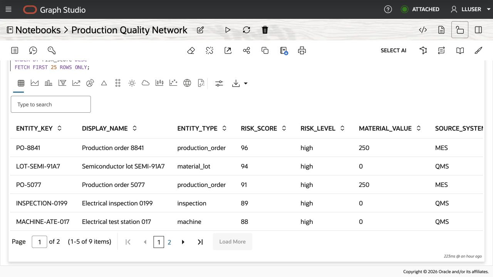

3. Under **Graph Visualization of previous query**, run the `SELECT *` paragraph anchored on `PO-8841` to draw its one-hop and two-hop paths.

    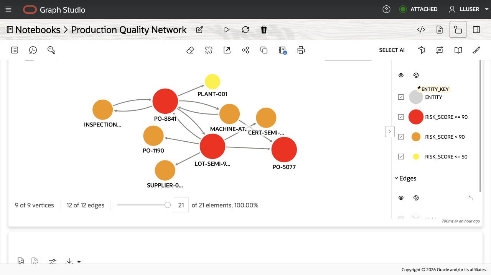

4. Under **Shared Entity Connections**, run the final SQL paragraph to draw orders connected to `LOT-SEMI-91A7`.

    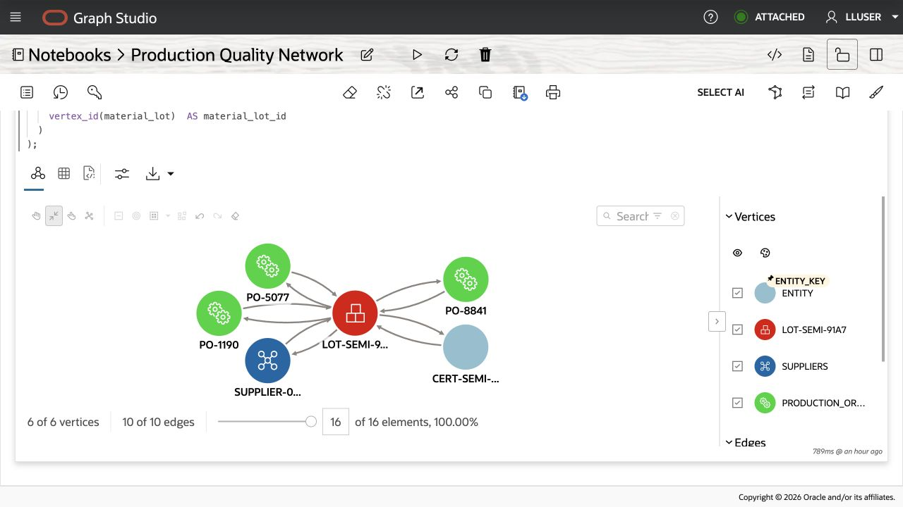

    Review the displayed vertex and edge counts. Remove display filters when checking the full query result.

Find the paths from `LOT-SEMI-91A7` to `PO-8841`, `PO-5077`, and `PO-1190`. Use the entity keys and edges to confirm the links; node positions on the screen can vary.

### Optional graph-algorithms extension

The companion [material flow graph notebook](https://github.com/oracle-livelabs/database/blob/main/livestack-workshop-hightech/production-quality-network/files/getting-started-material-flow-graph.dsnb) lets you practice PGX algorithms: paths, degree counts, PageRank, shortest paths, personalized PageRank, and hop distance. It uses `MATERIAL_FLOW_GRAPH` to connect work centers through material transfers, separately from the `PRODUCTION_QUALITY_NETWORK` used in this lab. A connection shows where material can move; it does not establish the cause of a quality issue.

## Appendix: Create the Property Graph

`TRACE_ENTITIES` supplies vertices labeled `entity`; `TRACE_RELATIONSHIPS` supplies edges labeled `related_to`, with foreign keys identifying their source and destination.

This statement is provided for reference. The `PRODUCTION_QUALITY_NETWORK` graph has already been created in the workshop database.

```sql
<copy>
CREATE PROPERTY GRAPH production_quality_network
  VERTEX TABLES (
    trace_entities KEY (entity_id)
      LABEL entity
      PROPERTIES (
        entity_id,
        entity_key,
        display_name,
        entity_type,
        risk_score,
        risk_level,
        source_system,
        material_value,
        event_count,
        is_confirmed_defect
      ),
    quality_cases KEY (case_id)
      LABEL quality_case
      PROPERTIES (
        case_id,
        case_ref,
        case_type,
        status,
        risk_score,
        loss_amount,
        event_count
      )
  )
  EDGE TABLES (
    trace_relationships KEY (relationship_id)
      SOURCE KEY (from_entity)
        REFERENCES trace_entities (entity_id)
      DESTINATION KEY (to_entity)
        REFERENCES trace_entities (entity_id)
      LABEL related_to
      PROPERTIES (
        relationship_type,
        strength,
        event_count,
        material_value
      ),
    quality_case_entities KEY (case_entity_id)
      SOURCE KEY (case_id)
        REFERENCES quality_cases (case_id)
      DESTINATION KEY (entity_id)
        REFERENCES trace_entities (entity_id)
      LABEL contains_entity
      PROPERTIES (
        role,
        evidence_score
      )
  );
</copy>
```

## Application example

The [High-Tech LiveStack demo](https://livelabs.oracle.com/ords/r/dbpm/livelabs/view-workshop?wid=4461) shows a two-hop graph and a SQL/PGQ query result.

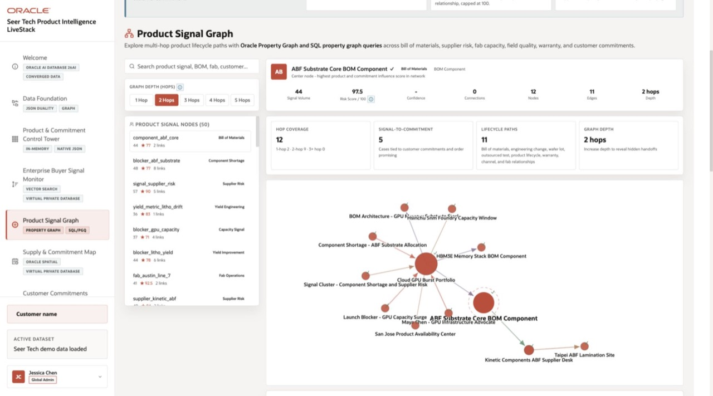

*LiveStack High-Tech Demo: Product Signal Graph*

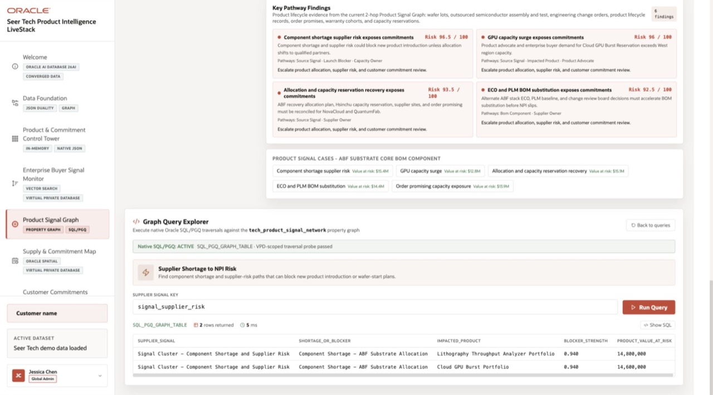

*LiveStack High-Tech Demo: Product Signal Graph*

## Acknowledgements

* **Author** - Matt Kowalik
* **Contributor** - Kevin Lazarz
* **Last Updated By/Date** - Matt Kowalik, September 2026
