# Build a Quality Review Watchlist with Oracle Machine Learning

## Introduction

Otto Spencer, Seer HighTech’s data scientist, is building a quality-review watchlist. The team needs to see which components may need attention and the electrical-test measurements behind each score.

You will train a model to classify components as `REVIEW` or `STABLE`, then join its predictions to component, production-order, and inspection data for the dashboard.

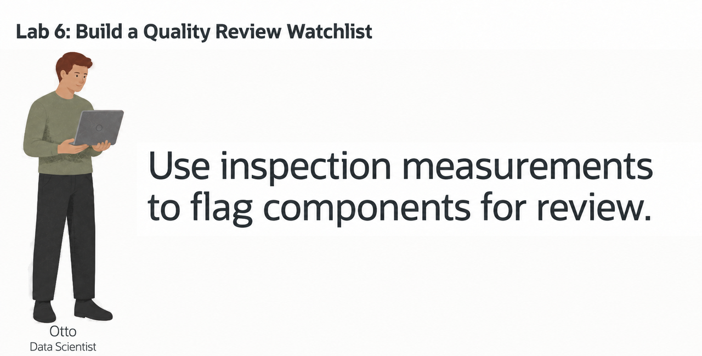

<details>
<summary><strong>Key terms: model, feature, classification, probability, and in-database machine learning</strong></summary>

> - A **model** is a set of learned rules that turns input data into a prediction.
>
> - A **feature** is an input value used by the model. In this lab, features include component category, unit cost, inspection measurements, and production quantities.
>
> - **Classification** predicts a label. Otto's model predicts either `REVIEW` or `STABLE`.
>
> - A **probability** is the model's value for a class. In this lab, the value is displayed as a `REVIEW_SCORE` to rank components for review. It is not a guarantee.
>
> - **In-database machine learning** means the model is trained or scored where the source data already lives. The SQL result can include the prediction and the data used to explain it.

</details>

### Objectives

- Read the prepared training data and identify the model target.
- Optionally use AutoML to compare classification models and inspect their predictions.
- Create a Generalized Linear Model (GLM) inside Oracle AI Database.
- Score components with `PREDICTION` and `PREDICTION_PROBABILITY`.
- Combine model output with component, production-order, and inspection data for a dashboard result.

Estimated Time: **10 minutes**

> **SQL Worksheet reminder:** See [Getting Started Task 2: Open SQL Worksheet](?lab=getting-started#Task2:OpenSQLWorksheet) for the steps to paste and run SQL.

## Task 1: Read the training data

Otto checks `OML_QUALITY_TRAINING_V`: one row per active component, combining inspection and production-order data.

`REVIEW_LABEL` is the label the model learns to predict. The sample data assigns `REVIEW` when the mean defect rate is at least 3 percent and at least two observations record 60 or more minutes of downtime. Other components are `STABLE`.

The view has 96 `REVIEW` rows and 96 `STABLE` rows. Because its labels and measurements come from the same period, a score here does not show how well the model predicts future defects.

The view aggregates quality observations and order lines separately before joining them, so neither set is counted more than once.

1. Run the training-data query:

    ```sql
    <copy>
    SELECT component_id,
           category,
           unit_cost,
           total_observations,
           avg_defect_rate_pct,
           major_stoppages,
           minor_stoppages,
           planned_units,
           material_value,
           review_label
    FROM oml_quality_training_v
    ORDER BY component_id
    FETCH FIRST 10 ROWS ONLY;
    </copy>
    ```

    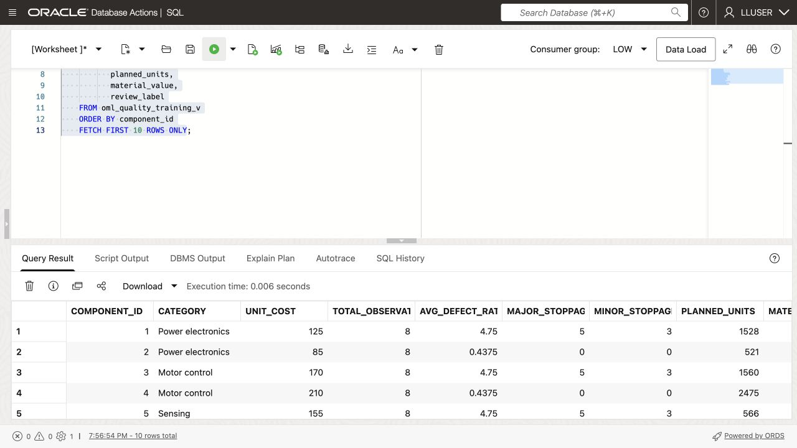

2. Identify the parts of each row.

    The numeric and category columns are the model inputs. `REVIEW_LABEL` is the answer the model learns to predict. `COMPONENT_ID` identifies the component but is not a business feature for this example.

## Task 2: Compare models with AutoML (optional)

AutoML compares and tunes candidate classifiers. Allow several minutes, or skip to Task 3 to build the SQL model directly.

1. Open **Machine Learning** from Database Actions. If prompted, use the credentials in **View Login Info**.

    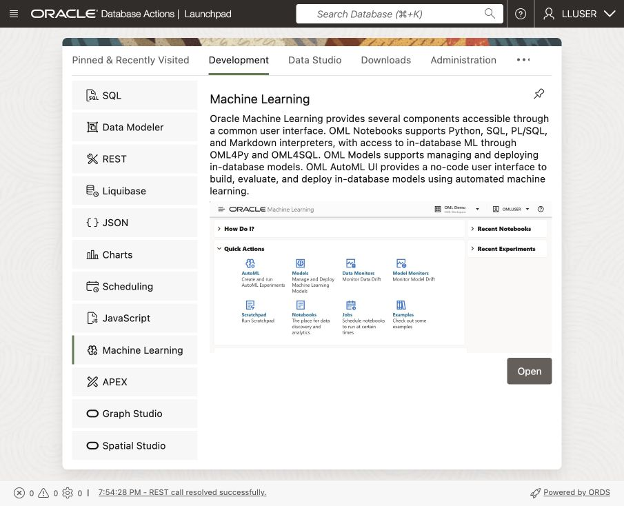

2. Click **AutoML**.

    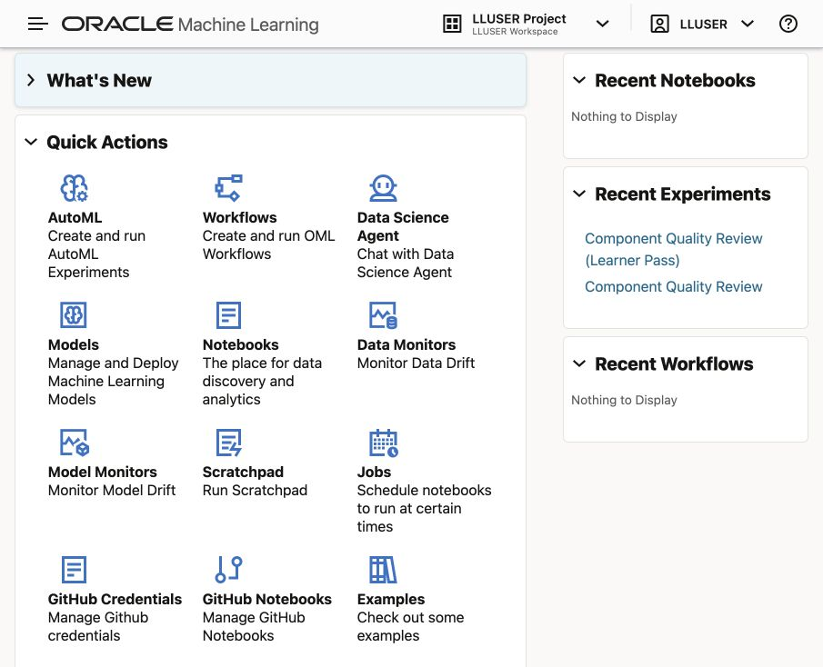

3. Create a new experiment with these settings:

    | Setting         | Value                   |
    | -----------------| -------------------------|
    | Experiment name | `Component Quality Review`  |
    | Data source     | `OML_QUALITY_TRAINING_V` |
    | Predict         | `REVIEW_LABEL`           |
    | Prediction type | `Classification`        |
    | Case ID         | `COMPONENT_ID`            |

    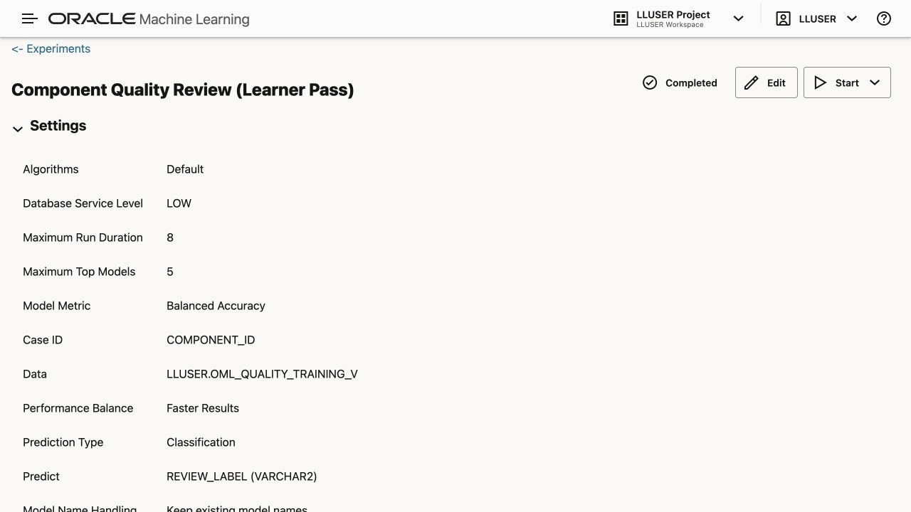

    Choose **Start → Faster Results** and wait for the model leaderboard. Runtime depends on the service and available resources.

4. Review the leaderboard and model details.

    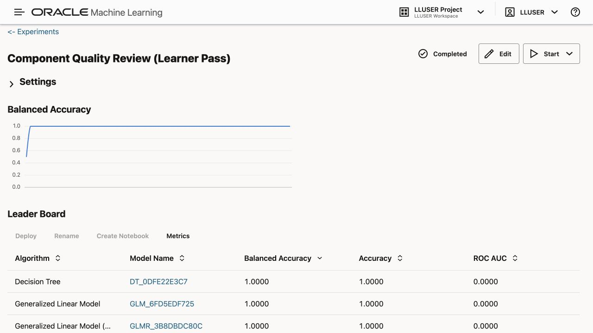

    Compare balanced accuracy, then open a model’s confusion matrix.

    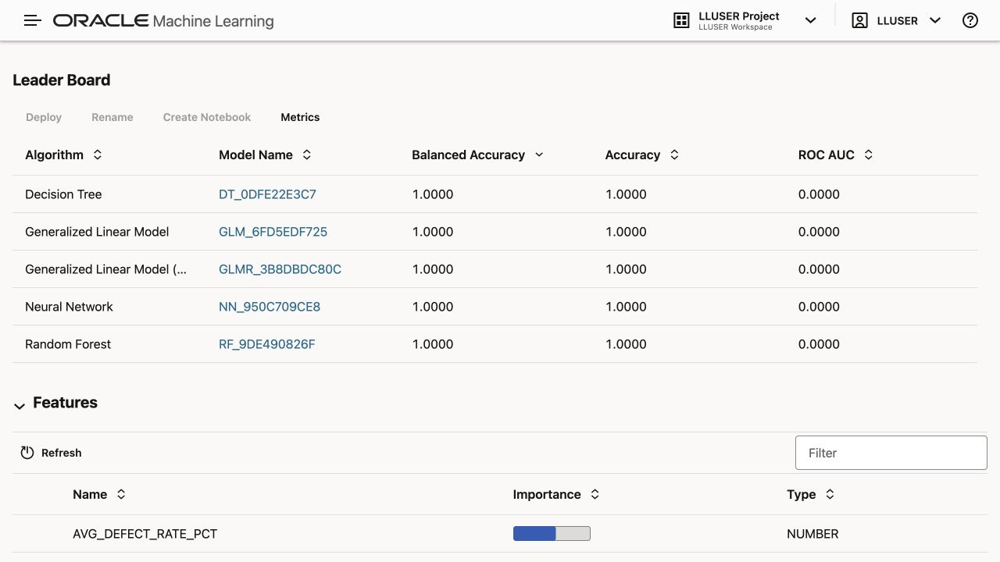

    Inspect the confusion matrix for both `STABLE` and `REVIEW`. A model that predicts only `STABLE` cannot identify quality escalations, even if its overall accuracy looks high. Check false positives and missed quality escalations before choosing a model.

    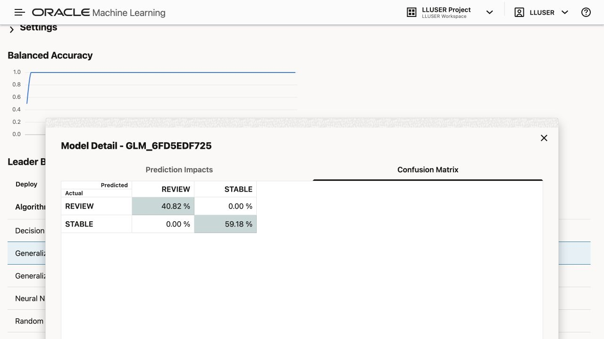

    Even a high score on these synthetic labels does not show how well the model predicts future defects. Task 3 creates a separate GLM using SQL.

    Review prediction impact for the selected model. A feature’s influence on a prediction does not prove that it causes the outcome.

    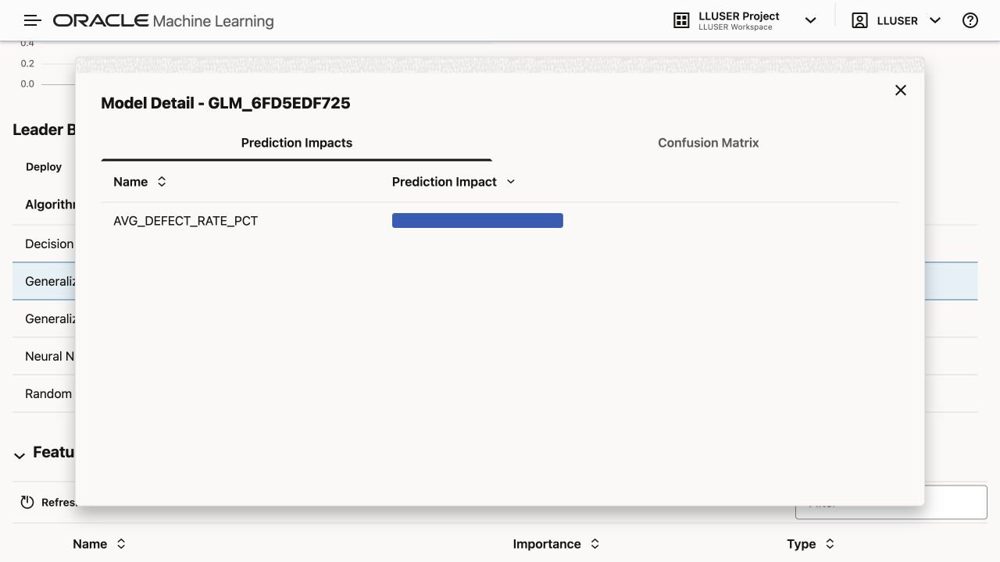

## Task 3: Create a GLM in SQL Developer Web

Create `OTTO_QUALITY_REVIEW_MODEL` in SQL Developer Web. If you ran AutoML, compare the two models’ results.

The settings table tells Oracle to use the **Generalized Linear Model** used in this exercise. `PREP_AUTO` lets the database handle standard preparation of the input columns.

1. Create the settings table and train the model:

    ```sql
    <copy>
    
    DROP TABLE IF EXISTS otto_quality_review_settings;
    
    CREATE TABLE otto_quality_review_settings (
          setting_name  VARCHAR2(30),
          setting_value VARCHAR2(4000)
        );

    INSERT INTO otto_quality_review_settings (setting_name, setting_value)
    VALUES ('ALGO_NAME', 'ALGO_GENERALIZED_LINEAR_MODEL');

    INSERT INTO otto_quality_review_settings (setting_name, setting_value)
    VALUES ('PREP_AUTO', 'ON');

    INSERT INTO otto_quality_review_settings (setting_name, setting_value)
    VALUES ('ODMS_RANDOM_SEED', '20260604');

    COMMIT;

    DECLARE
      l_model_count NUMBER;
    BEGIN
      SELECT COUNT(*)
      INTO l_model_count
      FROM user_mining_models
      WHERE model_name = 'OTTO_QUALITY_REVIEW_MODEL';

      IF l_model_count > 0 THEN
        DBMS_DATA_MINING.DROP_MODEL('OTTO_QUALITY_REVIEW_MODEL');
      END IF;
    END;
    /

    BEGIN
      DBMS_DATA_MINING.CREATE_MODEL(
        model_name           => 'OTTO_QUALITY_REVIEW_MODEL',
        mining_function      => DBMS_DATA_MINING.CLASSIFICATION,
        data_table_name      => 'OML_QUALITY_TRAINING_V',
        case_id_column_name  => 'COMPONENT_ID',
        target_column_name   => 'REVIEW_LABEL',
        settings_table_name  => 'OTTO_QUALITY_REVIEW_SETTINGS'
      );
    END;
    /
    </copy>
    ```

2. Confirm that Oracle created the model:

    ```sql
    <copy>
    SELECT model_name,
           mining_function,
           algorithm
    FROM user_mining_models
    WHERE model_name = 'OTTO_QUALITY_REVIEW_MODEL';
    </copy>
    ```

    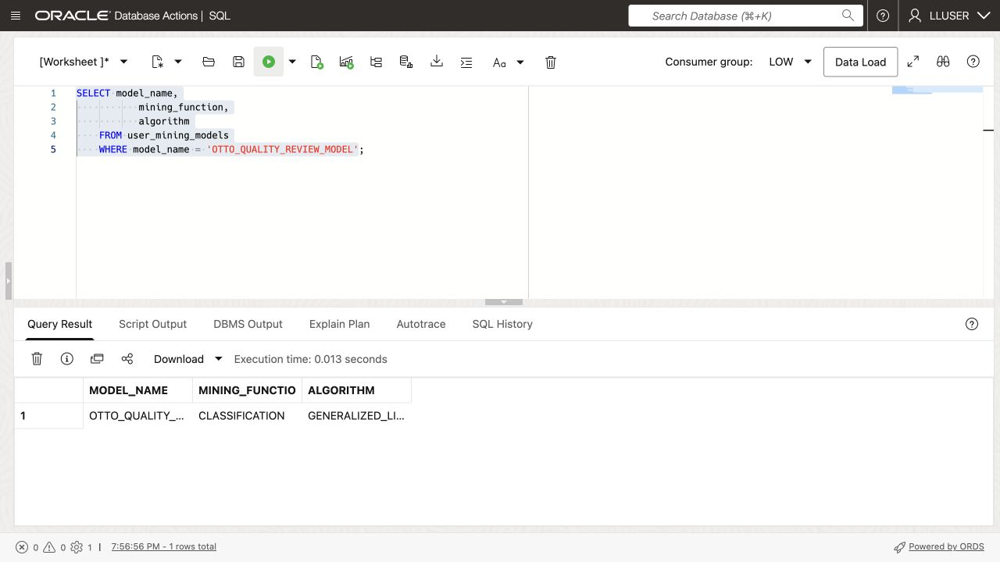

    Expect `CLASSIFICATION` and `GENERALIZED_LINEAR_MODEL`.

## Task 4: Score sample component measurements in SQL

Otto changes several measurements from the training view and scores them without a target label. These sample rows are not independent test data, so their scores do not measure future accuracy.

1. Create the scoring table and add the sample inspection measurements:

    ```sql
    <copy>
    
    DROP TABLE IF EXISTS otto_quality_review_scoring_data;

    CREATE TABLE otto_quality_review_scoring_data (
      component_id    NUMBER,
      category      VARCHAR2(100),
      unit_cost    NUMBER,
      total_observations   NUMBER,
      avg_defect_rate_pct NUMBER,
      total_inspected_units   NUMBER,
      total_rejected_units  NUMBER,
      total_rework_minutes   NUMBER,
      avg_downtime_minutes  NUMBER,
      major_stoppages   NUMBER,
      minor_stoppages  NUMBER,
      planned_units    NUMBER,
      material_value       NUMBER
    );

    INSERT INTO otto_quality_review_scoring_data (
      component_id,
      category,
      unit_cost,
      total_observations,
      avg_defect_rate_pct,
      total_inspected_units,
      total_rejected_units,
      total_rework_minutes,
      avg_downtime_minutes,
      major_stoppages,
      minor_stoppages,
      planned_units,
      material_value
    )
    SELECT component_id,
           category,
           unit_cost,
           total_observations + 4,
           ROUND((total_rejected_units + 12) / (total_inspected_units + 200) * 100, 4),
           total_inspected_units + 200,
           total_rejected_units + 12,
           total_rework_minutes + 500,
           avg_downtime_minutes + 15,
           major_stoppages + 1,
           minor_stoppages + 1,
           planned_units + 3,
           material_value + (unit_cost * 3)
    FROM (
      SELECT component_id,
             category,
             unit_cost,
             total_observations,
             avg_defect_rate_pct,
             total_inspected_units,
             total_rejected_units,
             total_rework_minutes,
             avg_downtime_minutes,
             major_stoppages,
             minor_stoppages,
             planned_units,
             material_value,
             ROW_NUMBER() OVER (ORDER BY component_id) AS row_num
      FROM oml_quality_training_v
    )
    WHERE row_num <= 12;

    COMMIT;
    </copy>
    ```

2. Run the scoring query:

    ```sql
    <copy>
    WITH scored_components AS (
      SELECT component_id,
             category,
             planned_units,
             material_value,
             total_observations,
             major_stoppages,
             minor_stoppages,
             PREDICTION(
               OTTO_QUALITY_REVIEW_MODEL USING
               category, unit_cost, total_observations, avg_defect_rate_pct,
               total_inspected_units, total_rejected_units, total_rework_minutes, avg_downtime_minutes,
               major_stoppages, minor_stoppages, planned_units, material_value
             ) AS predicted_review,
             ROUND(
               PREDICTION_PROBABILITY(
                 OTTO_QUALITY_REVIEW_MODEL,
                 'REVIEW' USING
                 category, unit_cost, total_observations, avg_defect_rate_pct,
                 total_inspected_units, total_rejected_units, total_rework_minutes, avg_downtime_minutes,
                 major_stoppages, minor_stoppages, planned_units, material_value
               ), 8
             ) AS review_score
      FROM otto_quality_review_scoring_data
    )
    SELECT so.component_id,
           so.component_name,
           scored_component.category,
           scored_component.predicted_review,
           scored_component.review_score,
           ROUND(scored_component.review_score * 100, 2) AS review_pct,
           scored_component.planned_units,
           scored_component.material_value,
           scored_component.total_observations,
           scored_component.major_stoppages,
           scored_component.minor_stoppages
    FROM scored_components scored_component
    JOIN components so
      ON so.component_id = scored_component.component_id
    ORDER BY scored_component.review_score DESC,
             so.component_id;
    </copy>
    ```

    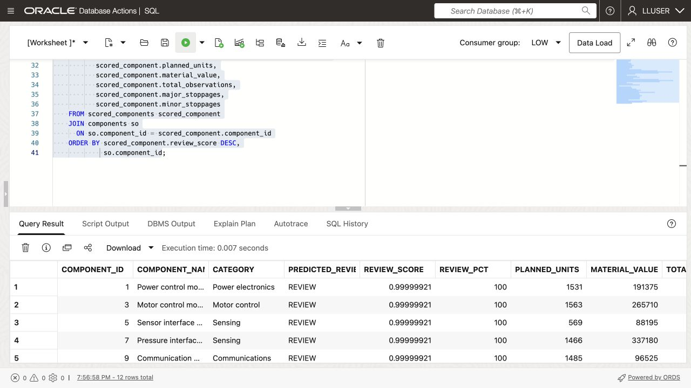

3. Find the component Otto should review first.

    Compare its `REVIEW_SCORE` with the inspection measurements and production-order values beside it. `PREDICTED_REVIEW` is the selected label; `REVIEW_PCT` displays the score as a percentage.

## Acknowledgements

* **Author** - Matt Kowalik
* **Contributor** - Kevin Lazarz
* **Last Updated By/Date** - Matt Kowalik, September 2026
