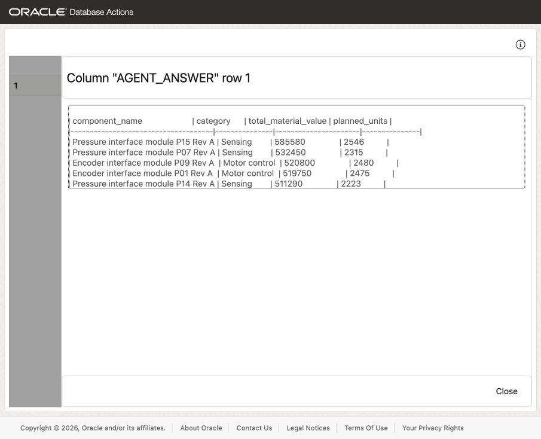
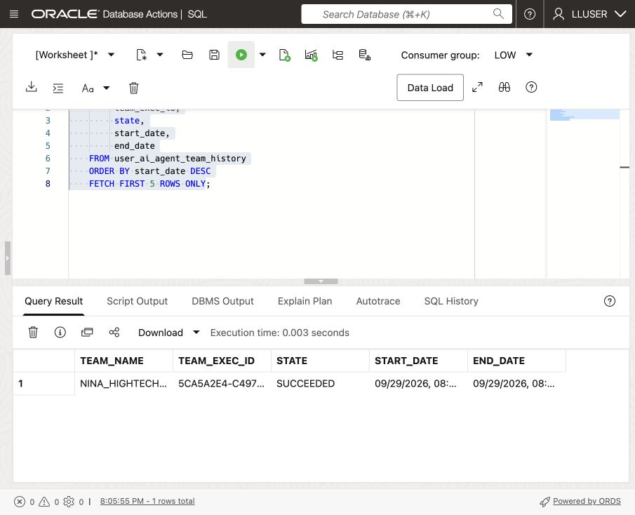
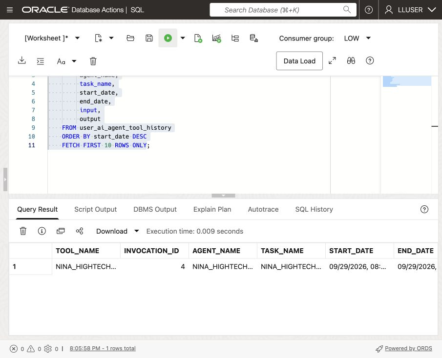

# Build a High-Tech Agent with Select AI Agent

<!-- markdownlint-configure-file
{
  "MD013": {
    "code_blocks": false,
    "tables": false
  },
  "MD033": {
    "allowed_elements": [
      "details",
      "summary",
      "strong"
    ]
  }
}
-->

## Introduction

Nina Patel has used Select AI for individual questions. Her production-review
screen now needs an assistant that can handle a request and follow-up questions.

Jessica gives the agent one tool: SQL through the `GENAI` profile configured in
the previous lab.

Create an agent, task and team, then run Nina’s question and verify the answer.
The instructions request read-only answers, but SQL still runs with `LLUSER`’s
owner privileges.


<details>
<summary><strong>Key terms: agent, tool, task, and team</strong></summary>

> * An **agent** is a configured role that follows instructions when it handles
>   a request.
>
> * A **tool** is a capability the agent is allowed to call. In this lab, the
>   tool runs SQL through the `GENAI` profile.
>
> * A **task** tells the agent what to do and which tools it may use.
>
> * A **team** connects the agent and task so an application or SQL session can
>   run them together.

</details>

### Objectives

* Confirm that the `GENAI` profile from the previous lab is available.
* Verify which High-Tech tables the SQL tool may use.
* Register a SQL query tool for the High-Tech schema.
* Create an agent, task, and team with `DBMS_CLOUD_AI_AGENT`.
* Run a High-Tech question through the team.
* Review the agent’s tool history and explain why its available tools should be
  limited.

Estimated Time: **15 minutes**

> **Prerequisite:** Complete
> [Lab 7: Ask High-Tech Questions with Select AI](?lab=selectai). This lab uses
> the `GENAI` profile and its `object_list`.

## Task 1: Check the profile and table access

The agent reuses `GENAI`. Its `object_list` guides SQL generation; database
privileges determine actual access.

1. Check the profile:

    ```sql
    <copy>
    SELECT profile_name,
           status
    FROM user_cloud_ai_profiles
    WHERE profile_name = 'GENAI';
    </copy>
    ```

    The profile should be enabled. If it is not present, complete Lab 7 first or
    ask the DBA which profile to use.

2. Check the tables listed in the profile:

    ```sql
    <copy>
    SELECT profile_name,
           attribute_name,
           attribute_value
    FROM user_cloud_ai_profile_attributes
    WHERE profile_name = 'GENAI'
      AND attribute_name = 'object_list';
    </copy>
    ```

    Confirm the four required tables: `COMPONENTS`, `PRODUCTION_ORDERS`,
    `PRODUCTION_ORDER_LINES`, and `CUSTOMER_SITES`.

3. Check the agents in your schema:

    ```sql
    <copy>
    SELECT agent_name,
           status
    FROM user_ai_agents
    ORDER BY agent_name;
    </copy>
    ```

    No agents with names beginning with `NINA_HIGHTECH_` are expected. You
    create Nina’s agent in Task 3.

4. Set the model for this agent exercise. First record the current model from
    `USER_CLOUD_AI_PROFILE_ATTRIBUTES` so you can restore it after Task 5. The
    supplied stack starts with `cohere.command-a-03-2025`.

    ```sql
    <copy>
    SELECT attribute_value AS original_model
    FROM user_cloud_ai_profile_attributes
    WHERE profile_name = 'GENAI' AND attribute_name = 'model';
    </copy>
    ```

    Use `meta.llama-3.3-70b-instruct` with the configured Chicago endpoint for
    this exercise. Changing the shared `GENAI` profile also affects other
    requests that use it. Use the workshop database and restore the previous
    model afterward using the instructions in Task 5, step 3.

    Run this block with **Run Script (F5)**:

    ```sql
    <copy>
    BEGIN
      DBMS_CLOUD_AI.SET_ATTRIBUTE(
        profile_name => 'GENAI',
        attribute_name => 'model',
        attribute_value => 'meta.llama-3.3-70b-instruct');
    END;
    /
    </copy>
    ```

## Task 2: Register the SQL tool

Register the SQL tool against `GENAI`.

1. Register the tool:

    ```sql
    <copy>
    BEGIN
      DBMS_CLOUD_AI_AGENT.CREATE_TOOL(
        tool_name   => 'NINA_HIGHTECH_SQL_TOOL',
        attributes  => '{"tool_type": "SQL", "tool_params": {"profile_name": "genai"}, "instruction": "For questions requesting database values, use runsql with the complete natural-language question, including its table names, joins, filters, grouping and measures. Let Select AI generate the SQL; do not replace the question with agent-written SQL."}',
        description => 'SQL query access to the workshop High-Tech tables; task requests read-only answers'
      );
    END;
    /
    </copy>
    ```

2. Confirm the tool definition:

    ```sql
    <copy>
    SELECT tool_name,
           status,
           description
    FROM user_ai_agent_tools
    WHERE tool_name = 'NINA_HIGHTECH_SQL_TOOL';
    </copy>
    ```

## Task 3: Create Nina's agent, task, and team

Define the agent’s role and task, then connect them in a team that can call the
SQL tool.

1. Create the agent:

    ```sql
    <copy>
    BEGIN
      DBMS_CLOUD_AI_AGENT.CREATE_AGENT(
        agent_name  => 'NINA_HIGHTECH_AGENT',
        attributes  => '{"profile_name": "genai", "role": "You are Nina Patel''s High-Tech data assistant. Answer questions using the approved SQL tool. Use returned database rows for components, production_orders, production_order_lines and customer_sites facts. Preserve their values and ranking; do not invent, recalculate or combine values."}',
        description => 'High-Tech assistant for Nina Patel'
      );
    END;
    /
    </copy>
    ```

2. Create the task:

    ```sql
    <copy>
    BEGIN
      DBMS_CLOUD_AI_AGENT.CREATE_TASK(
        task_name  => 'NINA_HIGHTECH_TASK',
        attributes => '{"instruction": "Answer Nina''s High-Tech question: {query}. Pass the complete question to NINA_HIGHTECH_SQL_TOOL once as natural language, preserving all calculations and table relationships. Return the requested columns in a table, copying each returned row and numeric value without recalculating or regrouping. If the tool fails or a requested field is missing, say the answer is incomplete; do not fill gaps. Do not repeat the same tool call or change database records.", "tools": ["NINA_HIGHTECH_SQL_TOOL"], "enable_human_tool": "false"}',
        description => 'Answer read-only component and customer site questions'
      );
    END;
    /
    </copy>
    ```

3. Create the team:

    ```sql
    <copy>
    BEGIN
      DBMS_CLOUD_AI_AGENT.CREATE_TEAM(
        team_name  => 'NINA_HIGHTECH_TEAM',
        attributes => '{"agents": [{"name": "NINA_HIGHTECH_AGENT", "task": "NINA_HIGHTECH_TASK"}], "process": "sequential"}',
        description => 'Read-only High-Tech question team'
      );
    END;
    /
    </copy>
    ```

## Task 4: Run a High-Tech question

Database Actions does not support the `SELECT AI AGENT` command directly. Use
`DBMS_CLOUD_AI_AGENT.RUN_TEAM` in SQL Worksheet and provide the team name in the
function call.

1. Ask the agent:

    ```sql
    <copy>
    SELECT DBMS_CLOUD_AI_AGENT.RUN_TEAM(
             team_name   => 'NINA_HIGHTECH_TEAM',
             user_prompt => 'Which five components have the highest scheduled material value? Join components c to production_order_lines l on c.component_id = l.component_id, then join production_orders o on l.production_order_id = o.production_order_id. Filter with o.order_status IN (''released'', ''in_production'', ''completed'') exactly; statuses are lowercase. Group only by c.component_id, c.component_name and c.category. Calculate total_material_value as SUM(l.line_total) and planned_units as SUM(l.quantity); exclude setup costs. Sort by total_material_value descending and return the first five components. Return one table with exactly five data rows and columns component_name, category, total_material_value and planned_units. Include both numeric totals for every component, reproduced exactly as returned by the tool without rounding or abbreviation.',
             params      => '{"conversation_id": "' || DBMS_CLOUD_AI.CREATE_CONVERSATION() || '"}'
           ) AS agent_answer;
    </copy>
    ```

    

    The query creates a conversation ID so Oracle can record the prompt and
    response in its history.

2. Review the answer.

    Compare all five agent rows with the SQL result below. Check each component,
    category, rank, material value, and planned units. Every row needs both
    numeric totals.

    ```sql
    <copy>
    SELECT c.component_name, c.category,
           SUM(l.line_total) AS total_material_value,
           SUM(l.quantity) AS planned_units
    FROM components c
    JOIN production_order_lines l ON l.component_id = c.component_id
    JOIN production_orders o ON o.production_order_id = l.production_order_id
    WHERE o.order_status IN ('released', 'in_production', 'completed')
    GROUP BY c.component_id, c.component_name, c.category
    ORDER BY total_material_value DESC
    FETCH FIRST 5 ROWS ONLY;
    </copy>
    ```

    If a value differs, inspect the tool input and output in Task 5. Keep the
    verified SQL result as the basis for Nina’s decision.

    > **Note:** The instructions request read-only answers. They do not revoke
    > the database privileges of `LLUSER`. Use a separately restricted account
    > for a production assistant.

3. Optional challenge: ask which customer sites and orders use the highest-value
    component. More complex requests may take longer.

## Task 5: Inspect what the agent did

Nina checks whether the agent called the approved tool and how it processed her
request.

1. Review the latest team runs:

    ```sql
    <copy>
    SELECT team_name,
         team_exec_id,
         state,
         start_date,
         end_date
    FROM user_ai_agent_team_history
    ORDER BY start_date DESC
    FETCH FIRST 5 ROWS ONLY;
    </copy>
    ```

    

2. Review the latest tool calls:

    ```sql
    <copy>
    SELECT tool_name,
         invocation_id,
         agent_name,
         task_name,
         start_date,
         end_date,
         input,
         output
    FROM user_ai_agent_tool_history
    ORDER BY start_date DESC
    FETCH FIRST 10 ROWS ONLY;
    </copy>
    ```

    

    Open `INPUT` and `OUTPUT` for `NINA_HIGHTECH_SQL_TOOL`. Do the returned
    values match the answer you checked in Task 4? `SUCCEEDED` confirms the call
    finished, not that its figures are correct.

3. Restore the original model even if the agent request fails. The value below
    is the supplied stack default. If you recorded a different value in Task 1,
    use that value instead. Run with **Run Script (F5)**.

    ```sql
    <copy>
    BEGIN
      DBMS_CLOUD_AI.SET_ATTRIBUTE(
        profile_name => 'GENAI',
        attribute_name => 'model',
        attribute_value => 'cohere.command-a-03-2025');
    END;
    /
    SELECT attribute_value AS restored_model
    FROM user_cloud_ai_profile_attributes
    WHERE profile_name = 'GENAI' AND attribute_name = 'model';
    </copy>
    ```

    Confirm that `RESTORED_MODEL` matches the value you recorded in Task 1. A
    timed-out request may leave a `RUNNING` history row without an end time.

## Conclusion: Give the agent a controlled way to work

Jessica can inspect the tool history or disable the team. For production,
restrict access with database grants and row-level policies.

This example requests read-only answers. Before allowing changes to data, use a
narrowly defined function tool, clear instructions, and user confirmation.

## Next Steps

Read the [Oracle AI Database Select AI Agent documentation](https://docs.oracle.com/en/database/oracle/oracle-database/26/selai/).

## Acknowledgements

* **Author** - Matt Kowalik
* **Contributor** - Kevin Lazarz
* **Last Updated By/Date** - Matt Kowalik, September 2026
