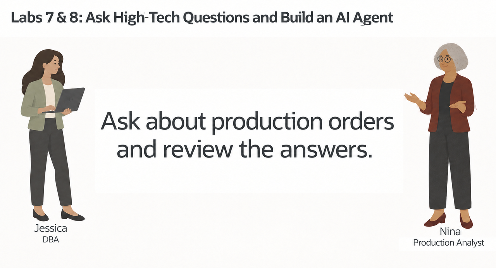
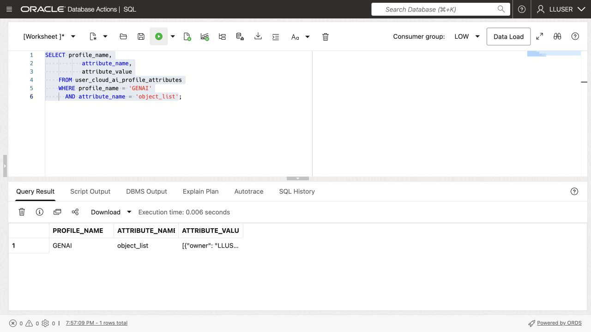
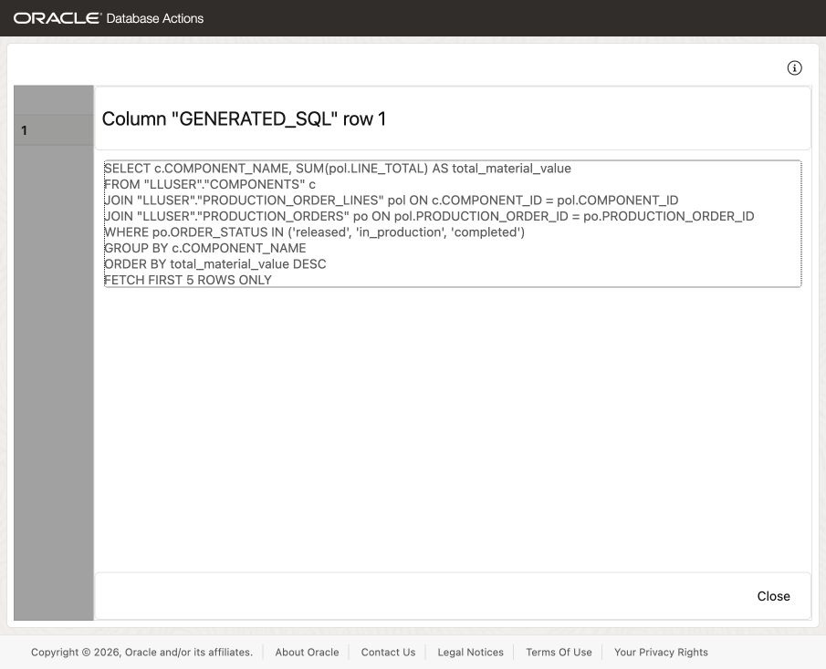
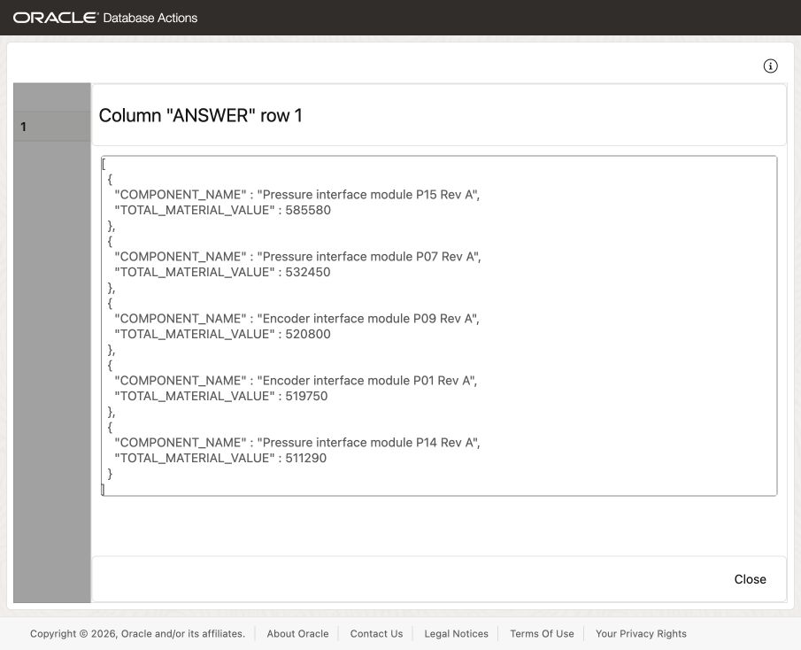
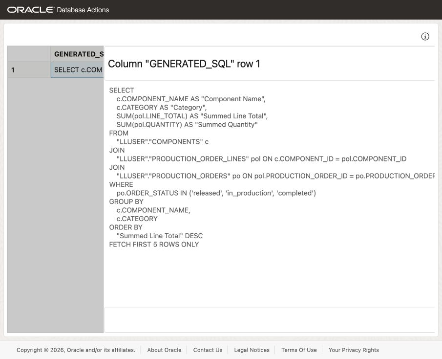
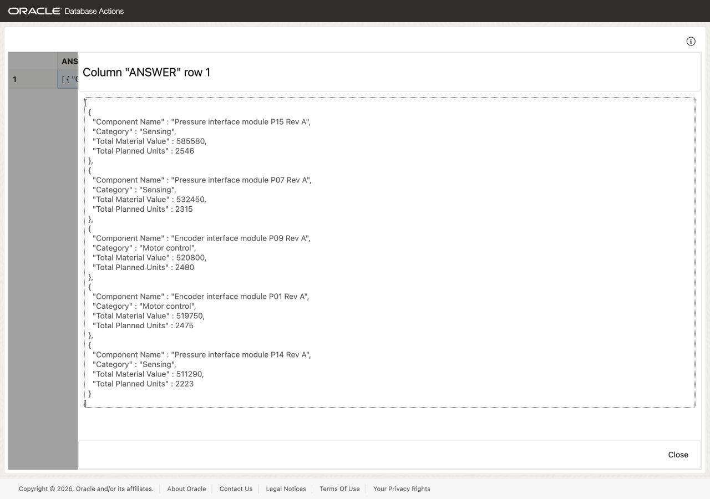
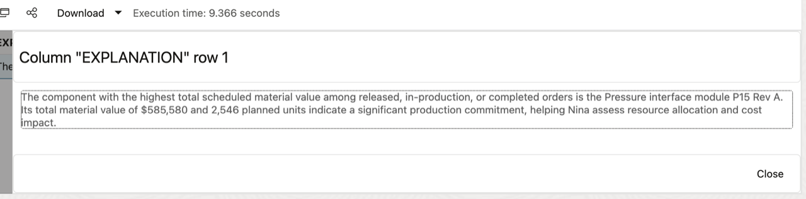

# Ask HighTech Questions with Select AI



## Introduction

Nina Patel, Seer HighTech’s production analyst, wants answers about components and production orders without writing every join and filter. Jessica has configured a Select AI profile for the HighTech schema.

You will help Nina ask a question, inspect the generated SQL, run it, and refine the result. The model can choose the wrong columns or misunderstand a question, so SQL review remains part of her work.

<details>
<summary><strong>Key terms: Select AI, AI profile, generated SQL, and natural-language prompt</strong></summary>

> - **Select AI** lets a user work with database information through a natural-language question.
>
> - An **AI profile** connects Select AI to an AI provider and identifies the database objects that may be used for the question.
>
> - **Generated SQL** is the SQL statement created from the question. Nina should inspect it before relying on the result.
>
> - A **natural-language prompt** states the question, including the required measures, filters, and output.

</details>

### Objectives

- Check which Select AI profile is available in the schema.
- Add the HighTech tables that Select AI may use to the profile.
- Generate SQL from a HighTech question and inspect it.
- Run a natural-language question through `DBMS_CLOUD_AI.GENERATE`.
- Refine a question to include the component, order, and cost details Nina needs.
- Explain why generated SQL still requires review.

Estimated Time: **10 minutes**

> **SQL Worksheet reminder:** See [Getting Started Task 2: Open SQL Worksheet](?lab=getting-started#Task2:OpenSQLWorksheet) for the steps to paste and run SQL.

## Task 1: Check the Select AI profile

1. Run this query:

    ```sql
    <copy>
    SELECT profile_name,
           status,
           description
    FROM user_cloud_ai_profiles
    ORDER BY profile_name;
    </copy>
    ```

    Expect an enabled `GENAI` profile; substitute your profile name below if different. Its model must support on-demand inference in the configured region. Use the workshop’s approved provider, model, and region; consult [Oracle’s regional model availability](https://docs.oracle.com/en-us/iaas/Content/generative-ai/model-endpoint-regions.htm) before changing them. Catalog availability alone does not confirm on-demand support.

2. Review the profile attributes:

    ```sql
    <copy>
    SELECT profile_name,
           attribute_name,
           attribute_value
    FROM user_cloud_ai_profile_attributes
    ORDER BY profile_name, attribute_name;
    </copy>
    ```

    Review the configuration without copying credentials. Task 2 changes only `object_list`.

## Task 2: Add the HighTech tables to the profile

Jessica adds the four tables Nina needs: components, production orders, order lines, and customer sites.

1. Add the HighTech tables to the profile:

    ```sql
    <copy>
    BEGIN
      DBMS_CLOUD_AI.SET_ATTRIBUTE(
        profile_name    => 'genai',
        attribute_name  => 'object_list',
        attribute_value => '[{"owner": "' || USER || '", "name": "COMPONENTS"}, {"owner": "' || USER || '", "name": "PRODUCTION_ORDERS"}, {"owner": "' || USER || '", "name": "PRODUCTION_ORDER_LINES"}, {"owner": "' || USER || '", "name": "CUSTOMER_SITES"}]'
      );
    END;
    /
    </copy>
    ```

2. Confirm the object list:

    ```sql
    <copy>
    SELECT profile_name,
           attribute_name,
           attribute_value
    FROM user_cloud_ai_profile_attributes
    WHERE profile_name = 'GENAI'
      AND attribute_name = 'object_list';
    </copy>
    ```

    

    Confirm `COMPONENTS`, `PRODUCTION_ORDERS`, `PRODUCTION_ORDER_LINES`, and `CUSTOMER_SITES`.

## Task 3: Ask a question and inspect the SQL

Nina starts with a simple question: which components have the highest scheduled material value? She first asks Select AI to show the SQL without running it.

Database Actions does not support the `SELECT AI` keyword. In SQL Worksheet, use `DBMS_CLOUD_AI.GENERATE` to submit the business question in `prompt`. Select AI generates the joins, filters, and calculations.

1. Run the question with the `GENAI` profile:

    ```sql
    <copy>
    SELECT DBMS_CLOUD_AI.GENERATE(
             prompt       => 'Which five components have the highest total scheduled material value across released, in-production, or completed orders? Show each component name and its total material value, excluding setup costs.',
             profile_name => 'genai',
             action       => 'showsql'
           ) AS generated_sql;
    </copy>
    ```

    

    The screenshots in Tasks 3–6 show example outputs. Your generated SQL and wording may differ.

2. Read the generated SQL before running it.

    Check the joins between `COMPONENTS`, `PRODUCTION_ORDER_LINES`, and `PRODUCTION_ORDERS`, grouping by component, five-row limit, and `SUM(LINE_TOTAL)`. Material value must exclude `SETUP_COST`.

    Check that the generated `WHERE` clause uses the stored status values: `released`, `in_production`, and `completed`. String comparisons are case-sensitive, so uppercase values can return no rows. If the SQL does not match Nina’s question, clarify the question and inspect the new SQL before continuing.

## Task 4: Run the question in the database

Nina now runs the question and compares the answer with the SQL she inspected.

1. Run the same question with the `runsql` action:

    ```sql
    <copy>
    SELECT DBMS_CLOUD_AI.GENERATE(
             prompt       => 'Which five components have the highest total scheduled material value across released, in-production, or completed orders? Show each component name and its total material value, excluding setup costs.',
             profile_name => 'genai',
             action       => 'runsql'
           ) AS answer;
    </copy>
      ```

    

2. Compare the answer with the SQL you inspected in Task 3.

    The SQL runs under the current database user’s privileges against the HighTech tables.

## Task 5: Improve the business question

Nina adds each component’s category and total planned units to make the ranking useful for her review.

1. Use `showsql` to inspect this revised prompt:

    ```sql
    <copy>
    SELECT DBMS_CLOUD_AI.GENERATE(
             prompt       => 'For released, in-production, or completed orders, which five components have the highest total scheduled material value? Show each component name, category, total material value, and total planned units. Exclude setup costs.',
             profile_name => 'genai',
             action       => 'showsql'
           ) AS generated_sql;
    </copy>
    ```

    

2. Review the generated SQL, then run the revised question with `runsql`:

    ```sql
    <copy>
    SELECT DBMS_CLOUD_AI.GENERATE(
             prompt       => 'For released, in-production, or completed orders, which five components have the highest total scheduled material value? Show each component name, category, total material value, and total planned units. Exclude setup costs.',
             profile_name => 'genai',
             action       => 'runsql'
           ) AS answer;
    </copy>
    ```

    

3. Compare the added columns with the first result, then check the joins, totals, and order statuses.

## Task 6: Explain the result

Nina wants a short explanation of the revised result. Select AI can run the SQL and ask the AI provider to describe the returned rows.

1. Run the revised question with the `narrate` action:

    ```sql
    <copy>
    SELECT DBMS_CLOUD_AI.GENERATE(
             prompt       => 'For released, in-production, or completed orders, which five components have the highest total scheduled material value? Exclude setup costs. Answer with a table containing exactly five rows and columns for component name, category, total material value, and total planned units, followed by one explanatory sentence. Include both numeric totals for every component exactly as returned by the query, without rounding or abbreviation. If a requested value is missing, say that the answer is incomplete rather than inventing it.',
             profile_name => 'genai',
             action       => 'narrate'
           ) AS explanation;
    </copy>
    ```

    

2. Review the explanation against the SQL result.

    Nina checks all five rows against the SQL result: names, categories, ranking and all ten numeric totals. If any value is missing or differs, use the verified SQL result for her decision.

  > **Note:** The `narrate` action sends the query result to the AI provider configured in the profile. Use it only for data approved for that provider.

## Next Steps

For the full list of Select AI actions, profile attributes, and supported providers, see the [Oracle AI Database 26ai Select AI documentation](https://docs.oracle.com/en/database/oracle/oracle-database/26/selai/).

## Acknowledgements

* **Author** - Matt Kowalik
* **Contributor** - Kevin Lazarz
* **Last Updated By/Date** - Matt Kowalik, September 2026
