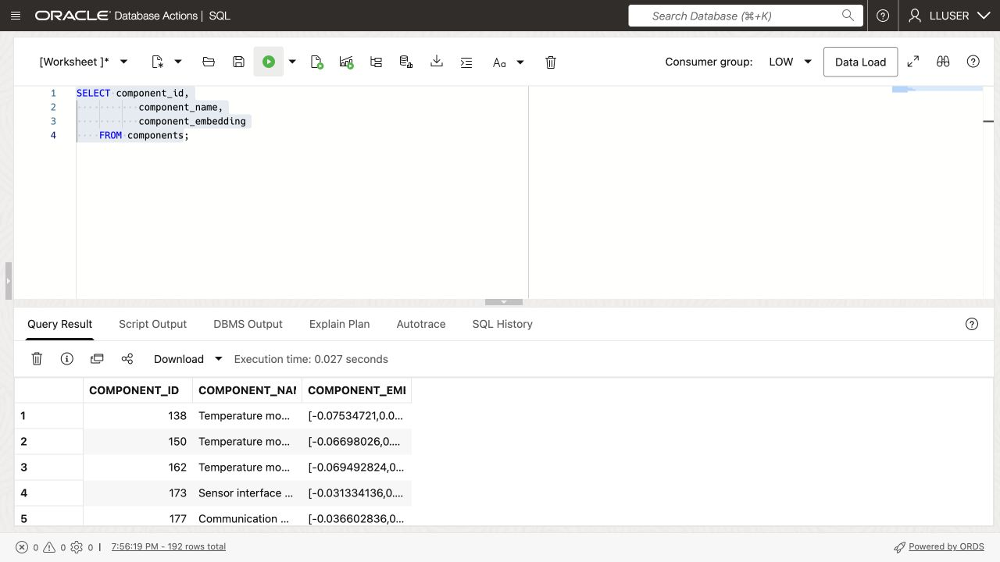

# Search Components by Meaning


## Introduction

Gilly Bourne, SEER HIGHTECH’s AI engineer, needs to answer **which customer sites may be affected by a power-module leakage-current concern?** The inspection wording may differ from the component descriptions.

You will create component vectors, search by meaning, and join the matches to production orders and customer sites. Gilly can return a follow-up list directly from Oracle AI Database.

<details>
<summary><strong>Key terms: embedding, vector, vector distance, and semantic search</strong></summary>

> - An **embedding** is a numerical profile of what text means. In this lab, component data is embedded so similar manufacturing ideas sit near each other mathematically, even when the wording is different.
>
> - An **ONNX embedding model** is a portable machine-learning model saved in the Open Neural Network Exchange (ONNX) format. It turns text into a vector of numbers that captures meaning. Oracle AI Database can load and run this model inside the database, close to the component rows.
>
> - A **vector** is the stored numerical form of an embedding. Oracle Database can store vectors beside the manufacturing rows they describe, so the search stays connected to component names, material grades, process routes, and unit costs.
>
> - **Vector distance** measures how close two vectors are. A smaller distance means the meanings are more similar; a larger distance means they are farther apart. In this lab, distance helps rank which components best match a production analyst's question.
>
> - **Semantic search** means searching by meaning instead of exact words. A search for "power control module with stable MOSFET switching and low leakage current" can find related components even when the component names use different wording.

</details>

### Objectives

- Check the embedding model Gilly needs for semantic search.
- Create a vector from component data inside the database.
- Search for components that match a production-quality concern.
- Turn component matches into a customer follow-up list.
- Explain why vector search belongs beside HighTech data and access controls.

Estimated Time: **10 minutes**


> **SQL Worksheet reminder:** See [Getting Started Task 2: Open SQL Worksheet](?lab=getting-started#Task2:OpenSQLWorksheet) for the steps to paste and run SQL.

## Task 1: Check the embedding model

The search needs an embedding model and component vectors. Jessica has loaded the model into the database; check that it is available to Gilly.

1. Run this query to list the available embedding models:

    ```sql
    <copy>
    SELECT owner,
           model_name,
           algorithm,
           mining_function
    FROM all_mining_models
    WHERE mining_function = 'EMBEDDING'
    ORDER BY owner, model_name;
    </copy>
    ```

    **Expected output: Available Embedding Models**

    

    The result should include an embedding model owned by `ADMIN`, such as `ALL_MINILM_L12_V2`. This compact model turns text into 384-number vectors. The `EMBEDDING` value confirms that the model can turn text into vectors for similarity search.

2. Review what this means for Gilly's application.

    Call the model from SQL with `VECTOR_EMBEDDING(...)`; component text stays in the database.

## Task 2: Create a component vector

Gilly decides that one vector per component is enough. Each component record is short and describes one component, so she combines its name, category, and subcategory into one text value before creating the vector.

1. Review the text Gilly will embed:

    ```sql
    <copy>
    SELECT component_id,
           component_name,
           category,
           subcategory,
           component_name || '. Category: ' || category ||
             '. Subcategory: ' || subcategory AS embedding_text
    FROM components
    FETCH FIRST 5 ROWS ONLY;
    </copy>
    ```

    Price and dates are omitted because they do not describe what the component is.

2. Add a vector column to `COMPONENTS`. On a repeat run, skip this ALTER statement if `COMPONENT_EMBEDDING` already exists; the following UPDATE fills only missing vectors:

    ```sql
    <copy>
    ALTER TABLE components ADD (component_embedding VECTOR(384));
    </copy>
    ```

    The column has 384 dimensions because `ALL_MINILM_L12_V2` produces 384-dimensional vectors.

3. Create the component vectors inside Oracle Database:

    ```sql
    <copy>
    UPDATE components
    SET component_embedding = VECTOR_EMBEDDING(
      ADMIN.ALL_MINILM_L12_V2 USING
        component_name || '. Category: ' || category ||
        '. Subcategory: ' || subcategory AS DATA)
    WHERE component_embedding IS NULL;

    COMMIT;
    </copy>
    ```

    The model reads the text in each row and writes the vector back to that same row. No component text leaves the database.

4. Verify the new column and its data:

    ```sql
    <copy>
    SELECT component_id,
           component_name,
           component_embedding
    FROM components;
    </copy>
    ```

    

    > **Note:** Chunking is not relevant for this data. Each row describes one short component, so splitting it would create several vectors for one component without adding useful detail. Chunking becomes useful for long documents, such as policies or plant quality notices, where each section may answer a different question.

## Task 3: Test the component vector

Gilly tests whether the vectors find components related to the leakage-current concern.

1. Run the following query:

    The SQL creates an embedding for the phrase `power control module with stable MOSFET switching and low leakage current`, compares it with the vectors in `COMPONENTS.COMPONENT_EMBEDDING`, and returns the cosine distance. A smaller distance means the two vectors are closer in meaning, so the query orders the smallest distance first.

    ```sql
    <copy>
    SELECT so.component_name,
           so.category,
           VECTOR_DISTANCE(
             so.component_embedding,
             VECTOR_EMBEDDING(ADMIN.ALL_MINILM_L12_V2 USING 'power control module with stable MOSFET switching and low leakage current' AS DATA),
             COSINE) AS vector_distance
    FROM components so
    ORDER BY vector_distance
    FETCH FIRST 5 ROWS ONLY;
    </copy>
    ```

    

    **Expected output: Relevant Component Matches**

2. Review the ranked components.
    Lower cosine distance means a closer match. Power control and gate driver modules are candidates for this switching and leakage-current concern. Read the actual ranking and distances from your run; a semantic match does not confirm an electrical defect.


3. Show the result as a similarity score:

    For the application display, Gilly uses `1 - cosine distance`: a higher score means a closer match. The query rounds it to four decimal places.

    ```sql
    <copy>
    SELECT so.component_name,
           so.category,
           ROUND(1 - VECTOR_DISTANCE(
             so.component_embedding,
             VECTOR_EMBEDDING(ADMIN.ALL_MINILM_L12_V2 USING 'power control module with stable MOSFET switching and low leakage current' AS DATA),
             COSINE), 4) AS similarity
    FROM components so
    ORDER BY similarity DESC
    FETCH FIRST 5 ROWS ONLY;
    </copy>
    ```

    

## Task 4: Find customer sites affected by a component concern

Gilly joins component matches to customer orders, limiting follow-up to planned, released, and in-production orders.

1. Run the following query for the concern `power control module with stable MOSFET switching and low leakage current`:

    ```sql
    <copy>
    WITH matched_components AS (
        SELECT so.component_id,
               so.component_name,
               ROUND(1 - VECTOR_DISTANCE(
                 so.component_embedding,
                 VECTOR_EMBEDDING(
                   ADMIN.ALL_MINILM_L12_V2
                   USING 'power control module with stable MOSFET switching and low leakage current' AS DATA
                 ),
                 COSINE), 4) AS similarity
        FROM components so
        ORDER BY similarity DESC
        FETCH FIRST 5 ROWS ONLY
    )
    SELECT matched_component.component_name,
           matched_component.similarity,
           g.site_name,
           g.first_name || ' ' || g.last_name AS contact_name,
           g.email,
           r.production_order_id,
           r.order_status,
           r.created_at,
           rn.quantity,
           rn.line_total
    FROM matched_components matched_component
    JOIN production_order_lines rn ON rn.component_id = matched_component.component_id
    JOIN production_orders r ON r.production_order_id = rn.production_order_id
    JOIN customer_sites g ON g.customer_site_id = r.customer_site_id
    WHERE r.order_status IN ('planned', 'released', 'in_production')
    ORDER BY matched_component.similarity DESC,
             r.created_at DESC;
    </copy>
    ```

    

    The first part ranks components by meaning. The remaining joins use ordinary relational keys to find the matching order lines, production orders, and customer sites.

    **Expected output: Customer Follow-up List**


2. Review the business result.

    Check the matched component, order status, date, and customer contact before deciding whom to contact. Only the components need vectors; relational joins supply the order and customer details.


## Acknowledgements

* **Author** - Matt Kowalik
* **Contributor** - Kevin Lazarz
* **Last Updated By/Date** - Matt Kowalik, September 2026
