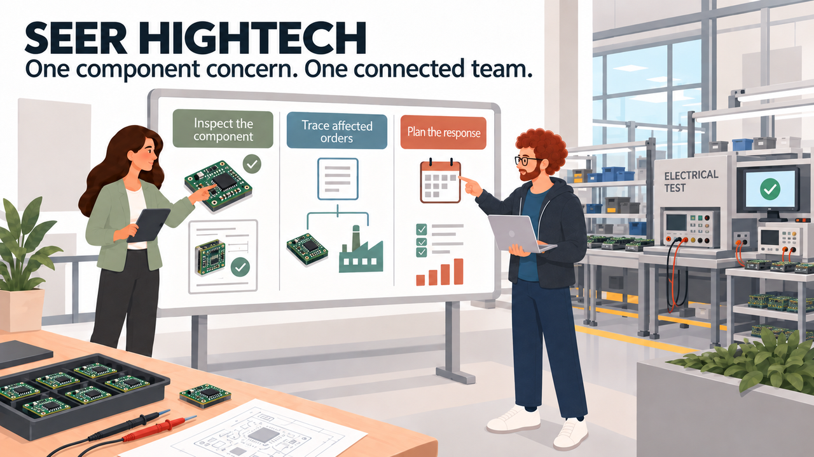
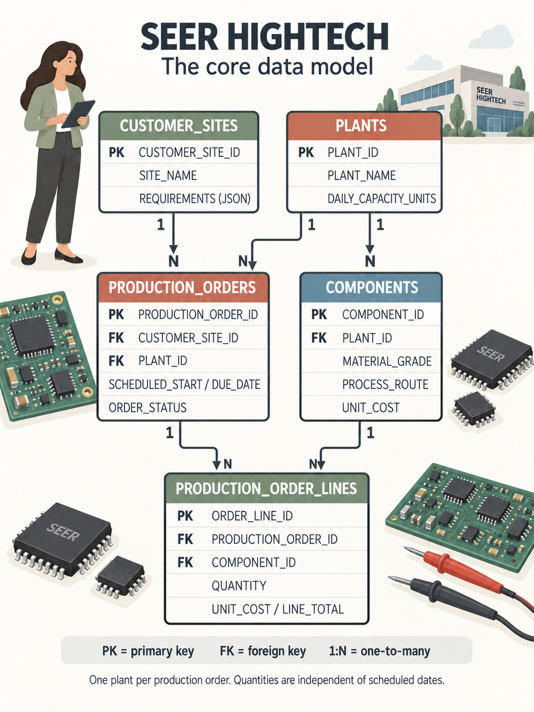

# Build Connected HighTech Solutions with Oracle AI Database

## Introduction

Jessica Chan, the DBA at SEER HIGHTECH, starts the morning with a question from the quality team. Electrical testing has flagged excessive leakage current in a power control module assembled with a purchased semiconductor lot. Which production orders use that component, and what should the team review before work continues?

Jessica brings the team together around the records in Oracle AI Database. Follow their investigation through JSON, vector search, graphs, spatial queries, machine learning, and AI. Run the queries and inspect the results before deciding what the quality team should do next.

### SEER HIGHTECH data model

SEER HIGHTECH assembles and tests electronic control modules using purchased packaged semiconductors. It does not fabricate wafers. `COMPONENTS` holds plant-specific module revisions; `PRODUCTION_ORDERS` records customer-backed build commitments for those modules. Test observations flag modules for review, and the graph traces shared semiconductor lots, suppliers, test equipment, and lot certificates before fulfillment.

This diagram shows how customer sites, plants, module revisions, production orders, and order lines connect.

*One plant per production order. Each component revision belongs to one plant and specifies a board material grade and assembly/test route. Production-order lines record quantities and unit costs.* [Open the illustrated ERD](images/seer-hightech-erd-illustrated.png) or the [text-based schema diagram](images/seer-hightech-erd.svg).

### What the team builds

| Team member | Decision or result | Database capability |
| --- | --- | --- |
| Jessica, DBA | Rank quality concerns and affected orders. | One query combines relational alerts, vectors, JSON, and location data. |
| Thomas, application developer | Serve flexible production-order documents. | JSON columns, collections, and duality views. |
| Gilly, AI engineer | Match a quality concern to components and customer orders. | An ONNX model creates component vectors in the database. |
| Bob, graph specialist | Trace shared lots, equipment, and supporting records. | Property graph patterns over relational data. |
| Moon, spatial expert | Find nearby plants for customer sites. | Spatial relationships, distance, and GeoJSON. |
| Otto, data scientist | Build a watchlist with test measurements beside predictions. | In-database model training and scoring. |
| Nina, production analyst | Ask questions, inspect SQL, and review agent activity. | Select AI and an agent with an approved SQL tool. |

<strong>Learn more: What does "converged database" mean?</strong>

> A **converged database** handles several data types and kinds of work in one database. Here, teams use relational rows, JSON documents, vectors, graphs, geographic data, machine learning models, and AI-assisted SQL.
>
> Teams use the form their application needs and keep the records and access controls together. They can query these data types without maintaining a separate store for each one.

### Objectives

- Follow Jessica and her team as they investigate a component quality concern.
- Use relational SQL, JSON, vectors, graphs, spatial data, Oracle Machine Learning, Select AI, and Select AI Agent in practical tasks.
- See how one Oracle AI Database can support different data types without separate copies of the manufacturing records.
- Understand how database privileges, AI profile settings, approved tools, and execution history help teams control access and review AI results.
- Explain how each query would support a SEER HIGHTECH application.

Estimated Workshop Time: **90 minutes**

## Running the HighTech demo

A HighTech application can use these queries to review module test failures, trace affected build commitments, and assess fulfillment options. The supporting stack provisions the workshop database and services; it does not deploy a separate application server.

## Acknowledgements

* **Author** - Matt Kowalik
* **Contributor** - Kevin Lazarz
* **Last Updated By/Date** - Matt Kowalik, September 2026
