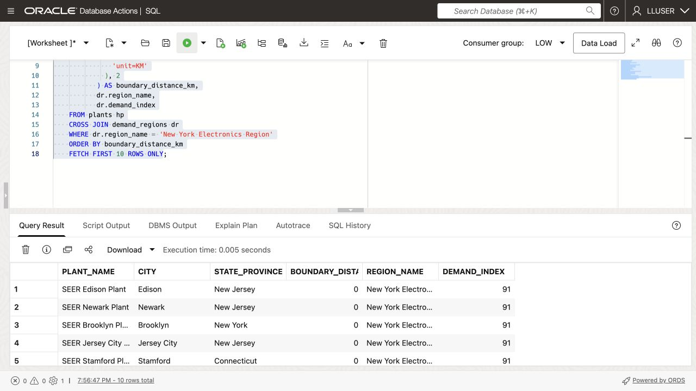
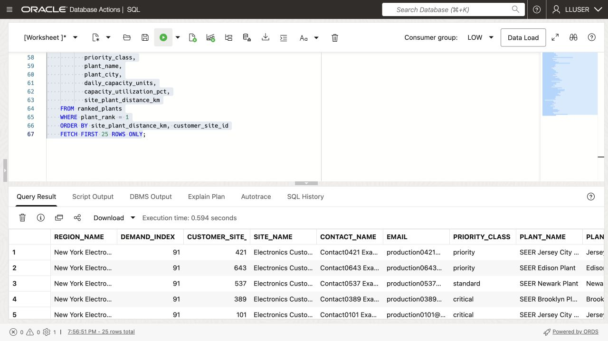

# Find the Closest Manufacturing Plant


## Introduction

Moon Kai, SEER HIGHTECH’s spatial specialist, helps planners find alternative plants for customer sites in a high-demand region. **Which sites are inside the region, and which plant is closest to each?**

You will use points for plant and customer-site locations, polygons for demand regions, and spatial queries to measure distances and identify nearby plants.

<details>
<summary><strong>Key terms: point, polygon, distance, spatial relationship, and GeoJSON</strong></summary>

> - A **point** is one location, represented by longitude and latitude. In this lab, a plant is stored as an `SDO_GEOMETRY` point.
>
> - A **polygon** is an area made from connected points. Demand regions are stored as polygons.
>
> - **Distance** measures how far two spatial objects are from each other. Here, it measures the shortest distance between a plant point and a demand-region polygon. A distance of zero means the plant is inside or touching the region.
>
> - A **spatial relationship** describes how two shapes relate to each other. `SDO_GEOM.RELATE` can test whether a customer site point is inside or touches a demand region.
>
> - **GeoJSON** is a JSON format for map locations and shapes. `SDO_UTIL.TO_GEOJSON` lets an application display the same database location on a map.
>
</details>


### Objectives

- Identify spatial points and polygons in the HighTech data.
- Convert a database point to GeoJSON for an application map.
- Measure which plants are closest to a demand region.
- Find customer sites inside a demand region.
- Match each customer site to the closest active plant.

Estimated Time: **10 minutes**


> **SQL Worksheet reminder:** See [Getting Started Task 2: Open SQL Worksheet](?lab=getting-started#Task2:OpenSQLWorksheet) for the steps to paste and run SQL.

## Task 1: Look at the locations as points

Moon starts with **where are the plants?** Each plant has an `SDO_GEOMETRY` point that SQL can analyze and an application can display as GeoJSON.

A point stores its geometry type, coordinate system, and coordinates. For example, a WGS84 point might use longitude `-74.4121` and latitude `40.5187`; check the actual coordinates in your loaded data.

`SDO_UTIL.TO_GEOJSON` converts the example to `{ "type": "Point", "coordinates": [-74.4121, 40.5187] }`. SQL calculations and map output use the same stored geometry.


1. Run this query:

    ```sql
    <copy>
    SELECT hp.plant_id,
           hp.plant_name,
           hp.city,
           hp.state_province,
           hp.latitude,
           hp.longitude,
           DBMS_LOB.SUBSTR(
             SDO_UTIL.TO_GEOJSON(hp.location), 120, 1
           ) AS location_geojson
    FROM plants hp
    WHERE hp.plant_id IN (1, 3, 16)
    ORDER BY hp.plant_id;
    </copy>
    ```

    

    `LOCATION` is the database point. `LATITUDE` and `LONGITUDE` make the value easy to read, and `LOCATION_GEOJSON` gives an application a map-ready representation of the same point. GeoJSON lists longitude first and latitude second. `SDO_UTIL.TO_GEOJSON` returns a CLOB, so `DBMS_LOB.SUBSTR` limits the displayed text to 120 characters; it does not change the stored geometry.

    **Expected output: Plant Points**

2. Review the point data.


    Compare the point, latitude/longitude columns, and GeoJSON. Notice that GeoJSON places longitude first.

## Task 2: Find the closest plants to a demand region

The sample data gives New York Electronics Region a demand index of `91`. Moon measures the distance between each plant point and the region polygon.

1. Run the distance query:

    ```sql
    <copy>
    SELECT hp.plant_name,
           hp.city,
           hp.state_province,
           ROUND(
             SDO_GEOM.SDO_DISTANCE(
               hp.location,
               dr.boundary,
               0.005,
               'unit=KM'
             ), 2
           ) AS boundary_distance_km,
           dr.region_name,
           dr.demand_index
    FROM plants hp
    CROSS JOIN demand_regions dr
    WHERE dr.region_name = 'New York Electronics Region'
    ORDER BY boundary_distance_km
    FETCH FIRST 10 ROWS ONLY;
    </copy>
    ```

    

    `SDO_GEOM.SDO_DISTANCE` compares the plant point with the demand-region polygon. The function returns the shortest distance between the two shapes. A value of `0` means the point is inside or touching the region.

    The four arguments in this query have simple roles:

    - `hp.location` is the first geometry: the plant point.
    - `dr.boundary` is the second geometry: the demand-region polygon.
    - `0.005` is the tolerance used when Oracle compares the geometries. It helps Oracle handle small differences in the stored coordinates.
    - `'unit=KM'` tells Oracle to return the distance in kilometers. Change it to `'unit=MILE'` when the application needs miles.

    The `ROUND(..., 2)` around the function result only formats the answer to two decimal places. It does not change the spatial calculation.

    Use `DEMAND_INDEX` and distance to select plants to check for available capacity.

    **Expected output: New York Production coverage**

    Review the closest plant and its distance. Rankings depend on the data your loader supplied. Read the actual distances from your database result.

2. Try another region.

    Change the region name to `Chicago Electronics Region`, add a miles calculation, and run the modified query:

    ```sql
    <copy>
    SELECT hp.plant_name,
           hp.city,
           hp.state_province,
           ROUND(
             SDO_GEOM.SDO_DISTANCE(
               hp.location,
               dr.boundary,
               0.005,
               'unit=KM'
             ), 2
           ) AS boundary_distance_km,
           ROUND(
             SDO_GEOM.SDO_DISTANCE(
               hp.location,
               dr.boundary,
               0.005,
               'unit=MILE'
             ), 2
           ) AS boundary_distance_miles,
           dr.region_name,
           dr.demand_index
    FROM plants hp
    CROSS JOIN demand_regions dr
    WHERE dr.region_name = 'Chicago Electronics Region'
    ORDER BY boundary_distance_km
    FETCH FIRST 10 ROWS ONLY;
    </copy>
    ```

    

    The `unit` parameter controls the measurement unit. Review whether a plant lies inside the Chicago Electronics Region polygon. A point inside or touching the polygon has distance zero. The contract assigns this region a synthetic demand index of 78; plant rankings must be checked after loading.

    Next, Moon finds the customer sites inside the region and their nearest active plants.

## Task 3: Route customer sites to the closest plant

Moon combines two checks: which customer sites lie inside New York Electronics Region, and which active plant is nearest to each?

1. Run the customer-site routing query:

    ```sql
    <copy>
    WITH regional_sites AS (
      SELECT dr.region_name,
             dr.demand_index,
             g.customer_site_id,
             g.site_name,
             g.first_name || ' ' || g.last_name AS contact_name,
             g.email,
             g.priority_class,
             g.location
      FROM customer_sites g
      CROSS JOIN demand_regions dr
      WHERE dr.region_name = 'New York Electronics Region'
        AND SDO_GEOM.RELATE(
              dr.boundary,
              'ANYINTERACT',
              g.location,
              0.005
            ) = 'TRUE'
    ), ranked_plants AS (
      SELECT rg.region_name,
             rg.demand_index,
             rg.customer_site_id,
             rg.site_name,
             rg.contact_name,
             rg.email,
             rg.priority_class,
             hp.plant_name,
             hp.city AS plant_city,
             hp.daily_capacity_units,
             hp.capacity_utilization_pct,
             ROUND(
               SDO_GEOM.SDO_DISTANCE(
                 rg.location,
                 hp.location,
                 0.005,
                 'unit=KM'
               ), 2
             ) AS site_plant_distance_km,
             ROW_NUMBER() OVER (
               PARTITION BY rg.customer_site_id
               ORDER BY SDO_GEOM.SDO_DISTANCE(
                          rg.location,
                          hp.location,
                          0.005,
                          'unit=KM'
                        ), hp.plant_id
             ) AS plant_rank
      FROM regional_sites rg
      CROSS JOIN plants hp
      WHERE hp.is_active = 1
    )
    SELECT region_name,
           demand_index,
           customer_site_id,
           site_name,
           contact_name,
           email,
           priority_class,
           plant_name,
           plant_city,
           daily_capacity_units,
           capacity_utilization_pct,
           site_plant_distance_km
    FROM ranked_plants
    WHERE plant_rank = 1
    ORDER BY site_plant_distance_km, customer_site_id
    FETCH FIRST 25 ROWS ONLY;
    </copy>
    ```

    

    `SDO_GEOM.RELATE` keeps customer sites whose point falls inside or touches the New York Electronics Region polygon. `SDO_GEOM.SDO_DISTANCE` then measures the distance from each matching customer site to every active plant. `ROW_NUMBER` keeps the nearest plant for each customer site.

2. Review the result as an operations decision.

    Customer site `LOCATION` is the delivery point. Review each site’s contact, nearest plant, distance, capacity, and current load before assigning work.


3. Change the query to `Chicago Electronics Region`.

    Compare the customer sites and candidate plants with New York. The predicates stay the same; only the region changes.

> **Recommendation boundary:** This query finds the nearest active plant by geographic distance. It does not check process capability, certification, material stock, machine schedules, transport time, or delivery commitments. `DAILY_CAPACITY_UNITS` and `CAPACITY_UTILIZATION_PCT` describe a plant snapshot. A planner must check those constraints before reassigning work.


## Next Steps

Explore further in the [Oracle Spatial LiveLabs workshop](https://livelabs.oracle.com/ords/r/dbpm/livelabs/view-workshop?clear=RR,180&wid=800).

## Acknowledgements

* **Author** - Matt Kowalik
* **Contributor** - Kevin Lazarz
* **Last Updated By/Date** - Matt Kowalik, September 2026
