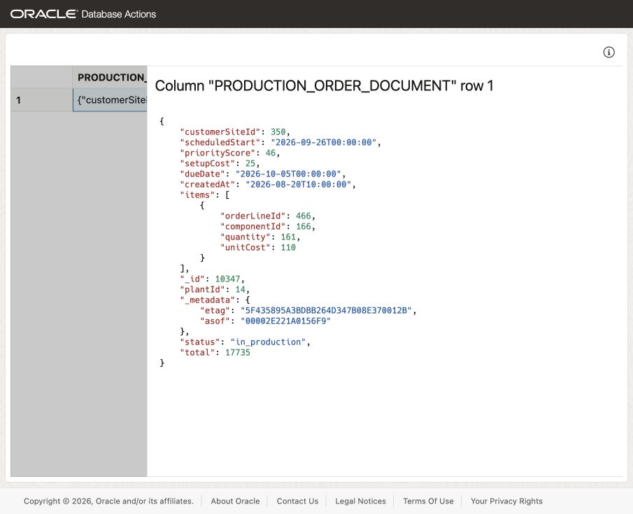
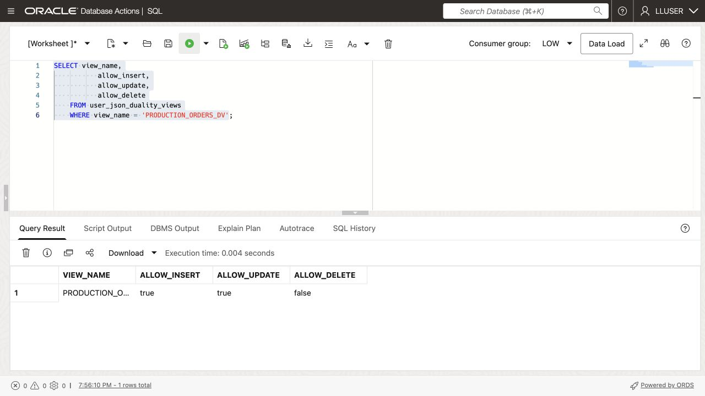
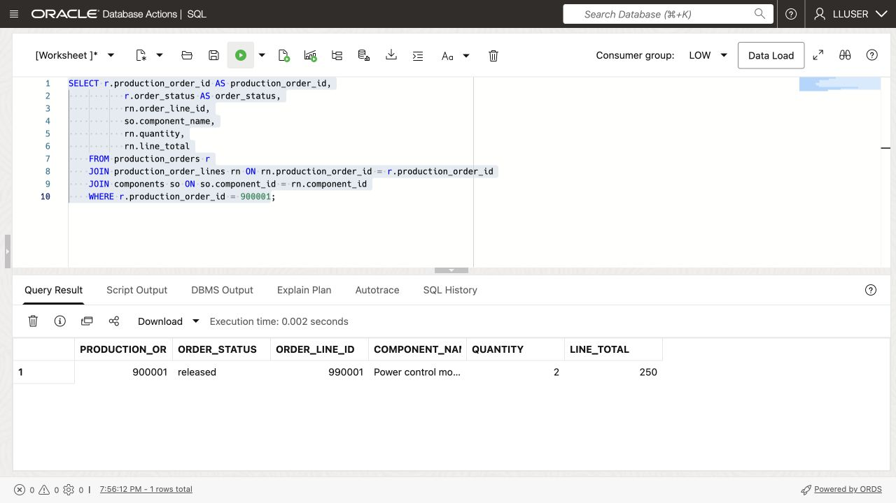
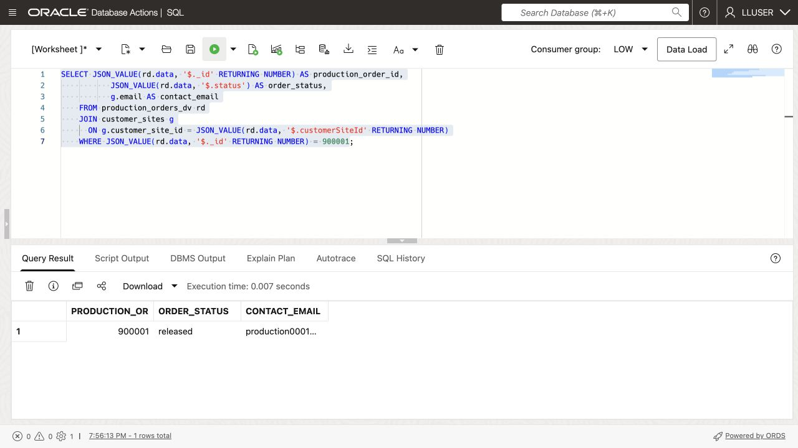
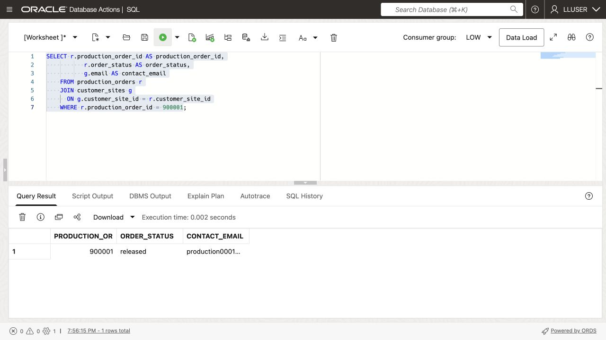

# Build a JSON Application Model

## Introduction

Thomas Brune, an application developer at SEER HIGHTECH, needs production-order JSON documents for web and mobile screens. Each document should group customer site and plant IDs, dates, status, costs, and optional app fields.


Jessica, the DBA, helps him compare JSON columns, JSON collections, and JSON Relational Duality Views while retaining SQL access, transactions, and database controls.


<details>
<summary><strong>Key terms: JSON columns, JSON collections, and JSON Relational Duality</strong></summary>

> - A **JSON column** stores a JSON value in a relational table alongside normal typed columns, keys, and constraints. Thomas can use it for optional or changing application attributes without turning every new attribute into a schema change.
>
> - A **JSON collection** is a special table or view that provides a set of JSON documents through one `JSON`-typed `DATA` column. Each document can have a top-level `_id` used to identify it.
>
> - **JSON Relational Duality** lets Oracle Database expose relational data as JSON documents without copying it into a separate document database. The application gets the document structure Thomas wants for its API. The database keeps the relational rows and controls.
>

</details>

Thomas's application needs a document with the production order and its production-order lines together, such as this:

```json
{
  "_id": 513063,
  "customerSiteId": 1,
  "plantId": 1,
  "scheduledStart": "2026-09-22",
  "dueDate": "2026-09-24",
  "status": "released",
  "items": [
    { "componentId": 1, "quantity": 2, "unitCost": 125.00 }
  ]
}
```


### Objectives

- Store flexible application attributes as JSON in a relational table.
- Create and query a JSON Collection Table of production order documents.
- Read and update relational production order data through `PRODUCTION_ORDERS_DV`.
- Compare the three JSON approaches and choose the right one for an application feature.

Estimated Time: **10 minutes**


> **SQL Worksheet reminder:** See [Getting Started Task 2: Open SQL Worksheet](?lab=getting-started#Task2:OpenSQLWorksheet) for the steps to paste and run SQL.

On a repeat run, reuse `THOMAS_APP_DATA` and `THOMAS_PRODUCTION_ORDER_DOCS` and skip their CREATE and INSERT statements in Tasks 1 and 2. The duality view may already allow inserts, and order `900001` may already be released; Task 5 preserves an existing order.

## Task 1: Store flexible application data as JSON

Thomas adds a native `JSON` column for optional screen and production-tracking settings. The production order rows already exist in the workshop database.

1. Create the application-data table and add one sample document.

    ```sql
    <copy>
    CREATE TABLE thomas_app_data (
        production_order_id  NUMBER PRIMARY KEY,
        app_data  JSON NOT NULL
    );

    INSERT INTO thomas_app_data (production_order_id, app_data)
    SELECT production_order_id,
           JSON_OBJECT(
               'screen'    VALUE 'production_order-detail',
               'showTotal' VALUE 'true' FORMAT JSON,
               'features'  VALUE JSON_ARRAY('live-status', 'delivery-requirements')
               RETURNING JSON
           )
    FROM (
        SELECT production_order_id
        FROM production_orders
        ORDER BY production_order_id
        FETCH FIRST 1 ROW ONLY
    );

    COMMIT;
    </copy>
    ```

2. Read values from the JSON column.

    ```sql
    <copy>
    SELECT production_order_id,
           JSON_VALUE(app_data, '$.screen') AS screen_name,
           JSON_VALUE(app_data, '$.showTotal' RETURNING BOOLEAN) AS show_total,
           JSON_QUERY(app_data, '$.features') AS app_features
    FROM thomas_app_data;
    </copy>
    ```

    `PRODUCTION_ORDER_ID` remains a relational key. `APP_DATA` can change as the application changes. Thomas can query both with SQL in one table.

## Task 2: Create a JSON Collection Table

Next, Thomas creates a JSON Collection Table. Each row holds a document in `DATA`, identified by `_id`.

1. Create the collection and add the sample production order document.

    ```sql
    <copy>
    CREATE JSON COLLECTION TABLE thomas_production_order_docs
    WITH ETAG;

    INSERT INTO thomas_production_order_docs (data)
    SELECT JSON_OBJECT(
               '_id'        VALUE r.production_order_id,
               'customerSiteId' VALUE r.customer_site_id,
               'plantId' VALUE r.plant_id,
               'scheduledStart' VALUE TO_CHAR(r.scheduled_start, 'YYYY-MM-DD'),
               'dueDate' VALUE TO_CHAR(r.due_date, 'YYYY-MM-DD'),
               'status'     VALUE r.order_status,
               'items'      VALUE (
                   SELECT JSON_ARRAYAGG(
                              JSON_OBJECT(
                                  'orderLineId'    VALUE rn.order_line_id,
                                  'componentId' VALUE rn.component_id,
                                  'quantity'  VALUE rn.quantity,
                                  'unitCost' VALUE rn.unit_cost
                                  RETURNING JSON
                              ) ORDER BY rn.order_line_id RETURNING JSON
                          )
                   FROM production_order_lines rn
                   WHERE rn.production_order_id = r.production_order_id
               ) FORMAT JSON
               RETURNING JSON
           )
    FROM production_orders r
    JOIN thomas_app_data t ON t.production_order_id = r.production_order_id;

    COMMIT;
    </copy>
    ```

    `WITH ETAG` adds `_metadata.etag`, which changes when the document changes. An application can submit the tag it last read with an update to detect concurrent changes and avoid overwriting a newer version.

2. Query the collection as documents.

    ```sql
    <copy>
    SELECT JSON_SERIALIZE(data PRETTY) AS production_order_document
    FROM thomas_production_order_docs
    WHERE JSON_VALUE(data, '$._id' RETURNING NUMBER) =
          (SELECT production_order_id FROM thomas_app_data);
    </copy>
    ```

    Thomas now has a document collection that a document API can access, and SQL can query the same `DATA` column. The collection stores the documents; it is separate from the relational `PRODUCTION_ORDERS` and `PRODUCTION_ORDER_LINES` tables.

## Task 3: Read a customer site document from relational data

Thomas now reads a document assembled from the existing relational production order and its lines.

1. Run this query:


    ```sql
    <copy>
    SELECT data AS production_order_document
    FROM production_orders_dv
    FETCH FIRST 1 ROW ONLY;
    </copy>
    ```

    

    **Expected output:** One JSON production-order document with an `items` array.

2. Expand the document in SQL Worksheet.

    The \_id value appears in the JSON document while the source data remains relational. The document includes `customerSiteId`, `status`, totals, timestamps, and production-order lines. 


    > **Note:** Look for `_metadata.etag` in the document. The ETAG changes when the document changes, so Thomas's application can detect a newer version before updating the production order and avoid overwriting another request.

## Task 4: Enable document inserts and updates

The existing `PRODUCTION_ORDERS_DV` lets an application update production order documents. Here, you also allow inserts. Oracle still enforces the table keys and constraints. An application granted access only to the view can use only the fields and write operations that the view allows.

1. Check the current document-write capabilities.

    ```sql
    <copy>
    SELECT view_name,
           allow_insert,
           allow_update,
           allow_delete
    FROM user_json_duality_views
    WHERE view_name = 'PRODUCTION_ORDERS_DV';
    </copy>
    ```

    **Expected output: Current Document Capabilities**

    `PRODUCTION_ORDERS_DV` should report update enabled and insert disabled in the initial loader definition.

    Both the root `PRODUCTION_ORDERS` table and nested `PRODUCTION_ORDER_LINES` rows need insert permission to accept a new document with line items.

2. Enable insert and update for the document and its production-order lines.


    ```sql
    <copy>
    CREATE OR REPLACE JSON RELATIONAL DUALITY VIEW production_orders_dv AS
    SELECT JSON {
        '_id'         : r.production_order_id,
        'customerSiteId'  : r.customer_site_id,
        'plantId' : r.plant_id,
        'scheduledStart'     : r.scheduled_start,
        'dueDate'    : r.due_date,
        'status'      : r.order_status,
        'total'       : r.order_total,
        'setupCost': r.setup_cost,
        'priorityScore' : r.priority_score,
        'createdAt'   : r.created_at,
        'items' : [
            SELECT JSON {
                'orderLineId'    : rn.order_line_id,
                'componentId' : rn.component_id,
                'quantity'  : rn.quantity,
                'unitCost' : rn.unit_cost
            }
            FROM production_order_lines rn WITH INSERT UPDATE
            WHERE rn.production_order_id = r.production_order_id
        ]
    }
    FROM production_orders r WITH INSERT UPDATE;
    </copy>
    ```

    `PRODUCTION_ORDERS` supplies the document root; `PRODUCTION_ORDER_LINES` supplies the nested `items` array. Each `WITH INSERT UPDATE` clause enables those operations on its part of the document.

    **Expected output: View Definition Updated**


3. Run the capability query again.

    ```sql
    <copy>
    SELECT view_name,
           allow_insert,
           allow_update,
           allow_delete
    FROM user_json_duality_views
    WHERE view_name = 'PRODUCTION_ORDERS_DV';
    </copy>
    ```

    

    **Expected output: Document Capabilities Enabled**

    `PRODUCTION_ORDERS_DV` should report insert and update enabled; delete remains disabled.


## Task 5: Create and update a JSON production order

Thomas inserts one nested document, then checks the relational rows Jessica sees.

1. Insert the supplied workshop production order document.

    The `INSERT` writes through `PRODUCTION_ORDERS_DV`; Oracle uses the view definition to update the relational tables. The sample uses production order `900001`, customer site `1`, plant `1`, component `1`, and order-line `990001`. Its two-unit order costs USD 125.00 per unit, for a total of 250.00 in the workshop currency.

    The loader must supply customer site 1 and component 1 at plant 1. The production order and order-line IDs are reserved for this exercise. Quantity is independent of the scheduled date range. The fixed dates make the exercise repeatable and put the due date after the scheduled start. On the first run, the production order has status `planned`. Running the insert again adds no rows and preserves the existing record.

    ```sql
    <copy>
    INSERT INTO production_orders_dv (data)
    SELECT JSON(
      '{
        "_id": 900001,
        "customerSiteId": 1,
        "plantId": 1,
        "scheduledStart": "2026-09-22",
        "dueDate": "2026-09-24",
        "status": "planned",
        "total": 250.00,
        "setupCost": 0,
        "items": [
          {
            "orderLineId": 990001,
            "componentId": 1,
            "quantity": 2,
            "unitCost": 125.00
          }
        ]
      }'
    )
    WHERE NOT EXISTS (
      SELECT 1
      FROM production_orders
      WHERE production_order_id = 900001
    );

    COMMIT;
    </copy>
    ```

    **Expected output: Production order Document Created**

    On the first run, you insert one document. On later runs, the `NOT EXISTS` check returns zero rows because the workshop production order is already present.

2. Confirm the JSON document became relational rows.

    > **Note:** This query reads the relational tables `PRODUCTION_ORDERS` and `PRODUCTION_ORDER_LINES`!

    ```sql
    <copy>
    SELECT r.production_order_id AS production_order_id,
           r.order_status AS order_status,
           g.email AS contact_email,
           rn.order_line_id,
           so.component_name,
           rn.quantity,
           rn.unit_cost,
           rn.line_total
    FROM production_orders r
    JOIN customer_sites g ON g.customer_site_id = r.customer_site_id
    JOIN production_order_lines rn ON rn.production_order_id = r.production_order_id
    JOIN components so ON so.component_id = rn.component_id
    WHERE r.production_order_id = 900001;
    </copy>
    ```

    **Expected output: Created Production order Rows**

    The sample row should contain production order 900001, order-line 990001, two units at 125.00, line total 250.00, and status `planned` on the first run. Read the customer site email and component name from the loaded rows.

3. Update the document status through the duality view.

    This statement maps `status` to `PRODUCTION_ORDERS.ORDER_STATUS`. The view also permits updates to other exposed fields; restricting writes to status alone would require a narrower view definition.

    ```sql
    <copy>
    UPDATE production_orders_dv
    SET data = JSON_TRANSFORM(data, SET '$.status' = 'released')
    WHERE JSON_VALUE(data, '$._id' RETURNING NUMBER) = 900001;

    COMMIT;
    </copy>
    ```

    **Expected output: Production order Status Updated**

    Oracle updates one document. The following query confirms that the relational production order row now has status `released`.

4. Verify the updated relational status.

    ```sql
    <copy>
    SELECT r.production_order_id AS production_order_id,
           r.order_status AS order_status,
           rn.order_line_id,
           so.component_name,
           rn.quantity,
           rn.line_total
    FROM production_orders r
    JOIN production_order_lines rn ON rn.production_order_id = r.production_order_id
    JOIN components so ON so.component_id = rn.component_id
    WHERE r.production_order_id = 900001;
    </copy>
    ```

    

    **Expected output: Updated Production order Rows**

    Production order 900001 should now have status `released`, with the same order-line values.

## Task 6: Project JSON fields with SQL

Jessica extracts JSON values from `PRODUCTION_ORDERS_DV` as SQL columns, a step called **projection**, and joins them to customer site data.

1. Run this SQL/JSON projection query:


    `JSON_VALUE` extracts the order ID, status, and customer site identifier. The query joins that identifier to `CUSTOMER_SITES` to retrieve the contact email.


    ```sql
    <copy>
    SELECT JSON_VALUE(rd.data, '$._id' RETURNING NUMBER) AS production_order_id,
           JSON_VALUE(rd.data, '$.status') AS order_status,
           g.email AS contact_email
    FROM production_orders_dv rd
    JOIN customer_sites g
      ON g.customer_site_id = JSON_VALUE(rd.data, '$.customerSiteId' RETURNING NUMBER)
    WHERE JSON_VALUE(rd.data, '$._id' RETURNING NUMBER) = 900001;
    </copy>
    ```

    

    **Expected output: JSON Field Projection**

    Compare production order ID 900001, status `released`, and the loaded customer site email with the following relational query. Check these values against your database results.

2. Run the equivalent query against the relational tables.

    ```sql
    <copy>
    SELECT r.production_order_id AS production_order_id,
           r.order_status AS order_status,
           g.email AS contact_email
    FROM production_orders r
    JOIN customer_sites g
      ON g.customer_site_id = r.customer_site_id
    WHERE r.production_order_id = 900001;
    </copy>
    ```

    

    Compare the result with the previous query. The production order ID, status, and customer site email should match. Thomas's application is reading the JSON document, while Jessica's relational query reads the underlying rows.

## Conclusion: Choose the right JSON approach

Choose the approach by who owns the data and whether the document represents existing relational rows.

| Approach                          | Use it when                                                                                 | Example in Thomas's application                                                                            | Where the data lives                                                                                           |
| -----------------------------------| ---------------------------------------------------------------------------------------------| ------------------------------------------------------------------------------------------------------------| ----------------------------------------------------------------------------------------------------------------|
| JSON column in a relational table | A relational record needs optional or changing attributes.                                  | Store screen settings or production planning options alongside a production order key.                          | A normal relational table with a native `JSON` column.                                                         |
| JSON Collection Table             | The application owns a set of JSON documents and needs document-style access.               | Store saved production order drafts as customer sites revise scheduled dates and delivery requirements.                              | A JSON Collection Table with one document in each `DATA` row.                                                  |
| JSON Relational Duality View      | The data already belongs in relational tables, but the application needs one JSON document. | Return a customer site production order with its status and production-order lines, or accept a new production order document from the app. | Relational tables such as `PRODUCTION_ORDERS` and `PRODUCTION_ORDER_LINES`; the duality view defines the JSON structure for Thomas' app. |

For the shared production-order data, Thomas chooses the duality view: the application gets JSON while Jessica retains SQL access and relational constraints.

## Acknowledgements

* **Author** - Matt Kowalik
* **Contributor** - Kevin Lazarz
* **Last Updated By/Date** - Matt Kowalik, September 2026
