# Investigate a Booking Abuse Network

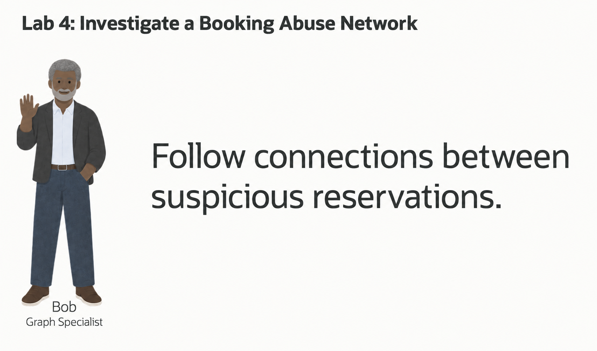

## Introduction

Bob Green, Seer Hotels’ graph specialist, investigates reservation `RSV-8841`. Shared devices, payment tokens, or contact details may connect it to other suspicious bookings.

Compare ordinary SQL joins with SQL Property Graph Queries (SQL/PGQ), then explore the connections visually in Graph Studio.

<details>
<summary><strong>Key terms: property graph, vertex, edge, and SQL Property Graph Queries (SQL/PGQ)</strong></summary>

> - A **property graph** represents things and how they are connected. In this lab, things include reservations, devices, IP addresses, phone numbers, payment tokens, hotel properties, and cases. A graph makes relationship patterns easier to see than they are in a flat table.
>
> - A **vertex** is a graph node that represents something investigators care about, such as a reservation, device, IP address, payment token, phone number, or case. In this graph, vertices use the `entity` label and carry properties such as a risk score, channel, or total amount.
>
> - An **edge** is a connection between vertices, such as a reservation using a device, sharing a phone number, paying with a token, or opening activity from an IP address. In this graph, edges use the `related_to` label and carry properties such as the relationship type.
>
> - A **hop** is one step across an edge from one vertex to another. `RSV-8841` to a device is one hop. `RSV-8841` to that device and then to another reservation is two hops. The hop count tells investigators how far the search travels from the starting reservation; it does not describe physical distance or reservation time.
>
> - **SQL Property Graph Queries (SQL/PGQ)** let you describe graph patterns in SQL, such as "start with this reservation and follow related entities." That lets investigators ask relationship questions in SQL without moving booking abuse data into a separate graph-only database.

</details>

The local Hospitality LiveStack demo illustrates a related application story using a separate dataset. Its identifiers and results differ from the Seer Hotels SQL exercises below.

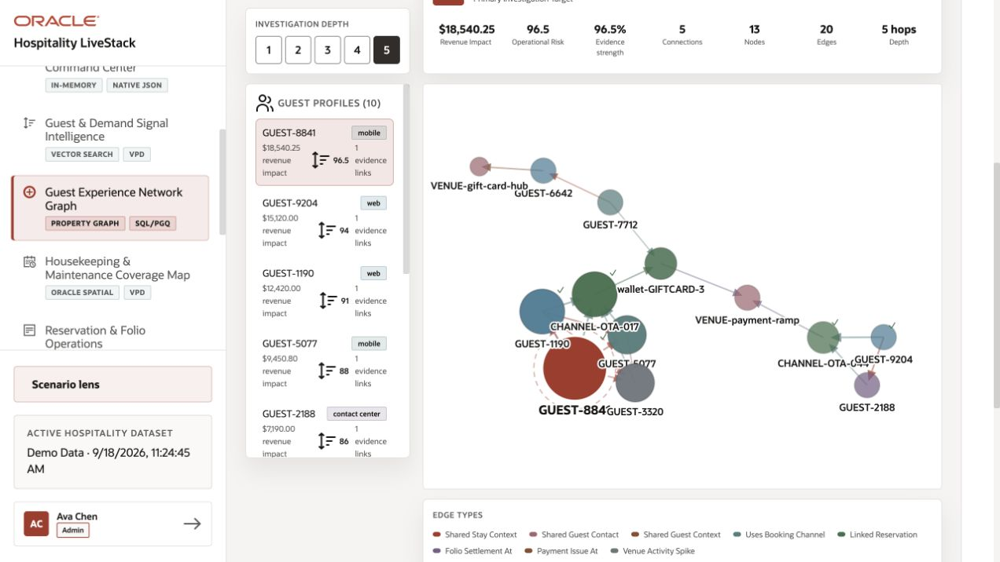

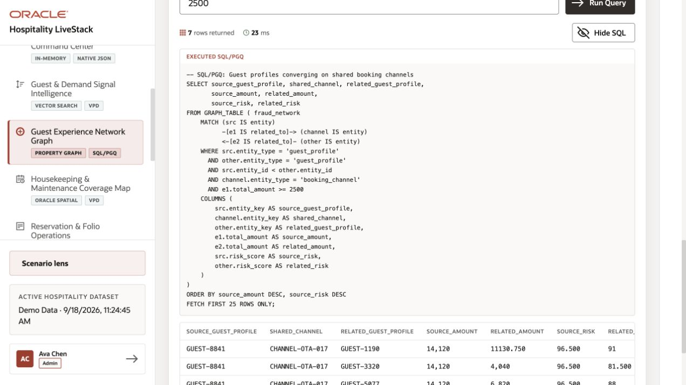

### Objectives

- Identify vertices and edges in a property graph.
- Follow connections from a suspicious reservation.
- Find reservation pairs that share identifying information.
- Open Graph Studio from Database Actions.
- Import and run the hospitality booking-abuse-network notebook.
- Explain the result in terms a business user can act on.

Estimated Time: **10 minutes**

> **SQL Worksheet reminder:** See [Getting Started Task 2: Open SQL Worksheet](?lab=getting-started#Task2:OpenSQLWorksheet) for the steps to paste and run SQL.

## Task 1: Follow a suspicious reservation with SQL

Jessica has already written a query for Bob. It shows the entities directly connected to suspicious reservation `RSV-8841`. The query works, but Jessica is concerned about what happens when investigators need to follow relationships several steps away.

1. Run Jessica's ordinary SQL query:

    ```sql
    <copy>
    SELECT reservation.entity_key AS reservation_key,
           connected.entity_key AS connected_key,
           connected.entity_type AS connected_type,
           rel.relationship_type,
           connected.risk_score AS connected_risk
    FROM booking_entities reservation
    JOIN booking_relationships rel
      ON rel.from_entity = reservation.entity_id
    JOIN booking_entities connected
      ON connected.entity_id = rel.to_entity
    WHERE reservation.entity_key = 'RSV-8841'
    ORDER BY connected_risk DESC;
    </copy>
    ```

    The query joins `BOOKING_ENTITIES` twice: once for the reservation and once for the connected entity. `BOOKING_RELATIONSHIPS` supplies the edge between them.

    **Expected output: Direct reservation Connections**

    The result lists the device, reused payment token, IP address, phone, or property directly connected to `RSV-8841`.

2. Extend Jessica's query to follow one through four hops without using a graph query:

    ```sql
    <copy>
    SELECT reservation_key, connected_key, connected_type,
           relationship_path, connected_risk
    FROM (
      SELECT seed.entity_key AS reservation_key,
             reached.entity_key AS connected_key,
             reached.entity_type AS connected_type,
             r1.relationship_type AS relationship_path,
             reached.risk_score AS connected_risk
      FROM booking_entities seed
      JOIN booking_relationships r1
        ON r1.from_entity = seed.entity_id
      JOIN booking_entities reached
        ON reached.entity_id = r1.to_entity
      WHERE seed.entity_key = 'RSV-8841'

      UNION

      SELECT seed.entity_key,
             reached.entity_key,
             reached.entity_type,
             r1.relationship_type || ' -> ' || r2.relationship_type,
             reached.risk_score
      FROM booking_entities seed
      JOIN booking_relationships r1
        ON r1.from_entity = seed.entity_id
      JOIN booking_entities v1
        ON v1.entity_id = r1.to_entity
      JOIN booking_relationships r2
        ON r2.from_entity = v1.entity_id
      JOIN booking_entities reached
        ON reached.entity_id = r2.to_entity
      WHERE seed.entity_key = 'RSV-8841'

      UNION

      SELECT seed.entity_key,
             reached.entity_key,
             reached.entity_type,
             r1.relationship_type || ' -> ' ||
               r2.relationship_type || ' -> ' ||
               r3.relationship_type,
             reached.risk_score
      FROM booking_entities seed
      JOIN booking_relationships r1
        ON r1.from_entity = seed.entity_id
      JOIN booking_entities v1
        ON v1.entity_id = r1.to_entity
      JOIN booking_relationships r2
        ON r2.from_entity = v1.entity_id
      JOIN booking_entities v2
        ON v2.entity_id = r2.to_entity
      JOIN booking_relationships r3
        ON r3.from_entity = v2.entity_id
      JOIN booking_entities reached
        ON reached.entity_id = r3.to_entity
      WHERE seed.entity_key = 'RSV-8841'

      UNION

      SELECT seed.entity_key,
             reached.entity_key,
             reached.entity_type,
             r1.relationship_type || ' -> ' ||
               r2.relationship_type || ' -> ' ||
               r3.relationship_type || ' -> ' ||
               r4.relationship_type,
             reached.risk_score
      FROM booking_entities seed
      JOIN booking_relationships r1
        ON r1.from_entity = seed.entity_id
      JOIN booking_entities v1
        ON v1.entity_id = r1.to_entity
      JOIN booking_relationships r2
        ON r2.from_entity = v1.entity_id
      JOIN booking_entities v2
        ON v2.entity_id = r2.to_entity
      JOIN booking_relationships r3
        ON r3.from_entity = v2.entity_id
      JOIN booking_entities v3
        ON v3.entity_id = r3.to_entity
      JOIN booking_relationships r4
        ON r4.from_entity = v3.entity_id
      JOIN booking_entities reached
        ON reached.entity_id = r4.to_entity
      WHERE seed.entity_key = 'RSV-8841'
    ) paths
    ORDER BY connected_risk DESC;
    </copy>
    ```

    Each branch follows a different path length; `UNION` combines the one-through-four-hop results and removes duplicates.

3. Review how the SQL grows more complex when it does not use a graph query.

    Four hops need four relationship joins and five instances of the entity table. Adding path lengths means adding more joins and branches.

    Bob’s graph query expresses the path directly over those same relational tables.

## Task 2: Read the same connections as a graph

`BOOKING_ABUSE_NETWORK` is already created over the relational tables. See the appendix for its vertex and edge mappings.

1. Run Bob's SQL/PGQ query:

    ```sql
    <copy>
    SELECT reservation_key,
           connected_key,
           connected_type,
           relationship_type,
           connected_risk
    FROM GRAPH_TABLE ( booking_abuse_network
      MATCH (reservation IS entity) -[edge IS related_to]-> (connected IS entity)
      WHERE reservation.entity_key = 'RSV-8841'
      COLUMNS (
        reservation.entity_key AS reservation_key,
        connected.entity_key AS connected_key,
        connected.entity_type AS connected_type,
        edge.relationship_type AS relationship_type,
        connected.risk_score AS connected_risk
      )
    )
    ORDER BY connected_risk DESC;
    </copy>
    ```

    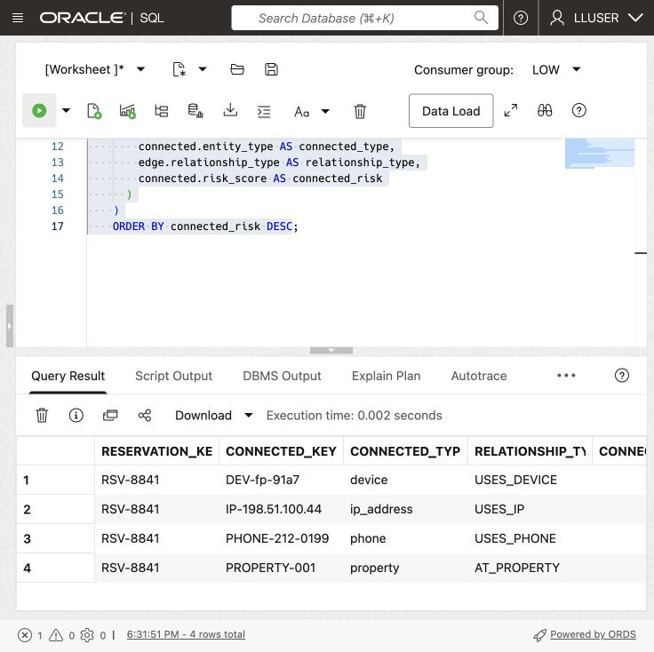

    In the `MATCH` pattern, `reservation` and `connected` are vertices. `edge` is the edge between them, so this pattern follows one hop. `IS entity` and `IS related_to` refer to the labels defined in `BOOKING_ABUSE_NETWORK`.

    Compare the result with Task 1: the graph pattern returns the same direct connections.

## Task 3: Trace four-hop booking abuse reach

Start from suspicious reservation `RSV-8841` and trace the connected entities within four relationship hops.

1. Run the SQL/PGQ traversal from `RSV-8841`.

    In `MATCH`, `seed` is the starting reservation and `->{1,4}` follows one through four edges to `reached`. `COUNT(e.relationship_type)` returns the path length as `relationship_hops`.

    The `WHERE` clause anchors the search on `RSV-8841`, and the `COLUMNS` clause returns graph properties in a normal SQL result table.

    ```sql
    <copy>
    SELECT DISTINCT entity_key, display_name, entity_type,
           relationship_hops, risk_score, risk_level,
           total_amount, channel
    FROM GRAPH_TABLE ( booking_abuse_network
      MATCH (seed IS entity) -[e IS related_to]->{1,4} (reached IS entity)
      WHERE seed.entity_key = 'RSV-8841'
      COLUMNS (
        reached.entity_key AS entity_key,
        reached.display_name AS display_name,
        reached.entity_type AS entity_type,
        COUNT(e.relationship_type) AS relationship_hops,
        reached.risk_score AS risk_score,
        reached.risk_level AS risk_level,
        reached.total_amount AS total_amount,
        reached.channel AS channel
      )
    )
    ORDER BY risk_score DESC
    FETCH FIRST 25 ROWS ONLY;
    </copy>
    ```

    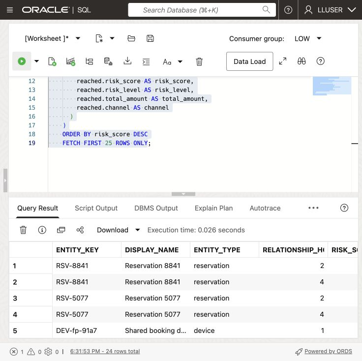

    `RELATIONSHIP_HOPS` is the number of steps from `RSV-8841`: `1` is a direct connection; `2`–`4` are longer paths.

    **Expected output: High Risk Booking Abuse Entities**

2. Review the entities in risk order. Examples include device `DEV-fp-91a7`, payment token `TOKEN-REUSED-017`, IP address `IP-198.51.100.44`, and phone `PHONE-212-0199`.

    Pick a high-risk row and explain which shared detail warrants further investigation. A high score helps prioritize review; it does not prove abuse.

## Task 4: Find reservations that share identifying information

Bob now moves from one suspicious reservation to a broader booking abuse question: **which reservation pairs share a device, IP address, phone number, or email address?** This is the kind of relationship pattern that can be difficult to find with ordinary joins.

1. Run Bob's reservation-pair query:

    ```sql
    <copy>
    SELECT reservation_a, shared_entity, shared_type, reservation_b,
           a_risk, b_risk,
           ROUND((a_risk + b_risk) / 2, 1) AS combined_risk,
           e1_type, e2_type
    FROM GRAPH_TABLE ( booking_abuse_network
        MATCH (a IS entity)
              -[e1 IS related_to]-> (shared IS entity)
              <-[e2 IS related_to]- (b IS entity)
        WHERE a.entity_type = 'reservation'
          AND b.entity_type = 'reservation'
          AND a.entity_id < b.entity_id
          AND shared.entity_type IN ('device','ip_address','phone','email')
          AND (a.risk_score >= 70 OR b.risk_score >= 70)
        COLUMNS (
            a.entity_key AS reservation_a,
            shared.entity_key AS shared_entity,
            shared.entity_type AS shared_type,
            b.entity_key AS reservation_b,
            a.risk_score AS a_risk,
            b.risk_score AS b_risk,
            e1.relationship_type AS e1_type,
            e2.relationship_type AS e2_type
        )
    )
    ORDER BY combined_risk DESC, shared_entity
    FETCH FIRST 25 ROWS ONLY;
    </copy>
    ```

    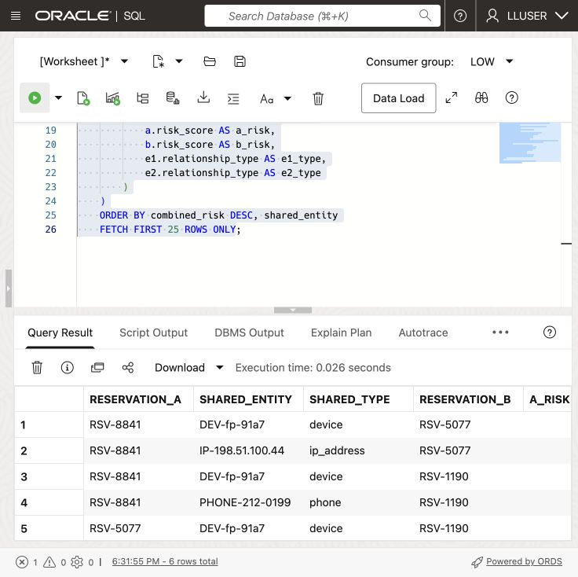

    The pattern starts at reservation `a`, follows an edge to a shared entity, and follows another edge back to reservation `b`. The two reservations can therefore be connected through the same device, IP address, phone number, or email address. `a.entity_id < b.entity_id` keeps the result from returning the same pair twice in reverse order.

2. Review the business result.

    The result shows the two reservations, the information they share, the relationship type on each side, and the risk score for each reservation. `COMBINED_RISK` helps the analyst review the strongest reservation pairs first. A shared identifier does not prove booking abuse, but it gives the booking abuse team a clear reason to investigate the reservations together.

## Task 5: Visualize the relationship using Oracle Graph Studio

Oracle Graph Studio displays the reservations and identifiers as an interactive network. Bob can select nodes and follow relationships to find clusters, shared devices, and links between reservations.

1. Start from the Database Actions Launchpad. Confirm that the upper-right corner shows `LLUSER`. If the dark-theme message appears, click **Done**.

2. On the **Development** tab, select **Graph Studio** from the left-side tool list and click **Open**.

    

3. If prompted, sign in with the `LLUSER` and the workshop password supplied.

4. Confirm that the Graph Studio home page opens. The landing page provides **Graphs**, **Notebooks**, **Templates**, and **Jobs**.

    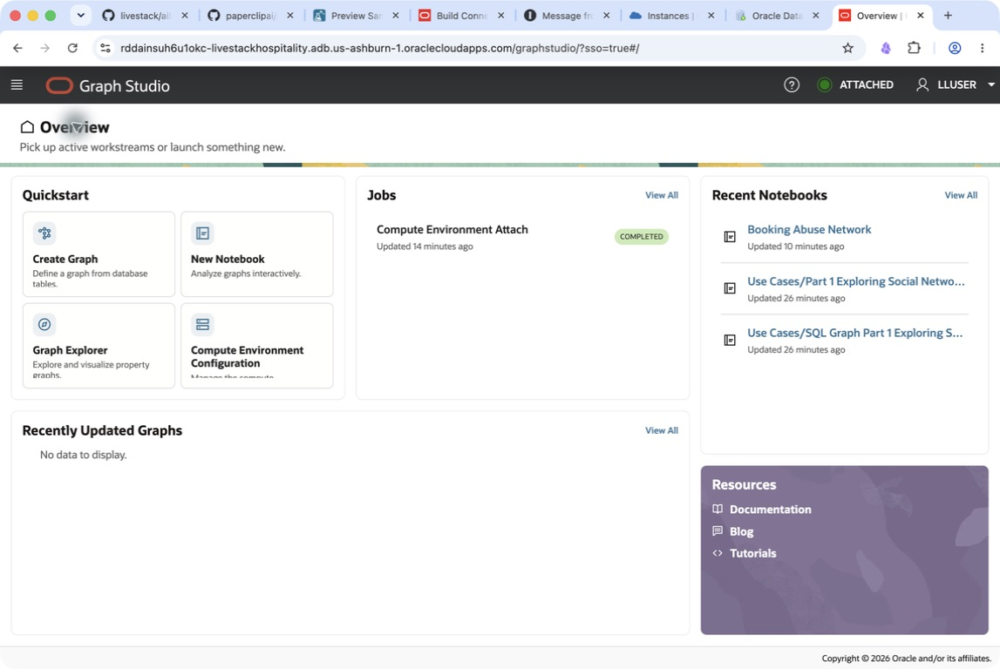

## Task 6: Download and import the hospitality notebook

The supplied `.dsnb` file is a native Graph Studio notebook: a reusable, runnable investigation guide that combines SQL/PGQ paragraphs and graph visualizations.

1. Download [hospitality-booking-abuse-graph-studio.dsnb](files/hospitality-booking-abuse-graph-studio.dsnb).

    If the notebook opens in your browser instead of downloading, right-click the link and select **Save Link As**.

2. In Graph Studio, click **Notebooks** in the landing page.

    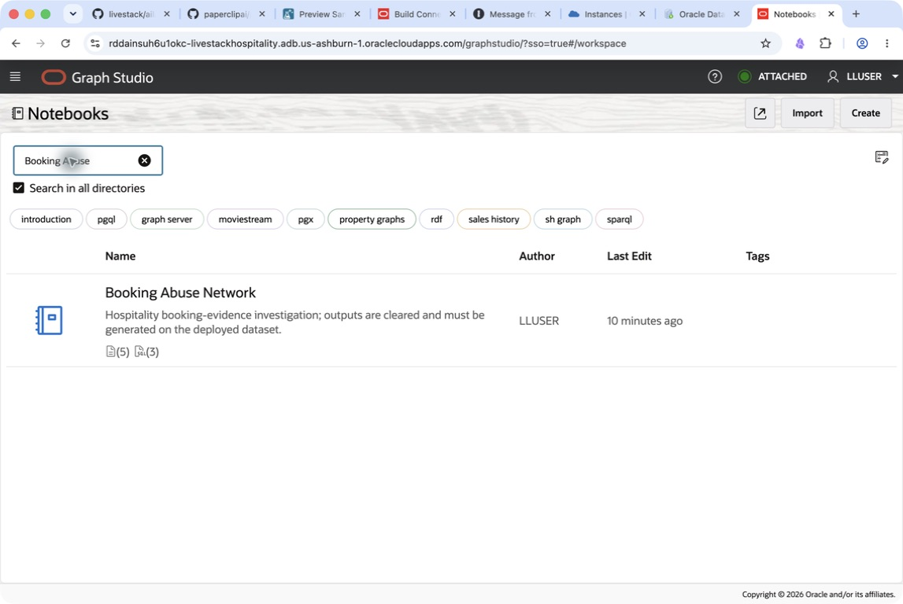

3. Select **Import** in the upper-right corner.

    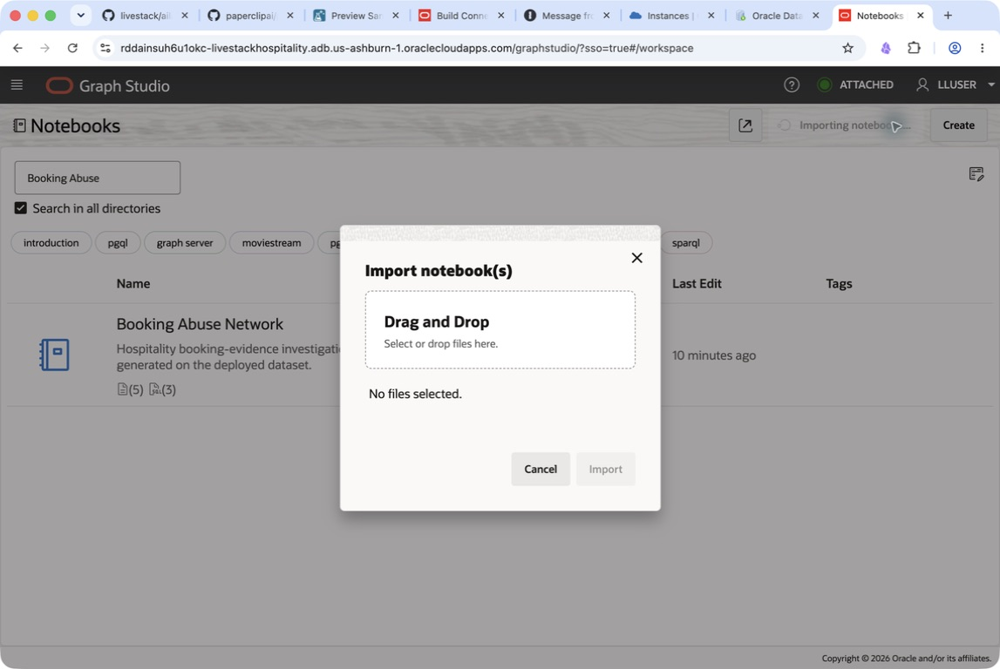

4. Drag the downloaded `.dsnb` file into the import window or browse to it. Confirm the filename, click **Import**, then open **Booking Abuse Network**.

    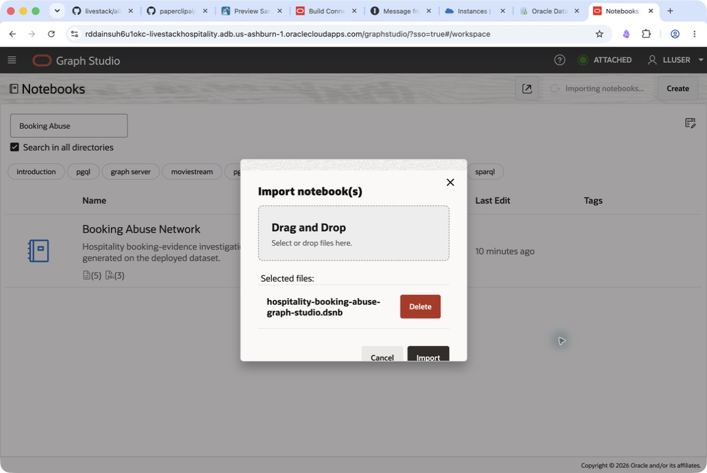

## Task 7: Run and interpret the Graph Studio notebook

Run the notebook’s `RSV-8841` traversal and `DEV-fp-91a7` shared-device view. Compare the ranked table with the paths shown in the graph.

1. Start at the top of the **Booking Abuse Network** notebook. Read the explanation for the `RSV-8841` traversal, then run the first SQL paragraph.

    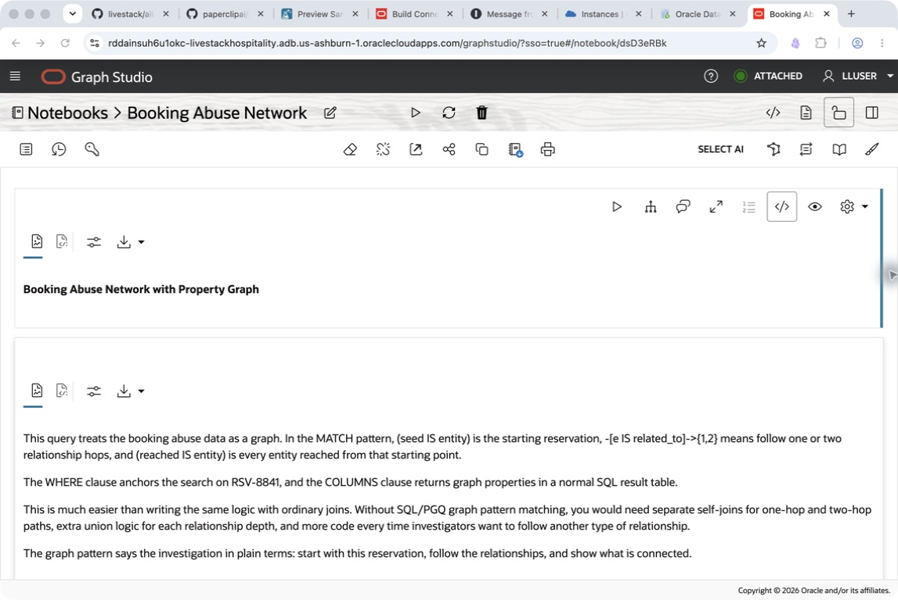

2. Review the results in table format in the graph studio notebook:

    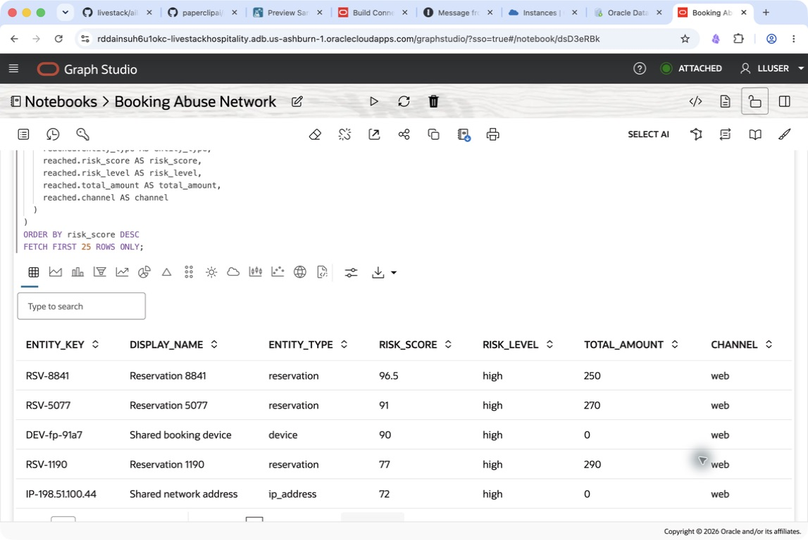

    This uses the investigation pattern from Task 3 with a shorter one-to-two-hop limit: start from `RSV-8841`, follow one or two relationship hops, and return the connected entities as a prioritized table.

3. Under **Graph Visualization of previous query**, run the SQL paragraph that starts with `SELECT *` and anchors on `RSV-8841`. Review the graph visualization that appears below the paragraph.

    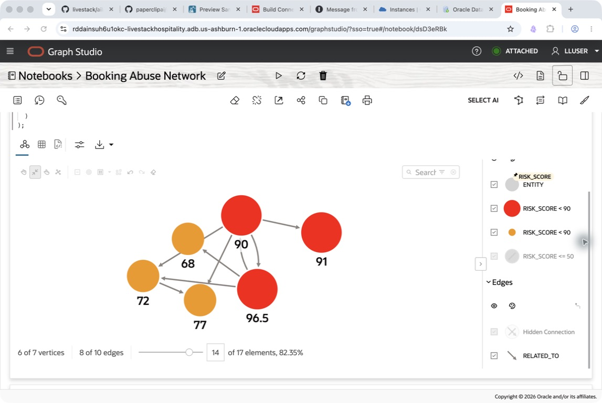

4. Under **Shared Entity Connections**, run the final SQL paragraph anchored on `DEV-fp-91a7`. Inspect the reservations connected to that device.

    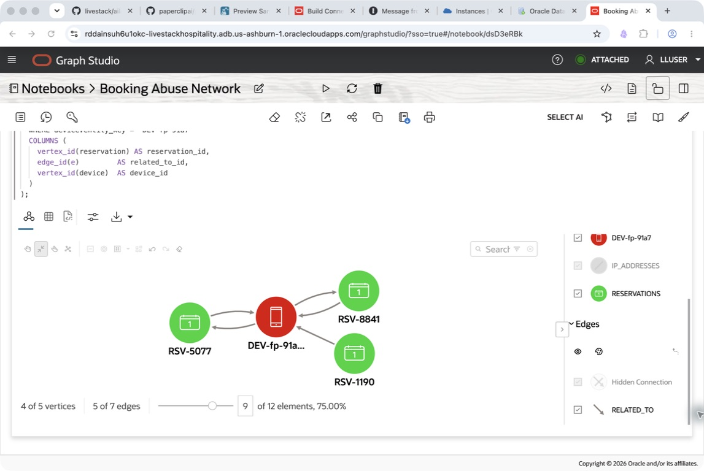

    The supplied display filters show four of five vertices and five of seven edges.

    Check that `DEV-fp-91a7` connects reservations `RSV-8841`, `RSV-5077`, and `RSV-1190` in your data.

> **Result note:** Graph layouts and node positions can vary between runs. Compare entity keys, relationships, and query results.

### Optional graph-algorithms extension

The companion [loyalty graph notebook](files/getting-started-loyalty-graph.dsnb) provides separate PGX exercises: parameterized paths, degree counts, PageRank, shortest paths, personalized PageRank, and hop distance. It uses `LOYALTY_GRAPH`, with loyalty members connected by allowed points transfers. It is separate from `BOOKING_ABUSE_NETWORK` and requires the optional PGQL graph, a provisioned `LOYALTY_GRAPH`, and an attached PGX service. Skip this extension if those resources are not available. Graph proximity is a review cue, not proof of abuse.

## Conclusion: Make Relationships Easy to Review

Bob can now rank connected entities in SQL and follow their paths in Graph Studio. Use shared identifiers to decide which reservations deserve investigation together.

## Appendix: Create the Property Graph

Bob creates a property graph by mapping relational tables to graph elements. `BOOKING_ENTITIES` becomes the vertex table, and each row receives the `entity` label. `BOOKING_RELATIONSHIPS` becomes the edge table, with foreign keys identifying the source and destination vertices. The graph queries in this lab use those two labels.

This statement is provided for reference. The `BOOKING_ABUSE_NETWORK` graph has already been created in the workshop database.

```sql
<copy>
CREATE PROPERTY GRAPH booking_abuse_network
  VERTEX TABLES (
    booking_entities KEY (entity_id)
      LABEL entity
      PROPERTIES (
        entity_id,
        entity_key,
        display_name,
        entity_type,
        risk_score,
        risk_level,
        channel,
        total_amount,
        event_count,
        is_confirmed_abuse
      ),
    booking_cases KEY (case_id)
      LABEL booking_case
      PROPERTIES (
        case_id,
        case_ref,
        case_type,
        status,
        risk_score,
        loss_amount,
        event_count
      )
  )
  EDGE TABLES (
    booking_relationships KEY (relationship_id)
      SOURCE KEY (from_entity)
        REFERENCES booking_entities (entity_id)
      DESTINATION KEY (to_entity)
        REFERENCES booking_entities (entity_id)
      LABEL related_to
      PROPERTIES (
        relationship_type,
        strength,
        event_count,
        total_amount
      ),
    booking_case_entities KEY (case_entity_id)
      SOURCE KEY (case_id)
        REFERENCES booking_cases (case_id)
      DESTINATION KEY (entity_id)
        REFERENCES booking_entities (entity_id)
      LABEL contains_entity
      PROPERTIES (
        role,
        evidence_score
      )
  );
</copy>
```

The statement defines the graph structure over the relational tables. It does not move the rows to a separate graph database. `BOOKING_ABUSE_NETWORK` can then be queried with `GRAPH_TABLE` while the relational tables remain the source of the data.

## Acknowledgements

* **Author** - Matt Kowalik
* **Contributor** - Kevin Lazarz
* **Last Updated By/Date** - Matt Kowalik, September 2026
