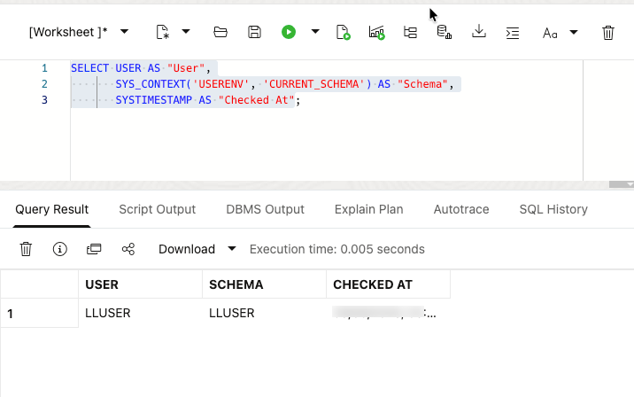

# Getting Started

## Introduction

> **Image status:** Hospitality captures for this lab are pending a deployed environment. The SQL and written checks below define what to inspect. Retained generic images are reference material, not evidence of a hospitality run. See the [image inventory](../validation/screenshots.md).

Use this lab to open the LiveLabs reservation, access the provisioned **Autonomous Database 26ai** instance, and prepare SQL Worksheet for the hands-on hospitality exercises. Think of this as getting the right desk, badge, and notebook before the investigation starts: each hospitality query runs as the workshop user against the prepared hospitality schema.

<details>
<summary><strong>Key terms: Database Actions, SQL Worksheet, and LLUSER</strong></summary>

> - **Database Actions** is the browser-based Oracle Database workspace you use in this workshop. It gives you access to tools such as SQL Worksheet, object browsing, data loading, and development utilities without installing a desktop database guest.
>
> - **SQL Worksheet** is the tool inside Database Actions where you paste and run SQL statements. It shows query results, script output, and errors, so it becomes the main place where you connect the application screens in this workshop to database evidence.
>
> - `LLUSER` is the workshop database user and schema owner for the hands-on hospitality objects. Using the right user matters because the tables, views, models, graph objects, and functions you query are created under this schema.

</details>

The retained sign-in graphics are source navigation illustrations. They are not screenshots captured from a hospitality deployment.

### Environment prerequisites

This guide expects a provisioned hospitality dataset in `LLUSER` on Autonomous Database 26ai. The Phase 1 repository does not provision it. Before starting, the instructor must deploy the Phase 2 package and verify the [hospitality schema contract](../validation/schema-contract.md).

Required capabilities are Database Actions SQL Worksheet, Graph Studio, native JSON and duality views, Oracle Spatial, Oracle Machine Learning, access to `ADMIN.ALL_MINILM_L12_V2`, and an enabled `GENAI` profile with an approved provider. Labs 1 and 4 require preloaded embeddings and a precreated booking graph. Lab 3 creates a separate teaching vector column. Lab 8 depends on Lab 7. AutoML and the supplemental PGX notebook also need their respective services and privileges.

The source supplies the same sandbox launch flow for both navigation variants. A tenancy-specific deployment procedure is pending the Phase 2 package. Do not launch an unrelated reservation to substitute for the hospitality environment.

Estimated Time: **5 minutes**

### Objectives

In this lab, you will:

- Launch the LiveLabs workshop environment.
- Use the reservation login information to open Database Actions.
- Confirm that SQL Worksheet is ready for the hospitality schema.
- Confirm that SQL Worksheet is connected as the workshop schema user.

## Task 1: Launch the LiveLabs environment

Start from the LiveLabs reservation so Database Actions opens with the correct workshop resources. The goal is simply to get into the environment that already contains the database and sign-in details for this workshop.

1. Sign in to [LiveLabs](https://livelabs.oracle.com) with your Oracle account.

2. Open this workshop, select **Start**, and select **Run on LiveLabs Sandbox**.

3. In **My Reservations**, select **Launch Workshop** for this reservation.

4. Select **View Login Info** and keep the database credentials available for the next task.

    

    *Figure 1: The Reservation Information dialog shows the `LLUSER` login, password, and Login URL for Database Actions.*

## Task 2: Open SQL Worksheet

Open SQL Worksheet as the workshop user before running the hospitality queries. SQL Worksheet is where you will ask the database each question and immediately see the evidence returned as a table.

1. In the **Reservation Information** dialog, confirm that **1 - Login** shows `LLUSER`.

2. Select **Copy** for **2 - Password**.

    

    *Figure 2: Copy the `LLUSER` password from the Reservation Information dialog.*

3. Select **Open Link** for **3 - Login URL**.

    

    *Figure 3: Use Open Link for the Login URL, then use the copied password to sign in as `LLUSER`.*

4. On the Database Actions sign-in page, confirm that **Username** shows `LLUSER`, paste the password from the reservation information, and select **Sign in**.

    

    *Figure 4: Sign in to Database Actions as `LLUSER` with the password from the reservation information.*

5. Before SQL Worksheet opens, select **Development**, then select **SQL** from the tools menu.

    

    *Figure 5: Open SQL from the Development tools menu.*

6. Use the same SQL Worksheet pattern throughout the workshop.

    


    - Confirm the user dropdown shows the main workshop user, usually `LLUSER`.
    - Paste each workshop SQL block into the editor.
    - Select **Run Statement** or press **Ctrl+Enter** to run the current SQL statement.
    - Review the output in **Query Result** or **Script Output**, depending on the step.
    - Use **Navigator** only when you want to inspect tables, views, or other objects.

7. Run this check.

    This check makes sure SQL Worksheet is connected as the right user before you start. `USER` shows who signed in, while `SYS_CONTEXT('USERENV', 'CURRENT_SCHEMA')` shows where table names resolve. The hospitality labs use `LLUSER`, so both values should point to the workshop schema.

    ```sql
    <copy>
    SELECT USER AS "User",
           SYS_CONTEXT('USERENV', 'CURRENT_SCHEMA') AS "Schema",
           SYSTIMESTAMP AS "Checked At";
    </copy>
    ```

    

    **Expected output: Connected SQL Worksheet Session**

    | User | Schema | Checked At |
    | --- | --- | --- |
    | LLUSER | LLUSER | Current SQL Worksheet timestamp |


8. You can use this same connection check whenever you want to confirm that SQL Worksheet is still running as `LLUSER`.

You can now continue to the hospitality labs.

## Acknowledgements

* **Author** - Pat Shepherd, Senior Principal Database Stay offer Manager
* **Contributor** - Linda Foinding, Principal Database Stay offer Manager
* **Last Updated By/Date** - Oracle Database Product Management, May 2026
