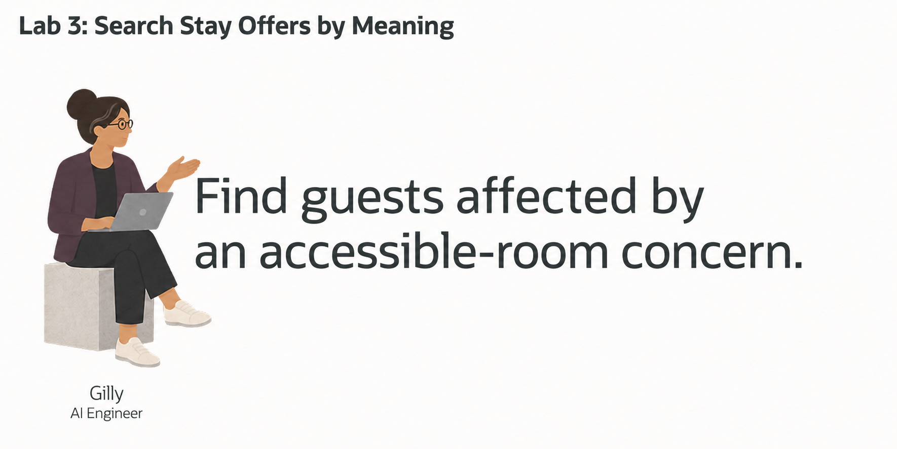
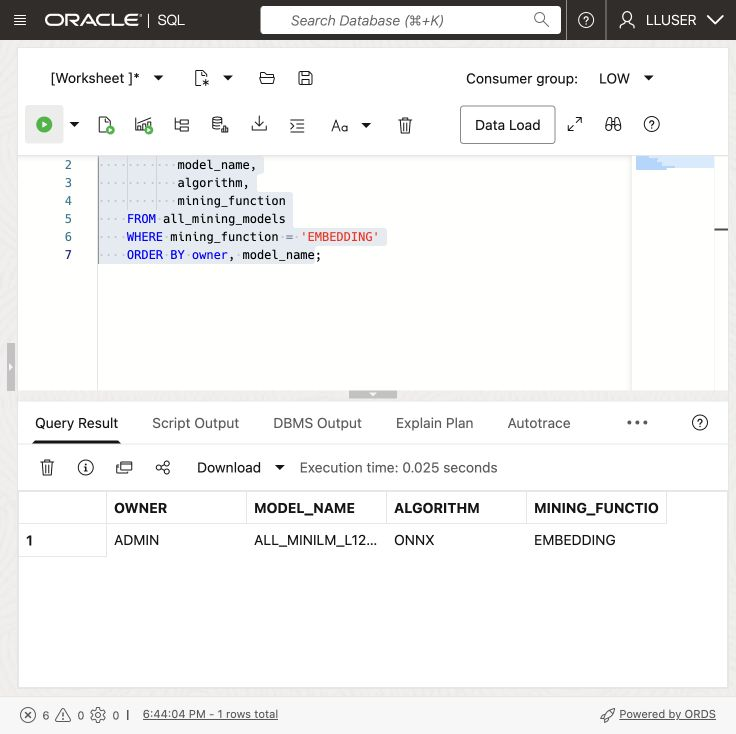
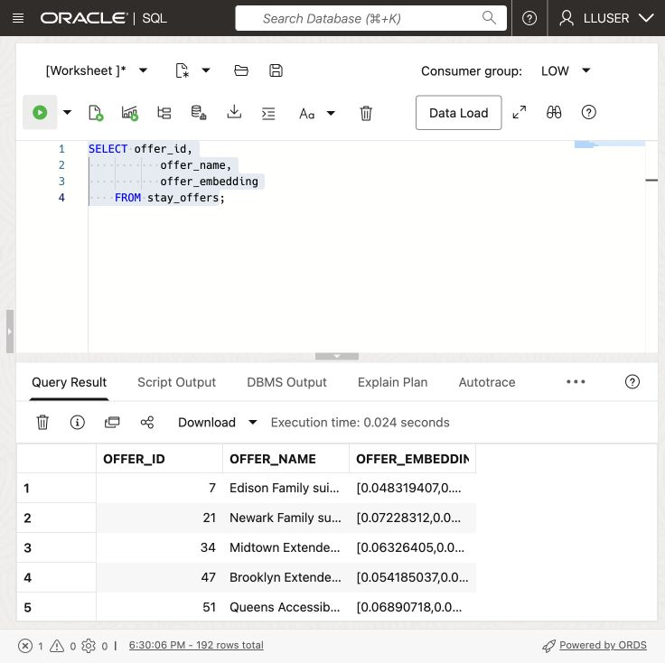
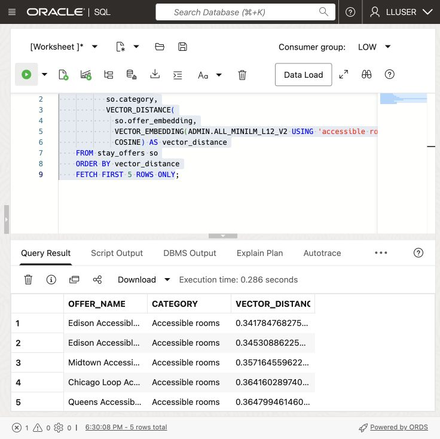
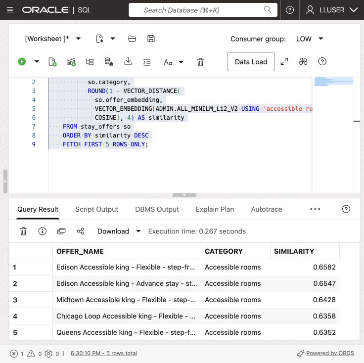
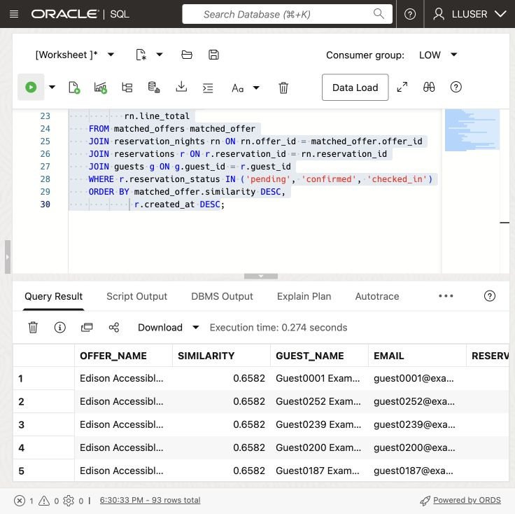

# Review a Semantic Guest Concern Search



## Introduction

> **Live validation:** The core SQL exercises were run successfully on 21 September 2026. A real result capture is included below. Additional application screen captures are tracked separately in the [image inventory](../validation/screenshots.md).

Gilly Bourne is an AI engineer at Seer Hotels. Her team has built a search feature for the guest service operations application. A business user can enter a question such as **which guests may be affected by an accessible-room availability concern?** The application should find the relevant stay offers first, then show the guests who booked them.

Gilly has the stay offer, reservation, and guest data in Oracle AI Database. She needs to match a plain-language question to stay offers, then find the guests who booked them. The result must give the service team names and reservations to follow up.

Gilly runs the search in the database. One SQL statement compares the question with stay offer vectors, joins the matches to reservations and guests, and returns the follow-up list. This avoids copying text and vectors to a separate search service.

In this lab, you check the embedding model, create stay offer vectors, and use a search result to find matching reservations and guests.


<details>
<summary><strong>Key terms: embedding, vector, vector distance, and semantic search</strong></summary>

> - An **embedding** is a numerical profile of what text means. In this lab, stay offer data is embedded so similar hospitality ideas sit near each other mathematically, even when the wording is different.
>
> - An **ONNX embedding model** is a portable machine-learning model saved in the Open Neural Network Exchange (ONNX) format. It turns text into a vector of numbers that captures meaning. Oracle AI Database can load and run this model inside the database, close to the stay offer rows.
>
> - A **vector** is the stored numerical form of an embedding. Oracle Database can store vectors beside the hospitality rows they describe, so the search stays connected to stay offer names, room types, rate plans, and nightly rates.
>
> - **Vector distance** measures how close two vectors are. A smaller distance means the meanings are more similar; a larger distance means they are farther apart. In this lab, distance helps rank which stay offers best match a business user's question.
>
> - **Semantic search** means searching by meaning instead of exact words. A search for "accessible room with step-free access" can find related accessible stay offers even when the stay offer names use different wording.

</details>

The Guest Concern Search page lets a user enter a concern and receive stay offers ranked by meaning. The following tasks explain the SQL behind that search.

### Objectives

- Check the embedding model Gilly needs for semantic search.
- Create a vector from stay offer data inside the database.
- Review a semantic stay offer search for a business question.
- Turn stay offer matches into a guest follow-up list.
- Explain why vector search belongs beside hospitality data and access controls.

Estimated Time: **10 minutes**

### Hands-on Scenario

| Step                | Hospitality focus                                                                                                                               |
| ---------------------| ---------------------------------------------------------------------------------------------------------------------------------------------|
| Business Problem    | Business users need to find relevant stay offers without knowing the exact terms used in the stay offer data.                                     |
| Technical Challenge | Gilly must search by meaning while keeping stay offer data, vectors, reservations, guests, and access controls together.                          |
| Persona Focus       | You review Gilly's implementation as she explains how the search connects a business question to stay offers, reservations, and guests.           |
| What You Will See   | Vector search ranks stay offers by meaning, then SQL adds reservation and guest details.                                                          |
| Database Capability | `VECTOR_EMBEDDING`, vector columns, and `VECTOR_DISTANCE` run beside relational hospitality data.                                               |
| Outcome             | The application can turn a plain-language concern into a guest follow-up list without a separate vector database or copied hospitality text. |

Persona focus: You are reviewing the search tool Gilly built for guest service operations.


> **SQL Worksheet reminder:** See [Getting Started Task 2: Open SQL Worksheet](?lab=getting-started#Task2:OpenSQLWorksheet) for the steps to paste and run SQL.


## Task 1: Check the embedding model

Start with Gilly's first design question: **what does similarity search need?** It needs vectors for the text being searched and an embedding model that converts a question into a vector.

Gilly asks Jessica to load an ONNX embedding model into Oracle AI Database. Oracle AI Database can store and run the ONNX model inside the database, so it creates the question embedding where the stay offer data already live. The application does not have to send hospitality text to a separate service and bring the vector back.

1. Run the following query to see which embedding models are available:

    ```sql
    <copy>
    SELECT owner,
           model_name,
           algorithm,
           mining_function
    FROM all_mining_models
    WHERE mining_function = 'EMBEDDING'
    ORDER BY owner, model_name;
    </copy>
    ```

    **Expected output: Available Embedding Models**

    

    The result should include an embedding model owned by `ADMIN`, such as `ALL_MINILM_L12_V2`. This compact model turns text into 384-number vectors. The `EMBEDDING` value confirms that the model can turn text into vectors for similarity search.

2. Review what this means for Gilly's application.

    Gilly can call the model from SQL with `VECTOR_EMBEDDING(...)`. Jessica manages the model inside the database, while Gilly uses it in her search query. The stay offer data, vectors, and access controls stay in the same database.

    > **Note:** The embedding model runs inside Oracle AI Database. Gilly can create vectors without sending hospitality text to another service.

## Task 2: Create a stay offer vector

Gilly decides that one vector per stay offer is enough. Each stay offer record is short and describes one stay offer, so she combines its name, category, and subcategory into one text value before creating the vector.

1. Review the text Gilly will embed:

    ```sql
    <copy>
    SELECT offer_id,
           offer_name,
           category,
           subcategory,
           offer_name || '. Category: ' || category ||
             '. Subcategory: ' || subcategory AS embedding_text
    FROM stay_offers
    FETCH FIRST 5 ROWS ONLY;
    </copy>
    ```

    The combined text gives the model the stay offer name and its business classification. Gilly does not need to embed price, dates, or other values that do not describe what the stay offer is.

2. Add a vector column to `STAY_OFFERS`:

    ```sql
    <copy>
    ALTER TABLE stay_offers ADD (offer_embedding VECTOR(384));
    </copy>
    ```

    The column has 384 dimensions because `ALL_MINILM_L12_V2` produces 384-dimensional vectors.

3. Create the stay offer vectors inside Oracle Database:

    ```sql
    <copy>
    UPDATE stay_offers
    SET offer_embedding = VECTOR_EMBEDDING(
      ADMIN.ALL_MINILM_L12_V2 USING
        offer_name || '. Category: ' || category ||
        '. Subcategory: ' || subcategory AS DATA)
    WHERE offer_embedding IS NULL;

    COMMIT;
    </copy>
    ```

    The model reads the text in each row and writes the vector back to that same row. No stay offer text leaves the database.

4. Verify the new column and its data:

    ```sql
    <copy>
    SELECT offer_id,
           offer_name,
           offer_embedding
    FROM stay_offers;
    </copy>
    ```

    

    *Actual LLUSER result; scroll the result grid to inspect additional rows and columns.*

    

    Each stay offer now has its own 384-dimensional vector. Gilly can use this column directly when the application searches for stay offers by meaning.

    > **Note:** Chunking is not relevant for this data. Each row describes one short stay offer, so splitting it would create several vectors for one stay offer without adding useful detail. Chunking becomes useful for long documents, such as policies or property service notices, where each section may answer a different question.

## Task 3: Test the stay offer vector

Now Gilly tests the new column with a simple vector query. She asks for stay offers related to accessible room with step-free access and lets the database rank them by meaning.

1. Run the following query:

    The SQL creates an embedding for the phrase `accessible room with step-free access`, compares it with the vectors in `STAY_OFFERS.OFFER_EMBEDDING`, and returns the cosine distance. A smaller distance means the two vectors are closer in meaning, so the query orders the smallest distance first.

    <details>
    <summary><strong>Why this matters to Gilly</strong></summary>

    > Gilly could export the text to an external embedding pipeline or search service. That would create extra copies of sensitive hospitality text and make it harder to show which data the application searched.
    >
    > Oracle AI Vector Search keeps the stay offer data, vectors, SQL query, and vector distance with the hospitality data. Gilly can check the search and use the result in the application without adding another data store.

    </details>

    ```sql
    <copy>
    SELECT so.offer_name,
           so.category,
           VECTOR_DISTANCE(
             so.offer_embedding,
             VECTOR_EMBEDDING(ADMIN.ALL_MINILM_L12_V2 USING 'accessible room with step-free access' AS DATA),
             COSINE) AS vector_distance
    FROM stay_offers so
    ORDER BY vector_distance
    FETCH FIRST 5 ROWS ONLY;
    </copy>
    ```

    

    *Actual LLUSER result; scroll the result grid to inspect additional rows and columns.*

    **Expected output: Accessible Stay Offer Matches**

    

2. Review the ranked stay offers.
    The query embeds the analyst phrase at runtime and compares it to the `STAY_OFFERS.OFFER_EMBEDDING` column. `VECTOR_DISTANCE` calculates the distance between the two vectors using the `COSINE` metric. A lower value means a closer match.

    Use the ranked offers to focus the dashboard review on the guest concern.

3. Show the result as a similarity score:

    Vector distance is useful for checking the search, but business users may not know what a cosine distance means. Gilly changes the display to a similarity score. She subtracts the distance from `1`, so a higher score means a closer match, and rounds the result to four decimal places.

    ```sql
    <copy>
    SELECT so.offer_name,
           so.category,
           ROUND(1 - VECTOR_DISTANCE(
             so.offer_embedding,
             VECTOR_EMBEDDING(ADMIN.ALL_MINILM_L12_V2 USING 'accessible room with step-free access' AS DATA),
             COSINE), 4) AS similarity
    FROM stay_offers so
    ORDER BY similarity DESC
    FETCH FIRST 5 ROWS ONLY;
    </copy>
    ```

    

    *Actual LLUSER result; scroll the result grid to inspect additional rows and columns.*

    The query uses the same vectors and the same cosine calculation. It only changes how the result is shown to the person using the application.

    

## Task 4: Find guests affected by a stay offer concern

Gilly now has the business requirement for the application. A business user should be able to enter a concern and find guests who booked related stay offers. The status filter limits the follow-up to pending, confirmed, and checked-in reservations. The result gives the guest-service team a short list for follow-up, with the stay offer match, reservation status, booking date, and guest contact details.

1. Run the following query for the concern `accessible room with step-free access`:

    ```sql
    <copy>
    WITH matched_offers AS (
        SELECT so.offer_id,
               so.offer_name,
               ROUND(1 - VECTOR_DISTANCE(
                 so.offer_embedding,
                 VECTOR_EMBEDDING(
                   ADMIN.ALL_MINILM_L12_V2
                   USING 'accessible room with step-free access' AS DATA
                 ),
                 COSINE), 4) AS similarity
        FROM stay_offers so
        ORDER BY similarity DESC
        FETCH FIRST 5 ROWS ONLY
    )
    SELECT matched_offer.offer_name,
           matched_offer.similarity,
           g.first_name || ' ' || g.last_name AS guest_name,
           g.email,
           r.reservation_id,
           r.reservation_status,
           r.created_at,
           rn.room_nights,
           rn.line_total
    FROM matched_offers matched_offer
    JOIN reservation_nights rn ON rn.offer_id = matched_offer.offer_id
    JOIN reservations r ON r.reservation_id = rn.reservation_id
    JOIN guests g ON g.guest_id = r.guest_id
    WHERE r.reservation_status IN ('pending', 'confirmed', 'checked_in')
    ORDER BY matched_offer.similarity DESC,
             r.created_at DESC;
    </copy>
    ```

    

    *Actual LLUSER result; scroll the result grid to inspect additional rows and columns.*

    The first part ranks stay offers by meaning. The remaining joins use ordinary relational keys to find the matching nightly charges, reservations, and guests.

    **Expected output: Guest Follow-up List**

    The result shows guests who booked stay offers related to the concern. The similarity score explains why the stay offer was included, while the reservation and guest columns give the service team enough information to decide what to do next.


    

2. Review the business result.

    Gilly creates vectors for stay offers, then uses SQL joins to find reservation and contact details. She does not need a vector for each reservation or guest.

## Conclusion

Gilly has built the search behind the application and connected it to a business action. A plain-language concern can produce ranked stay offers and a guest follow-up list using vectors, relational joins, and SQL in Oracle AI Database. 

## Acknowledgements

* **Author** - Matt Kowalik
* **Contributor** - Kevin Lazarz
* **Last Updated By/Date** - Matt Kowalik, September 2026
