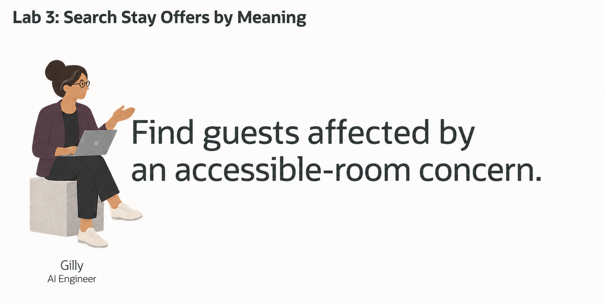
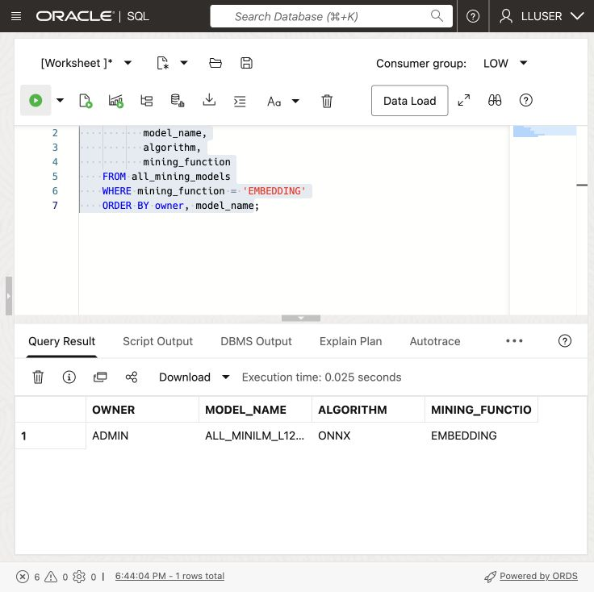
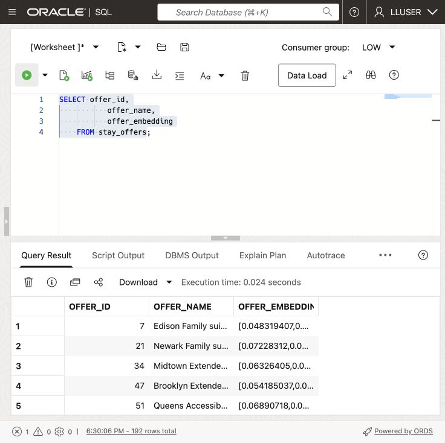
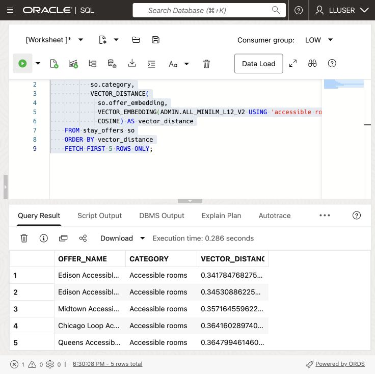
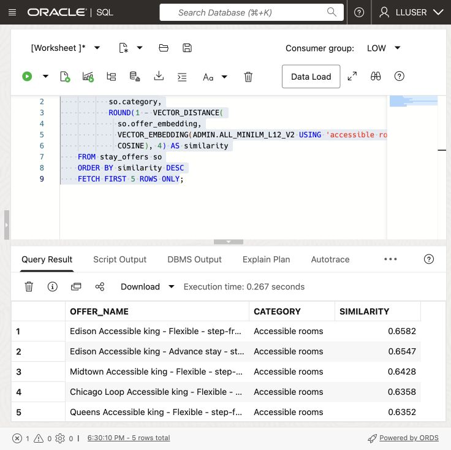
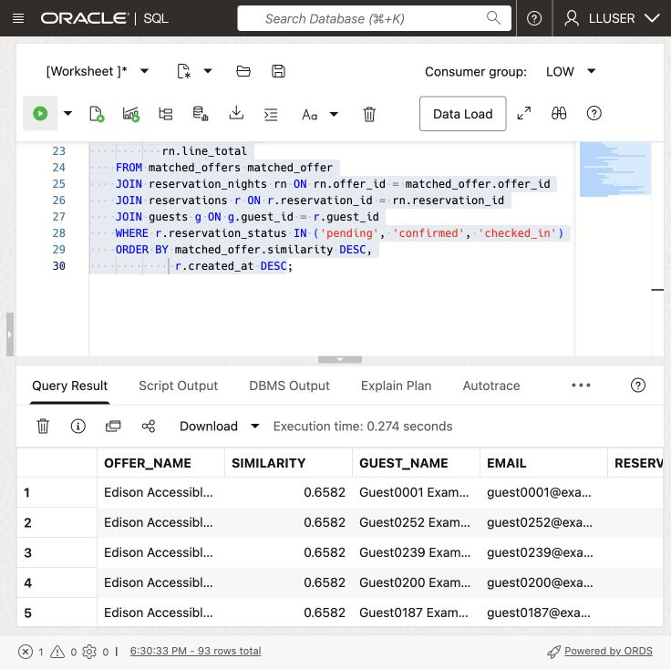

# Review a Semantic Guest Concern Search

## Introduction

Gilly Bourne, Seer Hotels’ AI engineer, is building a guest-concern search. A question such as **“Which guests may be affected by an accessible-room concern?”** must lead to relevant stay offers and the guests who booked them.

Create stay offer vectors, rank matches by meaning, then join the results to reservations and guest contact details.



<details>
<summary><strong>Key terms: embedding, vector, vector distance, and semantic search</strong></summary>

> - An **embedding** represents text as a list of numbers. This lab embeds each stay offer’s name, category and subcategory so the query can rank descriptions with similar meanings.
>
> - An **ONNX embedding model** is a portable machine-learning model saved in the Open Neural Network Exchange (ONNX) format. It turns text into a vector of numbers that captures meaning. Oracle AI Database can load and run this model inside the database, close to the stay offer rows.
>
> - A **vector** is the stored numerical form of an embedding. Oracle Database can store vectors beside the hospitality rows they describe, so the search stays connected to stay offer names, room types, rate plans, and nightly rates.
>
> - **Vector distance** measures how close two vectors are. A smaller distance means the meanings are more similar; a larger distance means they are farther apart. In this lab, distance helps rank which stay offers best match a business user's question.
>
> - **Semantic search** means searching by meaning instead of exact words. A search for "accessible room with step-free access" can find related accessible stay offers even when the stay offer names use different wording.

</details>

### Objectives

- Check the embedding model Gilly needs for semantic search.
- Create a vector from stay offer data inside the database.
- Review a semantic stay offer search for a business question.
- Turn stay offer matches into a guest follow-up list.
- Explain why vector search belongs beside hospitality data and access controls.

Estimated Time: **10 minutes**

> **SQL Worksheet reminder:** See [Getting Started Task 2: Open SQL Worksheet](?lab=getting-started#Task2:OpenSQLWorksheet) for the steps to paste and run SQL.

## Task 1: Check the embedding model

Gilly uses an ONNX embedding model loaded by Jessica to turn stay offer text and search questions into comparable vectors inside the database.

1. Run the following query to see which embedding models are available:

    ```sql
    <copy>
    SELECT owner,
           model_name,
           algorithm,
           mining_function
    FROM all_mining_models
    WHERE mining_function = 'EMBEDDING'
    ORDER BY owner, model_name;
    </copy>
    ```

    **Expected output: Available Embedding Models**

    

    The result should include an embedding model owned by `ADMIN`, such as `ALL_MINILM_L12_V2`. This compact model turns text into 384-number vectors. The `EMBEDDING` value confirms that the model can turn text into vectors for similarity search.

## Task 2: Create a stay offer vector

Each stay offer has a short description, so Gilly creates one vector from its name, category and subcategory.

1. Review the text Gilly will embed:

    ```sql
    <copy>
    SELECT offer_id,
           offer_name,
           category,
           subcategory,
           offer_name || '. Category: ' || category ||
             '. Subcategory: ' || subcategory AS embedding_text
    FROM stay_offers
    FETCH FIRST 5 ROWS ONLY;
    </copy>
    ```

    The combined text gives the model the stay offer name and its business classification. Gilly does not need to embed price, dates, or other values that do not describe what the stay offer is.

2. Add a vector column to `STAY_OFFERS`:

    ```sql
    <copy>
    ALTER TABLE stay_offers ADD (offer_embedding VECTOR(384));
    </copy>
    ```

    The column has 384 dimensions because `ALL_MINILM_L12_V2` produces 384-dimensional vectors.

3. Create the stay offer vectors inside Oracle Database:

    ```sql
    <copy>
    UPDATE stay_offers
    SET offer_embedding = VECTOR_EMBEDDING(
      ADMIN.ALL_MINILM_L12_V2 USING
        offer_name || '. Category: ' || category ||
        '. Subcategory: ' || subcategory AS DATA)
    WHERE offer_embedding IS NULL;

    COMMIT;
    </copy>
    ```

    The model writes each offer’s vector back to its row.

4. Verify the new column and its data:

    ```sql
    <copy>
    SELECT offer_id,
           offer_name,
           offer_embedding
    FROM stay_offers;
    </copy>
    ```

    

    > **Note:** Each offer is short enough for one vector. Long documents, such as property policies, may need separate vectors for sections that answer different questions.

## Task 3: Test the stay offer vector

Search for `accessible room with step-free access` and review how the database ranks the offers by meaning.

1. Run the following query:

    The SQL creates an embedding for the phrase `accessible room with step-free access`, compares it with the vectors in `STAY_OFFERS.OFFER_EMBEDDING`, and returns the cosine distance. A smaller distance means the two vectors are closer in meaning, so the query orders the smallest distance first.

    ```sql
    <copy>
    SELECT so.offer_name,
           so.category,
           VECTOR_DISTANCE(
             so.offer_embedding,
             VECTOR_EMBEDDING(ADMIN.ALL_MINILM_L12_V2 USING 'accessible room with step-free access' AS DATA),
             COSINE) AS vector_distance
    FROM stay_offers so
    ORDER BY vector_distance
    FETCH FIRST 5 ROWS ONLY;
    </copy>
    ```

    

    **Expected output: Accessible Stay Offer Matches**

2. Review the ranked offers. Lower cosine distance means a closer match to the concern.

3. Show the result as a similarity score:

    Display `1 - distance`, rounded to four decimal places, so higher scores mean closer matches.

    ```sql
    <copy>
    SELECT so.offer_name,
           so.category,
           ROUND(1 - VECTOR_DISTANCE(
             so.offer_embedding,
             VECTOR_EMBEDDING(ADMIN.ALL_MINILM_L12_V2 USING 'accessible room with step-free access' AS DATA),
             COSINE), 4) AS similarity
    FROM stay_offers so
    ORDER BY similarity DESC
    FETCH FIRST 5 ROWS ONLY;
    </copy>
    ```

    

## Task 4: Find guests affected by a stay offer concern

Gilly now connects the matched offers to guests. The query includes pending, confirmed, and checked-in reservations and returns contact details for follow-up.

1. Run the following query for the concern `accessible room with step-free access`:

    ```sql
    <copy>
    WITH matched_offers AS (
        SELECT so.offer_id,
               so.offer_name,
               ROUND(1 - VECTOR_DISTANCE(
                 so.offer_embedding,
                 VECTOR_EMBEDDING(
                   ADMIN.ALL_MINILM_L12_V2
                   USING 'accessible room with step-free access' AS DATA
                 ),
                 COSINE), 4) AS similarity
        FROM stay_offers so
        ORDER BY similarity DESC
        FETCH FIRST 5 ROWS ONLY
    )
    SELECT matched_offer.offer_name,
           matched_offer.similarity,
           g.first_name || ' ' || g.last_name AS guest_name,
           g.email,
           r.reservation_id,
           r.reservation_status,
           r.created_at,
           rn.room_nights,
           rn.line_total
    FROM matched_offers matched_offer
    JOIN reservation_nights rn ON rn.offer_id = matched_offer.offer_id
    JOIN reservations r ON r.reservation_id = rn.reservation_id
    JOIN guests g ON g.guest_id = r.guest_id
    WHERE r.reservation_status IN ('pending', 'confirmed', 'checked_in')
    ORDER BY matched_offer.similarity DESC,
             r.created_at DESC;
    </copy>
    ```

    

    The first part ranks stay offers by meaning. The remaining joins use ordinary relational keys to find the matching nightly charges, reservations, and guests.

    **Expected output: Guest Follow-up List**

    Use the similarity score to review each offer match. The list identifies guests to consider for follow-up; it does not confirm an accessibility problem. Check the property, room requirements and reservation details before contacting a guest.

2. Review the business result.

    Gilly creates vectors for stay offers, then uses SQL joins to find reservation and contact details. She does not need a vector for each reservation or guest.

## Conclusion

Gilly has built the search behind the application and connected it to a business action. A plain-language concern can produce ranked stay offers and a guest follow-up list using vectors, relational joins, and SQL in Oracle AI Database. 

## Acknowledgements

* **Author** - Matt Kowalik
* **Contributor** - Kevin Lazarz
* **Last Updated By/Date** - Matt Kowalik, September 2026
