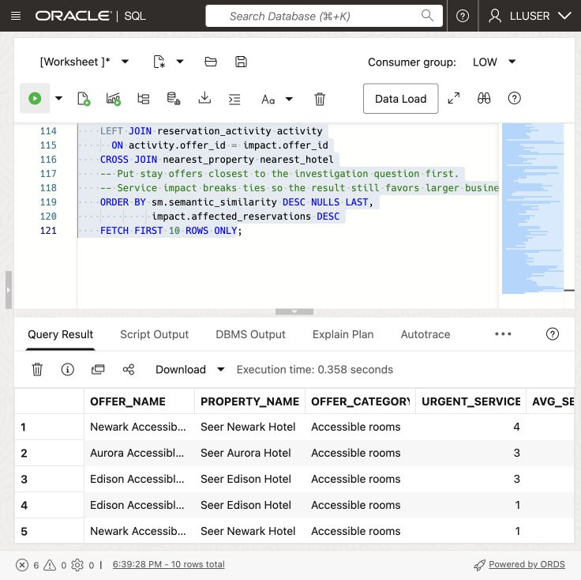
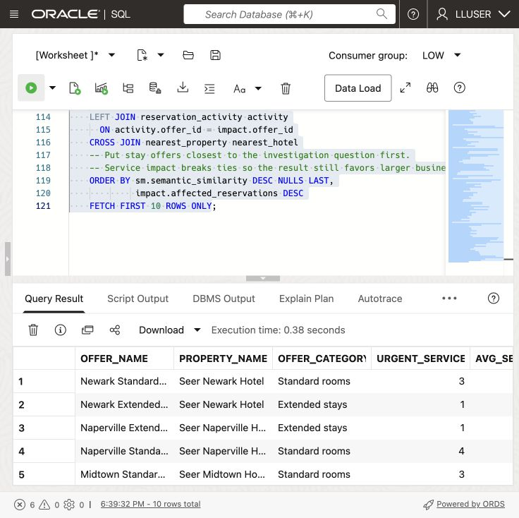
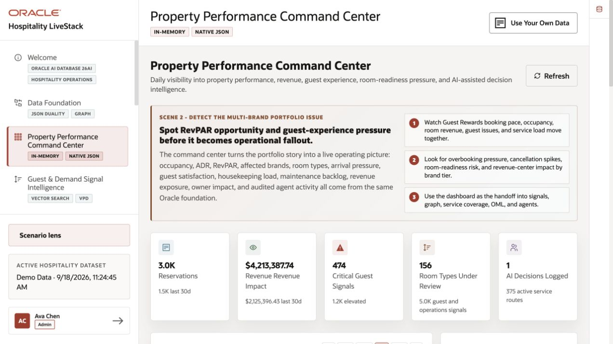
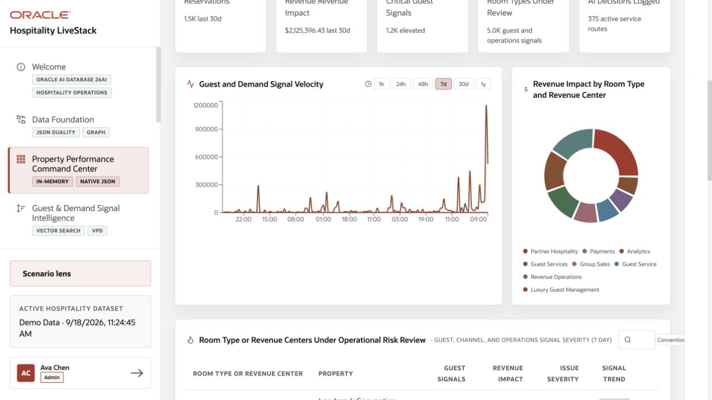

# Build a Converged Dashboard Query

## Introduction

Jessica Chan is the database administrator responsible for keeping Seer Hotels’ hospitality data reliable and useful. Every morning, the guest service operations team asks her a familiar question: **which stay offer needs attention first, and which guests may need assistance or relocation?**

Jessica needs four kinds of data for the Guest Service and Operations Dashboard. Tables hold service alerts and their impact. JSON documents hold reservation activity. Vectors represent stay offer descriptions for searches by meaning. Spatial data records hotel and demand-region locations. Her query must combine all four.

Keeping these data types in separate systems would require Jessica to combine exports and keep them current. Instead, she wants a dashboard answer that the guest service team can check against the source records.

Oracle AI Database can query these data types together. Jessica can join relational rows, JSON documents, vectors, and location data in one SQL statement.

In this lab, you build Jessica’s dashboard query. It combines service alerts, vector search, JSON reservation data, and hotel locations in one result.


### Objectives

- Explain what Oracle AI Database convergence means in a hospitality decision workflow.
- Run one query that combines relational, vector, JSON, and spatial database capabilities.
- Modify the query to investigate a different guest-service question and explain the change in results.

Estimated Time: **10 minutes**

### Hands-on Scenario

| Step                | Hospitality focus                                                                                                  |
| ---------------------| ----------------------------------------------------------------------------------------------------------------|
| Business Problem    | Business users need a quick way to find stay offer service needs, service impact, reservation activity, and service information. |
| Technical Challenge | The answer crosses service alerts, stay offer meaning, reservations, and service geography.                         |
| Persona Focus       | Jessica Chan, the DBA, builds the query that gives business users this dashboard view.                         |
| What You Will Do    | Use a single SQL statement that combines several data types.                                                   |
| Database Capability | Relational SQL, AI Vector Search, JSON Relational Duality, and Oracle Spatial work together.                   |
| Outcome             | The learner can explain convergence through a useful business result rather than a feature list.               |

Persona focus: You are Jessica Chan, the DBA. Your job is to build one shared query that gives business users a connected view of stay offer service needs and operations.

> **SQL Worksheet reminder:** See [Getting Started Task 2: Open SQL Worksheet](?lab=getting-started#Task2:OpenSQLWorksheet) for the steps to paste and run SQL.

## Task 1: Run a converged service investigation

Run the query below to list stay offers with severe service alerts. Use the result to decide which offers need review.

The query combines four data types:

- **Relational:** `SERVICE_ALERTS_V`, stay offer mentions, and hospitality views calculate stay offer service needs and service impact.
- **Vector:** `OFFER_EMBEDDINGS` and `VECTOR_DISTANCE` find stay offers related by meaning to the investigation phrase.
- **JSON:** `RESERVATIONS_DV` is read as a document, and `JSON_TABLE` projects its nested line items into rows so reservation activity can be counted.
- **Spatial:** `SDO_GEOM.SDO_DISTANCE` finds the closest hotel property to the high-demand New York Visitor Region using latitude and longitude information stored as spatial geometries that can be converted to GeoJSON.

    These are four operations in one investigation. Every row combines stay offer service needs with reservation activity, semantic relevance, and service-routing context.

1. Open SQL Worksheet as `LLUSER`. 

2. Run the query (note the comments that help to locate the specific use of different data types):

    ```sql
    <copy>
    -- RELATIONAL DATA: aggregate high-severity records and join them
    -- to shared stay offer and property views.
    WITH offer_service_impact AS (
        SELECT sov.offer_id,
               sov.offer_name,
               hpv.property_name,
               sov.offer_category,
               COUNT(DISTINCT sa.alert_id) AS urgent_service_alerts,
               ROUND(AVG(sa.severity_score), 1) AS avg_severity,
               SUM(sa.affected_reservations) AS affected_reservations,
               SUM(sa.service_cases_opened) AS cases_opened
        FROM service_alerts_v sa
        JOIN post_offer_mentions pom
          ON pom.post_id = sa.alert_id
        JOIN stay_offers_v sov
          ON sov.offer_id = pom.offer_id
        JOIN hotel_properties_v hpv
          ON hpv.property_id = sov.property_id
        WHERE sa.severity_score >= 80
        GROUP BY sov.offer_id,
                 sov.offer_name,
                 hpv.property_name,
                 sov.offer_category
    ),
    -- VECTOR DATA: compare the investigation question with stored
    -- stay offer embeddings to rank stay offers by meaning, not exact wording.
    semantic_match AS (
        SELECT so.offer_id,
               ROUND(1 - VECTOR_DISTANCE(
               oe.embedding,
                   VECTOR_EMBEDDING(
                       ADMIN.ALL_MINILM_L12_V2
                       USING 'room accessibility and service disruption requiring guest assistance' AS DATA
                   ),
                   COSINE
               ), 4) AS semantic_similarity
        FROM offer_embeddings oe
        JOIN stay_offers so
          ON so.offer_id = oe.offer_id
    ),
    -- JSON DATA: read reservation documents from the duality view and
    -- project nested line items into relational rows with JSON_TABLE.
    reservation_activity AS (
        SELECT jt.offer_id,
               COUNT(DISTINCT jt.reservation_id) AS active_reservations,
               SUM(jt.room_nights) AS active_room_nights
        FROM reservations_dv rd
        CROSS APPLY JSON_TABLE(
            rd.data,
            '$'
            COLUMNS (
                reservation_id NUMBER PATH '$._id',
                reservation_status VARCHAR2(30) PATH '$.status',
                NESTED PATH '$.items[*]' COLUMNS (
                    offer_id NUMBER PATH '$.offerId',
                    room_nights NUMBER PATH '$.roomNights'
                )
            )
        ) jt
        WHERE jt.reservation_status IN ('pending', 'confirmed')
        GROUP BY jt.offer_id
    ),
    -- SPATIAL DATA: calculate the distance from each hotel-property point
    -- to the New York Visitor Region demand-region boundary.
    nearest_property AS (
        SELECT routing_property.property_name,
               routing_property.city,
               routing_property.state_province,
               dr.region_name,
               dr.demand_index,
               ROUND(
                   SDO_GEOM.SDO_DISTANCE(
                       hp.location,
                       dr.boundary,
                       0.005,
                       'unit=KM'
                   ),
                   2
               ) AS distance_to_demand_region_km
        FROM hotel_properties_v routing_property
        JOIN hotel_properties hp
          ON hp.property_id = routing_property.property_id
        CROSS JOIN demand_regions dr
        WHERE dr.region_name = 'New York Visitor Region'
          AND hp.is_active = 1
        ORDER BY SDO_GEOM.SDO_DISTANCE(
                     hp.location,
                     dr.boundary,
                     0.005,
                     'unit=KM'
                 )
        FETCH FIRST 1 ROW ONLY
    )
    -- CONVERGED RESULT: join the outputs of the four data-model operations
    -- into one dashboard investigation result.
    SELECT impact.offer_name,
           impact.property_name,
           impact.offer_category,
           impact.urgent_service_alerts,
           impact.avg_severity,
           impact.affected_reservations,
           impact.cases_opened,
           sm.semantic_similarity,
           NVL(activity.active_reservations, 0) AS active_reservations,
           NVL(activity.active_room_nights, 0) AS active_room_nights,
           nearest_hotel.property_name AS nearest_property,
           nearest_hotel.city || ', ' || nearest_hotel.state_province AS property_location,
           nearest_hotel.region_name AS demand_region,
           nearest_hotel.demand_index,
           nearest_hotel.distance_to_demand_region_km
    FROM offer_service_impact impact
    LEFT JOIN semantic_match sm
      ON sm.offer_id = impact.offer_id
    LEFT JOIN reservation_activity activity
      ON activity.offer_id = impact.offer_id
    CROSS JOIN nearest_property nearest_hotel
    -- Put stay offers closest to the investigation question first.
    -- Service impact breaks ties so the result still favors larger business impact.
    ORDER BY sm.semantic_similarity DESC NULLS LAST,
             impact.affected_reservations DESC
    FETCH FIRST 10 ROWS ONLY;
    </copy>
    ```

    

    *Scroll the result grid to inspect additional rows and columns.*

3. Review the result as the stay offer-level data behind Jessica's dashboard. Each row combines service-alert severity, semantic match, reservation activity, and hotel location. This gives the dashboard a ranked stay offer table and the details a business user needs when deciding what to review.

    

    Each row should include all four types of data. Compare the semantic rank, service impact, reservation activity, and nearby property. A missing embedding or an empty regional property set can leave the result incomplete or empty.

Use the first row to explain why an offer needs attention. Check its alert severity, reservation counts, match to the search phrase, and nearby hotel. These values help the service team decide where to start.

Jessica can use this SQL result for the dashboard table and detail view. Other dashboard components, such as summary cards, can query the same database.

> **Interpretation:** The nearest-property result is regional context shared by every row. It is not a date-specific availability check or an automatic relocation. Affected-reservation counts are alert totals and may include a reservation in more than one alert; do not read their sum as unique guests.

## Task 2: Change the investigation question

Jessica meets with a guest experience analyst to review the results at the data level before she builds the dashboard. They start with stay offers related to **room accessibility and service disruption requiring guest assistance**. Change the embedded investigation phrase to:


```text
guest arrival workload and room availability
```


Run the query again and compare the top rows.



1. Which stay offers moved into or out of the top ten?
2. Which stay offers still have high relational service impact but a lower semantic similarity to the new question?
3. Does the reservation activity make you more or less concerned about the operational impact?

The query sorts by similarity first, so changing the question changes the review order. Service impact breaks ties. Jessica can ask a different question using the same query and stay offer data.


## Next Steps

Next, use JSON Relational Duality to expose the same reservation data as JSON for an application while keeping SQL access for the database team.

## Acknowledgements

* **Author** - Matt Kowalik
* **Contributor** - Kevin Lazarz
* **Last Updated By/Date** - Matt Kowalik, September 2026

## Application example

The running Hospitality LiveStack application presents portfolio indicators and charts. This application uses a separate demo dataset; these values are not the expected output of the workshop SQL query.




