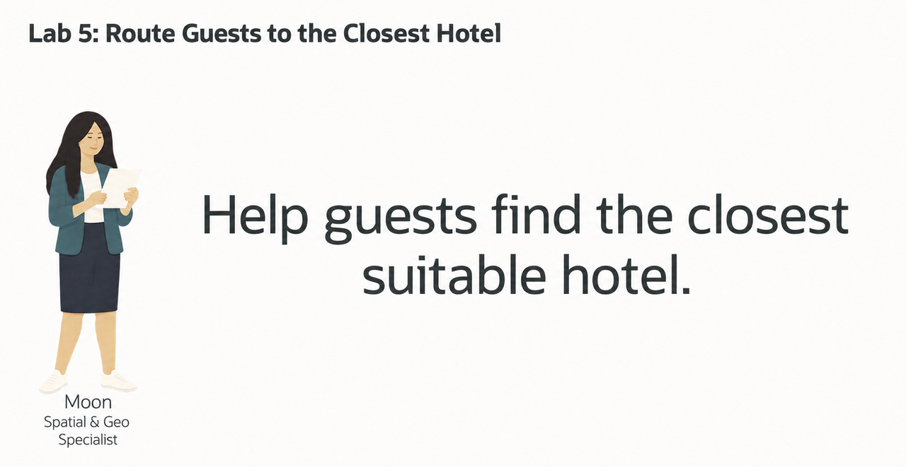
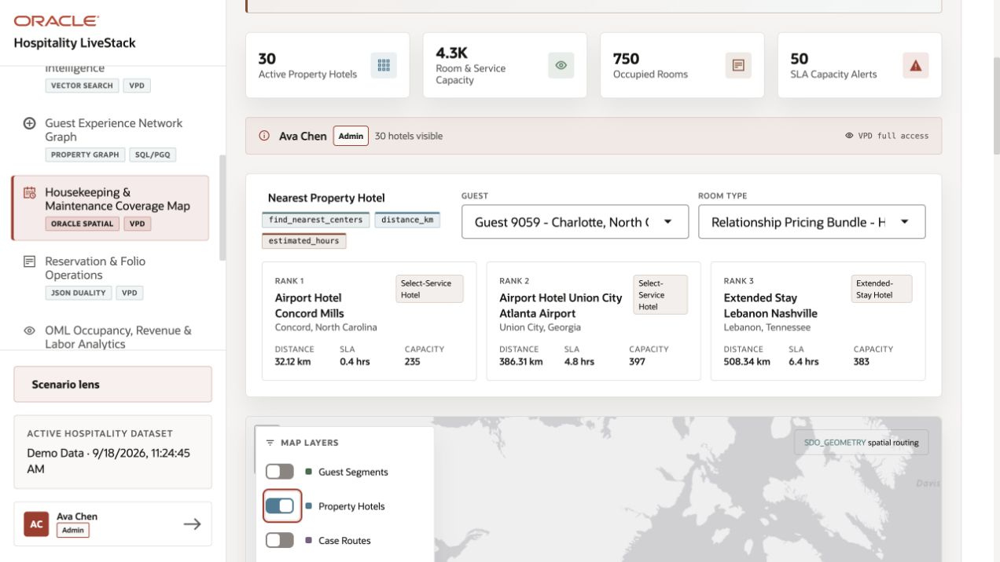
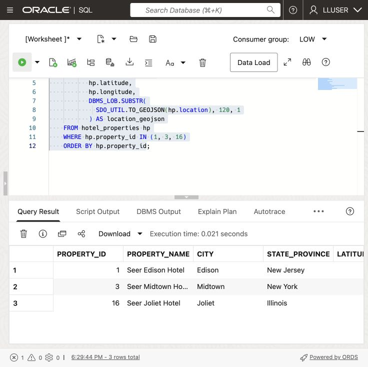
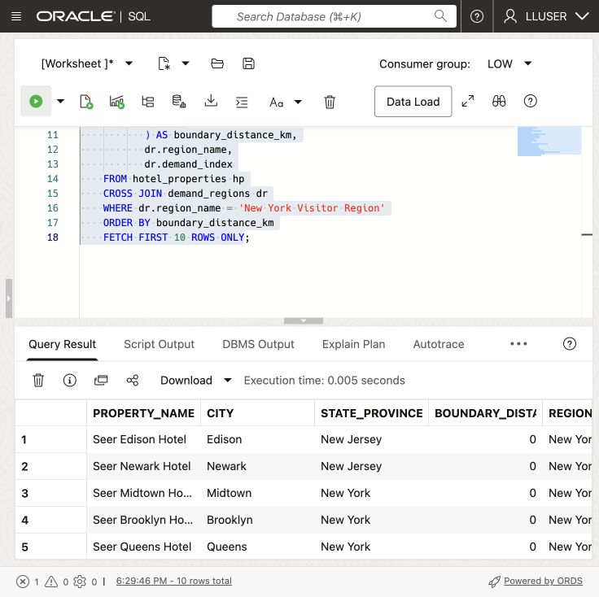
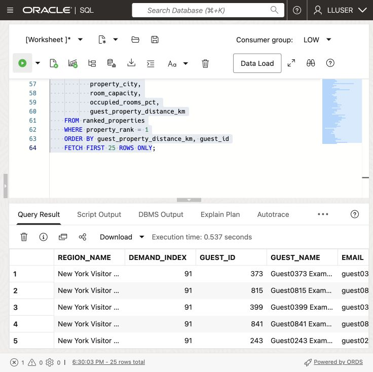

# Route Guests to the Closest Hotel Property



## Introduction

Moon Kai is Seer Hotels’ spatial specialist. Operations teams ask Moon for help when location affects a service decision: which property is closest to a region with growing demand, and which guests should it handle?

Oracle AI Database stores hotel and guest locations as map points. It stores demand regions as map areas, each with a demand score.

Moon wants a query that a service team can use in a dashboard and map:

> Guests in a high-demand region need help finding another hotel. **Which guests are in that region, and which property is closest to each one?**

In this lab, you follow Moon's approach. You start with a single point, measure distance to a region, find guests inside that region, and finish with a guest routing result that combines location and service data.


<details>
<summary><strong>Key terms: point, polygon, distance, spatial relationship, and GeoJSON</strong></summary>

> - A **point** is one location, represented by longitude and latitude. In this lab, a hotel property is stored as an `SDO_GEOMETRY` point.
>
> - A **polygon** is an area made from connected points. Demand regions are stored as polygons.
>
> - **Distance** measures how far two spatial objects are from each other. Here, it shows how far a hotel property is from a demand-region boundary. A distance of zero means the property is inside or touching the region.
>
> - A **spatial relationship** describes how two shapes relate to each other. `SDO_GEOM.RELATE` can test whether a guest point is inside or touches a demand region.
>
> - **GeoJSON** is a JSON format for map locations and shapes. `SDO_UTIL.TO_GEOJSON` lets an application display the same database location on a map.
>
</details>

Oracle Spatial can support a guest-relocation map using the distances calculated in this lab.

The local Hospitality LiveStack demo illustrates a related application story using a separate dataset. Its identifiers and results differ from the Seer Hotels SQL exercises below.




### Objectives

- Identify spatial points and polygons in the hospitality data.
- Convert a database point to GeoJSON for an application map.
- Measure which hotel properties are closest to a demand region.
- Find guests inside a demand region.
- Match each guest to the closest active hotel property.

Estimated Time: **10 minutes**

### Hands-on Scenario

| Step | Hospitality focus |
| --- | --- |
| Business Problem | Guest-service staff need nearby hotels to consider when arranging guest relocations. |
| Technical Challenge | Moon needs to compare guest points with a region, then find the closest property for each guest. |
| Persona Focus | You review Moon's spatial approach and interpret the result for an operations user. |
| What You Will See | Oracle Spatial turns location data into guest routing results with SQL. |
| Database Capability | `SDO_GEOMETRY`, `SDO_GEOM.SDO_DISTANCE`, `SDO_GEOM.RELATE`, and GeoJSON conversion support the analysis. |
| Outcome | An operations user can see which guests need service in a region and which property is closest to each one. |

> **SQL Worksheet reminder:** See [Getting Started Task 2: Open SQL Worksheet](?lab=getting-started#Task2:OpenSQLWorksheet) for the steps to paste and run SQL.

## Task 1: Look at the locations as points

Moon starts with the simplest spatial question: **where are the hotel properties?** The database stores each property as an `SDO_GEOMETRY` point, while the application can use the same point as GeoJSON.

An `SDO_GEOMETRY` point is Oracle Spatial's structured representation of one location. An illustrative hotel point could use a point type, the WGS84 coordinate system, and the coordinate pair longitude `-74.4121` and latitude `40.5187`. This example explains the format; check the actual coordinates supplied by the hospitality loader. Because Oracle stores the location as geometry, Spatial functions can calculate distance and test spatial relationships instead of treating the coordinates as two unrelated numbers.

`SDO_UTIL.TO_GEOJSON` converts that geometry into a standard JSON map object such as `{ "type": "Point", "coordinates": [-74.4121, 40.5187] }`. The application can send this object to a map without maintaining a second location format or a separate conversion service. Oracle uses the same stored geometry for SQL analysis and application display.

The same stored location supports distance calculations, relational joins, and JSON map output.

1. Run this query:

    ```sql
    <copy>
    SELECT hp.property_id,
           hp.property_name,
           hp.city,
           hp.state_province,
           hp.latitude,
           hp.longitude,
           DBMS_LOB.SUBSTR(
             SDO_UTIL.TO_GEOJSON(hp.location), 120, 1
           ) AS location_geojson
    FROM hotel_properties hp
    WHERE hp.property_id IN (1, 3, 16)
    ORDER BY hp.property_id;
    </copy>
    ```

    

    *Scroll the result grid to inspect additional rows and columns.*

    `LOCATION` is the database point. `LATITUDE` and `LONGITUDE` make the value easy to read, and `LOCATION_GEOJSON` gives an application a map-ready representation of the same point. GeoJSON lists longitude first and latitude second. `SDO_UTIL.TO_GEOJSON` returns a CLOB, so `DBMS_LOB.SUBSTR` limits the displayed text to 120 characters; it does not change the stored geometry.

    **Expected output: Hotel Property Points**

    

2. Review the point data.

    Moon has not created a second map database. The point used by the application and the point used by SQL are the same value. The database can calculate with it, and the application can display it.

    Moon keeps each property’s location beside its name, capacity, status, and current load. SQL returns the distance and property details. `SDO_UTIL.TO_GEOJSON` returns the same location for the application map.

## Task 2: Find the closest properties to a demand region

The dataset contract assigns New York Visitor Region a synthetic demand index of `91` for the first routing review. Moon now measures the distance from each hotel-property point to the region boundary.

1. Run the distance query:

    ```sql
    <copy>
    SELECT hp.property_name,
           hp.city,
           hp.state_province,
           ROUND(
             SDO_GEOM.SDO_DISTANCE(
               hp.location,
               dr.boundary,
               0.005,
               'unit=KM'
             ), 2
           ) AS boundary_distance_km,
           dr.region_name,
           dr.demand_index
    FROM hotel_properties hp
    CROSS JOIN demand_regions dr
    WHERE dr.region_name = 'New York Visitor Region'
    ORDER BY boundary_distance_km
    FETCH FIRST 10 ROWS ONLY;
    </copy>
    ```

    

    *Scroll the result grid to inspect additional rows and columns.*

    `SDO_GEOM.SDO_DISTANCE` compares the hotel-property point with the demand-region polygon. The function returns the shortest distance between the two shapes. A value of `0` means the point is inside or touching the region.

    The four arguments in this query have simple roles:

    - `hp.location` is the first geometry: the hotel-property point.
    - `dr.boundary` is the second geometry: the demand-region polygon.
    - `0.005` is the tolerance used when Oracle compares the geometries. It helps Oracle handle small differences in the stored coordinates.
    - `'unit=KM'` tells Oracle to return the distance in kilometers. Change it to `'unit=MILE'` when the application needs miles.

    The `ROUND(..., 2)` around the function result only formats the answer to two decimal places. It does not change the spatial calculation.

    The query also returns `DEMAND_INDEX`, so Moon can read location and demand together. The property with the smallest distance is the first property operations should check for available capacity.

    **Expected output: New York Service Coverage**

    Review the closest property and its distance. Rankings depend on the loaded data.

    

2. Try another region.

    Change the region name to `Chicago Visitor Region`, add a miles calculation, and run the modified query:

    ```sql
    <copy>
    SELECT hp.property_name,
           hp.city,
           hp.state_province,
           ROUND(
             SDO_GEOM.SDO_DISTANCE(
               hp.location,
               dr.boundary,
               0.005,
               'unit=KM'
             ), 2
           ) AS boundary_distance_km,
           ROUND(
             SDO_GEOM.SDO_DISTANCE(
               hp.location,
               dr.boundary,
               0.005,
               'unit=MILE'
             ), 2
           ) AS boundary_distance_miles,
           dr.region_name,
           dr.demand_index
    FROM hotel_properties hp
    CROSS JOIN demand_regions dr
    WHERE dr.region_name = 'Chicago Visitor Region'
    ORDER BY boundary_distance_km
    FETCH FIRST 10 ROWS ONLY;
    </copy>
    ```

    

    *Scroll the result grid to inspect additional rows and columns.*

    

    The `unit` parameter controls the measurement unit. Review whether a property lies inside the Chicago Visitor Region polygon. A point inside or touching the polygon has distance zero. The contract assigns this region a synthetic demand index of 78; property rankings must be checked after loading.

    This is a useful regional result, but distance to the region boundary does not identify the guests who need service. Moon now uses the region polygon to find those guests and then assigns each one to the closest active property.

## Task 3: Route Guests to the closest property

Moon now needs a result that an operations application can use: guests inside New York Visitor Region, their demand region, and the closest active hotel property. The query uses the guest point (**`g.location`**) and demand-region polygon (**`dr.boundary`**) to find the guests first. It then compares each guest point with every active property and keeps the closest one.

1. Run the guest routing query:

    ```sql
    <copy>
    WITH regional_guests AS (
      SELECT dr.region_name,
             dr.demand_index,
             g.guest_id,
             g.first_name || ' ' || g.last_name AS guest_name,
             g.email,
             g.loyalty_tier,
             g.location
      FROM guests g
      CROSS JOIN demand_regions dr
      WHERE dr.region_name = 'New York Visitor Region'
        AND SDO_GEOM.RELATE(
              dr.boundary,
              'ANYINTERACT',
              g.location,
              0.005
            ) = 'TRUE'
    ), ranked_properties AS (
      SELECT rg.region_name,
             rg.demand_index,
             rg.guest_id,
             rg.guest_name,
             rg.email,
             rg.loyalty_tier,
             hp.property_name,
             hp.city AS property_city,
             hp.room_capacity,
             hp.occupied_rooms_pct,
             ROUND(
               SDO_GEOM.SDO_DISTANCE(
                 rg.location,
                 hp.location,
                 0.005,
                 'unit=KM'
               ), 2
             ) AS guest_property_distance_km,
             ROW_NUMBER() OVER (
               PARTITION BY rg.guest_id
               ORDER BY SDO_GEOM.SDO_DISTANCE(
                          rg.location,
                          hp.location,
                          0.005,
                          'unit=KM'
                        )
             ) AS property_rank
      FROM regional_guests rg
      CROSS JOIN hotel_properties hp
      WHERE hp.is_active = 1
    )
    SELECT region_name,
           demand_index,
           guest_id,
           guest_name,
           email,
           loyalty_tier,
           property_name,
           property_city,
           room_capacity,
           occupied_rooms_pct,
           guest_property_distance_km
    FROM ranked_properties
    WHERE property_rank = 1
    ORDER BY guest_property_distance_km, guest_id
    FETCH FIRST 25 ROWS ONLY;
    </copy>
    ```

    

    *Scroll the result grid to inspect additional rows and columns.*

    `SDO_GEOM.RELATE` keeps guests whose point falls inside or touches the New York Visitor Region polygon. `SDO_GEOM.SDO_DISTANCE` then measures the distance from each matching guest to every active property. `ROW_NUMBER` keeps the nearest property for each guest.

2. Review the result as an operations decision.

    Guest `LOCATION` is the requested arrival or relocation point. Each row gives a business user a guest to contact, the closest property, and the information needed to decide where the work should go. The result combines the region's demand score, guest details, property capacity, current load, and spatial distance in one SQL result.

    A dashboard can use this result to show guests in the selected region and the closest hotel to each guest. The service team can review the location and capacity details together before arranging a relocation.

    

3. Change the query to `Chicago Visitor Region`.

    Compare the guests and assigned properties with the New York result. The spatial predicates stay the same; only the region changes. This is the kind of query an operations dashboard can run when a business user selects a different demand region.

    

> **Recommendation boundary:** This query finds the nearest active hotel. It does not reserve a room or prove availability for the requested dates. Check room type, accessibility requirements, dates, and available capacity before confirming a relocation. `ROOM_CAPACITY` and `OCCUPIED_ROOMS_PCT` describe a property snapshot, not date-specific inventory.

## Conclusion: Turn Location into a Service Decision

Moon used points and polygons to find guests in a demand region and rank nearby hotels. The result gives the service team guests to contact and properties to check for suitable rooms.

One SQL query finds guests by location, joins their records to hotel details, and returns distance, capacity, and current load. A dashboard can use these results for both its map and guest list.

## Next Steps

You used Oracle Spatial to turn points and polygons into a routing decision. For a deeper hands-on workshop focused on Oracle Spatial, open the [Oracle Spatial LiveLabs workshop](https://livelabs.oracle.com/ords/r/dbpm/livelabs/view-workshop?clear=RR,180&wid=800).

## Acknowledgements

* **Author** - Matt Kowalik
* **Contributor** - Kevin Lazarz
* **Last Updated By/Date** - Matt Kowalik, September 2026
