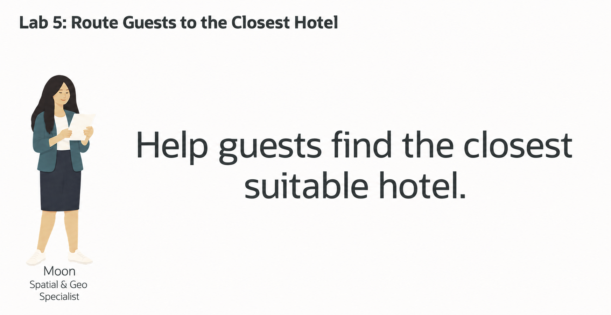
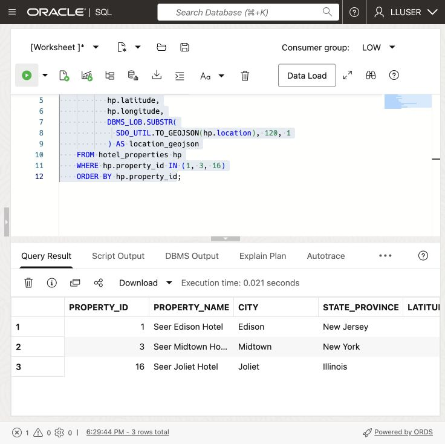
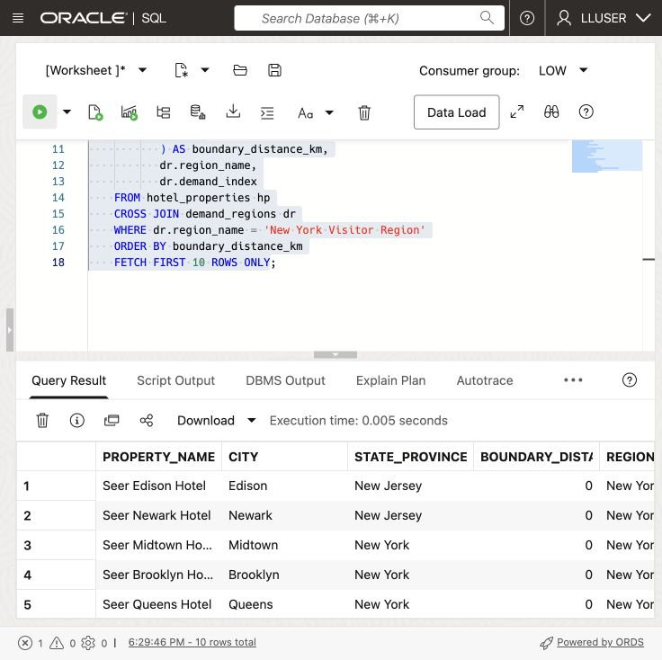
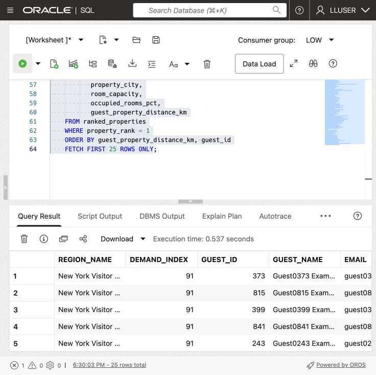
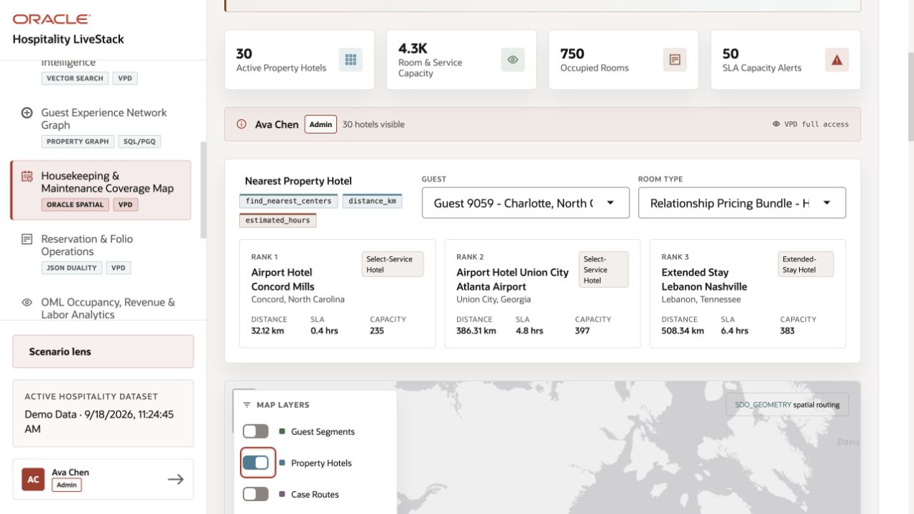

# Route Guests to the Closest Hotel Property



## Introduction

Moon Kai, Seer Hotels’ spatial specialist, helps guest services find nearby hotels: **which guests are in a high-demand region, and which active property is closest to each one?**

Follow Moon from hotel points and demand-region polygons to a guest routing query that returns distances and property details.

<details>
<summary><strong>Key terms: point, polygon, distance, spatial relationship, and GeoJSON</strong></summary>

> - A **point** is one location, represented by longitude and latitude. In this lab, a hotel property is stored as an `SDO_GEOMETRY` point.
>
> - A **polygon** is an area made from connected points. Demand regions are stored as polygons.
>
> - **Distance** measures how far two spatial objects are from each other. Here, it shows how far a hotel property is from a demand-region boundary. A distance of zero means the property is inside or touching the region.
>
> - A **spatial relationship** describes how two shapes relate to each other. `SDO_GEOM.RELATE` can test whether a guest point is inside or touches a demand region.
>
> - **GeoJSON** is a JSON format for map locations and shapes. `SDO_UTIL.TO_GEOJSON` lets an application display the same database location on a map.
>
</details>

### Objectives

- Identify spatial points and polygons in the hospitality data.
- Convert a database point to GeoJSON for an application map.
- Measure which hotel properties are closest to a demand region.
- Find guests inside a demand region.
- Match each guest to the closest active hotel property.

Estimated Time: **10 minutes**

> **SQL Worksheet reminder:** See [Getting Started Task 2: Open SQL Worksheet](?lab=getting-started#Task2:OpenSQLWorksheet) for the steps to paste and run SQL.

## Task 1: Look at the locations as points

Moon starts with the simplest spatial question: **where are the hotel properties?** The database stores each property as an `SDO_GEOMETRY` point, while the application can use the same point as GeoJSON.

`SDO_GEOMETRY` stores a location for spatial calculations. `SDO_UTIL.TO_GEOJSON` converts it to a map object such as `{ "type": "Point", "coordinates": [-74.4121, 40.5187] }`; your loaded coordinates may differ.

1. Run this query:

    ```sql
    <copy>
    SELECT hp.property_id,
           hp.property_name,
           hp.city,
           hp.state_province,
           hp.latitude,
           hp.longitude,
           DBMS_LOB.SUBSTR(
             SDO_UTIL.TO_GEOJSON(hp.location), 120, 1
           ) AS location_geojson
    FROM hotel_properties hp
    WHERE hp.property_id IN (1, 3, 16)
    ORDER BY hp.property_id;
    </copy>
    ```

    

    `LOCATION` is the database point. `LATITUDE` and `LONGITUDE` make the value easy to read, and `LOCATION_GEOJSON` gives an application a map-ready representation of the same point. GeoJSON lists longitude first and latitude second. `SDO_UTIL.TO_GEOJSON` returns a CLOB, so `DBMS_LOB.SUBSTR` limits the displayed text to 120 characters; it does not change the stored geometry.

    **Expected output: Hotel Property Points**

2. Review the point data.

    Compare each property’s location with its name, capacity, status, and current load.

## Task 2: Find the closest properties to a demand region

New York Visitor Region has a sample demand index of `91`. Measure the distance between each hotel point and the region polygon.

1. Run the distance query:

    ```sql
    <copy>
    SELECT hp.property_name,
           hp.city,
           hp.state_province,
           ROUND(
             SDO_GEOM.SDO_DISTANCE(
               hp.location,
               dr.boundary,
               0.005,
               'unit=KM'
             ), 2
           ) AS boundary_distance_km,
           dr.region_name,
           dr.demand_index
    FROM hotel_properties hp
    CROSS JOIN demand_regions dr
    WHERE dr.region_name = 'New York Visitor Region'
    ORDER BY boundary_distance_km
    FETCH FIRST 10 ROWS ONLY;
    </copy>
    ```

    

    `SDO_GEOM.SDO_DISTANCE` compares the hotel-property point with the demand-region polygon. The function returns the shortest distance between the two shapes. A value of `0` means the point is inside or touching the region.

    The four arguments in this query have simple roles:

    - `hp.location` is the first geometry: the hotel-property point.
    - `dr.boundary` is the second geometry: the demand-region polygon.
    - `0.005` is the tolerance used when Oracle compares the geometries. It helps Oracle handle small differences in the stored coordinates.
    - `'unit=KM'` tells Oracle to return the distance in kilometers. Change it to `'unit=MILE'` when the application needs miles.

    The `ROUND(..., 2)` around the function result only formats the answer to two decimal places. It does not change the spatial calculation.

    Review the nearest properties alongside `DEMAND_INDEX` to decide where to check capacity first.

    **Expected output: New York Service Coverage**

    Review the closest property and its distance. Rankings depend on the loaded data.

2. Try another region.

    Change the region name to `Chicago Visitor Region`, add a miles calculation, and run the modified query:

    ```sql
    <copy>
    SELECT hp.property_name,
           hp.city,
           hp.state_province,
           ROUND(
             SDO_GEOM.SDO_DISTANCE(
               hp.location,
               dr.boundary,
               0.005,
               'unit=KM'
             ), 2
           ) AS boundary_distance_km,
           ROUND(
             SDO_GEOM.SDO_DISTANCE(
               hp.location,
               dr.boundary,
               0.005,
               'unit=MILE'
             ), 2
           ) AS boundary_distance_miles,
           dr.region_name,
           dr.demand_index
    FROM hotel_properties hp
    CROSS JOIN demand_regions dr
    WHERE dr.region_name = 'Chicago Visitor Region'
    ORDER BY boundary_distance_km
    FETCH FIRST 10 ROWS ONLY;
    </copy>
    ```

    

    Compare the kilometer and mile values. A property inside or touching Chicago Visitor Region has distance zero; the region’s sample demand index is `78`.

    Next, find guests within the region and calculate the nearest hotel for each guest.

## Task 3: Route Guests to the closest property

Moon uses guest points (`g.location`) and the region polygon (`dr.boundary`) to select guests, then finds the nearest active hotel for each one.

1. Run the guest routing query:

    ```sql
    <copy>
    WITH regional_guests AS (
      SELECT dr.region_name,
             dr.demand_index,
             g.guest_id,
             g.first_name || ' ' || g.last_name AS guest_name,
             g.email,
             g.loyalty_tier,
             g.location
      FROM guests g
      CROSS JOIN demand_regions dr
      WHERE dr.region_name = 'New York Visitor Region'
        AND SDO_GEOM.RELATE(
              dr.boundary,
              'ANYINTERACT',
              g.location,
              0.005
            ) = 'TRUE'
    ), ranked_properties AS (
      SELECT rg.region_name,
             rg.demand_index,
             rg.guest_id,
             rg.guest_name,
             rg.email,
             rg.loyalty_tier,
             hp.property_name,
             hp.city AS property_city,
             hp.room_capacity,
             hp.occupied_rooms_pct,
             ROUND(
               SDO_GEOM.SDO_DISTANCE(
                 rg.location,
                 hp.location,
                 0.005,
                 'unit=KM'
               ), 2
             ) AS guest_property_distance_km,
             ROW_NUMBER() OVER (
               PARTITION BY rg.guest_id
               ORDER BY SDO_GEOM.SDO_DISTANCE(
                          rg.location,
                          hp.location,
                          0.005,
                          'unit=KM'
                        )
             ) AS property_rank
      FROM regional_guests rg
      CROSS JOIN hotel_properties hp
      WHERE hp.is_active = 1
    )
    SELECT region_name,
           demand_index,
           guest_id,
           guest_name,
           email,
           loyalty_tier,
           property_name,
           property_city,
           room_capacity,
           occupied_rooms_pct,
           guest_property_distance_km
    FROM ranked_properties
    WHERE property_rank = 1
    ORDER BY guest_property_distance_km, guest_id
    FETCH FIRST 25 ROWS ONLY;
    </copy>
    ```

    

    `SDO_GEOM.RELATE` keeps guests whose point falls inside or touches the New York Visitor Region polygon. `SDO_GEOM.SDO_DISTANCE` then measures the distance from each matching guest to every active property. `ROW_NUMBER` keeps the nearest property for each guest.

2. Review the result as an operations decision.

    Guest `LOCATION` is the requested arrival or relocation point. Review each guest’s nearest property, distance, capacity, and current load before arranging assistance.

3. Change the query to `Chicago Visitor Region`.

    Compare the guests and assigned properties with the New York result. Only the region changes; the spatial predicates stay the same.

> **Recommendation boundary:** This query finds the nearest active hotel. It does not reserve a room or prove availability for the requested dates. Check room type, accessibility requirements, dates, and available capacity before confirming a relocation. `ROOM_CAPACITY` and `OCCUPIED_ROOMS_PCT` describe a property snapshot, not date-specific inventory.

## Conclusion: Turn Location into a Service Decision

Moon used points and polygons to find guests in a demand region and rank nearby hotels. The result gives the service team guests to contact and properties to check for suitable rooms.

## Next Steps

Explore further in the [Oracle Spatial LiveLabs workshop](https://livelabs.oracle.com/ords/r/dbpm/livelabs/view-workshop?clear=RR,180&wid=800).

## Application example

Explore the [LiveStack Demo Hospitality](https://livelabs.oracle.com/ords/r/dbpm/livelabs/view-workshop?wid=4525).



*LiveStack Demo Hospitality: Housekeeping & Maintenance Coverage Map*

## Acknowledgements

* **Author** - Matt Kowalik
* **Contributor** - Kevin Lazarz
* **Last Updated By/Date** - Matt Kowalik, September 2026
