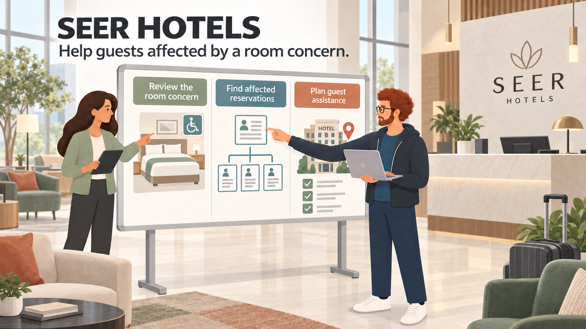
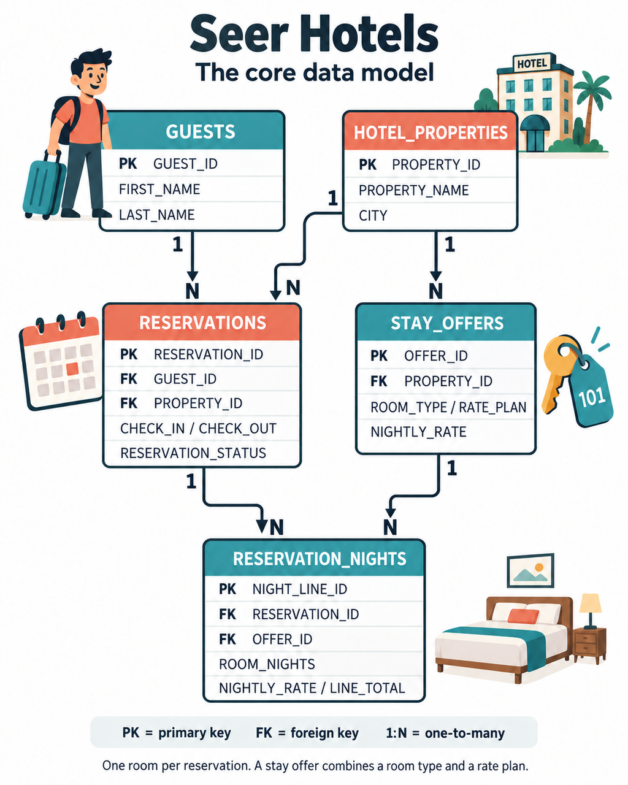
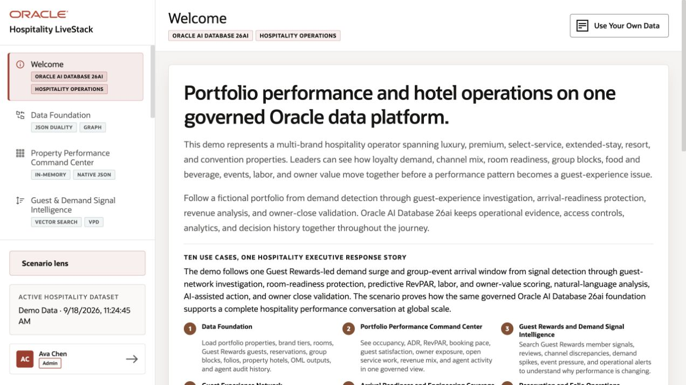

# Build Connected Hospitality Solutions with Oracle AI Database

## Introduction

Jessica Chan, the DBA at Seer Hotels, starts the morning with a question from guest services. A hotel has reported an accessible-room availability concern. Which guests have booked the affected stay offers, and what should the team check before arranging assistance?

Thomas needs reservation details as JSON for the guest application. Gilly will find related stay offers, and Moon will identify nearby hotels for the service team to consider. Bob will investigate suspicious booking connections, Otto will build a demand watchlist, and Nina will ask questions about the same hospitality data.

Jessica brings the team together around the records already held in Oracle AI Database. Each lab follows one part of their work. Before arranging a relocation, the service team still needs to check room availability, accessibility requirements, and stay dates.

The requests look different, but they share one problem. The data is already in Oracle AI Database, and each team wants to use it in a different way:

- Thomas needs guest reservations as JSON for a web and mobile application.
- Gilly needs semantic search that can find stay offers by meaning, as well as by matching words.
- Bob needs to follow relationships between reservations and other entities to investigate booking abuse.
- Moon needs to calculate distances between guests, hotel properties, and demand regions.
- Otto needs to train and score a stay offer demand model.
- Nina needs to ask hospitality questions in plain language and turn the answers into a useful review.

### Seer Hotels data model

Seer Hotels is a fictional hotel group. This diagram shows how guests, hotels, room offers, reservations, and nightly charges connect.

*One room per reservation. A stay offer combines a room type and a rate plan. Nightly-charge lines record room nights and rates.* [Open the full-size diagram](images/seer-hotels-erd.png).

Jessica helps each team use the same hospitality records. Oracle AI Database stores the relational tables and lets the teams work with them through JSON, vectors, graphs, spatial queries, machine learning, and AI services. Each team keeps the database access controls that apply to its work.

Each lab follows one team member as they solve a hospitality problem. You will run the queries, inspect the results, and see how the database supports each task.

### What the team builds

| Team member                   | Requirement                                                     | What you will see                                                                                                                          |
| -------------------------------| -----------------------------------------------------------------| --------------------------------------------------------------------------------------------------------------------------------------------|
| Jessica, DBA                  | Build the query behind a guest service and operations dashboard.         | One SQL result combines relational service-alert data, semantic stay offer matching, JSON reservation data, and location data.                         |
| Thomas, application developer | Give the application flexible reservation documents.            | JSON columns, JSON collections, and JSON Relational Duality Views provide different ways to serve application data.                        |
| Gilly, AI engineer            | Find stay offers related to a guest-service question.                       | Jessica loads an ONNX embedding model into the database, and Gilly creates vectors where the stay offer data already lives.                   |
| Bob, graph specialist         | Find connected reservations and entities in a booking abuse investigation.  | A property graph uses the existing relational data to show paths that become difficult to manage with repeated SQL joins.                  |
| Moon, spatial expert          | Route work using hotel-property and region locations.           | The database calculates distance from geographic data that the application can also display.                                               |
| Otto, data scientist          | Identify stay offers that may face a demand surge.                 | Oracle Machine Learning trains and scores a model inside the database, close to the stay offer and activity data.                             |
| Nina, guest experience analyst            | Ask hospitality questions without writing every query from scratch. | Select AI generates SQL that Nina can inspect, run, and refine. Select AI Agent adds a restricted SQL tool and records the agent activity. |

Jessica can meet new requirements without moving the hospitality records to another database. Those records can support:

- An application payload.
- A vector search.
- A graph investigation.
- A spatial calculation.
- A model score.
- A natural-language question.

<strong>Learn more: What does "converged database" mean?</strong>

> A **converged database** handles several data types and kinds of work in one database. Here, teams use relational rows, JSON documents, vectors, graphs, geographic data, machine learning models, and AI-assisted SQL.
>
> Teams use the form their application needs and keep the records and access controls together. They can query these data types without maintaining a separate store for each one.

### Objectives

- Follow Jessica and her team as they solve different hospitality application and analysis requirements.
- Use relational SQL, JSON, vectors, graphs, spatial data, Oracle Machine Learning, Select AI, and Select AI Agent in practical tasks.
- See how one Oracle AI Database can support different data types without separate copies of the hospitality records.
- Understand how database privileges, restricted AI profiles, approved tools, and execution history keep AI-assisted work visible and controlled.
- Connect the database exercises to the planned Seer Hotels application workflows.

Estimated Workshop Time: **90 minutes**

## Acknowledgements

* **Author** - Matt Kowalik
* **Contributor** - Kevin Lazarz
* **Last Updated By/Date** - Matt Kowalik, September 2026

## Running hospitality demo

This local Hospitality LiveStack demo uses a separate dataset from the Seer Hotels workshop.

