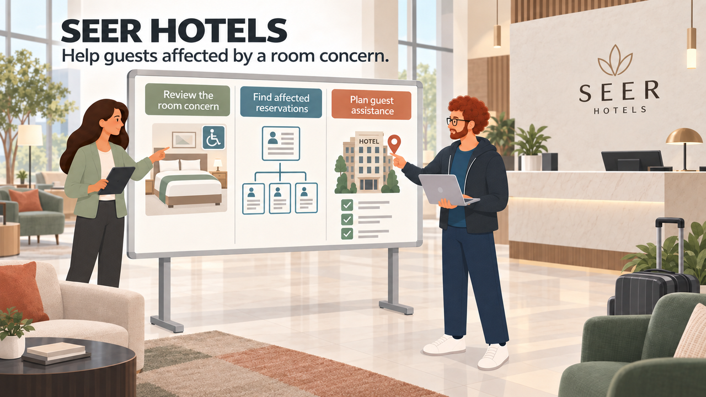
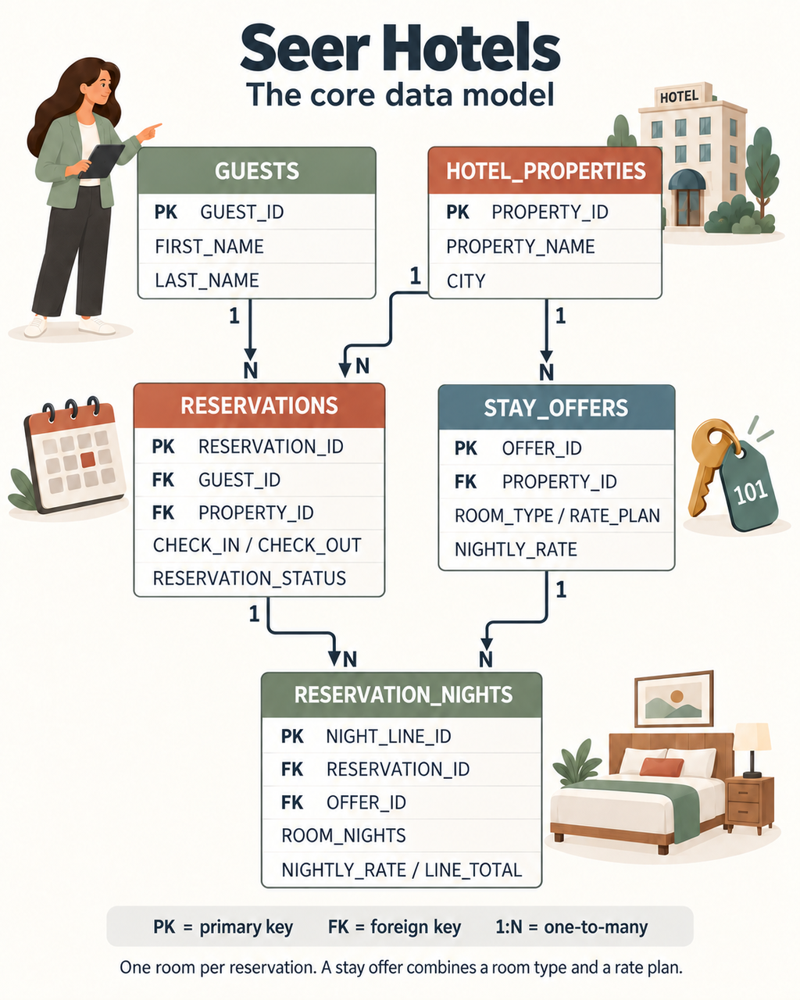
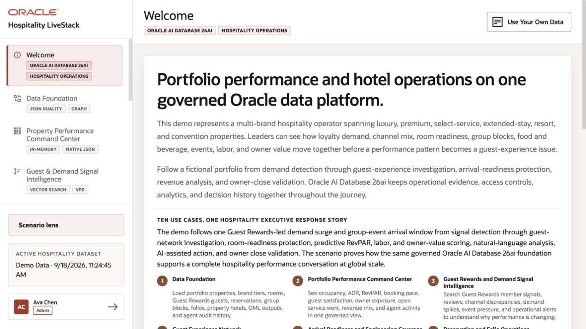

# Build Connected Hospitality Solutions with Oracle AI Database

## Introduction

Jessica Chan, the DBA at Seer Hotels, starts the morning with a question from guest services. A hotel has reported an accessible-room availability concern. Which guests have booked the affected stay offers, and what should the team check before arranging assistance?

Jessica brings the team together around the records in Oracle AI Database. Follow each specialist as they build a dashboard, serve reservation documents, investigate guest concerns, and plan a response. Before arranging a relocation, guest services must still check room availability, accessibility requirements, and stay dates.

### Seer Hotels data model

Seer Hotels is a fictional hotel group. This diagram shows how guests, hotels, room offers, reservations, and nightly charges connect.

*One room per reservation. A stay offer combines a room type and a rate plan. Nightly-charge lines record room nights and rates.* [Open the full-size diagram](images/seer-hotels-erd.png).

### What the team builds

| Team member | Your task |
| --- | --- |
| Jessica, DBA | Combine service alerts, JSON reservations, semantic matches, and locations in one dashboard query. |
| Thomas, application developer | Compare JSON storage options and update reservations through a duality view. |
| Gilly, AI engineer | Search stay offers by meaning and find guests who booked them. |
| Bob, graph specialist | Trace suspicious reservations through shared booking details. |
| Moon, spatial specialist | Find guests in a demand region and their nearest active hotel. |
| Otto, data scientist | Train a demand model and build a stay offer watchlist. |
| Nina, guest experience analyst | Ask questions with Select AI, then build an agent with a SQL tool. |

<strong>Learn more: What does "converged database" mean?</strong>

> A **converged database** handles several data types and kinds of work in one database. Here, teams use relational rows, JSON documents, vectors, graphs, geographic data, machine learning models, and AI-assisted SQL.
>
> Teams use the form their application needs and keep the records and access controls together. They can query these data types without maintaining a separate store for each one.

### Objectives

- Run queries across relational, JSON, vector, graph, and spatial data.
- Train a demand model and use AI to query the hospitality schema.
- Interpret results and apply database access controls to the team's work.

Estimated Workshop Time: **90 minutes**

## Application example

Explore the [LiveStack Demo Hospitality](https://livelabs.oracle.com/ords/r/dbpm/livelabs/view-workshop?wid=4525).

*LiveStack Demo Hospitality: Welcome*

## Acknowledgements

* **Author** - Matt Kowalik
* **Contributor** - Kevin Lazarz
* **Last Updated By/Date** - Matt Kowalik, September 2026
