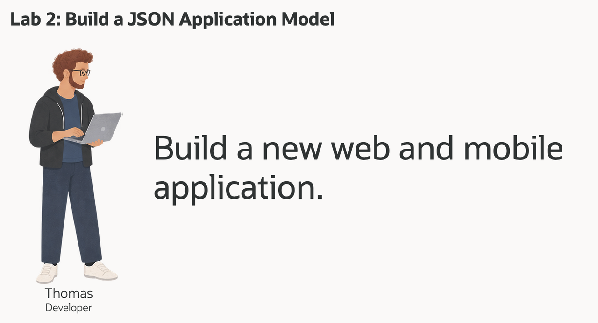
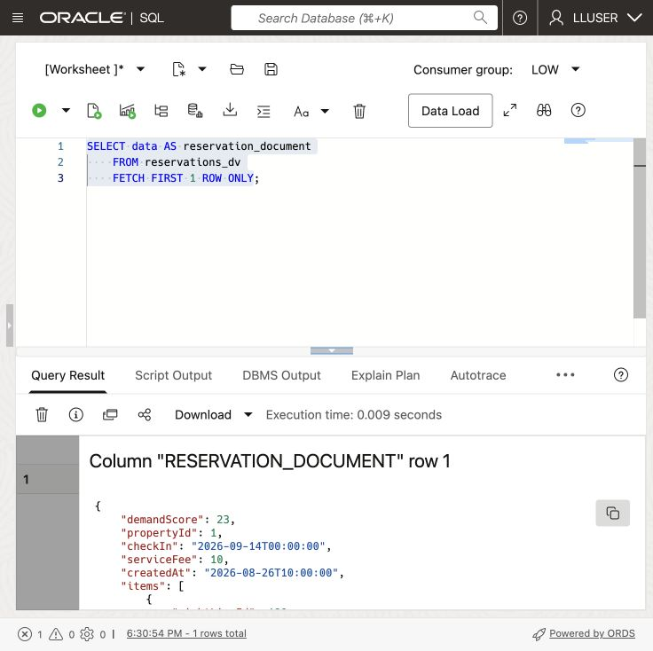
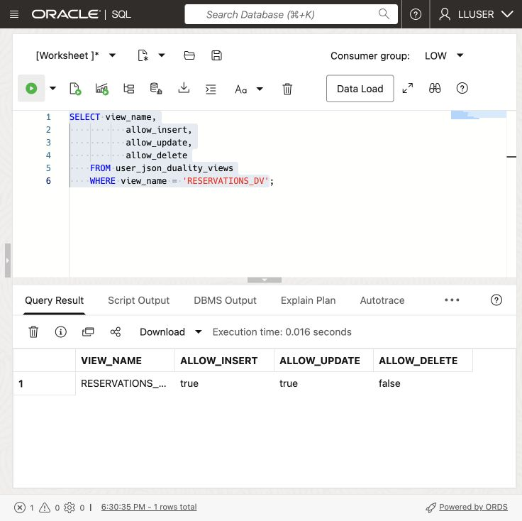
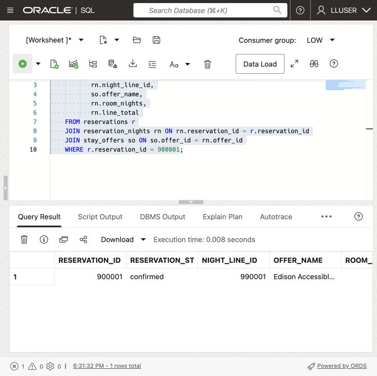
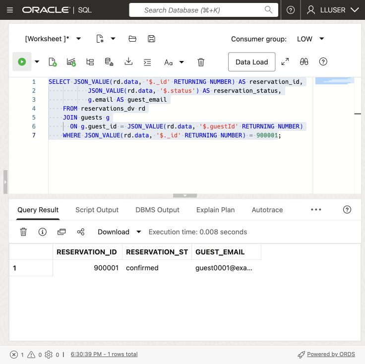
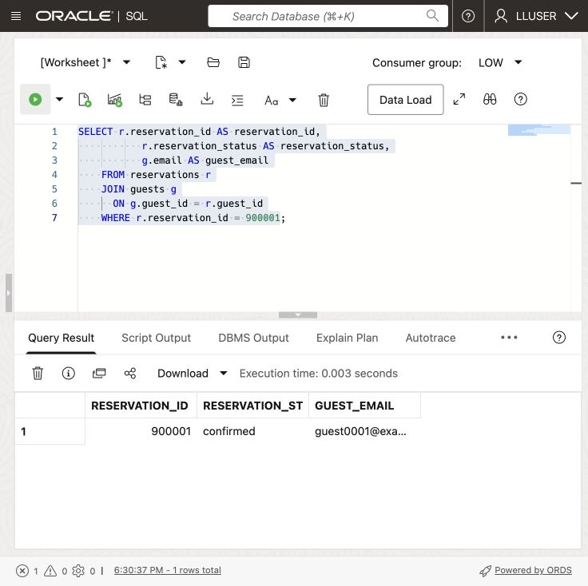
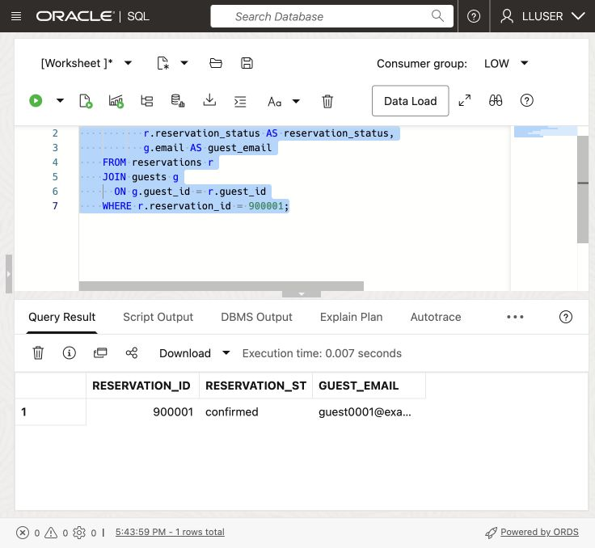

# Build a JSON Application Model

## Introduction

> **Live validation:** The core SQL exercises were run successfully on 21 September 2026. A real result capture is included below. Additional application screen captures are tracked separately in the [image inventory](../validation/screenshots.md).

Thomas Brune develops guest applications at Seer Hotels. His team needs reservation documents that match its web and mobile screens and reduce calls to the database.

Thomas wants each JSON document to group guest and property IDs, stay dates, status, nightly charges, and optional app fields. He needs to change the document as the application grows while keeping relational keys, SQL access, transactions, and database controls.

Thomas asks Jessica, the DBA, to walk through three ways to work with JSON in Oracle AI Database. They start with a JSON value in a relational table, then a collection of JSON documents, and finally a JSON Relational Duality View over existing relational rows. The goal is to choose the right approach for each application feature without creating a second copy of guest data.



<details>
<summary><strong>Key terms: JSON columns, JSON collections, and JSON Relational Duality</strong></summary>

> - A **JSON column** stores a JSON value in a relational table alongside normal typed columns, keys, and constraints. Thomas can use it for optional or changing application attributes without turning every new attribute into a schema change.
>
> - A **JSON collection** is a special table or view that provides a set of JSON documents through one `JSON`-typed `DATA` column. Each document can have a top-level `_id` used to identify it.
>
> - **JSON Relational Duality** lets Oracle Database expose relational data as JSON documents without copying it into a separate document database. The application gets the document shape Thomas wants for its API. The database keeps the relational rows and controls.
>

</details>

Thomas's application needs a payload with the reservation and its nightly-charge lines together, such as this:

```json
{
  "_id": 513063,
  "guestId": 1,
  "propertyId": 1,
  "checkIn": "2026-09-22",
  "checkOut": "2026-09-24",
  "status": "confirmed",
  "items": [
    { "offerId": 1, "roomNights": 2, "nightlyRate": 125.00 }
  ]
}
```

The application uses this document shape, while the database keeps the reservation and nightly-charge lines in relational form. In this lab, you build and read this type of payload in three ways.

### Objectives

- Store flexible application attributes as JSON in a relational table.
- Create and query a JSON Collection Table of reservation documents.
- Read and update relational reservation data through `RESERVATIONS_DV`.
- Compare the three JSON approaches and choose the right one for an application feature.

Estimated Time: **10 minutes**

### Hands-on Scenario

| Step | Hospitality focus |
| --- | --- |
| Business Problem | Thomas's team needs flexible JSON payloads for a new guest web and mobile application. |
| Technical Challenge | The team needs application-friendly documents while the database keeps relational keys, joins, and controls. |
| Persona Focus | Thomas tests JSON storage, collections, and duality with Jessica's database guidance. |
| What You Will See | One Oracle AI Database supports several JSON access patterns over the hospitality data. |
| Database Capability | Native JSON, SQL/JSON functions, and JSON Relational Duality work together. |
| Outcome | Thomas can choose an application shape without creating a second guest-data store. |

Persona focus: You are Thomas, working with Jessica to decide how the new application should store, assemble, and read guest reservation data.

### Thomas's three JSON choices

Thomas does not need one JSON pattern for every feature. A JSON column holds optional application attributes in a relational table. A JSON Collection Table holds documents owned by the application. A duality view assembles a document from existing relational tables. Thomas uses the document shape in the application, while Jessica works with the underlying rows using SQL.

Thomas gets the JSON document his application needs. Jessica keeps SQL access, relational rows, and database controls in the same database.

> **SQL Worksheet reminder:** See [Getting Started Task 2: Open SQL Worksheet](?lab=getting-started#Task2:OpenSQLWorksheet) for the steps to paste and run SQL.

## Task 1: Store flexible application data as JSON

Thomas starts with data that belongs to the application but does not need its own relational columns. The workshop database already contains the reservation rows. He adds a small application-data table with a native `JSON` column for optional screen and guest-experience settings.

1. Create the application-data table and add one sample payload.

    ```sql
    <copy>
    CREATE TABLE thomas_app_data (
        reservation_id  NUMBER PRIMARY KEY,
        app_data  JSON NOT NULL
    );

    INSERT INTO thomas_app_data (reservation_id, app_data)
    SELECT reservation_id,
           JSON_OBJECT(
               'screen'    VALUE 'reservation-detail',
               'showTotal' VALUE 'true' FORMAT JSON,
               'features'  VALUE JSON_ARRAY('live-status', 'arrival-preferences')
               RETURNING JSON
           )
    FROM (
        SELECT reservation_id
        FROM reservations
        ORDER BY reservation_id
        FETCH FIRST 1 ROW ONLY
    );

    COMMIT;
    </copy>
    ```

2. Read values from the JSON column.

    ```sql
    <copy>
    SELECT reservation_id,
           JSON_VALUE(app_data, '$.screen') AS screen_name,
           JSON_VALUE(app_data, '$.showTotal' RETURNING BOOLEAN) AS show_total,
           JSON_QUERY(app_data, '$.features') AS app_features
    FROM thomas_app_data;
    </copy>
    ```

    `RESERVATION_ID` remains a relational key. `APP_DATA` can change as the application changes. Thomas can query both with SQL in one table.

## Task 2: Create a JSON Collection Table

Thomas now needs a collection of application documents. Unlike the JSON column in Task 1, this object is a JSON Collection Table: each row is a document, the document is stored in `DATA`, and `_id` identifies the document.

1. Create the collection and add the sample reservation document.

    ```sql
    <copy>
    CREATE JSON COLLECTION TABLE thomas_reservation_docs
    WITH ETAG;

    INSERT INTO thomas_reservation_docs (data)
    SELECT JSON_OBJECT(
               '_id'        VALUE r.reservation_id,
               'guestId' VALUE r.guest_id,
               'propertyId' VALUE r.property_id,
               'checkIn' VALUE TO_CHAR(r.check_in, 'YYYY-MM-DD'),
               'checkOut' VALUE TO_CHAR(r.check_out, 'YYYY-MM-DD'),
               'status'     VALUE r.reservation_status,
               'items'      VALUE (
                   SELECT JSON_ARRAYAGG(
                              JSON_OBJECT(
                                  'nightLineId'    VALUE rn.night_line_id,
                                  'offerId' VALUE rn.offer_id,
                                  'roomNights'  VALUE rn.room_nights,
                                  'nightlyRate' VALUE rn.nightly_rate
                                  RETURNING JSON
                              ) ORDER BY rn.night_line_id RETURNING JSON
                          )
                   FROM reservation_nights rn
                   WHERE rn.reservation_id = r.reservation_id
               ) FORMAT JSON
               RETURNING JSON
           )
    FROM reservations r
    JOIN thomas_app_data t ON t.reservation_id = r.reservation_id;

    COMMIT;
    </copy>
    ```

    `WITH ETAG` adds an `_metadata.etag` value to each document. Oracle changes the tag whenever the document changes. Thomas's application can send the tag it last read when it updates a document. If the tag no longer matches, the application knows that someone else changed the document first and can avoid overwriting the newer version. This protects guest data when web and mobile requests try updating the same document at the same time.

2. Query the collection as documents.

    ```sql
    <copy>
    SELECT JSON_SERIALIZE(data PRETTY) AS reservation_document
    FROM thomas_reservation_docs
    WHERE JSON_VALUE(data, '$._id' RETURNING NUMBER) =
          (SELECT reservation_id FROM thomas_app_data);
    </copy>
    ```

    Thomas now has a document collection that a document API can access, and SQL can query the same `DATA` column. The collection stores the documents; it is separate from the relational `RESERVATIONS` and `RESERVATION_NIGHTS` tables.

## Task 3: Read a guest document from relational data

Thomas now tests the document shape his application can consume directly.

1. Run this query:


    This query selects the JSON `DATA` column from `RESERVATIONS_DV` so Thomas can inspect the document shape in SQL Worksheet.

    <details>
    <summary><strong>Why this matters to Thomas</strong></summary>

    > Thomas can use a JSON Collection Table when the application owns the document. But the reservation already has relational tables that Jessica and other teams rely on.
    > The duality view gives Thomas a document over those existing rows. He can choose the application shape without copying the reservation into another store.

    </details>

    ```sql
    <copy>
    SELECT data AS reservation_document
    FROM reservations_dv
    FETCH FIRST 1 ROW ONLY;
    </copy>
    ```

    

    *Actual LLUSER result; scroll the result grid to inspect additional rows and columns.*

    **Expected output:**

    

2. Expand the document in SQL Worksheet.
    The query reads the duality view as a document source. Oracle constructs the JSON shape from relational data, so the application gets a reservation payload without a second copy of the reservation record.

    The \_id value appears in the JSON document while the source data remains relational. The payload includes `guestId`, `status`, totals, timestamps, and nightly-charge lines. The application gets these fields without a second reservation store.

    The same reservation now has two useful forms: API-ready JSON for the application and relational rows for analysis.

    > **Note:** Look for `_metadata.etag` in the document. The ETAG changes when the document changes, so Thomas's application can detect a newer version before updating the reservation and avoid overwriting another request.

## Task 4: Enable document inserts and updates

The existing `RESERVATIONS_DV` lets an application update reservation documents. Here, you also allow inserts. Oracle still enforces the table keys and constraints. An application granted access only to the view can use only the fields and write operations that the view allows.

1. Check the current document-write capabilities.

    ```sql
    <copy>
    SELECT view_name,
           allow_insert,
           allow_update,
           allow_delete
    FROM user_json_duality_views
    WHERE view_name = 'RESERVATIONS_DV';
    </copy>
    ```

    **Expected output: Current Document Capabilities**

    `RESERVATIONS_DV` should report update enabled and insert disabled in the initial loader definition.

    The view currently allows updates but not new top-level documents. The root `RESERVATIONS` table controls document insertion. The nested `RESERVATION_NIGHTS` rows must also allow inserts so the document can include nightly-charge lines.

2. Enable insert and update for the document and its nightly-charge lines.

    You are changing the duality-view definition, not creating a second API store. The two `WITH INSERT UPDATE` clauses allow developers to create and update the JSON document. Oracle still enforces the relational keys and data types.

    ```sql
    <copy>
    CREATE OR REPLACE JSON RELATIONAL DUALITY VIEW reservations_dv AS
    SELECT JSON {
        '_id'         : r.reservation_id,
        'guestId'  : r.guest_id,
        'propertyId' : r.property_id,
        'checkIn'     : r.check_in,
        'checkOut'    : r.check_out,
        'status'      : r.reservation_status,
        'total'       : r.reservation_total,
        'serviceFee': r.service_fee,
        'demandScore' : r.demand_score,
        'createdAt'   : r.created_at,
        'items' : [
            SELECT JSON {
                'nightLineId'    : rn.night_line_id,
                'offerId' : rn.offer_id,
                'roomNights'  : rn.room_nights,
                'nightlyRate' : rn.nightly_rate
            }
            FROM reservation_nights rn WITH INSERT UPDATE
            WHERE rn.reservation_id = r.reservation_id
        ]
    }
    FROM reservations r WITH INSERT UPDATE;
    </copy>
    ```

    This duality view uses two relational tables. `RESERVATIONS` provides the document root. Related `RESERVATION_NIGHTS` rows become the nested `items` collection. The `WITH INSERT UPDATE` clauses let Thomas write the complete JSON document while Oracle maintains the rows and relationships.

    **Expected output: View Definition Updated**

    Oracle created or replaced the duality view. Verify the new capabilities in the next step.

3. Run the capability query again.

    ```sql
    <copy>
    SELECT view_name,
           allow_insert,
           allow_update,
           allow_delete
    FROM user_json_duality_views
    WHERE view_name = 'RESERVATIONS_DV';
    </copy>
    ```

    

    *Actual LLUSER result; scroll the result grid to inspect additional rows and columns.*

    **Expected output: Document Capabilities Enabled**

    `RESERVATIONS_DV` should report insert and update enabled; delete remains disabled.

    The view can now receive a new JSON reservation document and apply a document update. Thomas has a document API over the existing relational reservation data. He can use it for a guest feature such as submitting a new reservation. The application sends one document, and the database writes the reservation and its nightly-charge lines to the relational tables.

## Task 5: Create and update a JSON reservation

Thomas now tests a complete guest reservation. He creates it as one nested JSON document, then confirms that Jessica can immediately see the same data as structured relational rows.

1. Insert the supplied workshop reservation document.

    The `INSERT` writes through `RESERVATIONS_DV`; Oracle uses the view definition to update the relational tables. The sample uses reservation `900001`, guest `1`, property `1`, offer `1`, and night-line `990001`. Its two-night stay costs 125.00 per night, for a total of 250.00 in the workshop currency.

    The loader must supply guest 1 and offer 1 at property 1. The reservation and night-line IDs are reserved for this exercise. The fixed dates make the exercise repeatable and put check-out after check-in. On the first run, the reservation has status `pending`. Running the insert again adds no rows and preserves the existing record.

    ```sql
    <copy>
    INSERT INTO reservations_dv (data)
    SELECT JSON(
      '{
        "_id": 900001,
        "guestId": 1,
        "propertyId": 1,
        "checkIn": "2026-09-22",
        "checkOut": "2026-09-24",
        "status": "pending",
        "total": 250.00,
        "serviceFee": 0,
        "items": [
          {
            "nightLineId": 990001,
            "offerId": 1,
            "roomNights": 2,
            "nightlyRate": 125.00
          }
        ]
      }'
    )
    WHERE NOT EXISTS (
      SELECT 1
      FROM reservations
      WHERE reservation_id = 900001
    );

    COMMIT;
    </copy>
    ```

    **Expected output: Reservation Document Created**

    On the first run, you insert one document. On later runs, the `NOT EXISTS` check returns zero rows because the workshop reservation is already present.

2. Confirm the JSON document became relational rows.

    >**Note**: We are querying here the relational tables `RESERVATIONS` and `RESERVATION_NIGHTS`!

    ```sql
    <copy>
    SELECT r.reservation_id AS reservation_id,
           r.reservation_status AS reservation_status,
           g.email AS guest_email,
           rn.night_line_id,
           so.offer_name,
           rn.room_nights,
           rn.nightly_rate,
           rn.line_total
    FROM reservations r
    JOIN guests g ON g.guest_id = r.guest_id
    JOIN reservation_nights rn ON rn.reservation_id = r.reservation_id
    JOIN stay_offers so ON so.offer_id = rn.offer_id
    WHERE r.reservation_id = 900001;
    </copy>
    ```

    **Expected output: Created Reservation Rows**

    The sample row should contain reservation 900001, night-line 990001, two room nights at 125.00, line total 250.00, and status `pending` on the first run. Read the guest email and offer name from the loaded rows.

3. Update the document status through the duality view.

    This statement updates only `status` through `RESERVATIONS_DV`. Oracle maps it to `RESERVATIONS.RESERVATION_STATUS`. The view also allows updates to other exposed fields; restricting writes to status alone would require a more limited view definition. Thomas does not need to parse the document in the application.

    ```sql
    <copy>
    UPDATE reservations_dv
    SET data = JSON_TRANSFORM(data, SET '$.status' = 'confirmed')
    WHERE JSON_VALUE(data, '$._id' RETURNING NUMBER) = 900001;

    COMMIT;
    </copy>
    ```

    **Expected output: Reservation Status Updated**

    Oracle updates one document. The following query confirms that the relational reservation row now has status `confirmed`.

4. Verify the updated relational status.

    ```sql
    <copy>
    SELECT r.reservation_id AS reservation_id,
           r.reservation_status AS reservation_status,
           rn.night_line_id,
           so.offer_name,
           rn.room_nights,
           rn.line_total
    FROM reservations r
    JOIN reservation_nights rn ON rn.reservation_id = r.reservation_id
    JOIN stay_offers so ON so.offer_id = rn.offer_id
    WHERE r.reservation_id = 900001;
    </copy>
    ```

    

    *Actual LLUSER result; scroll the result grid to inspect additional rows and columns.*

    **Expected output: Updated Reservation Rows**

    Reservation 900001 should now have status `confirmed`, with the same night-line values.

## Task 6: Project JSON fields with SQL

Thomas has checked that the application can display and update a document. Jessica now queries `RESERVATIONS_DV` to check the fields the application receives. She extracts selected JSON values as SQL columns, a step called **projection**. She can use those columns for guest-service searches and status filters.

1. Run this SQL/JSON projection query:

    Thomas's document is still available for SQL analysis. The same reservation shape can be queried, filtered, and joined to relational guest data.

    The SQL uses `JSON_VALUE` to extract reservation fields from the duality document. That is the projection step. It returns the reservation ID and status, reads the embedded guest identifier, joins that identifier to `GUESTS`, and orders the result for review.

    Thomas does not need to hand-build this document in the application or copy the reservation to a separate document store. The application gets JSON, while Jessica still has SQL access to the same reservation rows.

    ```sql
    <copy>
    SELECT JSON_VALUE(rd.data, '$._id' RETURNING NUMBER) AS reservation_id,
           JSON_VALUE(rd.data, '$.status') AS reservation_status,
           g.email AS guest_email
    FROM reservations_dv rd
    JOIN guests g
      ON g.guest_id = JSON_VALUE(rd.data, '$.guestId' RETURNING NUMBER)
    WHERE JSON_VALUE(rd.data, '$._id' RETURNING NUMBER) = 900001;
    </copy>
    ```

    

    *Actual LLUSER result; scroll the result grid to inspect additional rows and columns.*

    **Expected output: JSON Field Projection**

    Compare reservation ID 900001, status `confirmed`, and the loaded guest email with the following relational query. The live captures below show these sample-data checks against the workshop database.

2. Run the equivalent query against the relational tables.

    ```sql
    <copy>
    SELECT r.reservation_id AS reservation_id,
           r.reservation_status AS reservation_status,
           g.email AS guest_email
    FROM reservations r
    JOIN guests g
      ON g.guest_id = r.guest_id
    WHERE r.reservation_id = 900001;
    </copy>
    ```

    

    *Actual LLUSER result; scroll the result grid to inspect additional rows and columns.*

    

    Compare the result with the previous query. The reservation ID, status, and guest email should match. Thomas's application is reading the JSON document, while Jessica's relational query reads the underlying rows.

## Conclusion: Choose the right JSON approach

Thomas does not have to choose one JSON model for the whole application. He can choose based on who owns the data and whether the application needs a document over existing relational rows.

| Approach                          | Use it when                                                                                 | Example in Thomas's application                                                                            | Where the data lives                                                                                           |
| -----------------------------------| ---------------------------------------------------------------------------------------------| ------------------------------------------------------------------------------------------------------------| ----------------------------------------------------------------------------------------------------------------|
| JSON column in a relational table | A relational record needs optional or changing attributes.                                  | Store screen settings or guest experience options alongside a reservation key.                          | A normal relational table with a native `JSON` column.                                                         |
| JSON Collection Table             | The application owns a set of JSON documents and needs document-style access.               | Store saved booking drafts as guests revise stay dates and room preferences.                              | A JSON Collection Table with one document in each `DATA` row.                                                  |
| JSON Relational Duality View      | The data already belongs in relational tables, but the application needs one JSON document. | Return a guest reservation with its status and nightly-charge lines, or accept a new reservation document from the app. | Relational tables such as `RESERVATIONS` and `RESERVATION_NIGHTS`; the duality view defines the JSON shape for Thomas' app. |

For Thomas, `RESERVATIONS_DV` is the right choice for the reservation feature because `RESERVATIONS` and `RESERVATION_NIGHTS` already hold shared hospitality data. The application gets the JSON payload it needs, while Jessica keeps SQL, relational constraints, and controlled access to the same data.


## Acknowledgements

* **Author** - Kevin Lazarz
* **Contributor** - Eugenio Galiano
* **Last Updated By/Date** - Oracle Database Product Management, August 2026

## Live database capture

Confirmed reservation after the JSON update. This screenshot shows the visible portion of the real Database Actions result; use the query to inspect all rows and columns.


