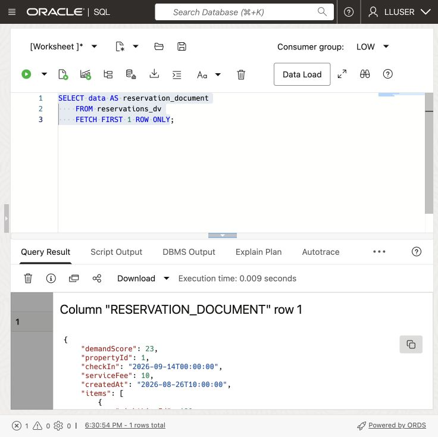
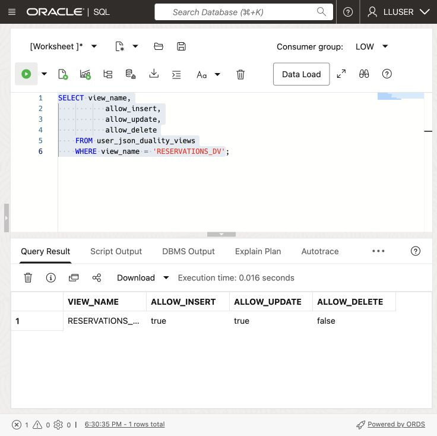
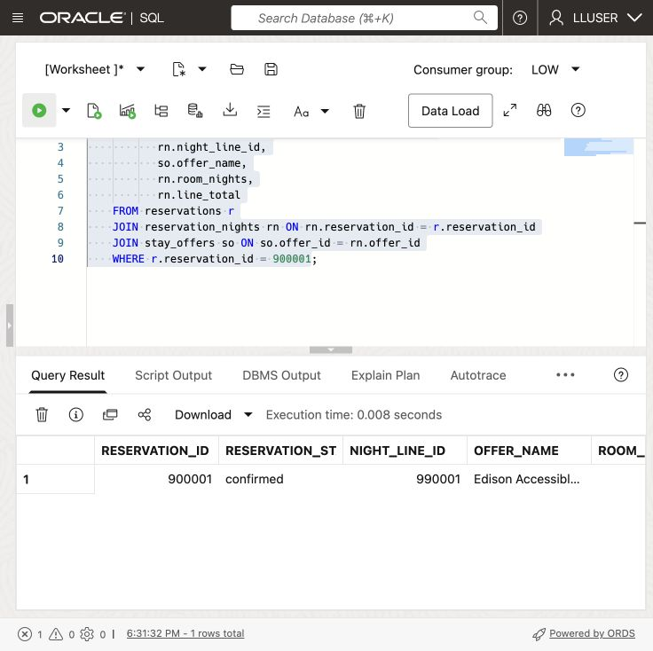
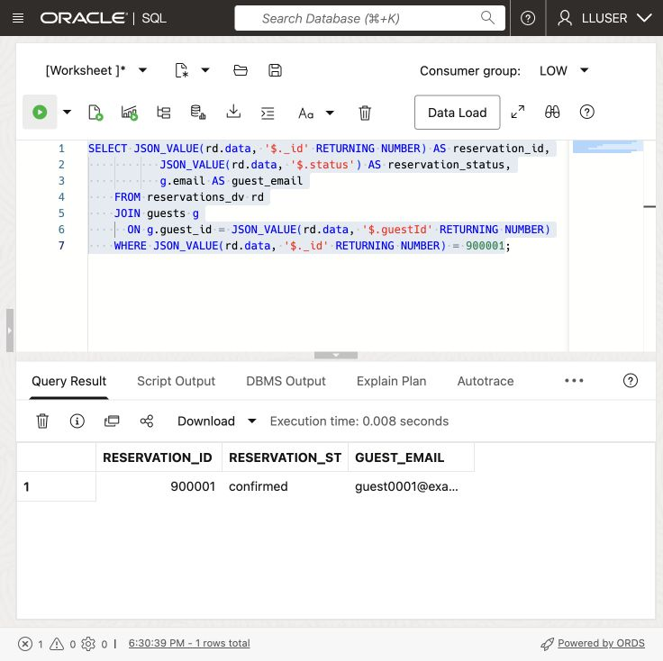
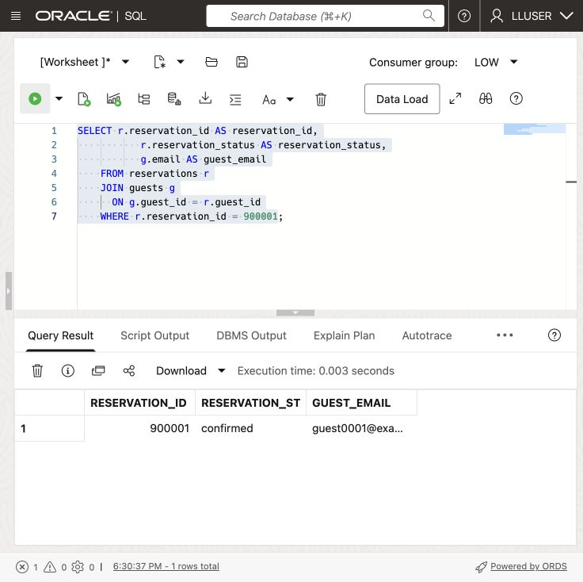

# Build a JSON Application Model

## Introduction

Thomas Brune needs JSON reservation documents for Seer Hotels’ guest application. Each document must include stay dates, status, and nightly charges while Jessica retains SQL access and relational constraints.

Help Thomas compare a JSON column, a JSON Collection Table, and a JSON Relational Duality View, then create and update a reservation through the view.


<details>
<summary><strong>Key terms: JSON columns, JSON collections, and JSON Relational Duality</strong></summary>

> - A **JSON column** stores a JSON value in a relational table alongside normal typed columns, keys, and constraints. Thomas can use it for optional or changing application attributes without turning every new attribute into a schema change.
>
> - A **JSON collection** is a special table or view that provides a set of JSON documents through one `JSON`-typed `DATA` column. Each document can have a top-level `_id` used to identify it.
>
> - **JSON Relational Duality** lets Oracle Database expose relational data as JSON documents without copying it into a separate document database. The application gets the document shape Thomas wants for its API. The database keeps the relational rows and controls.
>

</details>

Thomas's application needs a payload with the reservation and its nightly-charge lines together, such as this:

```json
{
  "_id": 513063,
  "guestId": 1,
  "propertyId": 1,
  "checkIn": "2026-09-22",
  "checkOut": "2026-09-24",
  "status": "confirmed",
  "items": [
    { "offerId": 1, "roomNights": 2, "nightlyRate": 125.00 }
  ]
}
```

### Objectives

- Store flexible application attributes as JSON in a relational table.
- Create and query a JSON Collection Table of reservation documents.
- Read and update relational reservation data through `RESERVATIONS_DV`.
- Compare the three JSON approaches and choose the right one for an application feature.

Estimated Time: **10 minutes**

> **SQL Worksheet reminder:** See [Getting Started Task 2: Open SQL Worksheet](?lab=getting-started#Task2:OpenSQLWorksheet) for the steps to paste and run SQL.

## Task 1: Store flexible application data as JSON

Thomas starts with data that belongs to the application but does not need its own relational columns. The workshop database already contains the reservation rows. He adds a small application-data table with a native `JSON` column for optional screen and guest-experience settings.

1. Create the application-data table and add one sample payload.

    ```sql
    <copy>
    CREATE TABLE thomas_app_data (
        reservation_id  NUMBER PRIMARY KEY,
        app_data  JSON NOT NULL
    );

    INSERT INTO thomas_app_data (reservation_id, app_data)
    SELECT reservation_id,
           JSON_OBJECT(
               'screen'    VALUE 'reservation-detail',
               'showTotal' VALUE 'true' FORMAT JSON,
               'features'  VALUE JSON_ARRAY('live-status', 'arrival-preferences')
               RETURNING JSON
           )
    FROM (
        SELECT reservation_id
        FROM reservations
        ORDER BY reservation_id
        FETCH FIRST 1 ROW ONLY
    );

    COMMIT;
    </copy>
    ```

2. Read values from the JSON column.

    ```sql
    <copy>
    SELECT reservation_id,
           JSON_VALUE(app_data, '$.screen') AS screen_name,
           JSON_VALUE(app_data, '$.showTotal' RETURNING BOOLEAN) AS show_total,
           JSON_QUERY(app_data, '$.features') AS app_features
    FROM thomas_app_data;
    </copy>
    ```

    `RESERVATION_ID` remains a relational key. `APP_DATA` can change as the application changes. Thomas can query both with SQL in one table.

## Task 2: Create a JSON Collection Table

Thomas now needs a collection of application documents. Unlike the JSON column in Task 1, this object is a JSON Collection Table: each row is a document, the document is stored in `DATA`, and `_id` identifies the document.

1. Create the collection and add the sample reservation document.

    ```sql
    <copy>
    CREATE JSON COLLECTION TABLE thomas_reservation_docs
    WITH ETAG;

    INSERT INTO thomas_reservation_docs (data)
    SELECT JSON_OBJECT(
               '_id'        VALUE r.reservation_id,
               'guestId' VALUE r.guest_id,
               'propertyId' VALUE r.property_id,
               'checkIn' VALUE TO_CHAR(r.check_in, 'YYYY-MM-DD'),
               'checkOut' VALUE TO_CHAR(r.check_out, 'YYYY-MM-DD'),
               'status'     VALUE r.reservation_status,
               'items'      VALUE (
                   SELECT JSON_ARRAYAGG(
                              JSON_OBJECT(
                                  'nightLineId'    VALUE rn.night_line_id,
                                  'offerId' VALUE rn.offer_id,
                                  'roomNights'  VALUE rn.room_nights,
                                  'nightlyRate' VALUE rn.nightly_rate
                                  RETURNING JSON
                              ) ORDER BY rn.night_line_id RETURNING JSON
                          )
                   FROM reservation_nights rn
                   WHERE rn.reservation_id = r.reservation_id
               ) FORMAT JSON
               RETURNING JSON
           )
    FROM reservations r
    JOIN thomas_app_data t ON t.reservation_id = r.reservation_id;

    COMMIT;
    </copy>
    ```

    `WITH ETAG` adds `_metadata.etag`, which changes when the document changes. An application can compare the tag it last read before updating, to avoid overwriting another request’s changes.

2. Query the collection as documents.

    ```sql
    <copy>
    SELECT JSON_SERIALIZE(data PRETTY) AS reservation_document
    FROM thomas_reservation_docs
    WHERE JSON_VALUE(data, '$._id' RETURNING NUMBER) =
          (SELECT reservation_id FROM thomas_app_data);
    </copy>
    ```

    Thomas now has a document collection that a document API can access, and SQL can query the same `DATA` column. The collection stores the documents; it is separate from the relational `RESERVATIONS` and `RESERVATION_NIGHTS` tables.

## Task 3: Read a guest document from relational data

Thomas inspects a reservation document for the guest application. The reservation is the document root; the guest identifier and nightly-charge lines come from the related relational rows.

1. Run this query:

    This query selects the JSON `DATA` column from `RESERVATIONS_DV` so Thomas can inspect the document shape in SQL Worksheet.

    ```sql
    <copy>
    SELECT data AS reservation_document
    FROM reservations_dv
    FETCH FIRST 1 ROW ONLY;
    </copy>
    ```

    

2. Expand the document in SQL Worksheet. Find `_id`, `guestId`, `status`, totals, timestamps, and the nested nightly-charge lines. Oracle assembles them from the relational rows.

    > **Note:** Find `_metadata.etag` here too; it lets the application detect document changes before an update.

## Task 4: Enable document inserts and updates

The existing `RESERVATIONS_DV` lets an application update reservation documents. Here, you also allow inserts. Oracle still enforces the table keys and constraints. An application granted access only to the view can use only the fields and write operations that the view allows.

1. Check the current document-write capabilities.

    ```sql
    <copy>
    SELECT view_name,
           allow_insert,
           allow_update,
           allow_delete
    FROM user_json_duality_views
    WHERE view_name = 'RESERVATIONS_DV';
    </copy>
    ```

    **Expected output: Current Document Capabilities**

    `RESERVATIONS_DV` should report update enabled and insert disabled in the initial loader definition.

    Inserts must be enabled on both the root `RESERVATIONS` table and the nested `RESERVATION_NIGHTS` rows.

2. Enable insert and update for the document and its nightly-charge lines.

    The two `WITH INSERT UPDATE` clauses enable writes to the reservation and its nightly-charge lines. Relational keys and data types still apply.

    ```sql
    <copy>
    CREATE OR REPLACE JSON RELATIONAL DUALITY VIEW reservations_dv AS
    SELECT JSON {
        '_id'         : r.reservation_id,
        'guestId'  : r.guest_id,
        'propertyId' : r.property_id,
        'checkIn'     : r.check_in,
        'checkOut'    : r.check_out,
        'status'      : r.reservation_status,
        'total'       : r.reservation_total,
        'serviceFee': r.service_fee,
        'demandScore' : r.demand_score,
        'createdAt'   : r.created_at,
        'items' : [
            SELECT JSON {
                'nightLineId'    : rn.night_line_id,
                'offerId' : rn.offer_id,
                'roomNights'  : rn.room_nights,
                'nightlyRate' : rn.nightly_rate
            }
            FROM reservation_nights rn WITH INSERT UPDATE
            WHERE rn.reservation_id = r.reservation_id
        ]
    }
    FROM reservations r WITH INSERT UPDATE;
    </copy>
    ```

    `RESERVATIONS` supplies the document root; related `RESERVATION_NIGHTS` rows form the nested `items` collection.

    **Expected output: View Definition Updated**

    Oracle created or replaced the duality view. Verify the new capabilities in the next step.

3. Run the capability query again.

    ```sql
    <copy>
    SELECT view_name,
           allow_insert,
           allow_update,
           allow_delete
    FROM user_json_duality_views
    WHERE view_name = 'RESERVATIONS_DV';
    </copy>
    ```

    

    **Expected output: Document Capabilities Enabled**

    `RESERVATIONS_DV` should report insert and update enabled; delete remains disabled.

## Task 5: Create and update a JSON reservation

Thomas now tests a complete guest reservation. He creates it as one nested JSON document, then confirms that Jessica can immediately see the same data as structured relational rows.

1. Insert the supplied workshop reservation document.

    The `INSERT` writes through `RESERVATIONS_DV`; Oracle uses the view definition to update the relational tables. The sample uses reservation `900001`, guest `1`, property `1`, offer `1`, and night-line `990001`. Its two-night stay costs 125.00 per night, for a total of 250.00 in the workshop currency.

    The loader supplies guest `1` and offer `1` at property `1`. Reservation `900001` and night-line `990001` are reserved for this exercise. The insert skips an existing reservation, so rerunning it preserves the record.

    ```sql
    <copy>
    INSERT INTO reservations_dv (data)
    SELECT JSON(
      '{
        "_id": 900001,
        "guestId": 1,
        "propertyId": 1,
        "checkIn": "2026-09-22",
        "checkOut": "2026-09-24",
        "status": "pending",
        "total": 250.00,
        "serviceFee": 0,
        "items": [
          {
            "nightLineId": 990001,
            "offerId": 1,
            "roomNights": 2,
            "nightlyRate": 125.00
          }
        ]
      }'
    )
    WHERE NOT EXISTS (
      SELECT 1
      FROM reservations
      WHERE reservation_id = 900001
    );

    COMMIT;
    </copy>
    ```

    **Expected output: Reservation Document Created**

    On the first run, you insert one document. On later runs, the `NOT EXISTS` check returns zero rows because the workshop reservation is already present.

2. Confirm the JSON document became relational rows.

    Query the underlying `RESERVATIONS` and `RESERVATION_NIGHTS` tables:

    ```sql
    <copy>
    SELECT r.reservation_id AS reservation_id,
           r.reservation_status AS reservation_status,
           g.email AS guest_email,
           rn.night_line_id,
           so.offer_name,
           rn.room_nights,
           rn.nightly_rate,
           rn.line_total
    FROM reservations r
    JOIN guests g ON g.guest_id = r.guest_id
    JOIN reservation_nights rn ON rn.reservation_id = r.reservation_id
    JOIN stay_offers so ON so.offer_id = rn.offer_id
    WHERE r.reservation_id = 900001;
    </copy>
    ```

    **Expected output: Created Reservation Rows**

    The sample row should contain reservation 900001, night-line 990001, two room nights at 125.00, line total 250.00, and status `pending` on the first run. Read the guest email and offer name from the loaded rows.

3. Update the document status through the duality view.

    This statement updates only `status` through `RESERVATIONS_DV`. Oracle maps it to `RESERVATIONS.RESERVATION_STATUS`. The view also allows updates to other exposed fields; restricting writes to status alone would require a more limited view definition. Thomas does not need to parse the document in the application.

    ```sql
    <copy>
    UPDATE reservations_dv
    SET data = JSON_TRANSFORM(data, SET '$.status' = 'confirmed')
    WHERE JSON_VALUE(data, '$._id' RETURNING NUMBER) = 900001;

    COMMIT;
    </copy>
    ```

    **Expected output: Reservation Status Updated**

    Oracle updates one document. The following query confirms that the relational reservation row now has status `confirmed`.

4. Verify the updated relational status.

    ```sql
    <copy>
    SELECT r.reservation_id AS reservation_id,
           r.reservation_status AS reservation_status,
           rn.night_line_id,
           so.offer_name,
           rn.room_nights,
           rn.line_total
    FROM reservations r
    JOIN reservation_nights rn ON rn.reservation_id = r.reservation_id
    JOIN stay_offers so ON so.offer_id = rn.offer_id
    WHERE r.reservation_id = 900001;
    </copy>
    ```

    

    **Expected output: Updated Reservation Rows**

    Reservation 900001 should now have status `confirmed`, with the same night-line values.

## Task 6: Project JSON fields with SQL

Jessica now extracts JSON values as SQL columns, a step called **projection**, and compares them with the underlying reservation rows.

1. Run this SQL/JSON projection query:

    `JSON_VALUE` extracts the reservation ID, status, and guest identifier. The query joins the guest identifier to `GUESTS` to retrieve the email.

    ```sql
    <copy>
    SELECT JSON_VALUE(rd.data, '$._id' RETURNING NUMBER) AS reservation_id,
           JSON_VALUE(rd.data, '$.status') AS reservation_status,
           g.email AS guest_email
    FROM reservations_dv rd
    JOIN guests g
      ON g.guest_id = JSON_VALUE(rd.data, '$.guestId' RETURNING NUMBER)
    WHERE JSON_VALUE(rd.data, '$._id' RETURNING NUMBER) = 900001;
    </copy>
    ```

    

    **Expected output: JSON Field Projection**

    Compare reservation ID 900001, status `confirmed`, and the loaded guest email with the following relational query.

2. Run the equivalent query against the relational tables.

    ```sql
    <copy>
    SELECT r.reservation_id AS reservation_id,
           r.reservation_status AS reservation_status,
           g.email AS guest_email
    FROM reservations r
    JOIN guests g
      ON g.guest_id = r.guest_id
    WHERE r.reservation_id = 900001;
    </copy>
    ```

    

    Compare the result with the previous query. The reservation ID, status, and guest email should match. Thomas's application is reading the JSON document, while Jessica's relational query reads the underlying rows.

## Conclusion: Choose the right JSON approach

Choose by who owns the data and how the application uses it:

| Approach | Use in Thomas’s application |
| --- | --- |
| JSON column | Optional screen settings beside a relational reservation key. |
| JSON Collection Table | Application-owned booking drafts stored as documents in `DATA`. |
| JSON Relational Duality View | Shared reservations exposed as JSON over `RESERVATIONS` and `RESERVATION_NIGHTS`. |

Thomas chooses the duality view for confirmed reservations: the application writes JSON, and Jessica queries the same rows with SQL.

## Acknowledgements

* **Author** - Matt Kowalik
* **Contributor** - Kevin Lazarz
* **Last Updated By/Date** - Matt Kowalik, September 2026
