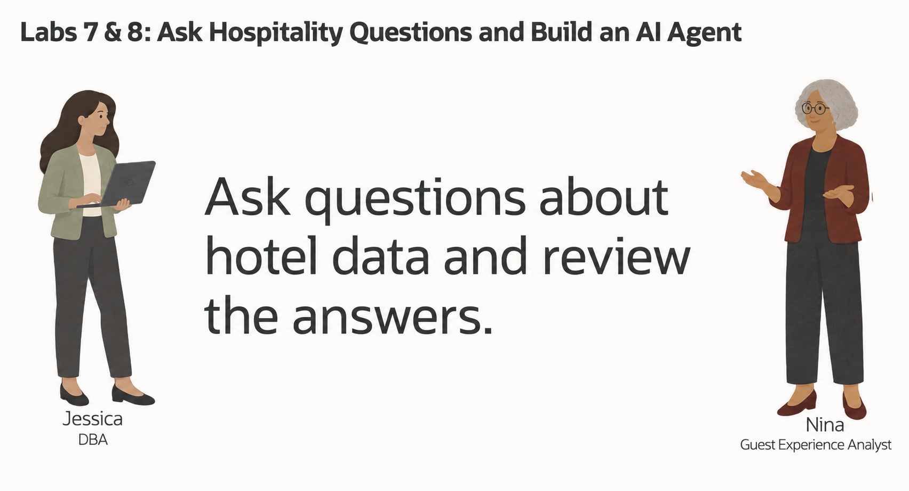
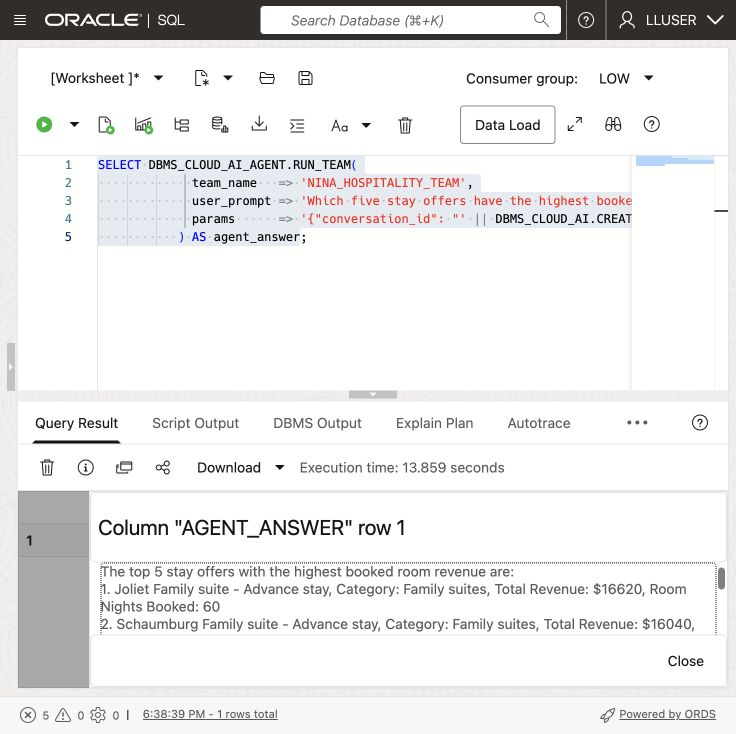
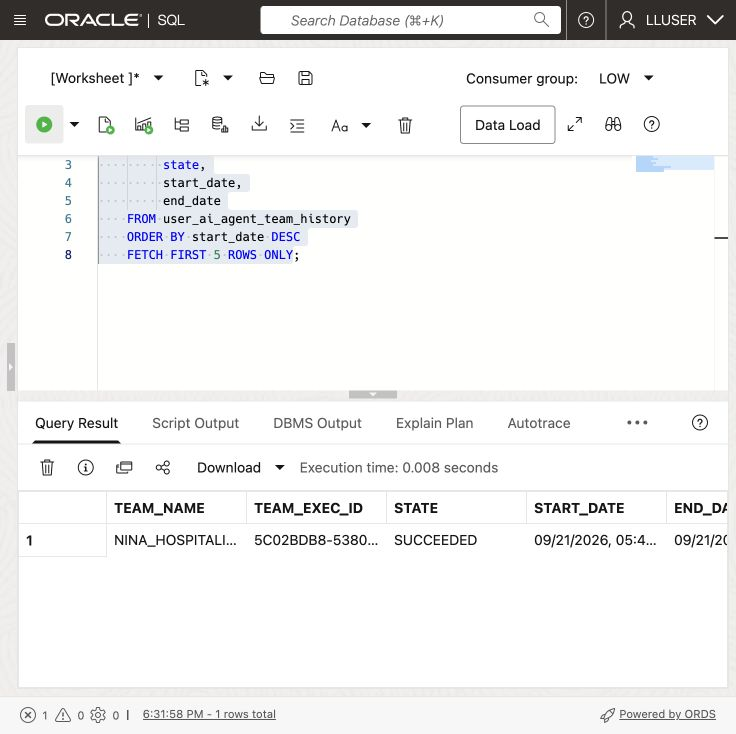
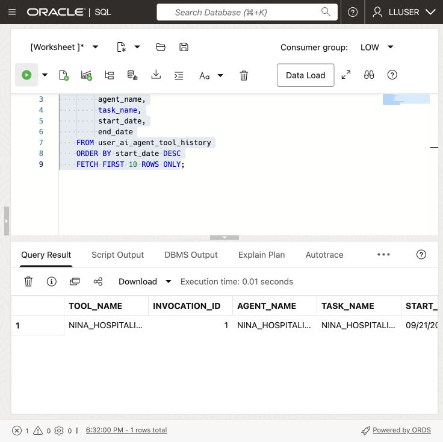

# Build a Hospitality Agent with Select AI Agent

## Introduction

Nina Patel has used Select AI for individual questions. Her guest-review screen now needs an assistant that can handle a request and follow-up questions.

Jessica, the DBA, does not want to give an AI system unrestricted access to the database. She gives Nina's agent one approved tool: a SQL tool that uses the `GENAI` profile and the hospitality tables configured in the previous lab.

In this lab, you create an agent, give it the built-in SQL query tool, and run a question through its team. The instructions ask for read-only answers. SQL still runs with the database user’s privileges. `LLUSER` owns the workshop objects, so it is not an example of a production account with restricted access.



<details>
<summary><strong>Key terms: agent, tool, task, and team</strong></summary>

> - An **agent** is a configured role that follows instructions when it handles a request.
>
> - A **tool** is a capability the agent is allowed to call. In this lab, the tool runs SQL through the `GENAI` profile.
>
> - A **task** tells the agent what to do and which tools it may use.
>
> - A **team** connects the agent and task so an application or SQL session can run them together.

</details>

### Objectives

- Confirm that the `GENAI` profile from the previous lab is available.
- Verify which hospitality tables the SQL tool may use.
- Register a SQL tool and give the agent read-only task instructions.
- Create an agent, task, and team with `DBMS_CLOUD_AI_AGENT`.
- Run a hospitality question through the team.
- Review the agent's tool history and explain why the tool boundary matters.

Estimated Time: **15 minutes**

> **Prerequisite:** Complete [Lab 7: Ask Hospitality Questions with Select AI](?lab=selectai). This lab uses the `GENAI` profile and its `object_list`.

## Task 1: Check the profile and table access

The tool uses `GENAI`. Its `object_list` guides SQL generation; database privileges determine what the current user can access.

1. Check the profile:

    ```sql
    <copy>
    SELECT profile_name,
           status
    FROM user_cloud_ai_profiles
    WHERE profile_name = 'GENAI';
    </copy>
    ```

    The profile should be enabled. If it is not present, complete Lab 7 first or ask the DBA which profile to use.

2. Check the tables listed in the profile:

    ```sql
    <copy>
    SELECT profile_name,
           attribute_name,
           attribute_value
    FROM user_cloud_ai_profile_attributes
    WHERE profile_name = 'GENAI'
      AND attribute_name = 'object_list';
    </copy>
    ```

    The list should contain only the workshop tables needed for this lab: `STAY_OFFERS`, `RESERVATIONS`, `RESERVATION_NIGHTS`, and `GUESTS`. The `object_list` guides SQL generation; it is not a replacement for database grants.

3. Check the agent objects already in your schema:

    ```sql
    <copy>
    SELECT agent_name,
           status
    FROM user_ai_agents
    ORDER BY agent_name;
    </copy>
    ```

  The workshop objects use names beginning with `NINA_HOSPITALITY_`. If you already ran this lab, you can reuse the existing objects or run the reset block in the appendix before starting again.

## Task 2: Register the SQL tool

Register the built-in SQL tool with the `GENAI` profile.

1. Register the tool:

    ```sql
    <copy>
    BEGIN
      DBMS_CLOUD_AI_AGENT.CREATE_TOOL(
        tool_name   => 'NINA_HOSPITALITY_SQL_TOOL',
        attributes  => '{"tool_type": "SQL", "tool_params": {"profile_name": "genai"}}',
        description => 'Read-only SQL access to the workshop hospitality tables'
      );
    END;
    /
    </copy>
    ```

2. Confirm the tool definition:

    ```sql
    <copy>
    SELECT tool_name,
           status,
           description
    FROM user_ai_agent_tools
    WHERE tool_name = 'NINA_HOSPITALITY_SQL_TOOL';
    </copy>
    ```
  
## Task 3: Create Nina's agent, task, and team

The tool by itself does nothing. Nina's agent needs a role, a task needs instructions, and a team connects the two.

1. Create the agent:

    ```sql
    <copy>
    BEGIN
      DBMS_CLOUD_AI_AGENT.CREATE_AGENT(
        agent_name  => 'NINA_HOSPITALITY_AGENT',
        attributes  => '{"profile_name": "genai", "role": "You are Nina Patel''s hospitality data assistant. Answer questions using the approved SQL tool. Use database results for stay offer, reservation, nightly charge, and guest facts. Do not invent values."}',
        description => 'Hospitality assistant for Nina Patel'
      );
    END;
    /
    </copy>
    ```

2. Create the task:

    ```sql
    <copy>
    BEGIN
      DBMS_CLOUD_AI_AGENT.CREATE_TASK(
        task_name  => 'NINA_HOSPITALITY_TASK',
        attributes => '{"instruction": "Answer Nina''s hospitality question: {query}. Use NINA_HOSPITALITY_SQL_TOOL once to retrieve the required data. Return a concise answer based on the database result. Do not repeat the same tool call and do not make changes to database records.", "tools": ["NINA_HOSPITALITY_SQL_TOOL"], "enable_human_tool": "false"}',
        description => 'Answer read-only stay offer and guest questions'
      );
    END;
    /
    </copy>
    ```
  
3. Create the team:

    ```sql
    <copy>
    BEGIN
      DBMS_CLOUD_AI_AGENT.CREATE_TEAM(
        team_name  => 'NINA_HOSPITALITY_TEAM',
        attributes => '{"agents": [{"name": "NINA_HOSPITALITY_AGENT", "task": "NINA_HOSPITALITY_TASK"}], "process": "sequential"}',
        description => 'Read-only hospitality question team'
      );
    END;
    /
    </copy>
    ```

## Task 4: Run a hospitality question

Database Actions does not support the `SELECT AI AGENT` command directly. Use `DBMS_CLOUD_AI_AGENT.RUN_TEAM` in SQL Worksheet and provide the team name in the function call.

1. Ask the agent:

    ```sql
    <copy>
    SELECT DBMS_CLOUD_AI_AGENT.RUN_TEAM(
             team_name   => 'NINA_HOSPITALITY_TEAM',
             user_prompt => 'Which five stay offers have the highest booked room revenue? Sum reservation_nights.line_total only for confirmed, checked_in, or checked_out reservations. Include the stay offer name, category, total revenue, and room nights booked.',
             params      => '{"conversation_id": "' || DBMS_CLOUD_AI.CREATE_CONVERSATION() || '"}'
           ) AS agent_answer;
    </copy>
    ```

    

    Database Actions does not keep an agent conversation ID for this call, so the query creates one and passes it to `RUN_TEAM`. The ID lets Oracle record the prompt and response in the agent conversation history.

2. Review the answer.

    Look for the stay offer ranking, category, revenue, and room nights booked. The exact wording may vary because an AI provider generates the response, but the answer should be based on the hospitality tables available through `GENAI`.
  
    > **Note:** The task requests read-only answers. These instructions do not replace database permissions; the calls run with `LLUSER` privileges.

3. Optional challenge: ask a follow-up question that connects the highest-revenue stay offer to its guests and reservations. A more detailed request may take longer because the agent has to interpret more steps.

## Task 5: Inspect what the agent did

Nina needs more than a final answer. She also wants to know whether the agent called the approved tool and how the request was processed.

1. Review the latest team runs:

    ```sql
    <copy>
    SELECT team_name,
         team_exec_id,
         state,
         start_date,
         end_date
    FROM user_ai_agent_team_history
    ORDER BY start_date DESC
    FETCH FIRST 5 ROWS ONLY;
    </copy>
    ```

    

2. Review the latest tool calls:

    ```sql
    <copy>
    SELECT tool_name,
         invocation_id,
         agent_name,
         task_name,
         start_date,
         end_date
    FROM user_ai_agent_tool_history
    ORDER BY start_date DESC
    FETCH FIRST 10 ROWS ONLY;
    </copy>
    ```

    

  The history should show `NINA_HOSPITALITY_SQL_TOOL`. Nina and Jessica can use it to check which tool the agent called.

## Conclusion: Give the agent a controlled way to work

Nina can now call the team and inspect its tool history. For an application deployment, Jessica must limit database grants and any row-level access policies; the profile’s `object_list` and agent instructions are not permission controls.

## Appendix: Reset the workshop objects

Run this block only if you want to recreate the objects used in this lab. It removes only the four names created here.

```sql
<copy>
BEGIN
  DBMS_CLOUD_AI_AGENT.DROP_TEAM('NINA_HOSPITALITY_TEAM', TRUE);
  DBMS_CLOUD_AI_AGENT.DROP_TASK('NINA_HOSPITALITY_TASK', TRUE);
  DBMS_CLOUD_AI_AGENT.DROP_AGENT('NINA_HOSPITALITY_AGENT', TRUE);
  DBMS_CLOUD_AI_AGENT.DROP_TOOL('NINA_HOSPITALITY_SQL_TOOL', TRUE);
END;
/
</copy>
```

## Next Steps

Read the [Oracle AI Database Select AI Agent documentation](https://docs.oracle.com/en/database/oracle/oracle-database/26/selai/).

## Acknowledgements

* **Author** - Matt Kowalik
* **Contributor** - Kevin Lazarz
* **Last Updated By/Date** - Matt Kowalik, September 2026
