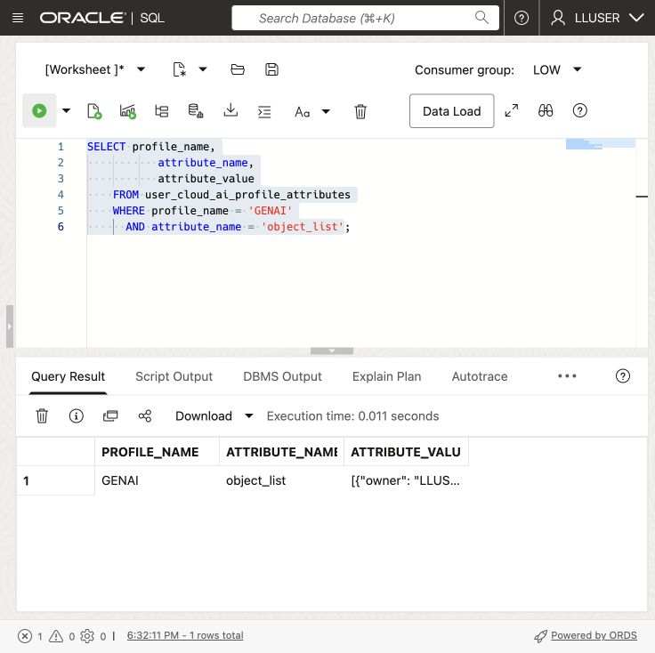
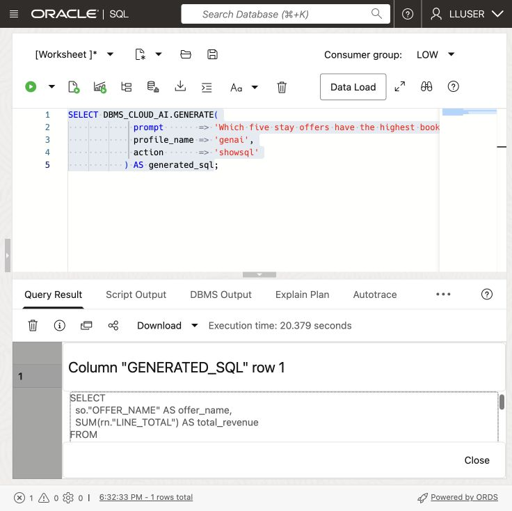
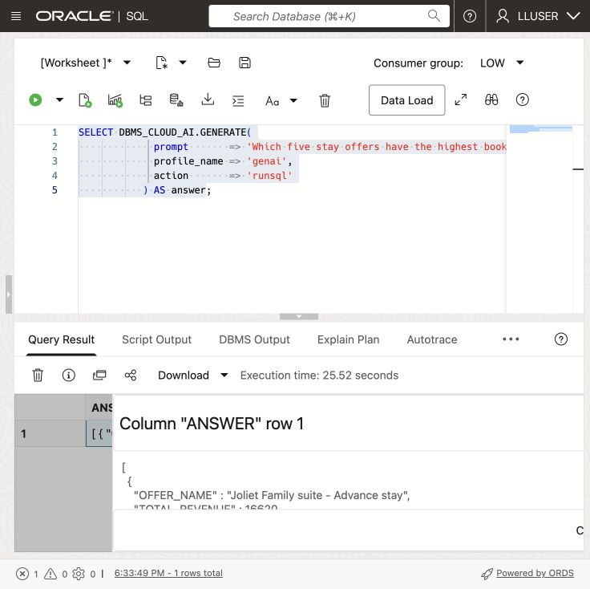
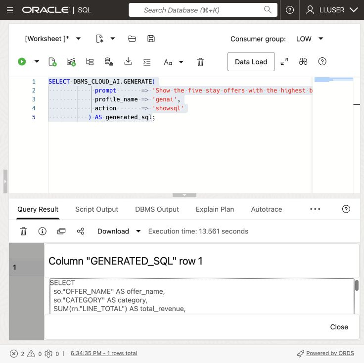
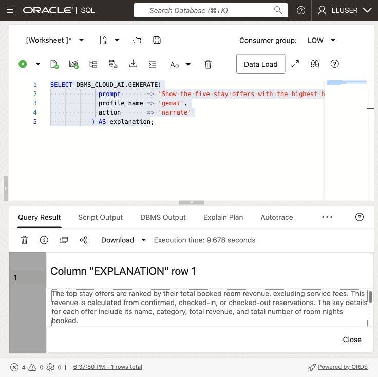

# Ask Hospitality Questions with Select AI


## Introduction

Nina Patel, Seer Hotels’ guest experience analyst, wants to know which stay offers earn the most room revenue. Jessica has configured a Select AI profile so Nina can ask in ordinary language.

Help Nina inspect the generated SQL, run the question, and refine it. Review the joins and filters carefully: a model can produce valid SQL that answers the wrong question.

<details>
<summary><strong>Key terms: Select AI, AI profile, generated SQL, and natural-language prompt</strong></summary>

> - **Select AI** lets a user work with database information through a natural-language question.
>
> - An **AI profile** connects Select AI to an AI provider and identifies the database objects that may be used for the question.
>
> - **Generated SQL** is the SQL statement created from the question. Nina should inspect it before relying on the result.
>
> - A **natural-language prompt** is the question sent to Select AI, such as `Which five stay offers have the highest booked room revenue? Include confirmed reservations and guests who have checked in or checked out. Do not include service fees.`

</details>

### Objectives

- Check which Select AI profile is available in the schema.
- Add the hospitality tables that Select AI may use to the profile.
- Generate SQL from a hospitality question and inspect it.
- Run a natural-language question through `DBMS_CLOUD_AI.GENERATE`.
- Improve a question so the result contains the business details Nina needs.
- Explain why generated SQL still requires review.

Estimated Time: **10 minutes**

> **SQL Worksheet reminder:** See [Getting Started Task 2: Open SQL Worksheet](?lab=getting-started#Task2:OpenSQLWorksheet) for the steps to paste and run SQL.

## Task 1: Check the Select AI profile

Check the AI profile already configured for `LLUSER`.

1. Run this query:

    ```sql
    <copy>
    SELECT profile_name,
           status,
           description
    FROM user_cloud_ai_profiles
    ORDER BY profile_name;
    </copy>
    ```

    The workshop profile is expected to be named `GENAI`. Confirm that it is enabled. The configured model must support on-demand inference in the provider region. Check [Oracle’s regional model availability](https://docs.oracle.com/en-us/iaas/Content/generative-ai/model-endpoint-regions.htm) before a separate deployment. If the query shows a different profile name, use that name in the following tasks.

2. Review the profile attributes:
  
    ```sql
    <copy>
    SELECT profile_name,
           attribute_name,
           attribute_value
    FROM user_cloud_ai_profile_attributes
    ORDER BY profile_name, attribute_name;
    </copy>
    ```

    The attributes show how the profile is configured and which database objects are available to Select AI. Do not copy credentials. In Task 2, you will change only the profile's `object_list`.

## Task 2: Add the hospitality tables to the profile

The profile needs a list of tables that Select AI may use. Nina's questions require stay offer, reservation, reservation-night, and guest data, so Jessica adds those four tables to the `GENAI` profile.

1. Add the hospitality tables to the profile:

    ```sql
    <copy>
    BEGIN
      DBMS_CLOUD_AI.SET_ATTRIBUTE(
        profile_name    => 'genai',
        attribute_name  => 'object_list',
        attribute_value => '[{"owner": "' || USER || '", "name": "STAY_OFFERS"}, {"owner": "' || USER || '", "name": "RESERVATIONS"}, {"owner": "' || USER || '", "name": "RESERVATION_NIGHTS"}, {"owner": "' || USER || '", "name": "GUESTS"}]'
      );
    END;
    /
    </copy>
    ```

2. Confirm the object list:

    ```sql
    <copy>
    SELECT profile_name,
           attribute_name,
           attribute_value
    FROM user_cloud_ai_profile_attributes
    WHERE profile_name = 'GENAI'
      AND attribute_name = 'object_list';
    </copy>
    ```

    

    The result should list `STAY_OFFERS`, `RESERVATIONS`, `RESERVATION_NIGHTS`, and `GUESTS`. Select AI can now use these tables when it translates Nina's questions into SQL.

## Task 3: Ask a question and inspect the SQL

Nina starts with a simple question: which stay offers have the highest revenue? She first asks Select AI to show the SQL without running it.

In SQL Worksheet, submit your question using the short `DBMS_CLOUD_AI.GENERATE` call below. Write the question in ordinary language inside `prompt`; Select AI works out the SQL. Keep the profile name unchanged. The `action` chooses whether to show the SQL, return results, or explain them.

1. Ask Nina’s question using the `GENAI` profile. The `showsql` action returns the generated SQL for review:

    ```sql
    <copy>
    SELECT DBMS_CLOUD_AI.GENERATE(
             prompt       => 'Which five stay offers have the highest booked room revenue? Include confirmed reservations and guests who have checked in or checked out. Do not include service fees.',
             profile_name => 'genai',
             action       => 'showsql'
           ) AS generated_sql;
    </copy>
    ```

    

2. Read the generated SQL before running it.

    Check that the statement joins STAY_OFFERS, RESERVATION_NIGHTS, and RESERVATIONS, groups by offer, returns five rows, sums LINE_TOTAL, and filters the stated reservation statuses. Exclude SERVICE_FEE from room revenue. Select AI can generate a valid-looking statement that does not answer the question precisely, so the generated SQL is part of the result Nina reviews.

## Task 4: Run the question in the database

Nina has reviewed the SQL. She now asks Select AI to run the question and return the database result.

1. Run the same question with the `runsql` action:

    ```sql
    <copy>
    SELECT DBMS_CLOUD_AI.GENERATE(
             prompt       => 'Which five stay offers have the highest booked room revenue? Include confirmed reservations and guests who have checked in or checked out. Do not include service fees.',
             profile_name => 'genai',
             action       => 'runsql'
           ) AS answer;
    </copy>
      ```

    

2. Compare the answer with the SQL you inspected in Task 3.

    Check the offer ranking and revenue totals against the tables and filters from Task 3. The query runs with your database privileges.

    > **Note:** `runsql` may generate different SQL from a previous `showsql` call. Review the returned result as well as the earlier SQL.

## Task 5: Improve the business question

Nina has a ranking, but she also needs the offer category and number of room nights booked. She adds those details to her question in ordinary language; she does not need to name database columns or write joins.

1. Use `showsql` to inspect this revised prompt:

    ```sql
    <copy>
    SELECT DBMS_CLOUD_AI.GENERATE(
             prompt       => 'Which five stay offers have the highest booked room revenue? For each offer, show its name, category, total room revenue, and number of room nights booked. Include confirmed reservations and guests who have checked in or checked out. Do not include service fees.',
             profile_name => 'genai',
             action       => 'showsql'
           ) AS generated_sql;
    </copy>
    ```

    

2. Review the generated SQL, then run the revised question with `runsql`:

    ```sql
    <copy>
    SELECT DBMS_CLOUD_AI.GENERATE(
             prompt       => 'Which five stay offers have the highest booked room revenue? For each offer, show its name, category, total room revenue, and number of room nights booked. Include confirmed reservations and guests who have checked in or checked out. Do not include service fees.',
             profile_name => 'genai',
             action       => 'runsql'
           ) AS answer;
    </copy>
    ```

    

3. Compare the first and second questions.

  The revised question asks for the business details Nina needs in her review. She still checks that the SQL uses the right joins, totals, and reservation statuses.

## Task 6: Explain the result

Nina wants a short explanation of the revised result. Select AI can run the SQL and ask the AI provider to describe the returned rows.

1. Run the revised question with the `narrate` action:

    ```sql
    <copy>
    SELECT DBMS_CLOUD_AI.GENERATE(
             prompt       => 'Which five stay offers have the highest booked room revenue? For each offer, show its name, category, total room revenue, and number of room nights booked. Include confirmed reservations and guests who have checked in or checked out. Do not include service fees.',
             profile_name => 'genai',
             action       => 'narrate'
           ) AS explanation;
    </copy>
    ```

    

2. Review the explanation against the SQL result.

  The explanation is a convenience for a business user. The SQL result remains the record Nina can inspect, repeat, and use to check whether the explanation is accurate.

  > **Note:** The `narrate` action sends the query result to the AI provider configured in the profile. Use it only for data approved for that provider.

## Conclusion: Ask, Inspect, and Refine

Nina now has a review workflow: ask, inspect the SQL, run, and refine. Describe the business question clearly, refine it in ordinary language, and check the generated SQL and explanation against the returned rows.

## Next Steps

For the full list of Select AI actions, profile attributes, and supported providers, see the [Oracle AI Database 26ai Select AI documentation](https://docs.oracle.com/en/database/oracle/oracle-database/26/selai/).

## Acknowledgements

* **Author** - Matt Kowalik
* **Contributor** - Kevin Lazarz
* **Last Updated By/Date** - Matt Kowalik, September 2026
