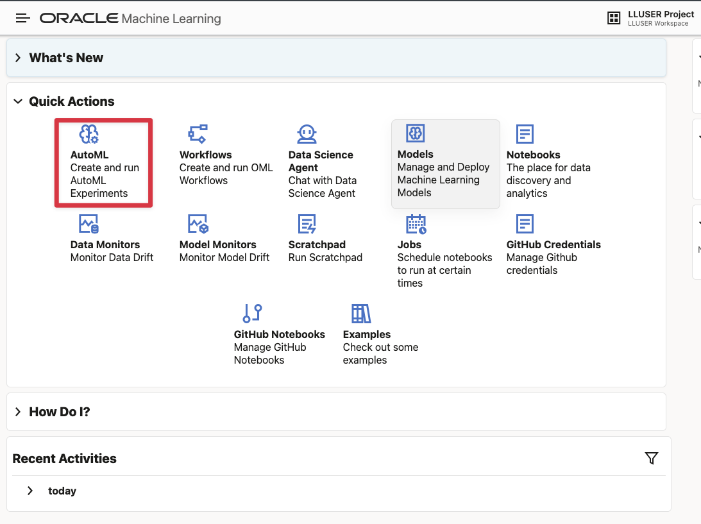

# Build a Stay Offer Demand Watchlist with Oracle Machine Learning

## Introduction

> **Image status:** Hospitality captures for this lab are pending a deployed environment. The SQL and written checks below define what to inspect. Retained generic images are reference material, not evidence of a hospitality run. See the [image inventory](../validation/screenshots.md).

Otto Spencer is Seer Hotels’ data scientist. His team supplies the predictions used in analytics charts and dashboards.

The stay offer team wants a demand watchlist. A business user should be able to see which stay offers may need more attention, why the model flagged them, and which stay offers are already showing strong bookings or guest activity.

Otto has the stay offer, bookings, and social activity data in Oracle AI Database. He could copy the data to a separate machine learning platform, train a model there, and copy the scores back. That would create another copy of hospitality data and another process for keeping scores current.

Instead, Otto builds and scores the model in the database. The model uses stay offer activity to classify stay offers as `SURGE` or `STABLE`. SQL then joins the prediction to the stay offer name, bookings, and engagement values that a dashboard needs.

In this lab, you build Otto's demand-surge model and turn its output into a review list for a business user.


<details>
<summary><strong>Key terms: model, feature, classification, probability, and in-database machine learning</strong></summary>

> - A **model** is a set of learned rules that turns input data into a prediction.
>
> - A **feature** is an input value used by the model. In this lab, features include stay offer category, price, social activity, and bookings.
>
> - **Classification** predicts a label. Otto's model predicts either `SURGE` or `STABLE`.
>
> - A **probability** is the model's value for a class. In this lab, the value is displayed as a `SURGE_SCORE` to rank stay offers for review. It is not a guarantee.
>
> - **In-database machine learning** means the model is trained or scored where the source data already lives. The SQL result can include the prediction and the data used to explain it.

</details>


### Objectives

- Read the prepared training data and identify the model target.
- Optionally use AutoML to compare classification models and inspect their predictions.
- Create the selected Generalized Linear Model inside Oracle AI Database.
- Score stay offers with `PREDICTION` and `PREDICTION_PROBABILITY`.
- Combine model output with stay offer, bookings, and engagement data for a dashboard result.

Estimated Time: **10 minutes**

### Hands-on Scenario

| Step                | Hospitality focus                                                                                                        |
| ---------------------| ----------------------------------------------------------------------------------------------------------------------|
| Business Problem    | A business user needs a short list of stay offers that may require attention.                                           |
| Technical Challenge | Otto needs to train and score a model without copying stay offer activity to another machine learning system.           |
| Persona Focus       | You follow Otto as he builds the model and checks the result before it reaches a dashboard.                          |
| What You Will See   | Optionally compare models with AutoML, then use SQL Developer Web to create and score the selected model.             |
| Database Capability | AutoML, `DBMS_DATA_MINING`, `PREDICTION`, and `PREDICTION_PROBABILITY` support machine learning inside the database. |
| Outcome             | A watchlist for a dashboard combines the model result with the stay offer and activity data behind it.                  |

> **SQL Worksheet reminder:** Need a reminder on how to open and use the SQL Worksheet? Return to [Getting Started Task 2: Open SQL Worksheet](?lab=getting-started#Task2:OpenSQLWorksheet) for the step-by-step instructions for pasting and running SQL statements.

## Task 1: Read the training data

Before Otto creates a model, he checks the data that will teach it. The workshop already provides `OML_STAY_DEMAND_TRAINING_V`, a view that combines stay offer, social activity, and bookings data into one row per active stay offer.

The view also contains `SURGE_LABEL`. This is the known label used during training. The demo data assigns each stay offer `SURGE` or `STABLE` from its activity values so the SQL pattern can be tested without waiting for new business outcomes.

1. Run the training-data query:

    ```sql
    <copy>
    SELECT offer_id,
           category,
           nightly_rate,
           total_posts,
           avg_sentiment,
           viral_posts,
           rising_posts,
           room_nights_booked,
           revenue,
           surge_label
    FROM oml_stay_demand_training_v
    ORDER BY offer_id
    FETCH FIRST 10 ROWS ONLY;
    </copy>
    ```

2. Identify the parts of each row.

    The numeric and category columns are the model inputs. `SURGE_LABEL` is the answer the model learns to predict. `OFFER_ID` identifies the stay offer but is not a business feature for this example.

    

    Otto is checking that the training data already brings together the values he needs. He does not have to export social activity, bookings, and stay offer data into separate files before training.

## Task 2: Compare models with AutoML (optional)

Otto first uses the Oracle Machine Learning AutoML interface to compare candidate models. AutoML can select algorithms, tune them, and show how well each model identifies the two labels.

This shows how a data scientist chooses a model: the leaderboard is a starting point, but Otto also checks whether the model identifies the business outcome he cares about.

This task is optional. AutoML can take several minutes to complete, so you can continue with Task 3 if you want to focus on creating and using the model in SQL Developer Web.

1. Open **Machine Learning** from Database Actions.

    Open **Database Actions**, select **Machine Learning**. Use the username and password you can find on the **View Login Info screen**.
    
    
    
2. Click **AutoML**.

     

3. Create a new experiment with these settings:
  
    | Setting         | Value                   |
    | -----------------| -------------------------|
    | Experiment name | `Stay Offer Demand Surge`  |
    | Data source     | `OML_STAY_DEMAND_TRAINING_V` |
    | Predict         | `SURGE_LABEL`           |
    | Prediction type | `Classification`        |
    | Case ID         | `OFFER_ID`            |
  
    Start the experiment and wait for the model leaderboard (this can take between 5-10 minutes).

    

4. Review the leaderboard and model details.

  
  
  The leaderboard may show several models with a higher balanced-accuracy value than the Generalized Linear Model. Otto does not choose from that number alone. Open the different model details and inspect the confusion matrix.

  Inspect the confusion matrix for both `STABLE` and `SURGE`. A model that predicts only `STABLE` cannot identify demand surges, even if its overall accuracy looks high. Check false positives and missed surges before choosing a model.

  The next task uses a Generalized Linear Model to preserve the SQL training and scoring exercise. No hospitality leaderboard, confusion matrix, or feature-importance result has been measured yet. After Phase 2, compare this model with the AutoML candidates and record the result instead of assuming it is the best model.

  Review prediction impact for the selected model. Social-post counts and sentiment may help explain a prediction, but influence is not evidence of causation.

## Task 3: Create the selected model in SQL Developer Web

If you ran AutoML, use its results to compare models. He now moves to SQL Developer Web to create a named model that a SQL query can call repeatedly. The model is stored in Oracle AI Database under the name `OTTO_STAY_DEMAND_SURGE_MODEL`.

The settings table tells Oracle to use the **Generalized Linear Model** used in this exercise. `PREP_AUTO` lets the database handle standard preparation of the input columns.

If you skipped the optional AutoML task, use this setting as the example model for the workshop.

1. Create the settings table and train the model:

    ```sql
    <copy>
    
    DROP TABLE IF EXISTS otto_stay_demand_settings;
    
    CREATE TABLE otto_stay_demand_settings (
          setting_name  VARCHAR2(30),
          setting_value VARCHAR2(4000)
        );

    INSERT INTO otto_stay_demand_settings (setting_name, setting_value)
    VALUES ('ALGO_NAME', 'ALGO_GENERALIZED_LINEAR_MODEL');

    INSERT INTO otto_stay_demand_settings (setting_name, setting_value)
    VALUES ('PREP_AUTO', 'ON');

    INSERT INTO otto_stay_demand_settings (setting_name, setting_value)
    VALUES ('ODMS_RANDOM_SEED', '20260604');

    COMMIT;

    DECLARE
      l_model_count NUMBER;
    BEGIN
      SELECT COUNT(*)
      INTO l_model_count
      FROM user_mining_models
      WHERE model_name = 'OTTO_STAY_DEMAND_SURGE_MODEL';

      IF l_model_count > 0 THEN
        DBMS_DATA_MINING.DROP_MODEL('OTTO_STAY_DEMAND_SURGE_MODEL');
      END IF;
    END;
    /

    BEGIN
      DBMS_DATA_MINING.CREATE_MODEL(
        model_name           => 'OTTO_STAY_DEMAND_SURGE_MODEL',
        mining_function      => DBMS_DATA_MINING.CLASSIFICATION,
        data_table_name      => 'OML_STAY_DEMAND_TRAINING_V',
        case_id_column_name  => 'OFFER_ID',
        target_column_name   => 'SURGE_LABEL',
        settings_table_name  => 'OTTO_STAY_DEMAND_SETTINGS'
      );
    END;
    /
    </copy>
    ```

    The model reads the training view, learns the relationship between the features and `SURGE_LABEL`, and stores the trained model in the database. No stay offer or social data leaves Oracle Database during training.

2. Confirm that Oracle created the model:

    ```sql
    <copy>
    SELECT model_name,
           mining_function,
           algorithm
    FROM user_mining_models
    WHERE model_name = 'OTTO_STAY_DEMAND_SURGE_MODEL';
    </copy>
    ```

    The result should show `CLASSIFICATION` and `GENERALIZED_LINEAR_MODEL`. Otto now has a database model that SQL can call.

## Task 4: Score new stay offer activity in SQL

Otto creates a synthetic scoring snapshot by perturbing rows from the training view. This demonstrates scoring a separate table without passing the target label. Because it derives from training data, it is not an independent holdout set and cannot establish predictive accuracy.

1. Create the scoring table and add the new activity snapshot:

    ```sql
    <copy>
    
    DROP TABLE IF EXISTS otto_stay_demand_scoring_data;

    CREATE TABLE otto_stay_demand_scoring_data (
      offer_id    NUMBER,
      category      VARCHAR2(100),
      nightly_rate    NUMBER,
      total_posts   NUMBER,
      avg_sentiment NUMBER,
      total_likes   NUMBER,
      total_shares  NUMBER,
      total_views   NUMBER,
      avg_virality  NUMBER,
      viral_posts   NUMBER,
      rising_posts  NUMBER,
      room_nights_booked    NUMBER,
      revenue       NUMBER
    );

    INSERT INTO otto_stay_demand_scoring_data (
      offer_id,
      category,
      nightly_rate,
      total_posts,
      avg_sentiment,
      total_likes,
      total_shares,
      total_views,
      avg_virality,
      viral_posts,
      rising_posts,
      room_nights_booked,
      revenue
    )
    SELECT offer_id,
           category,
           nightly_rate,
           total_posts + 4,
           avg_sentiment,
           total_likes + 25,
           total_shares + 10,
           total_views + 500,
           avg_virality + 0.05,
           viral_posts + 1,
           rising_posts + 1,
           room_nights_booked + 3,
           revenue + (nightly_rate * 3)
    FROM (
      SELECT offer_id,
             category,
             nightly_rate,
             total_posts,
             avg_sentiment,
             total_likes,
             total_shares,
             total_views,
             avg_virality,
             viral_posts,
             rising_posts,
             room_nights_booked,
             revenue,
             ROW_NUMBER() OVER (ORDER BY offer_id) AS row_num
      FROM oml_stay_demand_training_v
    )
    WHERE row_num <= 12;

    COMMIT;
    </copy>
    ```

    This creates a small synthetic scenario from the workshop data, not observed future bookings. 
    >Note: The table has the model inputs, but it does not contain `SURGE_LABEL`. That label belongs to the historical training data and must not be passed to the model as an input.

2. Run the scoring query:

    ```sql
    <copy>
    WITH scored_offers AS (
      SELECT offer_id,
             category,
             room_nights_booked,
             revenue,
             total_posts,
             viral_posts,
             rising_posts,
             PREDICTION(
               OTTO_STAY_DEMAND_SURGE_MODEL USING
               category, nightly_rate, total_posts, avg_sentiment,
               total_likes, total_shares, total_views, avg_virality,
               viral_posts, rising_posts, room_nights_booked, revenue
             ) AS predicted_surge,
             ROUND(
               PREDICTION_PROBABILITY(
                 OTTO_STAY_DEMAND_SURGE_MODEL,
                 'SURGE' USING
                 category, nightly_rate, total_posts, avg_sentiment,
                 total_likes, total_shares, total_views, avg_virality,
                 viral_posts, rising_posts, room_nights_booked, revenue
               ), 8
             ) AS surge_score
      FROM otto_stay_demand_scoring_data
    )
    SELECT so.offer_id,
           so.offer_name,
           scored_offer.category,
           scored_offer.predicted_surge,
           scored_offer.surge_score,
           ROUND(scored_offer.surge_score * 100, 2) AS surge_pct,
           scored_offer.room_nights_booked,
           scored_offer.revenue,
           scored_offer.total_posts,
           scored_offer.viral_posts,
           scored_offer.rising_posts
    FROM scored_offers scored_offer
    JOIN stay_offers so
      ON so.offer_id = scored_offer.offer_id
    ORDER BY scored_offer.surge_score DESC,
             so.offer_id;
    </copy>
    ```

3. Read the result as a dashboard user.

  `PREDICTED_SURGE` tells the dashboard which label the model selected. `SURGE_SCORE` is the model value between 0 and 1, while `SURGE_PCT` presents the same value as a percentage for a dashboard user. The bookings and activity columns give the business user something to review alongside the prediction.

  This is the value of in-database machine learning. Otto can return a prediction, the stay offer name, bookings, and social activity in one SQL result. There is no need to move data to an external machine learning platform.

  

## Conclusion: Put the Prediction Beside the Business Data

Otto used AutoML to compare models, used the Generalized Linear Model as the SQL example, recreated it in SQL Developer Web, and scored a new activity snapshot. The query returns a watchlist that a dashboard can show alongside the stay offer activity behind each score.

This is the business benefit of OML in the database. The model, the training data, the prediction, and the stay offer details stay together. Otto does not have to copy sensitive hospitality data to a separate machine learning platform, and the dashboard does not have to combine scores from one system with business data from another.

Oracle AI Database makes the model part of the dashboard query. A business user can read the watchlist, inspect the supporting values, and repeat the query using the same access controls that protect the source data.

## Acknowledgements

* **Author** - Kevin Lazarz
* **Contributor** - Eugenio Galiano, Linda Foinding
* **Last Updated By/Date** - Oracle Database Product Management, September 2026
