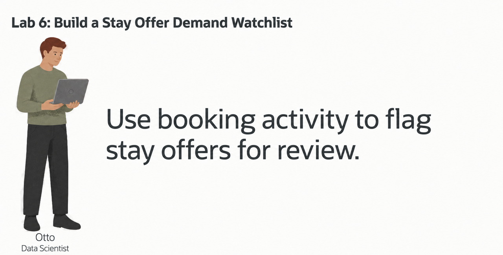
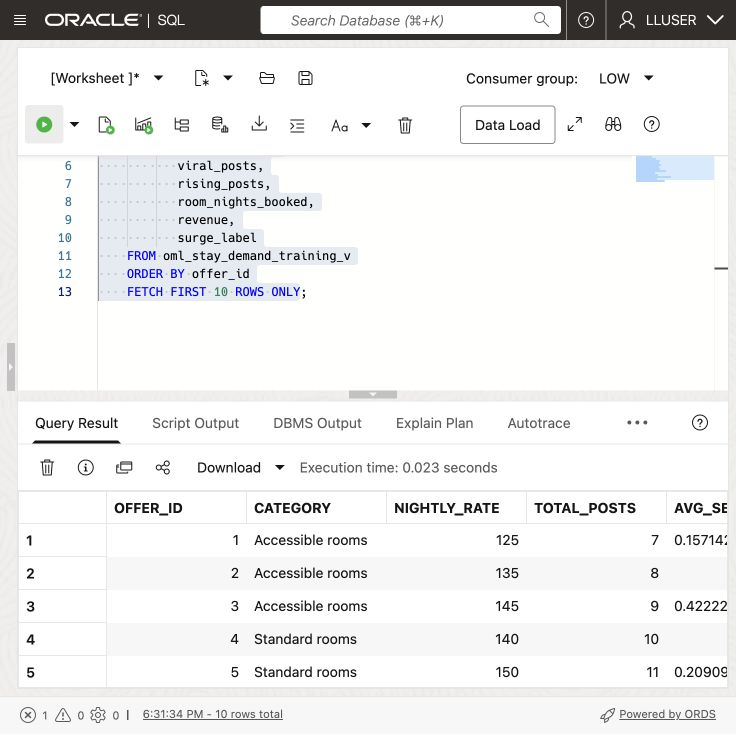
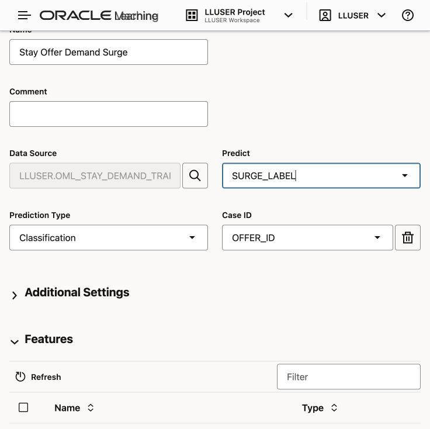
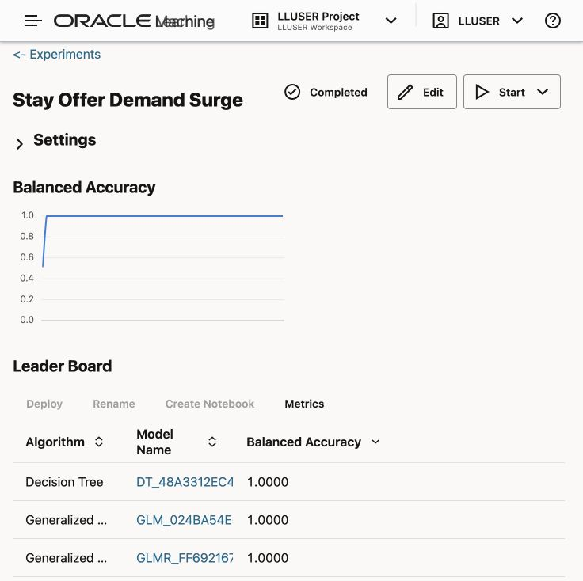
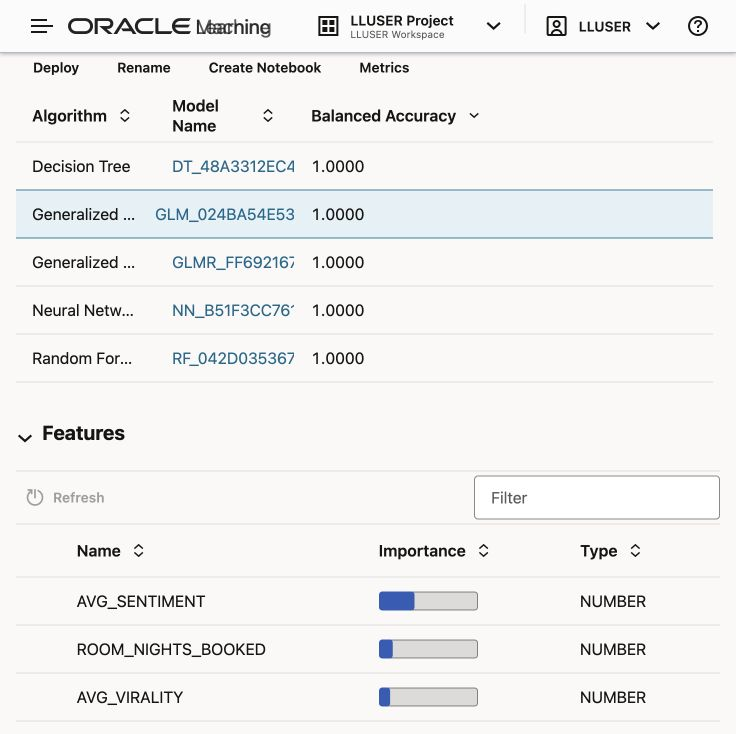
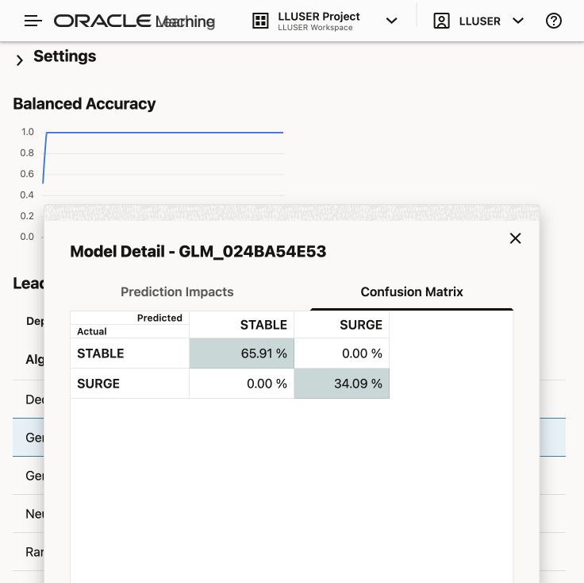
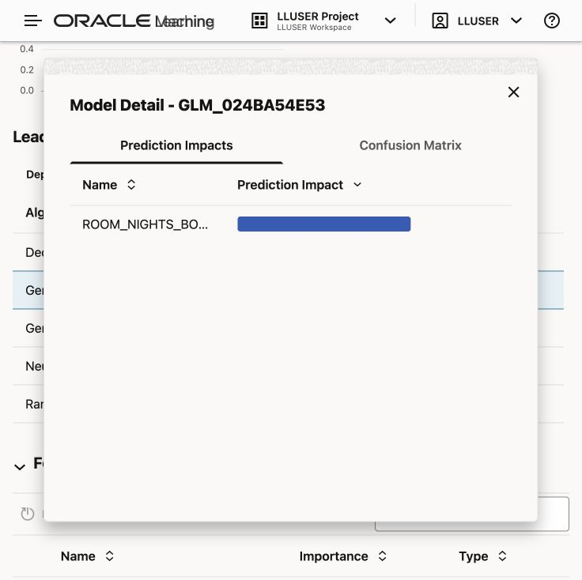
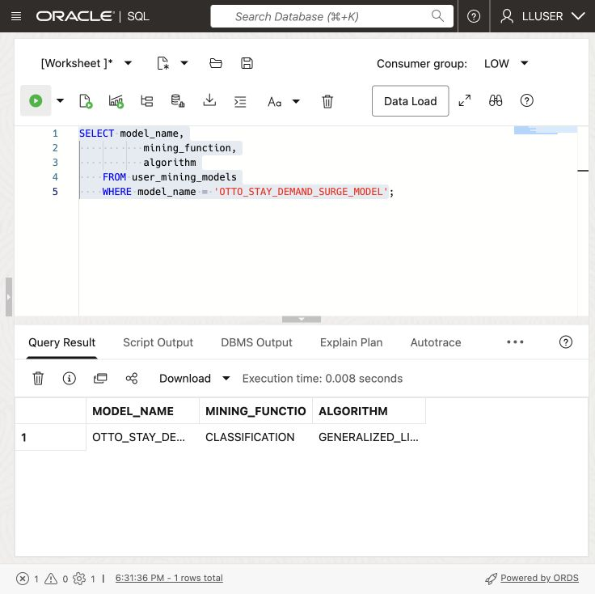
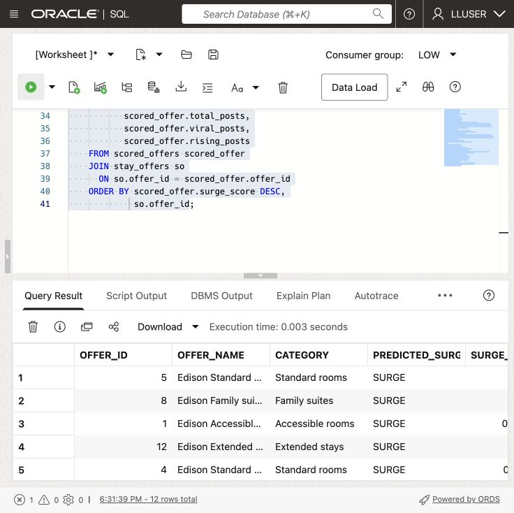

# Build a Stay Offer Demand Watchlist with Oracle Machine Learning

## Introduction

Otto Spencer, Seer Hotels’ data scientist, is building a demand watchlist. Guest-service staff need to see which stay offers may face a surge and the booking activity behind each prediction.

Train a model to classify offers as `SURGE` or `STABLE`, then combine its scores with stay offer details in SQL. You can also compare candidate models in the optional AutoML task.



<details>
<summary><strong>Key terms: model, feature, classification, probability, and in-database machine learning</strong></summary>

> - A **model** is a set of learned rules that turns input data into a prediction.
>
> - A **feature** is an input value used by the model. In this lab, features include stay offer category, price, social activity, and bookings.
>
> - **Classification** predicts a label. Otto's model predicts either `SURGE` or `STABLE`.
>
> - A **probability** is the model’s estimated value for a particular class. `SURGE_SCORE` is the probability assigned to `SURGE`, from 0 to 1. `SURGE_PCT` shows the same value as a percentage. Use the score to rank stay offers for review, not as a guarantee of a future outcome.
>
> - **In-database machine learning** means the model is trained or scored where the source data already lives. The SQL result can include the prediction and the data used to explain it.

</details>

### Objectives

- Read the prepared training data and identify the model target.
- Optionally use AutoML to compare classification models and inspect their predictions.
- Create the example Generalized Linear Model inside Oracle AI Database.
- Score stay offers with `PREDICTION` and `PREDICTION_PROBABILITY`.
- Combine model output with stay offer, bookings, and engagement data for a dashboard result.

Estimated Time: **10 minutes**

> **SQL Worksheet reminder:** See [Getting Started Task 2: Open SQL Worksheet](?lab=getting-started#Task2:OpenSQLWorksheet) for the steps to paste and run SQL.

## Task 1: Read the training data

Before Otto creates a model, he checks the data that will teach it. The workshop already provides `OML_STAY_DEMAND_TRAINING_V`, a view that combines stay offer, social activity, and bookings data into one row per active stay offer.

The view also contains `SURGE_LABEL`. This is the known label used during training. The demo data assigns each stay offer `SURGE` or `STABLE` from its activity values so the SQL pattern can be tested without waiting for new business outcomes.

1. Run the training-data query:

    ```sql
    <copy>
    SELECT offer_id,
           category,
           nightly_rate,
           total_posts,
           avg_sentiment,
           viral_posts,
           rising_posts,
           room_nights_booked,
           revenue,
           surge_label
    FROM oml_stay_demand_training_v
    ORDER BY offer_id
    FETCH FIRST 10 ROWS ONLY;
    </copy>
    ```

    

2. Identify the parts of each row.

    The numeric and category columns are the model inputs. `SURGE_LABEL` is the answer the model learns to predict. `OFFER_ID` identifies the stay offer but is not a business feature for this example.

## Task 2: Compare models with AutoML (optional)

Otto first uses the Oracle Machine Learning AutoML interface to compare candidate models. AutoML can select algorithms, tune them, and show how well each model identifies the two labels.

AutoML may take several minutes. Skip to Task 3 to train the example model directly in SQL Worksheet.

1. Open **Machine Learning** from Database Actions.

    Sign in using the credentials in **View Login Info**.

    

2. Click **AutoML**.

     

3. Create a new experiment with these settings:
  
    | Setting         | Value                   |
    | -----------------| -------------------------|
    | Experiment name | `Stay Offer Demand Surge`  |
    | Data source     | `OML_STAY_DEMAND_TRAINING_V` |
    | Predict         | `SURGE_LABEL`           |
    | Prediction type | `Classification`        |
    | Case ID         | `OFFER_ID`            |
  
    

    Choose **Start → Faster Results** and wait for the model leaderboard. Runtime varies; the leaderboard may take several minutes.

4. Review the leaderboard and model details.

    

    The leaderboard may show several models with a higher balanced-accuracy value than the Generalized Linear Model. Otto does not choose from that number alone. Open the different model details and inspect the confusion matrix.

    

    Inspect the confusion matrix for both `STABLE` and `SURGE`. A model that predicts only `STABLE` cannot identify demand surges, even if its overall accuracy looks high. Check false positives and missed surges before choosing a model.

    Scores on this small synthetic dataset do not establish accuracy on future bookings. Inspect errors for both classes; the next task trains a separate GLM in SQL.

    

    Review which features have the greatest prediction impact. Influence on a prediction does not prove that a feature causes the outcome.

    

## Task 3: Create the selected model in SQL Developer Web

In Database Actions, open SQL Worksheet, called SQL Developer Web in this heading. Create `OTTO_STAY_DEMAND_SURGE_MODEL` using the supplied script. It trains a separate Generalized Linear Model; it does not import an AutoML model. If you completed Task 2, compare the results.

The settings table selects the **Generalized Linear Model** algorithm. `PREP_AUTO` enables automatic preparation of the input columns.

1. Create the settings table and train the model:

    ```sql
    <copy>
    
    DROP TABLE IF EXISTS otto_stay_demand_settings;
    
    CREATE TABLE otto_stay_demand_settings (
          setting_name  VARCHAR2(30),
          setting_value VARCHAR2(4000)
        );

    INSERT INTO otto_stay_demand_settings (setting_name, setting_value)
    VALUES ('ALGO_NAME', 'ALGO_GENERALIZED_LINEAR_MODEL');

    INSERT INTO otto_stay_demand_settings (setting_name, setting_value)
    VALUES ('PREP_AUTO', 'ON');

    INSERT INTO otto_stay_demand_settings (setting_name, setting_value)
    VALUES ('ODMS_RANDOM_SEED', '20260604');

    COMMIT;

    DECLARE
      l_model_count NUMBER;
    BEGIN
      SELECT COUNT(*)
      INTO l_model_count
      FROM user_mining_models
      WHERE model_name = 'OTTO_STAY_DEMAND_SURGE_MODEL';

      IF l_model_count > 0 THEN
        DBMS_DATA_MINING.DROP_MODEL('OTTO_STAY_DEMAND_SURGE_MODEL');
      END IF;
    END;
    /

    BEGIN
      DBMS_DATA_MINING.CREATE_MODEL(
        model_name           => 'OTTO_STAY_DEMAND_SURGE_MODEL',
        mining_function      => DBMS_DATA_MINING.CLASSIFICATION,
        data_table_name      => 'OML_STAY_DEMAND_TRAINING_V',
        case_id_column_name  => 'OFFER_ID',
        target_column_name   => 'SURGE_LABEL',
        settings_table_name  => 'OTTO_STAY_DEMAND_SETTINGS'
      );
    END;
    /
    </copy>
    ```

    The model learns from the training view and is stored in the database for SQL scoring.

2. Confirm that Oracle created the model:

    ```sql
    <copy>
    SELECT model_name,
           mining_function,
           algorithm
    FROM user_mining_models
    WHERE model_name = 'OTTO_STAY_DEMAND_SURGE_MODEL';
    </copy>
    ```

    

    The result should show `CLASSIFICATION` and `GENERALIZED_LINEAR_MODEL`. Otto now has a database model that SQL can call.

## Task 4: Score new stay offer activity in SQL

Otto creates sample scoring data by changing values from the training view. This shows how to score a separate table without including the target label. Because the rows come from training data, they cannot measure accuracy on new, independent data.

1. Create the scoring table and add the new activity snapshot:

    ```sql
    <copy>
    
    DROP TABLE IF EXISTS otto_stay_demand_scoring_data;

    CREATE TABLE otto_stay_demand_scoring_data (
      offer_id    NUMBER,
      category      VARCHAR2(100),
      nightly_rate    NUMBER,
      total_posts   NUMBER,
      avg_sentiment NUMBER,
      total_likes   NUMBER,
      total_shares  NUMBER,
      total_views   NUMBER,
      avg_virality  NUMBER,
      viral_posts   NUMBER,
      rising_posts  NUMBER,
      room_nights_booked    NUMBER,
      revenue       NUMBER
    );

    INSERT INTO otto_stay_demand_scoring_data (
      offer_id,
      category,
      nightly_rate,
      total_posts,
      avg_sentiment,
      total_likes,
      total_shares,
      total_views,
      avg_virality,
      viral_posts,
      rising_posts,
      room_nights_booked,
      revenue
    )
    SELECT offer_id,
           category,
           nightly_rate,
           total_posts + 4,
           avg_sentiment,
           total_likes + 25,
           total_shares + 10,
           total_views + 500,
           avg_virality + 0.05,
           viral_posts + 1,
           rising_posts + 1,
           room_nights_booked + 3,
           revenue + (nightly_rate * 3)
    FROM (
      SELECT offer_id,
             category,
             nightly_rate,
             total_posts,
             avg_sentiment,
             total_likes,
             total_shares,
             total_views,
             avg_virality,
             viral_posts,
             rising_posts,
             room_nights_booked,
             revenue,
             ROW_NUMBER() OVER (ORDER BY offer_id) AS row_num
      FROM oml_stay_demand_training_v
    )
    WHERE row_num <= 12;

    COMMIT;
    </copy>
    ```

    This creates a small synthetic scenario from the workshop data, not observed future bookings. 
    >Note: The table has the model inputs, but it does not contain `SURGE_LABEL`. That label belongs to the historical training data and must not be passed to the model as an input.

2. Run the scoring query:

    ```sql
    <copy>
    WITH scored_offers AS (
      SELECT offer_id,
             category,
             room_nights_booked,
             revenue,
             total_posts,
             viral_posts,
             rising_posts,
             PREDICTION(
               OTTO_STAY_DEMAND_SURGE_MODEL USING
               category, nightly_rate, total_posts, avg_sentiment,
               total_likes, total_shares, total_views, avg_virality,
               viral_posts, rising_posts, room_nights_booked, revenue
             ) AS predicted_surge,
             ROUND(
               PREDICTION_PROBABILITY(
                 OTTO_STAY_DEMAND_SURGE_MODEL,
                 'SURGE' USING
                 category, nightly_rate, total_posts, avg_sentiment,
                 total_likes, total_shares, total_views, avg_virality,
                 viral_posts, rising_posts, room_nights_booked, revenue
               ), 8
             ) AS surge_score
      FROM otto_stay_demand_scoring_data
    )
    SELECT so.offer_id,
           so.offer_name,
           scored_offer.category,
           scored_offer.predicted_surge,
           scored_offer.surge_score,
           ROUND(scored_offer.surge_score * 100, 2) AS surge_pct,
           scored_offer.room_nights_booked,
           scored_offer.revenue,
           scored_offer.total_posts,
           scored_offer.viral_posts,
           scored_offer.rising_posts
    FROM scored_offers scored_offer
    JOIN stay_offers so
      ON so.offer_id = scored_offer.offer_id
    ORDER BY scored_offer.surge_score DESC,
             so.offer_id;
    </copy>
    ```

    

3. Read the result as a dashboard user.

  `PREDICTED_SURGE` is the class selected by the model. `SURGE_SCORE` is the probability assigned to `SURGE`, and `SURGE_PCT` shows that probability as a percentage. Compare the score with the activity values in the same row before deciding what to review.

## Conclusion: Put the Prediction Beside the Business Data

You trained a Generalized Linear Model in SQL Developer Web and scored sample stay offer activity. If you completed the optional AutoML task, you also compared candidate models. The final query returns a watchlist with the activity values behind each score.

## Acknowledgements

* **Author** - Matt Kowalik
* **Contributor** - Kevin Lazarz
* **Last Updated By/Date** - Matt Kowalik, September 2026
