# Find Alternative Supply Depots Using Property Graphs

## Introduction

Bob Green is a graph specialist at Seer Scientific. The clinical-supply team asks him a practical question: if Fall River cannot dispatch Order 50, where else could they find everything the order needs? To follow the order's requirements and find the inventory connections they share, Bob recommends a property graph.

Bob's starting point is simple: finding stock for one product is not enough. Both products in Order 50 must be available in sufficient quantities at the same alternative depot. Bob follows the order through its lines, then traces each product to the depots that stock it. The useful connections are where those separate product branches meet. Fall River's dispatch interruption is hypothetical; the exercise does not change depot availability or move orders.

In this lab, you will use Bob's approach to investigate the order's supply options in two views. You will start with the basic parts of a graph and use SQL/PGQ to follow connections from Fall River's open orders to their products and stocking depots. Then you will focus on Order 50 and open Graph Studio to run selected parts of the investigation as a visual graph, where the relationships become easier to explore and explain. Think of SQL as the evidence table and Graph Studio as the map of the order's product and depot connections.

Graph Studio is Oracle Database's visual workspace for property graphs. It lets an investigator see nodes, edges, and paths as an interactive network while keeping the graph backed by the same database data. Bob uses SQL/PGQ when he needs a precise, repeatable result set, such as the orders assigned to a depot or a list of candidate depots. He uses Graph Studio to explore the network visually, select a node, follow adjacent relationships, and explain why several product branches lead to the same depot.

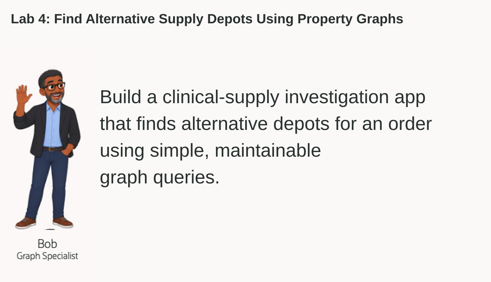

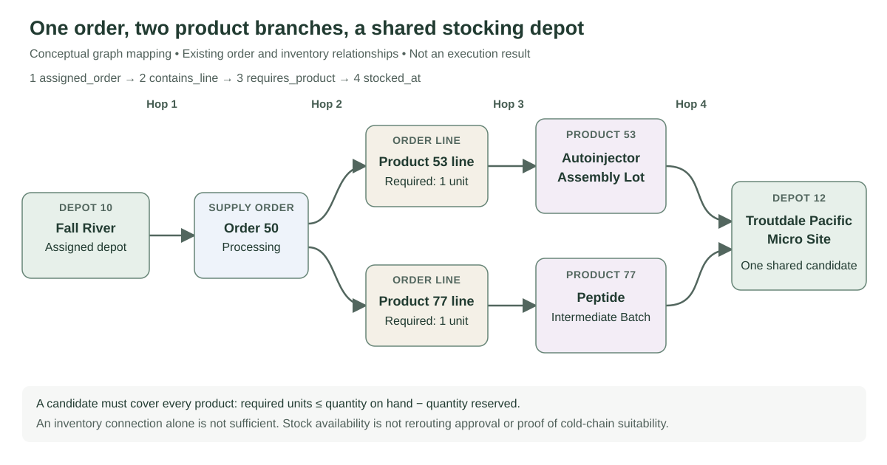

<details>
<summary><strong>Key terms: property graph, vertex, edge, and SQL Property Graph Queries (SQL/PGQ)</strong></summary>

> - A **property graph** represents things and how they are connected. In this lab, things include depots, supply orders, order lines, and products.
>
> - A **vertex** is a graph node that represents something Bob needs to review. This graph uses the labels `depot`, `supply_order`, `order_line`, and `product`. All four types also have the common label `supply_entity` for queries that follow different kinds of vertices.
>
> - An **edge** is a connection between vertices. `assigned_order` links a depot to an assigned order; `contains_line` links an order to its lines; `requires_product` links a line to its product; `stocked_at` links a product to a depot with an inventory record. Each edge also has the common label `supply_link`.
>
> - A **hop** is one step across an edge. A depot to an assigned order is one hop. Continuing to a line, its product, and a stocking depot takes four hops in total. Hop count describes the data relationships, not travel distance, custody transfers, or delivery time.
>
> - **SQL Property Graph Queries (SQL/PGQ)** describe graph patterns inside SQL, such as "start with this depot and follow its orders, products, and stocking depots." The relational tables remain the source of the data.

</details>

### Objectives

- Identify vertices and edges in a property graph.
- Follow connections from a depot through assigned orders and required products.
- Find alternative depots with enough recorded stock for every product in a selected order.
- Open Graph Studio from Database Actions.
- Import and run the Life Sciences supply-depot notebook.
- Explain what the candidate list establishes and what still requires operational review.

Estimated Time: **10 minutes**


### Hands-on Scenario

| Step | Life Sciences focus |
| --- | --- |
| Business Problem | The clinical-supply team needs to find all the products for Order 50 at one alternative depot if Fall River cannot dispatch it. |
| Technical Challenge | Bob needs to follow order and inventory relationships, then find depots shared by all required products. |
| Persona Focus | You review Bob's graph design with a clinical-supply analyst. |
| What You Will See | SQL returns assigned orders, related products, and candidate depots; Graph Studio displays the paths and shared connections. |
| Database Capability | `LS_SUPPLY_NETWORK` and `GRAPH_TABLE` support SQL/PGQ traversal over the existing order and inventory data. |
| Outcome | The team can see which depots have enough recorded stock for the whole order and which product connections support each candidate. |

Persona focus: You are reviewing Bob's graph solution with a clinical-supply analyst.

> **SQL Worksheet reminder:** Need a reminder on how to open and use SQL Worksheet? Return to [Getting Started Task 2: Open SQL Worksheet](?lab=getting-started#Task2:OpenSQLWorksheet) for the step-by-step graphic showing where to paste and run SQL statements.

## Task 1: Follow a depot's orders with SQL

Jessica has already written a query for Bob. It shows the confirmed and processing orders assigned to **Fall River Northeast Safety Hub**, depot `10`, including Order `50`. The query works, but it stops at the order list. To investigate where the required products are stocked, Bob needs to follow relationships several steps away.

In this lab, a **hop** means one relationship step. The assigned depot to an order is one hop. The order to its line is a second hop, the line to its product is a third, and that product to a stocking depot is a fourth. An order line matters because it records how much of the product the order needs.

1. Run Jessica's ordinary SQL query:

    ```sql
    <copy>
    SELECT d.center_id, d.center_name, o.order_id, o.order_status
    FROM fulfillment_centers d
    JOIN orders o ON o.fulfillment_center_id = d.center_id
    WHERE d.center_id = 10
      AND o.order_status IN ('confirmed', 'processing')
    ORDER BY o.order_id;
    </copy>
    ```

    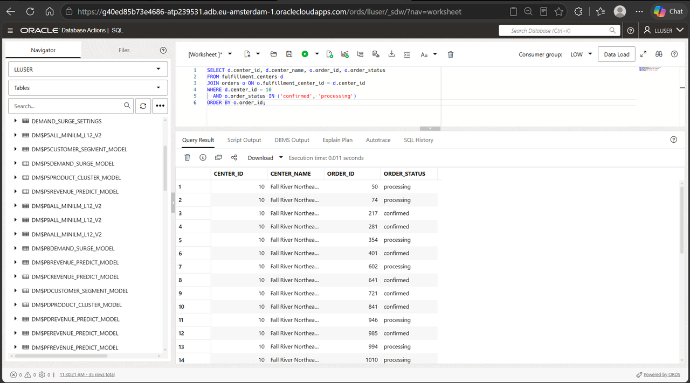

    The query joins `FULFILLMENT_CENTERS` to `ORDERS` through the order's `FULFILLMENT_CENTER_ID`. It keeps only `confirmed` and `processing` orders assigned to Fall River.

    **Expected output: Open Orders Assigned to Fall River**

    The supplied dataset contains **35 orders** with those statuses assigned to depot `10`. Order `50` is one of them. Assignment is the recorded responsibility for the order; it does not prove that every item is physically held at that depot.

2. Extend Jessica's query to follow one through four hops without using a graph query:

    ```sql
    <copy>
    WITH paths AS (
      SELECT 1 AS relationship_hops, 'ORDER' AS entity_type,
             o.order_id AS entity_id
      FROM fulfillment_centers d
      JOIN orders o ON o.fulfillment_center_id = d.center_id
      WHERE d.center_id = 10 AND o.order_status IN ('confirmed', 'processing')
      UNION ALL
      SELECT 2, 'ORDER_LINE', i.item_id
      FROM fulfillment_centers d
      JOIN orders o ON o.fulfillment_center_id = d.center_id
      JOIN order_items i ON i.order_id = o.order_id
      WHERE d.center_id = 10 AND o.order_status IN ('confirmed', 'processing')
      UNION ALL
      SELECT 3, 'PRODUCT', p.product_id
      FROM fulfillment_centers d
      JOIN orders o ON o.fulfillment_center_id = d.center_id
      JOIN order_items i ON i.order_id = o.order_id
      JOIN products p ON p.product_id = i.product_id
      WHERE d.center_id = 10 AND o.order_status IN ('confirmed', 'processing')
      UNION ALL
      SELECT 4, 'DEPOT', other.center_id
      FROM fulfillment_centers d
      JOIN orders o ON o.fulfillment_center_id = d.center_id
      JOIN order_items i ON i.order_id = o.order_id
      JOIN products p ON p.product_id = i.product_id
      JOIN inventory s ON s.product_id = p.product_id
      JOIN fulfillment_centers other ON other.center_id = s.center_id
      WHERE d.center_id = 10 AND o.order_status IN ('confirmed', 'processing')
    )
    SELECT relationship_hops, entity_type,
           COUNT(DISTINCT entity_id) AS distinct_entities
    FROM paths
    GROUP BY relationship_hops, entity_type
    ORDER BY relationship_hops;
    </copy>
    ```

    

    Jessica now needs four query branches. The first follows assigned orders, the second follows their lines, the third reaches the products, and the fourth reaches depots with inventory records for those products. Each branch adds another relationship to the previous chain.

    The query summarizes the endpoints by hop count. The open orders contain **113 order lines** covering **57 distinct products**. Those products connect to **30 depots** with inventory records. A product can appear on several lines or orders, and a stocking depot can connect to several products. `COUNT(DISTINCT entity_id)` counts each endpoint once within its type and hop count, even when several paths reach it.

3. Review how the SQL grows when it follows several relationship types.

    Ordinary joins can answer this question. Supporting each path length requires another branch and its joins, filters, and duplicate handling. Bob's graph approach makes the path itself explicit while leaving the data in those same relational tables.

    At this stage, a stocking-depot connection means an inventory row exists. It does not mean the depot is active or has enough unreserved stock. Task 4 applies those conditions to one order.

## Task 2: Read the same connections as a graph

Bob's `LS_SUPPLY_NETWORK` property graph has already been supplied for this lab. You do not need to create it before running the queries. Its definition uses the existing relational tables; it does not create a second copy of the supply data. Check the appendix to see the mapping.

In graph terms, a depot and an assigned order are **vertices**. The order's recorded depot assignment supplies the **edge** between them. `GRAPH_TABLE` lets Bob query those vertices and edges with a graph pattern while Oracle keeps the source rows in the database.

1. Run Bob's SQL/PGQ query:

    ```sql
    <copy>
    SELECT center_id, center_name, order_id, order_status
    FROM GRAPH_TABLE (ls_supply_network
      MATCH (d IS depot)-[a IS assigned_order]->(o IS supply_order)
      WHERE d.center_id = 10 AND o.order_status IN ('confirmed', 'processing')
      COLUMNS (d.center_id AS center_id, d.center_name AS center_name,
               o.order_id AS order_id, o.order_status AS order_status)
    )
    ORDER BY order_id;
    </copy>
    ```

    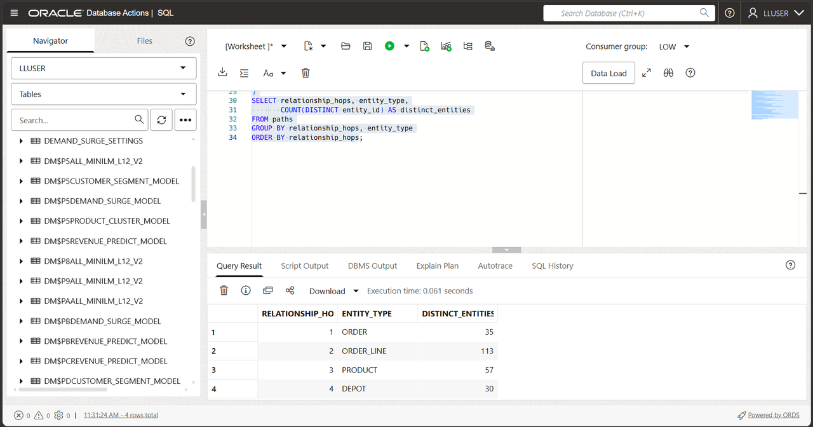

    The `MATCH` pattern starts at a `depot`, follows an `assigned_order` edge, and reaches a `supply_order`. This is one hop. Those names are labels defined in `LS_SUPPLY_NETWORK`.

    The result has the same **35 orders** as Jessica's direct-connections query. The difference is how Bob describes the question: start at one vertex, follow one edge, and return the connected vertex. Compare the order IDs and statuses, not only the row count.

## Task 3: Trace the four-hop supply connections

Start from Fall River and trace the orders, order lines, products, and stocking depots within four relationship hops.

1. Run the SQL/PGQ traversal.

    In the `MATCH` pattern, the starting vertex is a `depot`. Bob first follows an `assigned_order` edge to a `supply_order` so he can filter on the order's status. The `-[e IS supply_link]->{0,3}` pattern then follows zero, one, two, or three additional outgoing edges. Including the first assignment edge, that produces paths of one through four hops. Zero additional edges means the reached vertex is the order itself.

    The common `supply_link` and `supply_entity` labels let that additional path cross different relationship and vertex types. `1 + COUNT(e.relationship_type)` includes the initial assignment hop. The `WHERE` clause anchors the search on Fall River's confirmed and processing orders, and `COLUMNS` returns graph properties in a normal SQL result table. The graph pattern expresses the same progression as the ordinary SQL branches in Task 1.

    ```sql
    <copy>
    SELECT relationship_hops, entity_type,
           COUNT(DISTINCT entity_id) AS distinct_entities
    FROM GRAPH_TABLE (ls_supply_network
      MATCH (d IS depot)-[a IS assigned_order]->(o IS supply_order)
            -[e IS supply_link]->{0,3}(reached IS supply_entity)
      WHERE d.center_id = 10 AND o.order_status IN ('confirmed', 'processing')
      COLUMNS (1 + COUNT(e.relationship_type) AS relationship_hops,
               reached.entity_type AS entity_type,
               reached.entity_id AS entity_id)
    )
    GROUP BY relationship_hops, entity_type
    ORDER BY relationship_hops;
    </copy>
    ```

    **Expected output: Orders, Products, and Stocking Depots Connected to Fall River**

    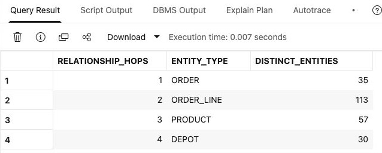

2. Review the connected entities.

    A one-hop endpoint is an assigned order. Two hops reach an order line, three reach its product, and four reach a depot holding an inventory record for that product. Several paths can reach the same product or depot, so the outer SQL groups by hop count and type and counts distinct endpoints. Compare all four rows with Task 1's ordinary SQL summary.

    This table is a map of recorded relationships, not a list of approved replacement depots. Some reached depots may be inactive or short of stock, and the original depot may appear again. Bob now narrows the question to Order `50` and checks whether one other depot can cover all its products.

## Task 4: Find depots that cover every product in an order

Bob now moves from Fall River's wider network to the order the team asked about: **which other active depots have enough unreserved stock for every product in Order 50?** A depot connected to just one required product will not solve the team's problem; the product branches must meet at the same qualifying depot.

1. Run Bob's candidate-depot query:

    ```sql
    <copy>
    WITH required_products AS (
      SELECT product_id, SUM(quantity) AS units_required
      FROM order_items
      WHERE order_id = 50
      GROUP BY product_id
    ), graph_stock AS (
      SELECT product_id, center_id, center_name, is_active, units_available
      FROM GRAPH_TABLE (ls_supply_network
        MATCH (p IS product)-[s IS stocked_at]->(d IS depot)
        COLUMNS (p.product_id AS product_id, d.center_id AS center_id,
                 d.center_name AS center_name, d.is_active AS is_active,
                 s.quantity_on_hand - s.quantity_reserved AS units_available)
      )
    )
    SELECT s.center_id, s.center_name,
           COUNT(*) AS products_covered,
           SUM(r.units_required) AS order_units_required,
           MIN(s.units_available - r.units_required) AS minimum_product_surplus
    FROM required_products r
    JOIN graph_stock s ON s.product_id = r.product_id
    WHERE s.is_active = 1
      AND s.center_id <> (SELECT fulfillment_center_id FROM orders WHERE order_id = 50)
      AND s.units_available >= r.units_required
    GROUP BY s.center_id, s.center_name
    HAVING COUNT(*) = (SELECT COUNT(*) FROM required_products)
    ORDER BY s.center_id;
    </copy>
    ```

    The query first reads the selected order's lines and sums the line quantities **per product before comparing them with inventory**. It then uses a graph pattern to follow `stocked_at` edges from those products to depots. If an order repeats the same product on two lines, the depot must cover their combined quantity.

    Recorded unreserved stock is `QUANTITY_ON_HAND - QUANTITY_RESERVED`. A candidate must be active, differ from the order's assigned depot, and cover **every distinct required product**. A missing inventory row or a stock shortfall prevents that depot from covering the order; matching only one product is not enough.

2. Review the business result.

    Order `50` has two lines: **Autoinjector Assembly Lot** (product `53`) and **Peptide Intermediate Batch** (product `77`), one unit of each.

    Four depots meet both product requirements: **Troutdale Pacific Micro Site** (12), **Lebanon Central Biologics Warehouse** (13), **Romulus Great Lakes Bioprocess Hub** (15), and **Sparks West Coast Cold Chain Hub** (24). Each covers both products and the order's two required units, as shown in the result below.

    `MINIMUM_PRODUCT_SURPLUS` is the smallest remaining quantity among the required products after subtracting this order's requirement. It is not a total across different products and does not reserve that stock.

    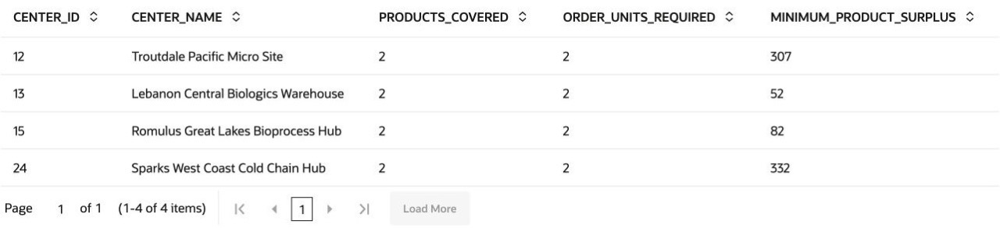

    *The same query's full result is shown here in Graph Studio's table view, which you will use in Task 7.*

    Each candidate has enough recorded unreserved stock for this order considered on its own. The result does not allocate inventory, promise delivery, or establish temperature suitability or product-release status. Product names containing "Lot" or "Batch" are names in this dataset, not batch-level traceability records.

## Task 5: Visualize the relationship using Oracle Graph Studio

Now, what if Bob wanted people to have pattern visualization at their disposal? The SQL above showed which four depots meet the order's product and quantity requirements; the same relationships can also be shown visually. Graph Studio turns them into an interactive network so Bob can show the clinical-supply team how both product branches lead to each qualifying depot.

In the following tasks, you will turn the SQL evidence for Order `50` into a supply-network map. The notebook keeps the picture focused on this order so the two product branches are easy to follow.

1. Start from the Database Actions Launchpad. Confirm that the upper-right corner shows `LLUSER`.

    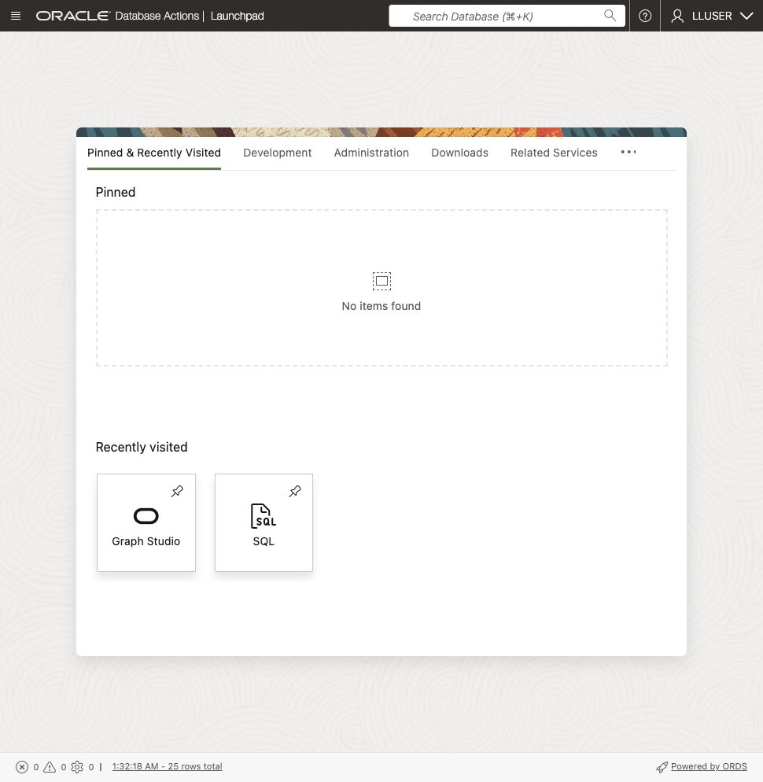

2. On the **Development** tab, select **Graph Studio** from the left-side tool list and click **Open**.

    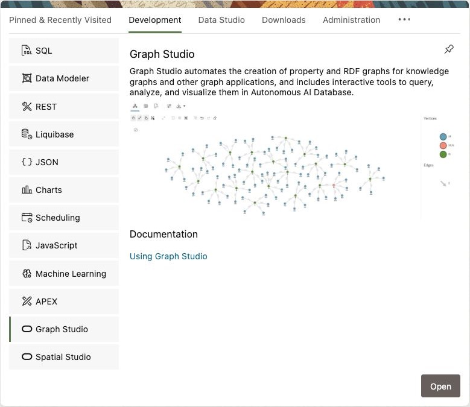

3. If prompted, sign in with `LLUSER` and the workshop password supplied.

4. Confirm that the Graph Studio home page opens. The landing page provides **Graphs**, **Notebooks**, **Templates** and **Jobs**.

    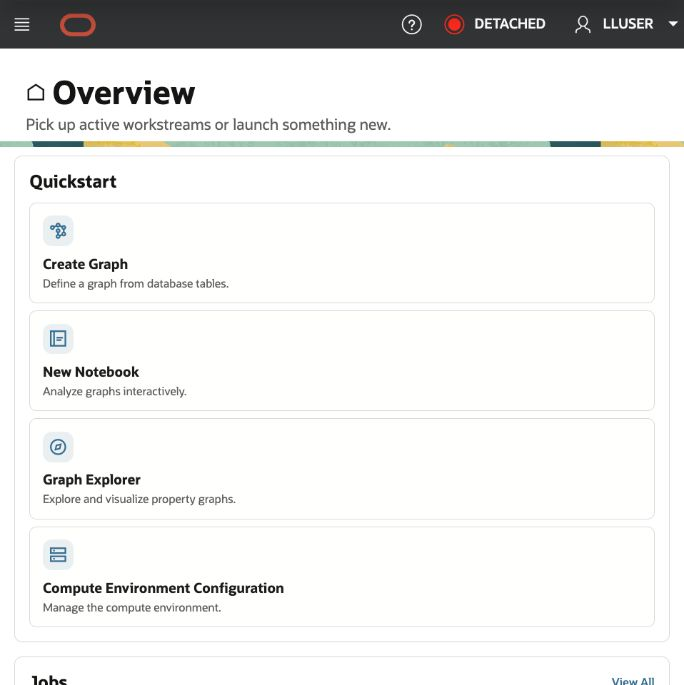

## Task 6: Download and import the Life Sciences notebook

The supplied `.dsnb` file is a native Graph Studio notebook: a reusable, runnable investigation guide that combines SQL/PGQ paragraphs and graph visualizations.

1. Download [lifesciences-supply-depot-network.dsnb](files/lifesciences-supply-depot-network.dsnb).

    If the notebook opens in your browser instead of downloading, right-click the link and select **Save Link As**.

2. In Graph Studio, click **Notebooks**.

    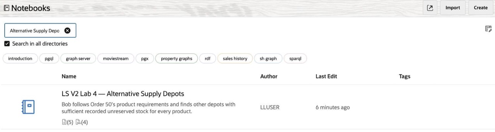

3. Select **Import** in the upper-right corner.

    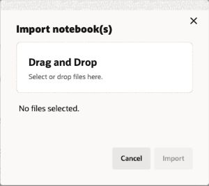

4. Drag and drop the downloaded file into the import window, or browse to the file on your computer. Review the selected filename and click **Import**. Open **LS V2 Lab 4 — Alternative Supply Depots** after import completes.

    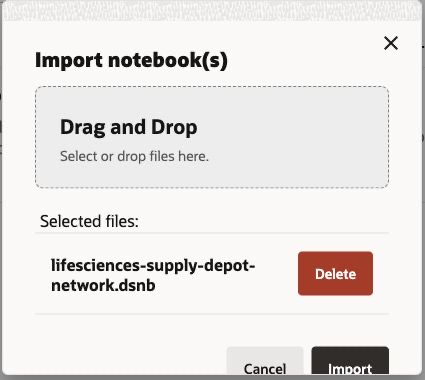

## Task 7: Run and interpret the Graph Studio notebook

You already ran the SQL/PGQ patterns in SQL Worksheet. Now run selected parts of that investigation in Graph Studio. The notebook shows Order `50` and its products, then displays the alternative depots connected to all those products.

The advantage of Graph Studio is relationship context: a table lists the candidate depots, while the visual graph shows the branches that converge on them.

1. Start at the top of **LS V2 Lab 4 — Alternative Supply Depots**. Read the explanation, then run the first SQL paragraph.

    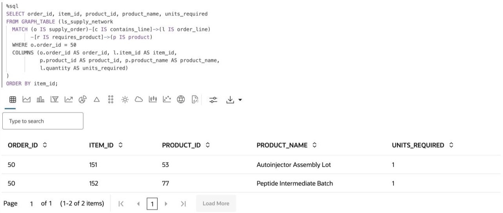

2. Review the results in table format.

    Compare the order, product IDs, and required quantities with Task 4. A useful candidate must appear on both product branches and pass the quantity checks, not merely have an inventory connection to one product.

    | Paragraph | Result | Investigation purpose |
    | --- | --- | --- |
    | Order 50 Product Requirements | Table | Shows the products and quantities required by the selected order. |
    | Graph Visualization of the Order Requirements | Explanation and graph visualization | Follows the assigned depot, order, lines, and products so each relationship is visible. |
    | Alternative Depot Coverage | Table | Checks active alternative depots against every required product and its quantity. |
    | Shared Stocking Depots | Explanation and graph visualization | Shows the required products converging on the qualifying depots. |

3. Under **Graph Visualization of the Order Requirements**, run the SQL paragraph for Order `50`.

    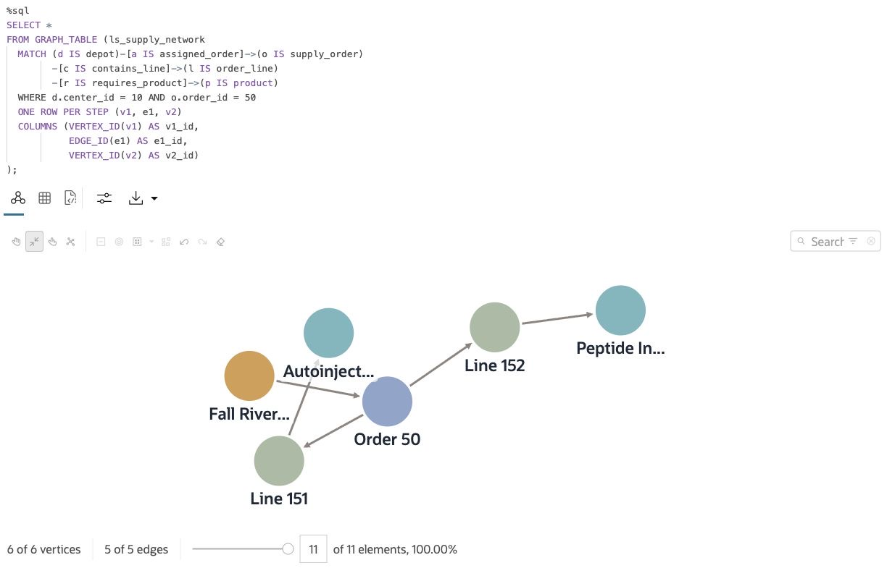

    Follow the arrows from Fall River to the order, then through its two lines to products `53` and `77`. The graph contains **six vertices and five distinct edges**. Both product paths share the same depot-to-order edge; the visualizer draws that edge once. Select a line vertex to inspect its required quantity. The edges represent database relationships, not physical custody or transport routes.

4. Under **Alternative Depot Coverage**, run the SQL paragraph and review its table. Compare the four depot IDs and quantities with Task 4 before moving to the picture.

5. Under **Shared Stocking Depots**, read the explanation and run the final SQL paragraph.

    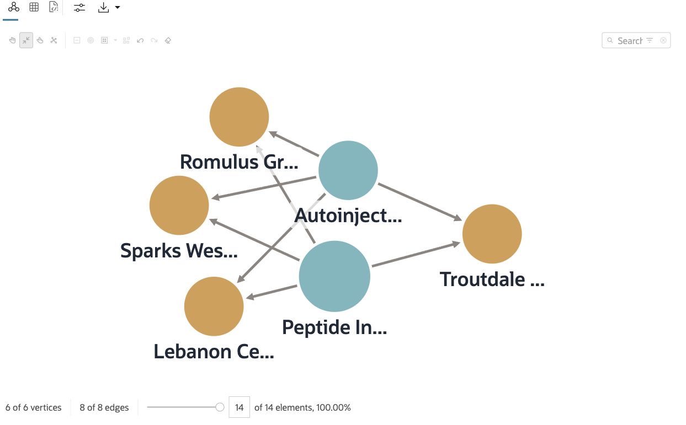

    The two product branches meet at each candidate depot: **two product vertices, four depot vertices, and eight inventory edges**. Select a depot or inventory edge to inspect its properties and compare its ID and stock values with the SQL results. The graph should explain the candidate table, not introduce extra candidates or new relationships.

> **Generated result note:** Graph layouts and node positions can vary between runs. Compare order IDs, product IDs, depot IDs, relationship evidence, and query results rather than exact node positions.

Congratulations, you have navigated Graph Studio. You used SQL/PGQ for precise, repeatable results, then explored the order's dependencies and shared stocking depots as an interactive network.

## Conclusion: Make Relationships Easy to Review

Bob's investigation answers the team's question about Order 50: four alternative depots have enough recorded unreserved stock for both required products. He started with Fall River's assigned orders, followed their lines and products, and found the depots shared by this order's product branches. Graph queries express those paths directly while SQL supplies the quantity checks and result table.

The same relationships were shown visually in Graph Studio. The table lists the four candidates; the network shows why each belongs on the list by connecting it to both required products. Both views use the supplied relational data. The clinical-supply team has a shortlist to review, not a rerouting decision or proof of cold-chain suitability.

## Appendix: Create the Property Graph

Bob maps existing relational rows to graph elements. `FULFILLMENT_CENTERS`, `ORDERS`, `ORDER_ITEMS`, and `PRODUCTS` provide the depot, order, line, and product vertices. The `LS_SUPPLY_ASSIGNMENTS_V` view exposes orders that have a recorded depot assignment; it provides assignment edges without inventing an assignment for orders whose depot is null. Order-item and inventory rows supply the remaining relationships and their properties.

Each vertex has a specific type label and the common `supply_entity` label. Each edge has a specific relationship label and the common `supply_link` label. The specific labels express a selected relationship; the common labels let Bob follow different kinds of relationships in one quantified path.

The following definition is for reference only. **Do not run it: `LS_SUPPLY_NETWORK` and its supporting view already exist in the workshop database.**

```sql
-- Lab 4 supply-depot graph. Metadata only: no source rows are copied or changed.
-- Owner: LLUSER. Reference definition only; the graph is already supplied.
CREATE VIEW ls_supply_assignments_v AS
SELECT order_id, fulfillment_center_id, order_status
FROM orders
WHERE fulfillment_center_id IS NOT NULL;

COMMENT ON TABLE ls_supply_assignments_v IS 'One edge per source order with an assigned depot; not a physical custody or stock assertion.';

CREATE PROPERTY GRAPH ls_supply_network
  VERTEX TABLES (
    fulfillment_centers AS depots KEY (center_id)
      LABEL depot PROPERTIES (center_id, center_name, is_active)
      LABEL supply_entity PROPERTIES (
        CAST(center_id AS NUMBER) AS entity_id,
        CAST(center_name AS VARCHAR2(300)) AS display_name,
        CAST('DEPOT' AS VARCHAR2(30)) AS entity_type),
    orders AS supply_orders KEY (order_id)
      LABEL supply_order PROPERTIES (order_id, order_status, fulfillment_center_id)
      LABEL supply_entity PROPERTIES (
        CAST(order_id AS NUMBER) AS entity_id,
        CAST('Order ' || TO_CHAR(order_id) AS VARCHAR2(300)) AS display_name,
        CAST('ORDER' AS VARCHAR2(30)) AS entity_type),
    order_items AS order_lines KEY (item_id)
      LABEL order_line PROPERTIES (item_id, order_id, product_id, quantity)
      LABEL supply_entity PROPERTIES (
        CAST(item_id AS NUMBER) AS entity_id,
        CAST('Line ' || TO_CHAR(item_id) AS VARCHAR2(300)) AS display_name,
        CAST('ORDER_LINE' AS VARCHAR2(30)) AS entity_type),
    products AS supply_products KEY (product_id)
      LABEL product PROPERTIES (product_id, product_name, category, is_active)
      LABEL supply_entity PROPERTIES (
        CAST(product_id AS NUMBER) AS entity_id,
        CAST(product_name AS VARCHAR2(300)) AS display_name,
        CAST('PRODUCT' AS VARCHAR2(30)) AS entity_type)
  )
  EDGE TABLES (
    ls_supply_assignments_v AS assignments KEY (order_id)
      SOURCE KEY (fulfillment_center_id) REFERENCES depots (center_id)
      DESTINATION KEY (order_id) REFERENCES supply_orders (order_id)
      LABEL assigned_order PROPERTIES (order_id, order_status)
      LABEL supply_link PROPERTIES (
        CAST('ASSIGNED_ORDER' AS VARCHAR2(30)) AS relationship_type),
    order_items AS order_contents KEY (item_id)
      SOURCE KEY (order_id) REFERENCES supply_orders (order_id)
      DESTINATION KEY (item_id) REFERENCES order_lines (item_id)
      LABEL contains_line PROPERTIES (item_id)
      LABEL supply_link PROPERTIES (
        CAST('CONTAINS_LINE' AS VARCHAR2(30)) AS relationship_type),
    order_items AS product_requirements KEY (item_id)
      SOURCE KEY (item_id) REFERENCES order_lines (item_id)
      DESTINATION KEY (product_id) REFERENCES supply_products (product_id)
      LABEL requires_product PROPERTIES (item_id, quantity)
      LABEL supply_link PROPERTIES (
        CAST('REQUIRES_PRODUCT' AS VARCHAR2(30)) AS relationship_type),
    inventory AS stock_positions KEY (inventory_id)
      SOURCE KEY (product_id) REFERENCES supply_products (product_id)
      DESTINATION KEY (center_id) REFERENCES depots (center_id)
      LABEL stocked_at PROPERTIES (inventory_id, quantity_on_hand, quantity_reserved)
      LABEL supply_link PROPERTIES (
        CAST('STOCKED_AT' AS VARCHAR2(30)) AS relationship_type)
  )
  OPTIONS (TRUSTED MODE);

COMMENT ON PROPERTY GRAPH ls_supply_network IS 'Supply-order and recorded-inventory relationships; no batch genealogy, temperature qualification, reservation, or rerouting is inferred.';
```

The definition stores the graph mapping; it does not move rows to a separate graph database. `GRAPH_TABLE` reads the underlying relational data. No order, depot, product, or inventory row is changed by the queries in this lab.

## Acknowledgements

* **Author** - Kevin Lazarz, Linda Foinding
* **Contributor** - Eugenio Galiano, Ramu Murakami Gutierrez
* **Last Updated By/Date** - Joshua Pasaribu, October 2026
