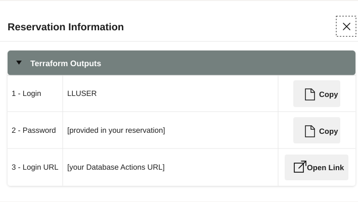
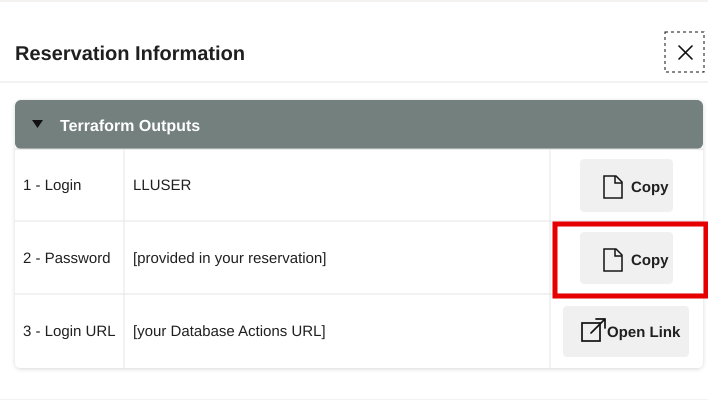
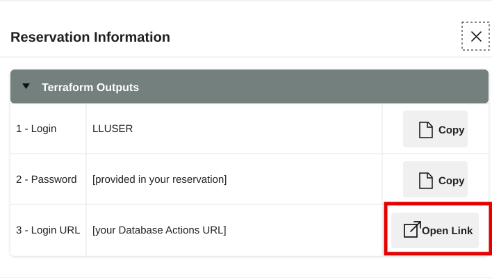
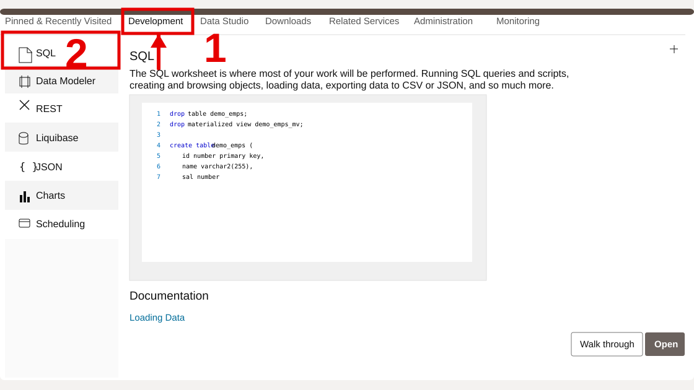
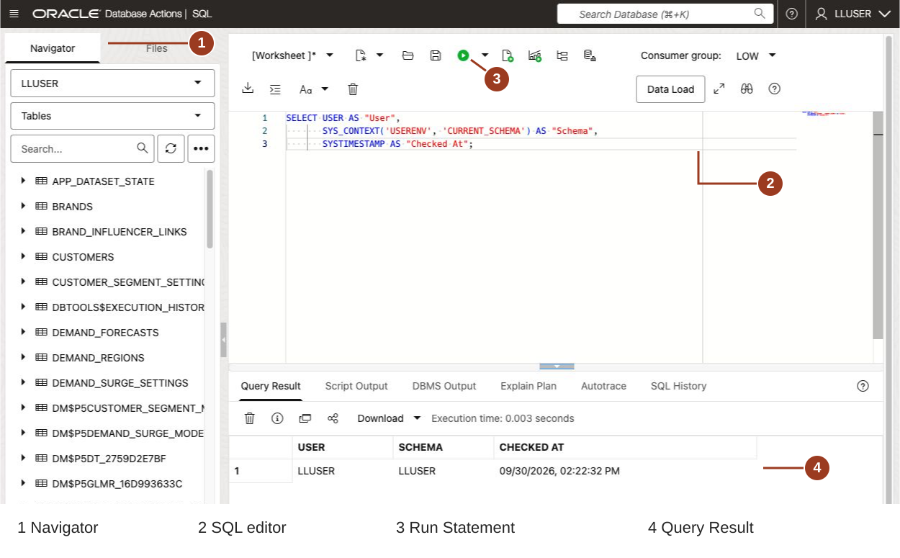

# Getting Started

## Introduction

Open your LiveLabs reservation, sign in to the prepared **Autonomous Database 26ai** instance, and open SQL Worksheet. You will use the workshop account to query the life sciences data throughout the exercises.

<details>
<summary><strong>Key terms: Database Actions, SQL Worksheet, and LLUSER</strong></summary>

> - **Database Actions** is the browser-based Oracle Database workspace you use in this workshop. It gives you access to tools such as SQL Worksheet, object browsing, data loading, and development utilities without installing a desktop database client.
>
> - **SQL Worksheet** is the tool inside Database Actions where you paste and run SQL statements. Use it to inspect query results, script output, and errors throughout the workshop.
>
> - `LLUSER` is the workshop database user and schema owner for the hands-on Life Sciences objects. Use this account for the exercises. Shared objects, such as the supplied embedding model, are referenced with their owner's name where required.

</details>

Estimated Time: **5 minutes**

### Objectives

In this lab, you will:

- Launch the LiveLabs workshop environment.
- Use the reservation login information to open Database Actions.
- Open SQL Worksheet for the exercises.
- Confirm that SQL Worksheet is connected as the workshop schema user.

## Task 1: Launch the LiveLabs environment

Open the prepared workshop resources from your LiveLabs reservation.

1. Sign in to [LiveLabs](https://livelabs.oracle.com) with your Oracle account.

2. Open this workshop, select **Start**, and select **Run on LiveLabs Sandbox**.

3. In **My Reservations**, select **Launch Workshop** for this reservation.

4. Select **View Login Info** and keep the database credentials available for the next task.

    

    *Figure 1: The Reservation Information dialog shows the `LLUSER` login, password, and Login URL for Database Actions.*

## Task 2: Open SQL Worksheet

Open SQL Worksheet as `LLUSER` before running the exercises. Use it to run queries and inspect their results.

1. In the **Reservation Information** dialog, confirm that **1 - Login** shows `LLUSER`.

2. Select **Copy** for **2 - Password**.

    

    *Figure 2: Copy the `LLUSER` password from the Reservation Information dialog.*

3. Select **Open Link** for **3 - Login URL**.

    

    *Figure 3: Use Open Link for the Login URL, then use the copied password to sign in as `LLUSER`.*

4. On the Database Actions sign-in page, confirm that **Username** shows `LLUSER`, paste the password from the reservation information, and select **Sign in**.

    

    *Figure 4: Sign in to Database Actions as `LLUSER` with the password from the reservation information.*

5. In Database Actions, select **Development**, then select **SQL** from the tools menu.

    

    *Figure 5: Open SQL from the Development tools menu.*

6. Use the same SQL Worksheet pattern throughout the workshop.

    

    *Figure 6: SQL Worksheet after a successful LLUSER connection check. Navigator (1) lists database objects. Paste SQL in the editor (2), choose Run Statement (3), and read Query Result (4).*

    - Confirm the user dropdown shows the main workshop user, usually `LLUSER`.
    - Paste each workshop SQL block into the editor.
    - Use **Run Statement** or **Ctrl+Enter** for one SQL statement. When a step specifies Run Script (F5), use it for the complete block.
    - Review the output in **Query Result** or **Script Output**, depending on the step.
    - Use **Navigator** only when you want to inspect tables, views, or other objects.

7. Run this check.

    This check makes sure SQL Worksheet is connected as the right user before you start. `USER` shows who signed in, while `SYS_CONTEXT('USERENV', 'CURRENT_SCHEMA')` shows where table names resolve. The Life Sciences labs use `LLUSER`, so both values should point to the workshop schema.

    ```sql
    <copy>
    SELECT USER AS "User",
           SYS_CONTEXT('USERENV', 'CURRENT_SCHEMA') AS "Schema",
           SYSTIMESTAMP AS "Checked At";
    </copy>
    ```

    

    **Expected output: Connected SQL Worksheet Session**

    | User | Schema | Checked At |
    | --- | --- | --- |
    | LLUSER | LLUSER | Current SQL Worksheet timestamp |


8. You can use this same connection check whenever you want to confirm that SQL Worksheet is still running as `LLUSER`.

You can now continue to the Life Sciences labs.

## Acknowledgements

* **Author** - Joshua Pasaribu
* **Contributor** - Nechita C. Teodor
* **Last Updated By/Date** - Nechita C. Teodor, October 2026
