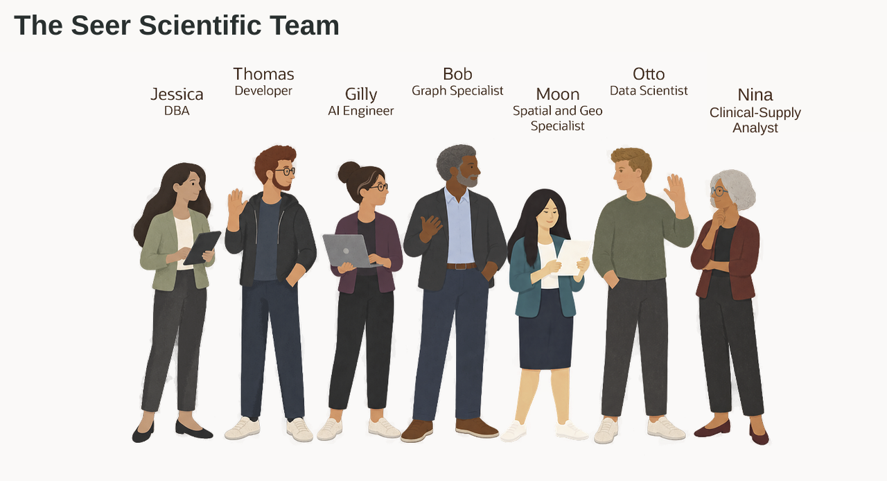

# Build Connected Life Sciences Solutions with Oracle AI Database

## Introduction

A quality alert lands before the clinical supply meeting starts. Seer Scientific needs to know which regulated products, trial sites, cold-chain locations, and supply-depot relationships deserve attention first, and every answer must be explainable.

Jessica Chan is the database administrator at Seer Scientific. Her teams are building clinical supply applications, reviewing product concerns, evaluating service coverage, and adding AI to quality and supply dashboards.

The requests look different, but they share one problem. The data is already in Oracle AI Database, and each team wants to use it in a different way:

- Thomas needs clinical supply orders as JSON for a web and mobile application.
- Gilly needs semantic search that can find products by meaning, not only by matching words.
- Bob needs to follow supply orders to their required products and find alternative depots with enough recorded stock.
- Moon needs to calculate distances between trial sites, cold-chain supply centers, and demand regions.
- Otto needs to train and score a product demand model.
- Nina needs to ask quality and clinical-supply questions in plain language and turn the answers into a useful review.

Jessica's job is to help each team meet its requirement without creating a new data copy or a separate security model for every feature. She uses Oracle AI Database as the shared foundation: relational tables remain the source for Life Sciences records, while JSON, vectors, graphs, spatial data, machine learning, and AI services work with those same records.

This workshop follows Jessica and her colleagues as they solve these problems and help Seer Scientific improve quality investigations and clinical-supply operations. Each lab focuses on one business requirement, but the database remains the common thread. You will see how the teams use different data types and database capabilities together, and how Jessica keeps access, SQL, and results visible.

### What the team builds

| Team member | Requirement | What you will see |
| --- | --- | --- |
| Jessica, DBA | Build the query behind a quality and supply operations dashboard. | One SQL result combines quality and supply data, semantic product matching, JSON order data, and location data. |
| Thomas, application developer | Give the application flexible clinical supply order documents. | JSON columns, JSON collections, and JSON Relational Duality Views provide different ways to serve application data. Practice writes use isolated exercise objects. |
| Gilly, AI engineer | Find products related to a sterility concern. | With the supplied in-database embedding model, Gilly creates vectors where the product data already lives. |
| Bob, graph specialist | Find alternative depots with enough recorded stock for every product in one supply order. | SQL/PGQ follows existing order and inventory relationships; Graph Studio shows the product branches and the candidate depots they share. |
| Moon, spatial expert | Evaluate cold-chain coverage using trial-site, supply-center, and region locations. | The database calculates distance from geographic data that the application can also display. Proximity alone does not establish cold-chain suitability. |
| Otto, data scientist | Identify regulated products that may face a supply-demand surge. | Oracle Machine Learning trains and scores a model inside the database, close to the product and activity data. The exercise demonstrates scoring, not unseen-data accuracy. |
| Nina, clinical-supply analyst | Ask Life Sciences questions without writing every query from scratch. | Select AI generates SQL that Nina can inspect, run, and refine. Select AI Agent adds a restricted SQL question-answering tool and records the agent activity. |

The point is not to use every capability in every query. The point is that Jessica does not have to move the data into a separate database whenever a requirement changes. The same Life Sciences records can support:

- An application payload.
- A vector search.
- A graph investigation.
- A spatial calculation.
- A model score.
- A natural-language question.

<strong>Learn more: What does "converged database" mean?</strong>

> A converged database supports different data types and workloads on one database foundation. In this workshop, that includes relational rows, JSON documents, vectors, graphs, geographic data, machine learning models, and AI-assisted SQL.
>
> The advantage is practical. Teams can use the data in the form their application or analysis needs while keeping the records, privileges, and SQL access connected. They do not need to copy Life Sciences data into a document store, vector service, graph database, mapping system, or separate scoring service for each requirement.

This workshop uses synthetic demonstration data. Some exercises create isolated practice objects or derived data such as embeddings and model scores; they do not require a separate production database for each capability.

### Objectives

- Follow Jessica and her team as they solve different Life Sciences application and analysis requirements.
- Use relational SQL, JSON, vectors, graphs, spatial data, Oracle Machine Learning, Select AI, and Select AI Agent in practical tasks.
- See how one Oracle AI Database can support different data types without separate production stores for the Life Sciences records.
- Understand how database privileges, restricted AI profiles, approved tools, and execution history keep AI-assisted work visible and controlled.
- Connect the database work to the Seer Scientific clinical-supply LiveStack demo.

Estimated Workshop Time: **90 minutes**

## Acknowledgements

* **Author** - Kevin Lazarz
* **Contributor** - Eugenio Galiano, Pat Shepherd, Linda Foinding
* **Last Updated By/Date** - Joshua Pasaribu, October 2026
