# Build a Supply Demand Watchlist with Oracle Machine Learning

## Introduction

Otto Spencer is Seer Scientific's data scientist. His team supplies the predictions used in analytics charts and dashboards.

The clinical-supply team wants a demand watchlist. A business user should be able to see which products may need more attention, which label the model assigns, and which products are already showing strong order or signal activity.

Otto has the product, order, and quality-signal activity data in Oracle AI Database. He could copy the data to a separate machine learning platform, train a model there, and copy the scores back. That would create another copy of Life Sciences data and another process for keeping scores current.

Instead, Otto builds and scores the model in the database. The model uses product activity to classify products as `SURGE` or `WATCH`, the two labels present in this workshop's training data. SQL then joins the prediction to the product name, order quantities, and signal activity that a dashboard needs.

In this lab, you build Otto's demand-surge model and turn its output into a review list for a business user. The sample labels are generated by rules, not observed future demand: this exercise teaches the machine learning workflow, not a validated clinical or supply forecast.

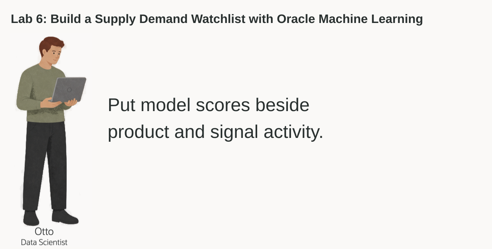

<details>
<summary><strong>Key terms: model, feature, classification, probability, and in-database machine learning</strong></summary>

> - A **model** is a set of learned rules that turns input data into a prediction.
>
> - A **feature** is an input value used by the model. In this lab, features include product category, price, signal activity, and orders.
>
> - **Classification** predicts a label. Otto's model predicts either `SURGE` or `WATCH` in this dataset.
>
> - A **probability** is the model's value for a class. In this lab, the probability of `SURGE` is displayed as a `SURGE_SCORE` to rank products for review. It is not a guarantee.
>
> - **In-database machine learning** means the model is trained or scored where the source data already lives. The SQL result can include the prediction and the data used to explain it.

</details>

### Objectives

- Read the prepared training data and identify the model target.
- Optionally use AutoML to compare classification models and inspect their predictions.
- Create a Generalized Linear Model inside Oracle AI Database.
- Score products with `PREDICTION` and `PREDICTION_PROBABILITY`.
- Combine model output with product, order, and signal data for a dashboard result.

Estimated Time: **10 minutes** (optional AutoML comparison takes additional time)

### Hands-on Scenario

| Step | Life Sciences focus |
| --- | --- |
| Business Problem | A clinical-supply user needs a short list of products that may require attention. |
| Technical Challenge | Otto needs to train and score a model without copying product activity to another machine learning system. |
| Persona Focus | You follow Otto as he builds the model and checks the result before it reaches a dashboard. |
| What You Will See | Optionally compare models with AutoML, then use SQL Developer Web to create and score the workshop model. |
| Database Capability | AutoML, `DBMS_DATA_MINING`, `PREDICTION`, and `PREDICTION_PROBABILITY` support machine learning inside the database. |
| Outcome | A watchlist for a dashboard combines the model result with the product and activity data behind it. |

> **SQL Worksheet reminder:** Need a reminder on how to open and use the SQL Worksheet? Return to [Getting Started Task 2: Open SQL Worksheet](?lab=getting-started#Task2:OpenSQLWorksheet) for the step-by-step graphic showing where to paste and run SQL statements.

## Task 1: Read the training data

Before Otto creates a model, he checks the data that will teach it. The workshop already provides `OML_DEMAND_TRAINING_V`, a view that combines product, signal activity, and order data into one row per active product. Signal and order totals are aggregated separately before they are joined, so multiple signals do not multiply the order totals.

The view also contains `SURGE_FLAG`. This is the label used during training. The source rules assign `SURGE` when average virality is at least 70, there are at least four viral or mega-viral signals, or total views reach 10 million. Otherwise, they assign `WATCH` when average virality is at least 45, there are at least five rising signals, or views reach 2.5 million; the remaining products receive `STABLE`. The prepared dataset has **79 products: 57 SURGE, 22 WATCH, and no STABLE rows**.

These are rule-generated labels based on the same activity used as model inputs. They are not previous model predictions, but neither are they independently observed future outcomes.

1. Run the training-data query:

    ```sql
    <copy>
    SELECT product_id,
           category,
           unit_price,
           total_posts,
           avg_sentiment,
           viral_posts,
           rising_posts,
           units_sold,
           revenue,
           surge_flag
    FROM oml_demand_training_v
    ORDER BY product_id
    FETCH FIRST 10 ROWS ONLY;
    </copy>
    ```

2. Identify the parts of each row.

    The numeric and category columns are the model inputs. `SURGE_FLAG` is the answer the model learns to predict. `PRODUCT_ID` identifies the product but is not a business feature for this example.

    The source retains names such as `SOCIAL_POSTS`, `VIRAL_POSTS`, and `REVENUE`. In this Life Sciences demo they carry the signal activity and order-value measures used by the application. `AVG_SENTIMENT` is an inherited synthetic activity feature, not a clinical assessment. Do not read a high signal score as proof of a quality failure.

    The following panels show the same ten rows. Product 8 has the label `WATCH`; the other nine shown have `SURGE`.

    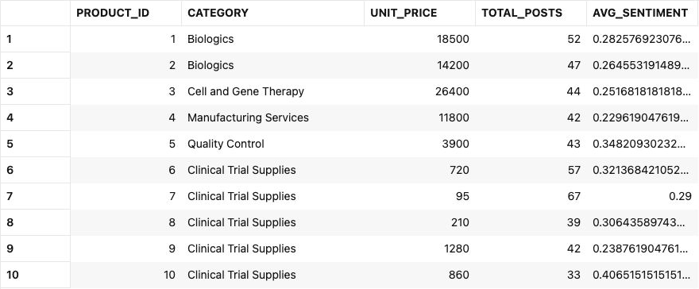

    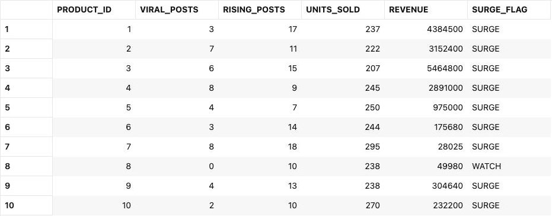

    Otto is checking that the training data already brings together the values he needs. He does not have to export signal activity, orders, and product data into separate files before training.

## Task 2: Compare models with AutoML (optional)

Otto can use the Oracle Machine Learning AutoML interface to compare candidate models. AutoML can select algorithms, tune them, and show how well each model identifies the labels.

This shows how a data scientist chooses a model: the leaderboard is a starting point, but Otto also checks whether the model identifies the business outcome he cares about.

This task is optional and requires access to the Oracle Machine Learning interface. If that interface is unavailable for your workshop user, continue with Task 3. AutoML can take several minutes to complete; you can also skip it to focus on creating and using the model in SQL Developer Web.

1. Open **Machine Learning** from Database Actions.

    Use the workshop username and password from **View Login Info**. Work in your assigned workspace and project.

2. Click **AutoML**.

3. Create a new experiment with these settings:

    | Setting | Value |
    | --- | --- |
    | Experiment name | `LS V2 Lab 6 Supply Demand Watchlist` |
    | Data source | `LLUSER.OML_DEMAND_TRAINING_V` |
    | Predict | `SURGE_FLAG` |
    | Prediction type | `Classification` |
    | Case ID | `PRODUCT_ID` |
    | Metric | `Balanced Accuracy` |
    | Run option | `Faster Results` |

    Keep these twelve predictors: `CATEGORY`, `UNIT_PRICE`, `TOTAL_POSTS`, `AVG_SENTIMENT`, `TOTAL_LIKES`, `TOTAL_SHARES`, `TOTAL_VIEWS`, `AVG_VIRALITY`, `VIRAL_POSTS`, `RISING_POSTS`, `UNITS_SOLD`, and `REVENUE`. `PRODUCT_ID` is the case identifier and `SURGE_FLAG` is the target; neither belongs in the predictor list.

    Start the experiment and wait for the model leaderboard. Runtime depends on available resources and chosen settings.

    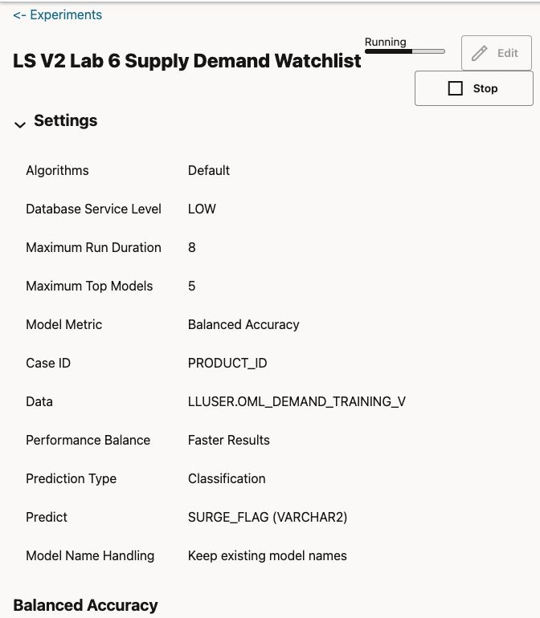

4. Review the leaderboard and model details.

    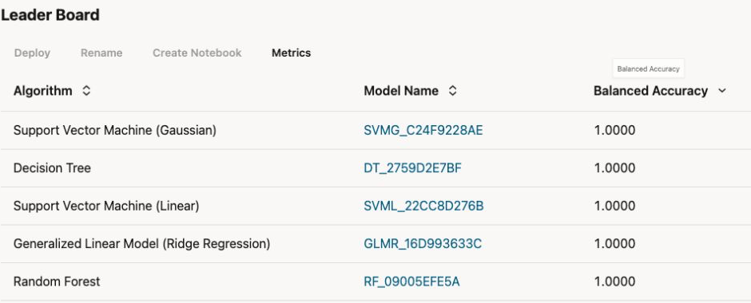

    Compare balanced accuracy, then open each candidate's confusion matrix. Inspect both `SURGE` and `WATCH`: which rule-labeled products did the model identify, and which did it misclassify? A model that assigns every product the majority label can look reassuring in an overall score while missing the smaller class.

    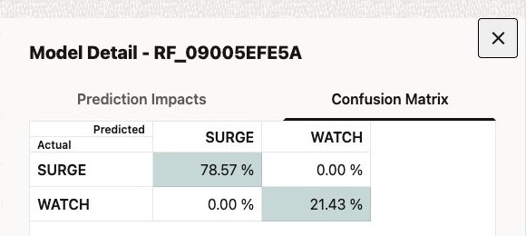

    Inspect prediction impact as well. It shows which inputs influenced the prediction; it does not prove that one input causes demand. Do not assume that the Generalized Linear Model wins, that another algorithm predicts only one class, or that your experiment matches another learner's rankings.

    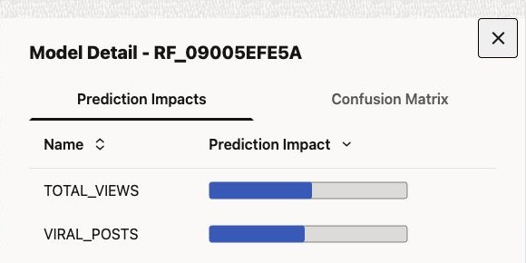

    This is Otto's decision: **consider the class-level results as well as the leaderboard score**. Even a strong result here measures agreement with the demo's rule-generated labels, not reliable prediction of future supply demand.

## Task 3: Create the selected model in SQL Developer Web

AutoML provides an optional way to compare models. Otto now moves to SQL Developer Web to create a named model that a SQL query can call repeatedly. The model is stored in Oracle AI Database under the name `LS_OTTO_DEMAND_MODEL`.

The settings table tells Oracle to use a **Generalized Linear Model**, the algorithm selected for this workshop exercise. `PREP_AUTO` lets the database handle standard preparation of the input columns. This SQL model is not an export of an AutoML experiment and need not reproduce its tuned model.

If you skipped the optional AutoML task, you can still complete this task and Task 4.

1. Create the settings table and train the model. Use **Run Script** for this block:

    ```sql
    <copy>
    DROP TABLE IF EXISTS ls_otto_demand_settings;
    
    CREATE TABLE ls_otto_demand_settings (
      setting_name VARCHAR2(30),
      setting_value VARCHAR2(4000)
    );
    
    INSERT INTO ls_otto_demand_settings (setting_name, setting_value)
    VALUES ('ALGO_NAME', 'ALGO_GENERALIZED_LINEAR_MODEL');
    
    INSERT INTO ls_otto_demand_settings (setting_name, setting_value)
    VALUES ('PREP_AUTO', 'ON');
    
    COMMIT;
    
    DECLARE
      l_model_count NUMBER;
    BEGIN
      SELECT COUNT(*) INTO l_model_count
      FROM user_mining_models
      WHERE model_name = 'LS_OTTO_DEMAND_MODEL';
      IF l_model_count > 0 THEN
        DBMS_DATA_MINING.DROP_MODEL('LS_OTTO_DEMAND_MODEL');
      END IF;
    END;
    /
    
    BEGIN
      DBMS_DATA_MINING.CREATE_MODEL(
        model_name => 'LS_OTTO_DEMAND_MODEL',
        mining_function => DBMS_DATA_MINING.CLASSIFICATION,
        data_table_name => 'OML_DEMAND_TRAINING_V',
        case_id_column_name => 'PRODUCT_ID',
        target_column_name => 'SURGE_FLAG',
        settings_table_name => 'LS_OTTO_DEMAND_SETTINGS'
      );
    END;
    /
    </copy>
    ```

    The model reads the training view, learns the relationship between the features and `SURGE_FLAG`, and stores the trained model in the database. No product or signal data leaves Oracle Database during this SQL training step. The supplied `DEMAND_SURGE_MODEL` is a different model and is not replaced.

2. Confirm that Oracle created the model:

    ```sql
    <copy>
    SELECT model_name, mining_function, algorithm
    FROM user_mining_models
    WHERE model_name = 'LS_OTTO_DEMAND_MODEL';
    </copy>
    ```

    The result should show `CLASSIFICATION` and `GENERALIZED_LINEAR_MODEL`. Otto now has a database model that SQL can call.

    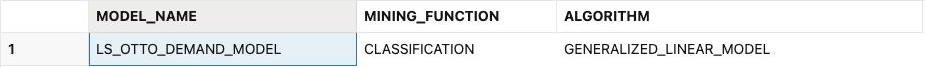

## Task 4: Score product activity in SQL

Otto now prepares a small scoring table and uses the model to build a watchlist. For this exercise, the table copies the existing inputs for products 1–12 without changing their values. These are **not unseen products or a new reporting period**; the exercise demonstrates scoring and joining the result, not a holdout accuracy test.

1. Create the scoring table and add the activity rows. Use **Run Script**:

    ```sql
    <copy>
    DROP TABLE IF EXISTS ls_otto_scoring_data;
    
    CREATE TABLE ls_otto_scoring_data (
      product_id NUMBER CONSTRAINT ls_otto_scoring_pk PRIMARY KEY,
      category VARCHAR2(100),
      unit_price NUMBER,
      total_posts NUMBER,
      avg_sentiment NUMBER,
      total_likes NUMBER,
      total_shares NUMBER,
      total_views NUMBER,
      avg_virality NUMBER,
      viral_posts NUMBER,
      rising_posts NUMBER,
      units_sold NUMBER,
      revenue NUMBER
    );
    
    INSERT INTO ls_otto_scoring_data (
      product_id, category, unit_price, total_posts, avg_sentiment,
      total_likes, total_shares, total_views, avg_virality,
      viral_posts, rising_posts, units_sold, revenue
    )
    SELECT product_id, category, unit_price, total_posts, avg_sentiment,
           total_likes, total_shares, total_views, avg_virality,
           viral_posts, rising_posts, units_sold, revenue
    FROM oml_demand_training_v
    WHERE product_id BETWEEN 1 AND 12;
    
    COMMIT;
    </copy>
    ```

    This inserts 12 rows. The table has the model inputs, but it does not contain `SURGE_FLAG`. That label is the training answer and must not be passed to the model as an input.

2. Create the scoring view, then run the watchlist query:

    ```sql
    <copy>
    CREATE OR REPLACE VIEW ls_otto_watchlist_v AS
    WITH scored_products AS (
      SELECT product_id, category, units_sold, revenue,
             total_posts, viral_posts, rising_posts,
             PREDICTION(LS_OTTO_DEMAND_MODEL USING
               category, unit_price, total_posts, avg_sentiment,
               total_likes, total_shares, total_views, avg_virality,
               viral_posts, rising_posts, units_sold, revenue
             ) AS predicted_surge,
             PREDICTION_PROBABILITY(LS_OTTO_DEMAND_MODEL, 'SURGE' USING
               category, unit_price, total_posts, avg_sentiment,
               total_likes, total_shares, total_views, avg_virality,
               viral_posts, rising_posts, units_sold, revenue
             ) AS surge_score
      FROM ls_otto_scoring_data
    )
    SELECT p.product_id, p.product_name, sp.category,
           sp.predicted_surge, sp.surge_score,
           sp.units_sold, sp.revenue, sp.total_posts,
           sp.viral_posts, sp.rising_posts
    FROM scored_products sp
    JOIN products p ON p.product_id = sp.product_id;
    </copy>
    ```

    ```sql
    <copy>
    SELECT product_id, product_name, category, predicted_surge,
           ROUND(surge_score, 8) AS surge_score,
           ROUND(surge_score * 100, 2) AS surge_pct,
           units_sold, revenue, total_posts, viral_posts, rising_posts
    FROM ls_otto_watchlist_v w
    ORDER BY w.surge_score DESC, product_id;
    </copy>
    ```

    The view stores the SQL definition, not another copy of the product facts. `PREDICTION` chooses the label. Specifying `'SURGE'` in `PREDICTION_PROBABILITY` asks for that class's probability, even when the predicted label is `WATCH`.

3. Read the result as a dashboard user.

    `PREDICTED_SURGE` tells the dashboard which label the model selected. `SURGE_SCORE` is its probability of `SURGE` between 0 and 1, while `SURGE_PCT` presents the same value as a percentage. The order and activity columns give the business user something to review alongside the prediction.

    The tested run returned 12 rows: 11 `SURGE` predictions and `WATCH` for product 8, Randomization Label Pack. It ranked products **12, 2, 9, 4, 10, 7, 5, 3, 1, 11, 6, 8**. The query sorts by the unrounded probability before the product ID, so values displayed as `1` or `100` need not be tied. Scores, precision, and rankings can vary with data or model versions; inspect your actual output.

    These panels show the same twelve rows in that order, with different columns visible so that product names, scores, and supporting activity remain readable.

    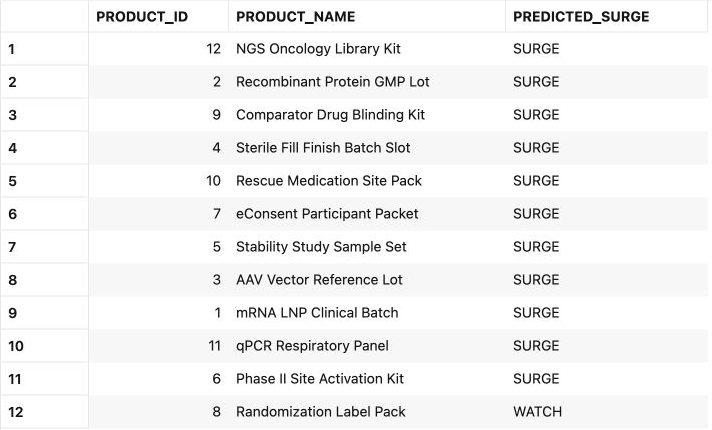

    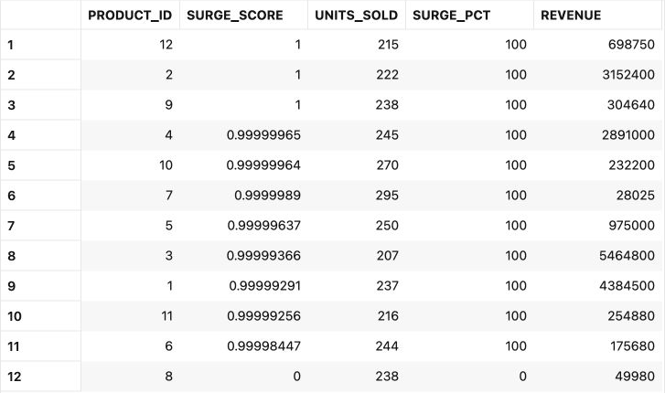

    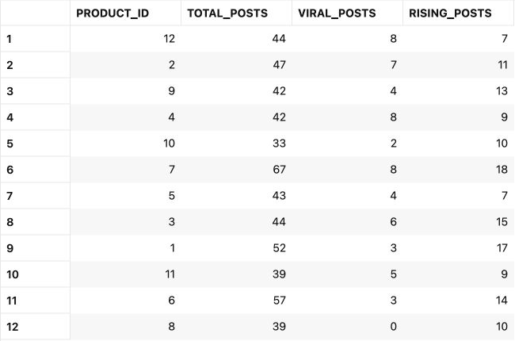

    Near-100% scores here are not proof of a reliable demand forecast. The model learned synthetic threshold labels from these same products, and this scoring set reuses their inputs. The watchlist helps explain the SQL workflow; it does not certify product release, quality compliance, or clinical suitability.

    This is the value of in-database machine learning. Otto can return a prediction, the product name, order values, and signal activity in one SQL result. There is no need to move data to an external machine learning platform.

## Conclusion: Put the Prediction Beside the Business Data

Otto inspected the training labels, created a Generalized Linear Model in SQL Developer Web, and scored a small set of product activity. The optional AutoML task offers a way to compare candidate models; the core SQL steps do not depend on completing it. The query returns a watchlist that a dashboard can show alongside the activity behind each score.

This is the business benefit of OML in the database. The model, the training data, the prediction, and the product details stay together. Otto does not have to copy Life Sciences data to a separate machine learning platform, and the dashboard does not have to combine scores from one system with business data from another.

Oracle AI Database makes the model part of the dashboard query. A business user can read the watchlist, inspect the supporting values, and repeat the query using the same access controls that protect the source data. For a production forecast, Otto would still need observed outcomes and independent evaluation data.

## Acknowledgements

* **Author** - Kevin Lazarz
* **Contributor** - Eugenio Galiano, Linda Foinding
* **Last Updated By/Date** - Joshua Pasaribu, October 2026
