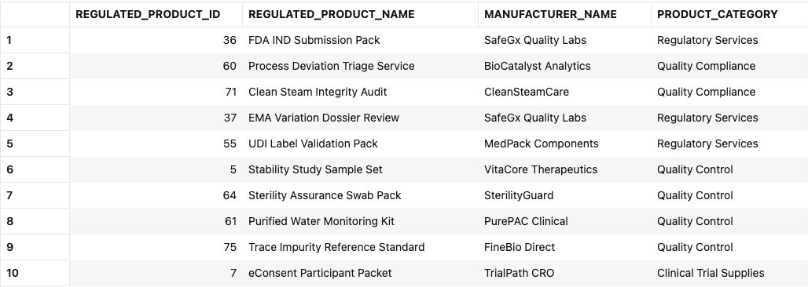
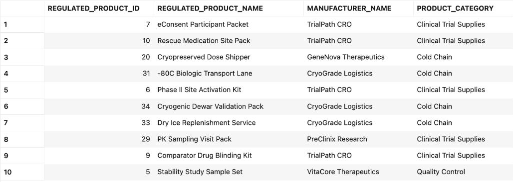

# Build a Converged Dashboard Query

## Introduction

Jessica Chan is the database administrator responsible for keeping Seer Scientific's quality and clinical-supply data reliable and useful. Every morning, the quality operations team asks her a familiar question: **which regulated products deserve review first, what pending supply activity involves them, and which supply site is closest to the selected demand region?**

The Quality and Supply Dashboard combines several types of data. Relational rows hold quality reports and illustrative exposure counts. JSON documents describe clinical supply orders, vectors represent product text, and spatial geometry locates supply sites and demand regions. Jessica needs to combine these records in one query.

Separate reporting extracts, search indexes, order services, and mapping systems would require Jessica to reconcile their results. Her team needs a dashboard whose results they can trace to the source records.

Oracle AI Database supports these data types in one database. Jessica can query relational records alongside JSON documents, vectors, and spatial geometry, and use the same database for graph and machine-learning tasks.

In this lab, you take Jessica's role as the DBA. You will write the converged SQL query behind the Quality and Supply Dashboard. It combines relational quality data, vector search, JSON order data, and spatial site data in one Oracle AI Database, without separate systems or data copies. The existing `LS_` views give inherited physical tables such as `SOCIAL_POSTS`, `PRODUCTS`, and `BRANDS` Life Sciences names without copying their rows.


### Objectives

- Explain what Oracle AI Database convergence means in a Life Sciences decision workflow.
- Run one query that combines relational, vector, JSON, and spatial database capabilities.
- Modify the query to investigate a different quality or supply question and explain the change in results.

Estimated Time: **10 minutes**

### Hands-on Scenario

| Step | Life Sciences focus |
| --- | --- |
| Business Problem | Business users need a quick way to connect quality signals, product exposure, clinical supply activity, and site information. |
| Technical Challenge | The query must combine quality records, product-text matches, order activity, and supply-site locations. |
| Persona Focus | Jessica Chan, the DBA, builds the query that gives business users this dashboard view. |
| What You Will Do | Use a single SQL statement that combines several data types. |
| Database Capability | Relational SQL, AI Vector Search, JSON Relational Duality, and Oracle Spatial work together. |
| Outcome | The learner can trace each part of the dashboard result to its source data and SQL calculation. |

Persona focus: You are Jessica Chan, the DBA. Build a query that lets the quality team compare products using quality reports, clinical supply orders, text matches, and supply-site locations.

> **SQL Worksheet reminder:** Need a reminder on how to open and use the SQL Worksheet? Return to [Getting Started Task 2: Open SQL Worksheet](?lab=getting-started#Task2:OpenSQLWorksheet) for the step-by-step guide showing how to run SQL statements.

## Task 1: Run a converged quality and supply investigation

The dashboard is a starting point for the decision, not the decision itself. Run the query below to produce a compact investigation view for products associated with high-criticality signals.

The query intentionally crosses four data models:

- **Relational:** `LS_QUALITY_SIGNALS_V`, product mentions, and Life Sciences views calculate signal counts and illustrative exposure. A criticality score of at least **80** is this exercise's filter, not a regulatory standard.
- **Vector:** `PRODUCT_EMBEDDINGS` and `VECTOR_DISTANCE` find products related by meaning to the investigation phrase. The prepared vectors use product names, categories, nullable descriptions, and manufacturer names. This dataset has no populated product descriptions. The model filter selects one stored embedding per product.
- **JSON:** `ORDERS_DV` presents the existing `ORDERS` and `ORDER_ITEMS` rows as documents. `JSON_TABLE` projects nested items into query rows, without creating a new stored table. Count distinct pending or confirmed orders and sum item quantities; do not sum order-header totals repeated across items. Other statuses are outside this question.
- **Spatial:** `SDO_GEOM.SDO_DISTANCE` finds the closest active supply site to the New York Metro region, using WGS 84 point and polygon geometries. This is minimum distance to the region polygon, not road distance, delivery time, inventory availability, or proof of cold-chain suitability.

These are four operations in one investigation. Each named section after `WITH` produces an intermediate result for this statement. The final joins combine them into one row per product. The selected site is shared location context: it does not restrict the product signals or orders to New York, and a shared product does not prove a signal caused an order.

1. Open SQL Worksheet as `LLUSER`.

2. Paste the query, select the entire statement, and choose **Run Statement**. Note the comments that help to locate the specific use of different data types:

    ```sql
    <copy>
    -- RELATIONAL DATA: aggregate high-criticality records and join them
    -- to governed product and manufacturer views.
    WITH product_quality AS (
        SELECT fp.regulated_product_id,
               fp.regulated_product_name,
               fi.manufacturer_name,
               fp.product_category,
               COUNT(DISTINCT rs.signal_id) AS high_quality_signals,
               ROUND(AVG(rs.criticality_score), 1) AS avg_criticality,
               SUM(rs.exposure_count) AS exposure_count,
               SUM(rs.cases_opened_count) AS cases_opened
        FROM ls_quality_signals_v rs
        JOIN post_product_mentions ppm
          ON ppm.post_id = rs.signal_id
        JOIN ls_regulated_products_v fp
          ON fp.regulated_product_id = ppm.product_id
        JOIN ls_manufacturers_v fi
          ON fi.manufacturer_id = fp.manufacturer_id
        WHERE rs.criticality_score >= 80
        GROUP BY fp.regulated_product_id,
                 fp.regulated_product_name,
                 fi.manufacturer_name,
                 fp.product_category
    ),
    -- VECTOR DATA: compare the investigation question with stored
    -- product embeddings to rank products by meaning, not exact wording.
    semantic_match AS (
        SELECT p.product_id,
               ROUND(1 - VECTOR_DISTANCE(
               pe.embedding,
                   VECTOR_EMBEDDING(
                       ALL_MINILM_L12_V2
                       USING 'quality deviation and regulatory compliance requiring product review' AS DATA
                   ),
                   COSINE
               ), 4) AS semantic_similarity
        FROM product_embeddings pe
        JOIN products p
          ON p.product_id = pe.product_id
        WHERE pe.embedding_model = 'all_MiniLM_L12_v2'
    ),
    -- JSON DATA: read clinical supply order documents from the duality view and
    -- project nested line items into relational rows with JSON_TABLE.
    order_activity AS (
        SELECT jt.product_id,
               COUNT(DISTINCT jt.order_id) AS pending_confirmed_orders,
               SUM(jt.quantity) AS pending_confirmed_units
        FROM orders_dv od
        CROSS APPLY JSON_TABLE(
            od.data,
            '$'
            COLUMNS (
                order_id NUMBER PATH '$._id',
                order_status VARCHAR2(30) PATH '$.status',
                NESTED PATH '$.items[*]' COLUMNS (
                    product_id NUMBER PATH '$.productId',
                    quantity NUMBER PATH '$.quantity'
                )
            )
        ) jt
        WHERE jt.order_status IN ('pending', 'confirmed')
        GROUP BY jt.product_id
    ),
    -- SPATIAL DATA: calculate the distance from each active supply-site point
    -- to the New York Metro demand-region polygon.
    nearest_cold_chain_site AS (
        SELECT sc.cold_chain_site_name,
               sc.city,
               sc.state_province,
               dr.region_name,
               dr.demand_index,
               ROUND(
                   SDO_GEOM.SDO_DISTANCE(
                       fc.location,
                       dr.boundary,
                       0.005,
                       'unit=KM'
                   ),
                   2
               ) AS distance_to_demand_region_km
        FROM ls_cold_chain_sites_v sc
        JOIN fulfillment_centers fc
          ON fc.center_id = sc.cold_chain_site_id
        CROSS JOIN demand_regions dr
        WHERE dr.region_id = 1
          AND dr.region_name = 'New York Metro'
          AND sc.is_active = 1
        ORDER BY SDO_GEOM.SDO_DISTANCE(
                     fc.location,
                     dr.boundary,
                     0.005,
                     'unit=KM'
                 ), fc.center_id
        FETCH FIRST 1 ROW ONLY
    )
    -- CONVERGED RESULT: join the outputs of the four data-model operations
    -- into one dashboard investigation result.
    SELECT pr.regulated_product_id,
           pr.regulated_product_name,
           pr.manufacturer_name,
           pr.product_category,
           pr.high_quality_signals,
           pr.avg_criticality,
           pr.exposure_count,
           pr.cases_opened,
           sm.semantic_similarity,
           NVL(ta.pending_confirmed_orders, 0) AS pending_confirmed_orders,
           NVL(ta.pending_confirmed_units, 0) AS pending_confirmed_units,
           nsc.cold_chain_site_name AS nearest_cold_chain_site,
           nsc.city || ', ' || nsc.state_province AS cold_chain_site_location,
           nsc.region_name AS demand_region,
           nsc.demand_index,
           nsc.distance_to_demand_region_km
    FROM product_quality pr
    LEFT JOIN semantic_match sm
      ON sm.product_id = pr.regulated_product_id
    LEFT JOIN order_activity ta
      ON ta.product_id = pr.regulated_product_id
    CROSS JOIN nearest_cold_chain_site nsc
    -- Put products closest to the investigation question first.
    -- Exposure breaks ties so the result still favors larger business impact.
    ORDER BY sm.semantic_similarity DESC NULLS LAST,
             pr.exposure_count DESC,
             pr.regulated_product_id
    FETCH FIRST 10 ROWS ONLY;
    </copy>
    ```

3. Review the result as the product-level data behind Jessica's dashboard. Each row combines quality signals, semantic match, order activity, and supply-site location. This gives the dashboard a ranked product table and the details a business user needs when deciding what to review.

    The image below shows the product identifiers, names, manufacturers, and categories for the ten result rows. Inspect all 16 columns in SQL Worksheet.

    

    With the prepared dataset, expect **10 distinct products** selected from 50 products with qualifying signals. Scroll horizontally to inspect all columns. Every row has a semantic score and the same selected New York region/site context. Rankings and scores depend on the prepared model and data.

The `exposure_count` and `cases_opened` columns retain the LS source views' illustrative counters. They originate from `views_count` and `comments_count`; they are not verified counts of patients, deviations, or an actual case ledger. A signal can mention more than one product, so adding product-level counters is not a distinct workshop-wide total.

Use the first row to explain the result. Quality counters and pending or confirmed quantities indicate potential review workload. Text similarity shows how closely the product matches the question, and the selected site provides geographic context. Check inventory and handling requirements before choosing a supply site.

The query provides the ranked product table for Jessica’s dashboard. Additional SQL queries can supply KPI cards and other dashboard components from the same database.

## Task 2: Change the investigation question

Jessica meets with a quality analyst to review the results at the data level before she builds the dashboard. They start with products related to **quality deviation and regulatory compliance requiring product review**. Change only the text inside `USING '...' AS DATA` to:

```text
clinical trial supplies and cold-chain distribution capacity
```

Run the query again and compare the top rows.

The image below shows product details from the alternate query. Compare its row order and the remaining result columns in SQL Worksheet.



1. Which products moved into or out of the top ten?
2. Which products still have high illustrative exposure counts but lower text similarity to the new question?
3. Does the pending or confirmed order activity make you more or less concerned about the supply workload?

The result is ordered by semantic similarity first, so changing the question can change the review queue. Exposure breaks ties, followed by product ID for stable ordering. For products appearing in both results, the quality counters, order quantities, and location context remain unchanged. Only the question's semantic scores and resulting ranking can change. Changing the search phrase lets Jessica review a different concern with the same query and source records.

## Next Steps

Next, use JSON Relational Duality to expose clinical supply data as JSON for an application while keeping SQL access for the database team.

## Acknowledgements

* **Author** - Joshua Pasaribu
* **Contributor** - Nechita C. Teodor
* **Last Updated By/Date** - Nechita C. Teodor, October 2026
