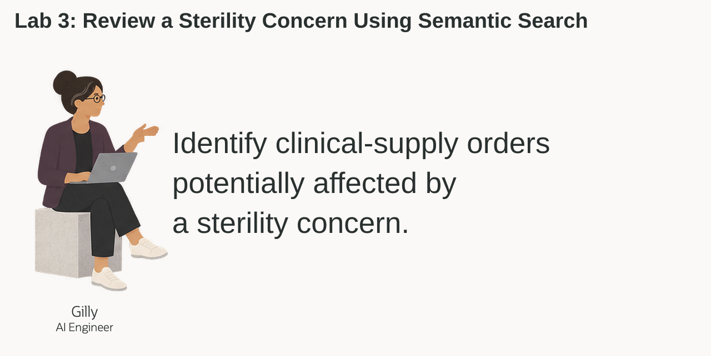
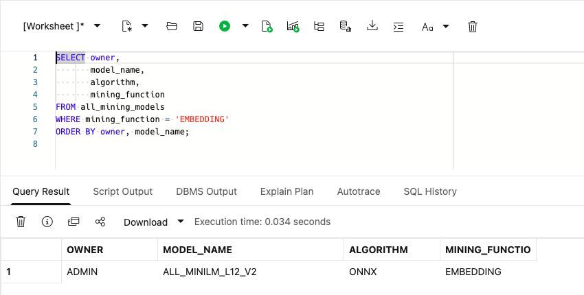
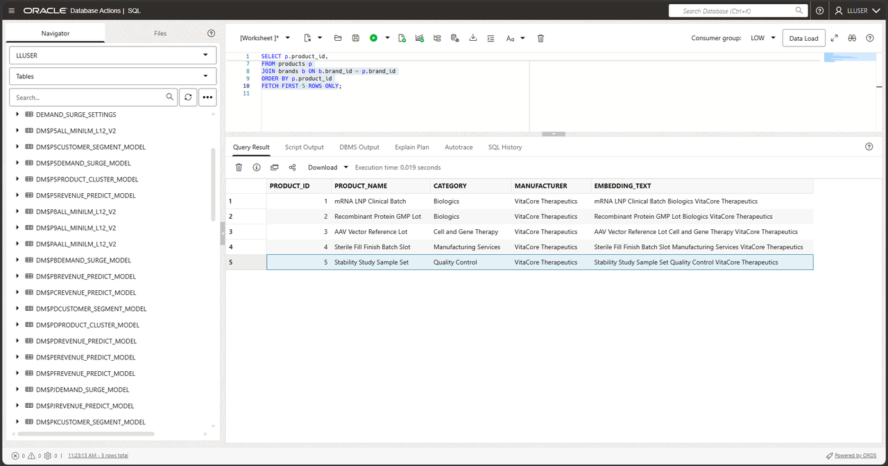
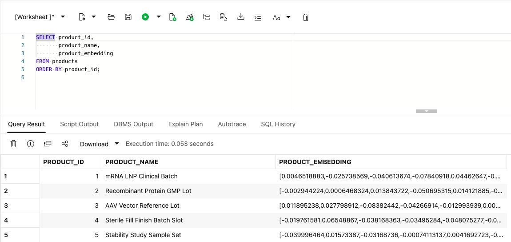
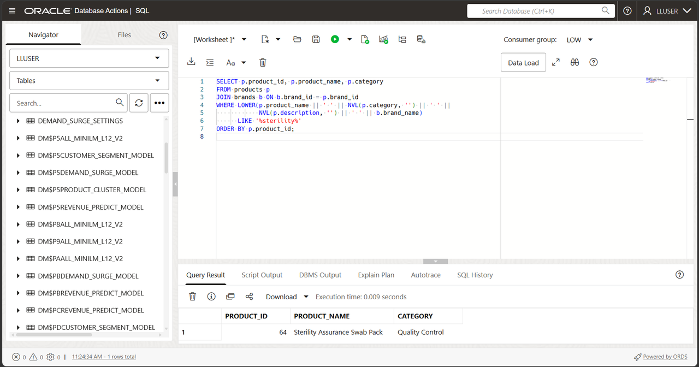
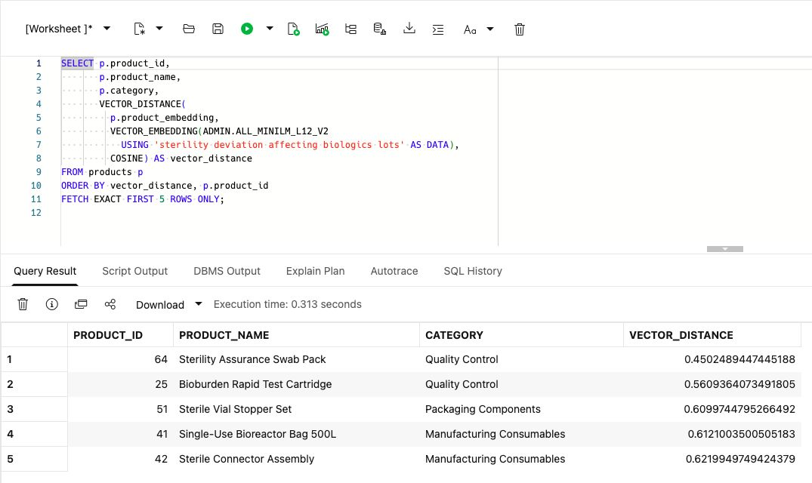
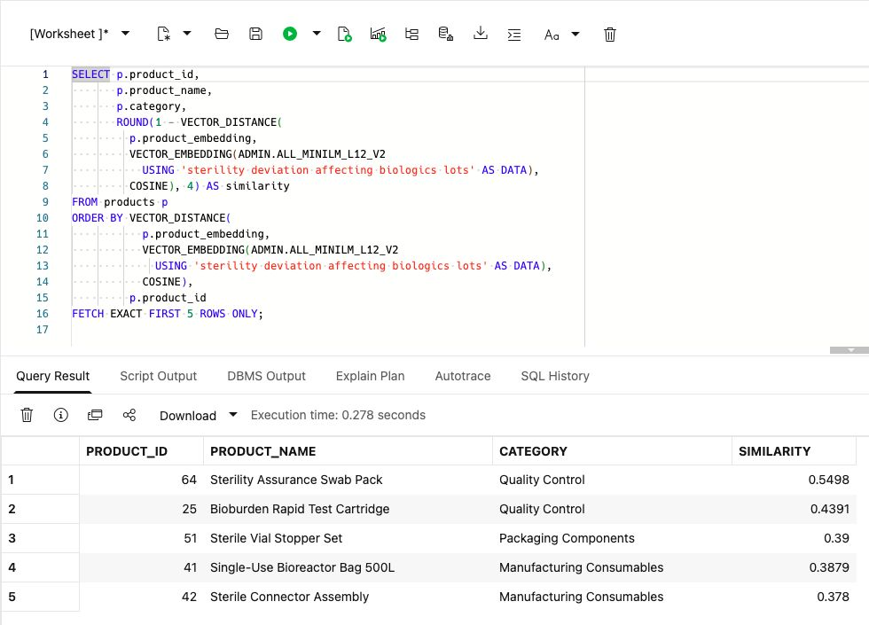
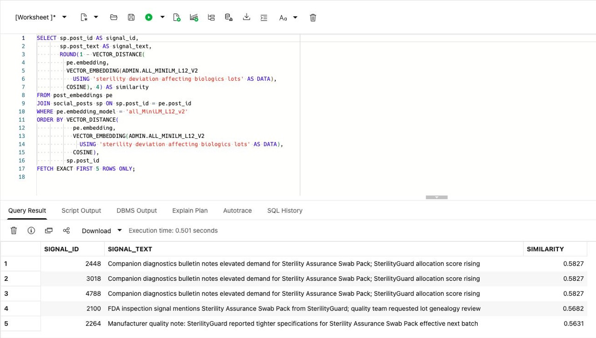
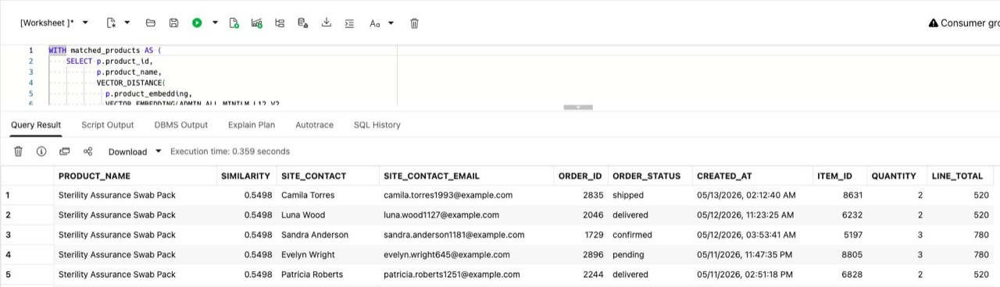

# Review a Sterility Concern Using Semantic Search

## Introduction

Gilly Bourne is an AI engineer at Seer Scientific. Her team has built a search feature for the clinical-supply application. A business user can ask **which products and clinical-supply orders should we review for a sterility deviation affecting biologics lots?** The application should find relevant products first, then show their orders and site contacts.

Gilly already has the product, order, and site-contact data in the database. Her design problem is connecting a plain-language question to those existing rows. She needs to turn product data into vectors, rank the closest products, and join those matches to orders and contacts. A useful result must show more than a similarity score. It must give the clinical-supply team a follow-up list, without treating a text match as confirmation that a product or lot is affected.

She could export the text and embeddings to a separate vector service. That would add a second copy of product information, another index to refresh, and another set of access rules to manage. Gilly wants the search to run where the underlying rows already live, so one SQL statement can compare meaning, join product data to orders and site contacts, and return a result for the application.

Review Gilly’s implementation from the embedding model to the follow-up list. Compare keyword matching with semantic search, then use SQL joins to connect product matches to order and contact records.



<details>
<summary><strong>Key terms: embedding, vector, vector distance, and semantic search</strong></summary>

> - An **embedding** is a numerical representation of text. The model turns a product's text and a search question into lists of numbers that can be compared. Related concepts can be close together even when the wording differs; you do not need to interpret the individual numbers.
>
> - An **ONNX embedding model** is a portable machine-learning model saved in the Open Neural Network Exchange (ONNX) format. It turns text into a vector of numbers that captures meaning. Oracle AI Database can load and run this model inside the database, close to the product rows.
>
> - A **vector** is the stored numerical form of an embedding. Oracle Database can store vectors beside the Life Sciences rows they describe, so the search stays connected to product names, order quantities, site contacts, and other business columns.
>
> - **Vector distance** measures how close two vectors are. A smaller distance means the meanings are more similar; a larger distance means they are farther apart. In this lab, distance helps rank which products or monitored posts best match a business user's question.
>
> - **Semantic search** means searching by meaning instead of exact words. A search for "sterility deviation affecting biologics lots" can find related quality-control products even when they do not contain all those words. A keyword search, by contrast, looks for the words you specify.

</details>

The application lets a business user enter a concern in plain language and returns products ranked by text similarity. The following tasks show how the search works.

### Objectives

- Check the embedding model Gilly needs for semantic search.
- Create a vector from product data inside the database.
- Compare keyword and semantic search for products and review related monitored posts.
- Turn product matches into a clinical supply follow-up list.
- Explain why vector search belongs beside Life Sciences data and access controls.

Estimated Time: **10 minutes**

### Hands-on Scenario

| Step                | Life Sciences focus                                                                                                                               |
| ---------------------| ---------------------------------------------------------------------------------------------------------------------------------------------|
| Business Problem    | Business users need to find relevant products without knowing the exact terms used in the product data.                                     |
| Technical Challenge | Gilly must search by meaning while keeping product data, vectors, orders, site contacts, and access controls together.                          |
| Persona Focus       | You review Gilly's implementation as she explains how the search connects a business question to products, orders, and site contacts.           |
| What You Will See   | Vector search ranks products by meaning, then SQL adds order and site-contact details.                                                          |
| Database Capability | `VECTOR_EMBEDDING`, vector columns, and `VECTOR_DISTANCE` run beside relational Life Sciences data.                                               |
| Outcome             | The application can turn a plain-language concern into a clinical supply follow-up list without a separate vector database or copied Life Sciences text. |

Persona focus: You are reviewing the search tool Gilly built for quality and clinical supply operations.


> **SQL Worksheet reminder:** Need a reminder on how to open and use the SQL Worksheet? Return to [Getting Started Task 2: Open SQL Worksheet](?lab=getting-started#Task2:OpenSQLWorksheet) for the step-by-step guide showing how to run SQL statements.


## Task 1: Check the embedding model

Start with Gilly's first design question: **what does similarity search need?** It needs vectors for the text being searched and an embedding model that converts a question into a vector.

Jessica has already loaded the shared ONNX embedding model for Gilly. Oracle AI Database can store and run the ONNX model inside the database, so it creates the question embedding where the product data already live. The application does not have to send Life Sciences text to a separate service and bring the vector back.

1. Run the following query to see which embedding models are available:

    ```sql
    <copy>
    SELECT owner,
           model_name,
           algorithm,
           mining_function
    FROM all_mining_models
    WHERE mining_function = 'EMBEDDING'
    ORDER BY owner, model_name;
    </copy>
    ```

    **Expected output: Available Embedding Models**

    

    The result should include `ALL_MINILM_L12_V2`, the model used throughout this lab. This compact model turns text into 384-number vectors. The `EMBEDDING` value confirms that the model can turn text into vectors for similarity search.

2. Review what this means for Gilly's application.

    Gilly can call the model from SQL with `VECTOR_EMBEDDING(...)`. Jessica manages the model inside the database, while Gilly uses it in her search query. The product data, vectors, and access controls stay in the same database.

    > **Note:** The embedding model runs inside the database. Gilly can create vectors from the product text without sending it to a separate embedding service.

## Task 2: Create a product vector

Each product has a short catalog entry, so Gilly creates one vector from its name, category, available description, and manufacturer name.

1. Review the text Gilly will embed:

    ```sql
    <copy>
    SELECT p.product_id,
           p.product_name,
           p.category,
           b.brand_name AS manufacturer,
           p.product_name || ' ' || NVL(p.category, '') || ' ' ||
             NVL(p.description, '') || ' ' || b.brand_name AS embedding_text
    FROM products p
    JOIN brands b ON b.brand_id = p.brand_id
    ORDER BY p.product_id
    FETCH FIRST 5 ROWS ONLY;
    </copy>
    ```

    

    The combined text gives the model the product name, business category, and manufacturer. All 79 descriptions in this dataset are empty, so this is short catalog text, not detailed product documentation. Gilly does not need to embed price, dates, or other values that do not describe what the product is.

2. Add a vector column to `PRODUCTS`:

    ```sql
    <copy>
    ALTER TABLE products ADD (product_embedding VECTOR(384, FLOAT32, DENSE));
    </copy>
    ```

    The column has 384 dimensions because `ALL_MINILM_L12_V2` produces 384-dimensional vectors.

3. Create the product vectors inside Oracle Database. Use Run Script (F5) to run the update and commit together:

    ```sql
    <copy>
    UPDATE products p
    SET product_embedding = (
      SELECT VECTOR_EMBEDDING(
          ALL_MINILM_L12_V2 USING
          p.product_name || ' ' || NVL(p.category, '') || ' ' ||
          NVL(p.description, '') || ' ' || b.brand_name AS DATA)
      FROM brands b
      WHERE b.brand_id = p.brand_id
    )
    WHERE p.product_embedding IS NULL;

    COMMIT;
    </copy>
    ```

    The model reads the text in each row and writes the vector back to that same row. No product text leaves the database.

4. Verify the new column and its data:

    ```sql
    <copy>
    SELECT product_id,
           product_name,
           product_embedding
    FROM products
    ORDER BY product_id;
    </copy>
    ```

    

    All 79 products now have their own 384-dimensional vectors. The screenshot shows the beginning of the result, not all 79 rows. Gilly can use this column directly when the application searches for products by meaning.

    > **Note:** Chunking is not relevant for this data. Each row describes one short product, so splitting it would create several vectors for one product without adding useful detail. Chunking becomes useful for long documents, such as policies or regulatory bulletins, where each section may answer a different question.

## Task 3: Test the product vector

Now Gilly tests the new column with a simple vector query. She asks for products related to a sterility deviation affecting biologics lots and lets the database rank them by meaning.

1. Start with a keyword search over the same product text:

    ```sql
    <copy>
    SELECT p.product_id, p.product_name, p.category
    FROM products p
    JOIN brands b ON b.brand_id = p.brand_id
    WHERE LOWER(p.product_name || ' ' || NVL(p.category, '') || ' ' ||
                NVL(p.description, '') || ' ' || b.brand_name)
          LIKE '%sterility%'
    ORDER BY p.product_id;
    </copy>
    ```

    

    This finds product **64, Sterility Assurance Swab Pack**. It answers a precise question: which product text contains `sterility`? It does not look for related concepts such as bioburden.

2. Run the following semantic query:

    The SQL creates an embedding for the phrase `sterility deviation affecting biologics lots`, compares it with the vectors in `PRODUCTS.PRODUCT_EMBEDDING`, and returns the cosine distance. A smaller distance means the two vectors are closer in meaning, so the query orders the smallest distance first.

    <details>
    <summary><strong>Why this matters to Gilly</strong></summary>

    > Gilly could export the text to an external embedding pipeline or search service. That would create extra copies of regulated product text and make it harder to show which data the application searched.
    >
    > Oracle AI Vector Search keeps the product data, vectors, SQL query, and vector distance with the Life Sciences data. Gilly can check the search and use the result in the application without adding another data store.

    </details>

    ```sql
    <copy>
    SELECT p.product_id,
           p.product_name,
           p.category,
           VECTOR_DISTANCE(
             p.product_embedding,
             VECTOR_EMBEDDING(ALL_MINILM_L12_V2
               USING 'sterility deviation affecting biologics lots' AS DATA),
             COSINE) AS vector_distance
    FROM products p
    ORDER BY vector_distance, p.product_id
    FETCH EXACT FIRST 5 ROWS ONLY;
    </copy>
    ```

    **Expected output: Regulated Product Matches**

    

3. Review the ranked products.

    The query embeds the question at runtime and compares it to the `PRODUCTS.PRODUCT_EMBEDDING` column. `VECTOR_DISTANCE` uses the `COSINE` metric. A lower value means a closer match. Compare the returned names with the keyword result: semantic search can include related products without the literal word `sterility`.

    `EXACT` requests the five nearest vectors, with product ID breaking equal-distance ties. It does not mean that every returned product is relevant or affected. Review the source text before deciding what to investigate.

4. Show the result as a similarity score:

    Vector distance is useful for checking the search, but business users may not know what a cosine distance means. Gilly changes the display to a similarity score. She subtracts the distance from `1`, so a higher score means a closer match, and rounds the result to four decimal places.

    ```sql
    <copy>
    SELECT p.product_id,
           p.product_name,
           p.category,
           ROUND(1 - VECTOR_DISTANCE(
             p.product_embedding,
             VECTOR_EMBEDDING(ALL_MINILM_L12_V2
               USING 'sterility deviation affecting biologics lots' AS DATA),
             COSINE), 4) AS similarity
    FROM products p
    ORDER BY VECTOR_DISTANCE(
               p.product_embedding,
               VECTOR_EMBEDDING(ALL_MINILM_L12_V2
                 USING 'sterility deviation affecting biologics lots' AS DATA),
               COSINE),
             p.product_id
    FETCH EXACT FIRST 5 ROWS ONLY;
    </copy>
    ```

    The query uses the same vectors and the same cosine calculation. Only the displayed value changes; sorting still uses the unrounded distance. Similarity is not a probability that a product is affected.

    

    In this dataset, Sterility Assurance Swab Pack ranks first (0.5498), followed by Bioburden Rapid Test Cartridge (0.4391). The second product did not match the literal keyword, but its quality-control meaning makes it a useful candidate to review. The remaining matches are Sterile Vial Stopper Set, Single-Use Bioreactor Bag 500L, and Sterile Connector Assembly.

5. Search the monitored posts for the same concern:

    ```sql
    <copy>
    SELECT sp.post_id AS signal_id,
           sp.post_text AS signal_text,
           ROUND(1 - VECTOR_DISTANCE(
             pe.embedding,
             VECTOR_EMBEDDING(ALL_MINILM_L12_V2
               USING 'sterility deviation affecting biologics lots' AS DATA),
             COSINE), 4) AS similarity
    FROM post_embeddings pe
    JOIN social_posts sp ON sp.post_id = pe.post_id
    WHERE pe.embedding_model = 'all_MiniLM_L12_v2'
    ORDER BY VECTOR_DISTANCE(
               pe.embedding,
               VECTOR_EMBEDDING(ALL_MINILM_L12_V2
                 USING 'sterility deviation affecting biologics lots' AS DATA),
               COSINE),
             sp.post_id
    FETCH EXACT FIRST 5 ROWS ONLY;
    </copy>
    ```

    

    The prepared dataset supplies these 5,000 post vectors. Each represents the first 500 characters of `POST_TEXT`; all current messages fit within that limit. You created the product vectors in Task 2, but you do not rebuild the supplied post vectors here. The query retains the output labels `SIGNAL_ID` and `SIGNAL_TEXT` for these source posts. Read the messages to decide whether they describe a related quality concern; a high score does not establish a confirmed deviation.

    Posts 2448, 3018, and 4788 have identical source text and tie at 0.5827; these are separate source records, not duplicate rows introduced by the join. Their message concerns demand. Post 2100 describes an inspection and lot-genealogy review, so it may deserve more attention even though its similarity score is lower (0.5682). Ranking helps Gilly find candidates; reading the source messages helps her decide what to review next.

    The supplied embedding tables have vector indexes for approximate searches in the broader application. This lab explicitly uses exact search. Approximate searches can return different neighbors; changed text or a different model can also change rankings. The indexes do not apply to the new column you added to `PRODUCTS`.

## Task 4: Find clinical supply orders to review for a product concern

The application must connect product matches to clinical supply orders. The next query returns a follow-up list with each product’s match score, order status, order date, and site-contact details.

1. Run the following query for the concern `sterility deviation affecting biologics lots`:

    ```sql
    <copy>
    WITH matched_products AS (
        SELECT p.product_id,
               p.product_name,
               VECTOR_DISTANCE(
                 p.product_embedding,
                 VECTOR_EMBEDDING(ALL_MINILM_L12_V2
                   USING 'sterility deviation affecting biologics lots' AS DATA),
                 COSINE) AS vector_distance
        FROM products p
        ORDER BY vector_distance, p.product_id
        FETCH EXACT FIRST 5 ROWS ONLY
    )
    SELECT mp.product_name,
           ROUND(1 - mp.vector_distance, 4) AS similarity,
           c.first_name || ' ' || c.last_name AS site_contact,
           c.email AS site_contact_email,
           o.order_id,
           o.order_status,
           o.created_at,
           oi.item_id,
           oi.quantity,
           oi.line_total
    FROM matched_products mp
    JOIN order_items oi ON oi.product_id = mp.product_id
    JOIN orders o ON o.order_id = oi.order_id
    JOIN customers c ON c.customer_id = o.customer_id
    WHERE o.order_status <> 'cancelled'
    ORDER BY mp.vector_distance, mp.product_id,
             o.created_at DESC, o.order_id, oi.item_id;
    </copy>
    ```

    The first part ranks five products by meaning. The remaining joins use ordinary relational keys to find their order items, orders, and site contacts. The source table is named `CUSTOMERS`; here it supplies clinical-site contact records, not names of institutions.

    **Expected output: Clinical Supply Follow-up List**

    

    Each row represents one order item. A product or order can appear more than once because it has multiple items; `ITEM_ID` identifies the line. `LINE_TOTAL` is that item's quantity multiplied by its unit price, not a repeated order-header total. Cancelled orders are excluded; delivered orders remain because quality follow-up can include earlier shipments. The screenshot shows the beginning of the list.

    The prepared dataset returns 535 distinct order items across 499 orders. Those lines contain 1,097 units with a combined line value of 918,700. Count or total the line items—not repeated order-header values—when reviewing this result.

2. Review the business result.

    Gilly does not vectorize every order or contact. She vectorizes the product data once, then builds a converged query that combines vector search with SQL joins for exact order and contact details. This keeps the search flexible while the order-line relationships remain precise.

    These are candidates for review, not proof that a particular lot is defective. The signal search and order query share a concern, but semantic similarity alone does not prove that a signal caused or refers to a particular order.

## Conclusion

Gilly’s search turns a plain-language concern into ranked products, related posts, and clinical supply orders for review. It combines vectors with relational joins in Oracle AI Database.

## Acknowledgements

* **Author** - Joshua Pasaribu
* **Contributor** - Nechita C. Teodor
* **Last Updated By/Date** - Nechita C. Teodor, October 2026
