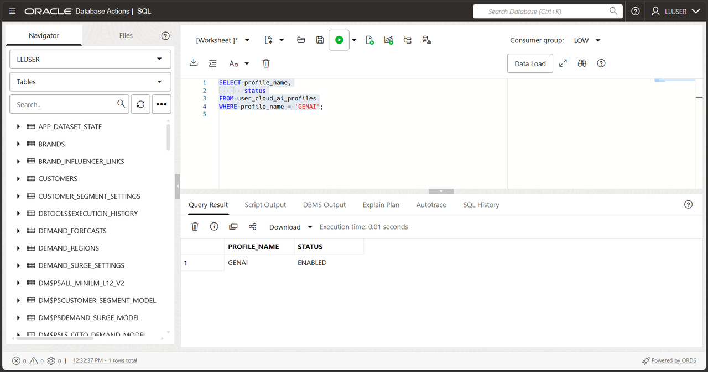
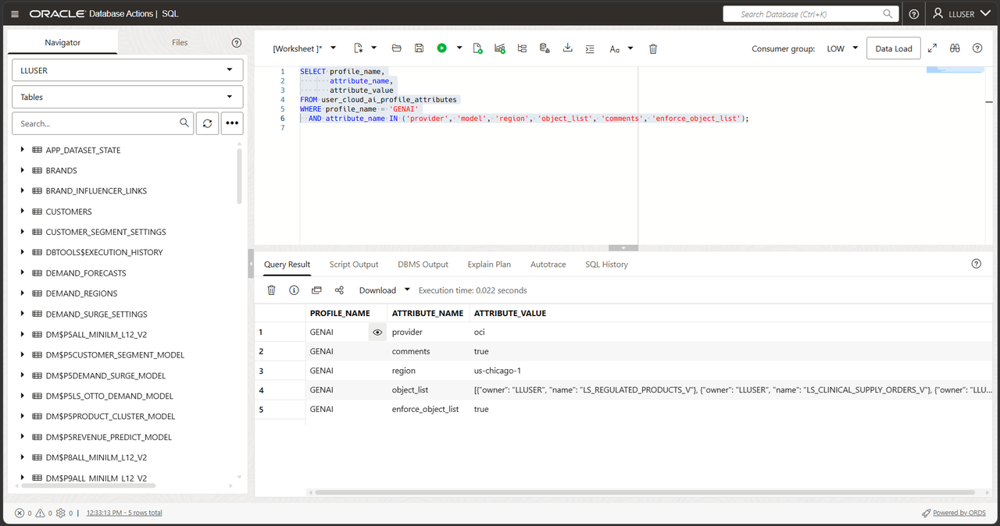
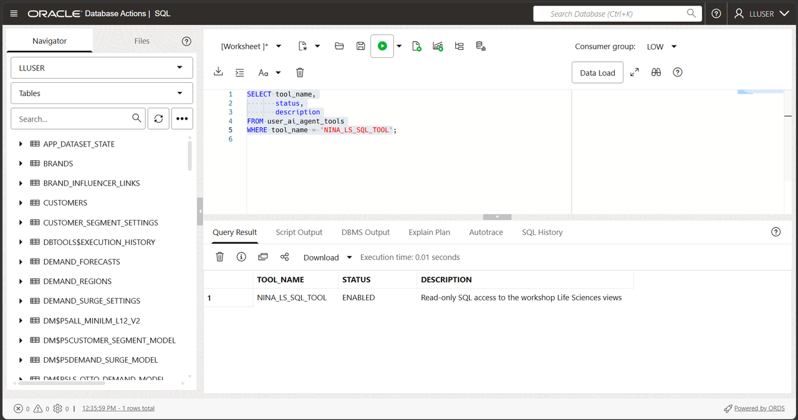
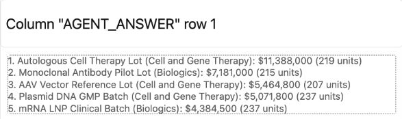
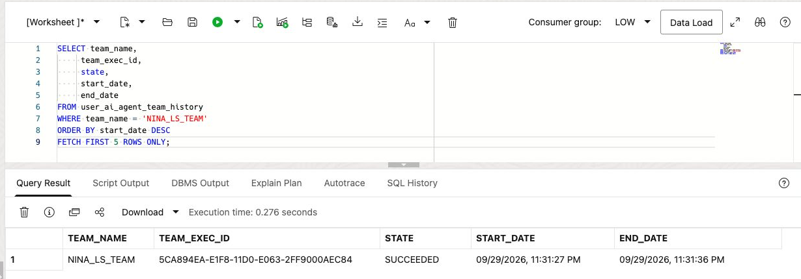
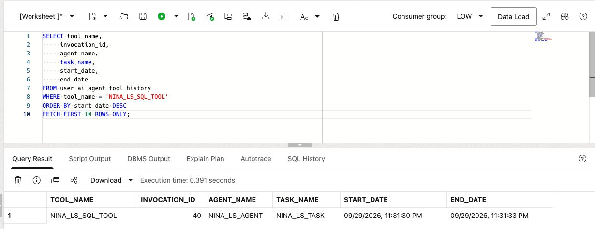

# Build a Life Sciences Agent with Select AI Agent

## Introduction

Nina Patel has used Select AI for individual questions. Her clinical supply review screen now needs an assistant that uses an approved SQL tool to answer requests about products and orders.

Jessica, the DBA, does not want to give an AI system unrestricted access to the database. She gives Nina's agent one approved tool: a SQL tool that uses the `GENAI` profile and the Life Sciences views configured in the previous lab.

In this lab, you create the agent objects, connect the agent to the SQL tool, and run a question through the team. The agent uses the approved tool and returns an answer. This lab gives the agent only the built-in SQL query tool, not an action tool. The SQL still runs with the database user's privileges.

<details>
<summary><strong>Key terms: agent, tool, task, and team</strong></summary>

> - An **agent** is a configured role that follows instructions when it handles a request.
>
> - A **tool** is a capability the agent is allowed to call. In this lab, the tool runs SQL through the `GENAI` profile.
>
> - A **task** tells the agent what to do and which tools it may use.
>
> - A **team** connects the agent and task so an application or SQL session can run them together.

</details>

### Objectives

- Confirm that the `GENAI` profile from the previous lab is available.
- Verify which Life Sciences views the SQL tool may use.
- Register a read-only SQL tool for the Life Sciences schema.
- Create an agent, task, and team with `DBMS_CLOUD_AI_AGENT`.
- Run a Life Sciences question through the team.
- Review the agent's tool history and explain why the tool boundary matters.

Estimated Time: **15 minutes**


### Hands-on Scenario

| Step                | Life Sciences focus                                                                                  |
| ------------------- | ---------------------------------------------------------------------------------------------- |
| Business Problem    | Nina needs a Life Sciences answer that can feed a clinical-supply review screen.                            |
| Technical Challenge | The agent must use database data through an approved capability, not unrestricted access.      |
| Persona Focus       | You follow Nina as she turns a Select AI question into a small Life Sciences assistant.              |
| What You Will See   | An agent receives a request, calls its SQL tool, and returns a Life Sciences answer.                 |
| Database Capability | Select AI Agent, `DBMS_CLOUD_AI_AGENT`, AI profiles, and a built-in SQL tool.                   |
| Outcome             | Nina has a controlled agent that can answer questions from the Life Sciences schema.                |

> **Prerequisite:** Complete [Lab 7: Ask Life Sciences Questions with Select AI](?lab=selectai). This lab uses the `GENAI` profile and its `object_list`.

## Task 1: Check the profile and view access

The agent's SQL tool uses the existing `GENAI` profile. The profile's `object_list` identifies the four views, and `enforce_object_list=true` restricts generated SQL to that scope. Database privileges provide the second control: the SQL still runs as the current database user and cannot read tables that user cannot access.

The agent and its SQL tool both use the model configured in `GENAI`. Lab 7 selects Grok for each `GENERATE` call without changing that profile. Here you set the profile's model so both parts of Nina's agent use Grok.

1. Check the profile:

    ```sql
    <copy>
    SELECT profile_name,
           status
    FROM user_cloud_ai_profiles
    WHERE profile_name = 'GENAI';
    </copy>
    ```

    

    The supplied `GENAI` profile should be enabled. If it is absent or disabled, stop and report the missing workshop prerequisite. Lab 7 checks and uses this profile; it does not create a missing profile.

2. Check the model and views listed in the profile:

    ```sql
    <copy>
    SELECT profile_name,
           attribute_name,
           attribute_value
    FROM user_cloud_ai_profile_attributes
    WHERE profile_name = 'GENAI'
      AND attribute_name IN ('provider', 'model', 'region', 'object_list', 'comments', 'enforce_object_list');
    </copy>
    ```
    

    The list should contain only the workshop views needed for this lab: `LS_REGULATED_PRODUCTS_V`, `LS_CLINICAL_SUPPLY_ORDERS_V`, `LS_ORDER_LINES_V`, and `LS_TRIAL_SITES_V`. Confirm that `comments` and `enforce_object_list` are `true`. These profile settings do not replace database grants or guarantee a correct answer.

3. Set the model used by the agent and its SQL tool. Select this block and choose **Run Script (F5)** as the workshop user:

    ```sql
    <copy>
    BEGIN
      DBMS_CLOUD_AI.SET_ATTRIBUTE(
        profile_name    => 'GENAI',
        attribute_name  => 'model',
        attribute_value => 'xai.grok-4.3'
      );
    END;
    /
    </copy>
    ```

    This changes the model on `GENAI` for subsequent requests using that profile, not just the current statement. It preserves the provider, region, credentials, and object list. The successful test used OCI Generative AI in `us-chicago-1`; setting a model does not supply missing cloud access. Rerun the attribute query above and confirm `model` is `xai.grok-4.3` before continuing.

4. Check the agent objects already in your schema:

    ```sql
    <copy>
    SELECT 'AGENT' AS object_kind, agent_name AS object_name, status
    FROM user_ai_agents WHERE agent_name = 'NINA_LS_AGENT'
    UNION ALL
    SELECT 'TASK', task_name, status
    FROM user_ai_agent_tasks WHERE task_name = 'NINA_LS_TASK'
    UNION ALL
    SELECT 'TEAM', agent_team_name, status
    FROM user_ai_agent_teams WHERE agent_team_name = 'NINA_LS_TEAM'
    UNION ALL
    SELECT 'TOOL', tool_name, status
    FROM user_ai_agent_tools WHERE tool_name = 'NINA_LS_SQL_TOOL';
    </copy>
    ```

  The workshop objects use names beginning with `NINA_LS_`. If all four objects already exist with the definitions shown in Tasks 2–3 and are enabled, skip their creation and continue at Task 4. If you need to recreate them, use the appendix only after any earlier run has ended, then repeat Tasks 2–3. Do not assume that an existing agent proves the tool, task, and team are also ready.

## Task 2: Register the SQL tool

The SQL tool is the agent's only database capability in this lab. It uses the `GENAI` profile, so the profile's object list limits the schema metadata available for generated SQL.

1. Register the tool:

    ```sql
    <copy>
    BEGIN
      DBMS_CLOUD_AI_AGENT.CREATE_TOOL(
        tool_name   => 'NINA_LS_SQL_TOOL',
        attributes  => '{"tool_type": "SQL", "tool_params": {"profile_name": "genai"}}',
        description => 'Read-only SQL access to the workshop Life Sciences views'
      );
    END;
    /
    </copy>
    ```

    The named tool lets the agent ask Select AI to generate and run queries against the configured life sciences views. The profile’s enforced object list and the executing user’s database privileges apply.
  
2. Confirm the tool definition:

    ```sql
    <copy>
    SELECT tool_name,
           status,
           description
    FROM user_ai_agent_tools
    WHERE tool_name = 'NINA_LS_SQL_TOOL';
    </copy>
    ```

    

## Task 3: Create Nina's agent, task, and team

Create a role for Nina’s agent, instructions for its task, and a team that connects them to the SQL tool.

1. Create the agent:

    ```sql
    <copy>
    BEGIN
      DBMS_CLOUD_AI_AGENT.CREATE_AGENT(
        agent_name  => 'NINA_LS_AGENT',
        attributes  => '{"profile_name": "genai", "role": "You are Nina Patel''s Life Sciences data assistant. Answer questions using the approved SQL tool. Use database results for regulated-product, clinical-supply order, order-line, and trial-site facts. Do not invent values."}',
        description => 'Life Sciences assistant for Nina Patel'
      );
    END;
    /
    </copy>
    ```

2. Create the task:

    ```sql
    <copy>
    BEGIN
      DBMS_CLOUD_AI_AGENT.CREATE_TASK(
        task_name  => 'NINA_LS_TASK',
        attributes => '{"instruction": "Answer Nina''s Life Sciences question: {query}. Use NINA_LS_SQL_TOOL once to retrieve the required data. Return a concise answer based on the database result. Do not repeat the same tool call and do not make changes to database records.", "tools": ["NINA_LS_SQL_TOOL"], "enable_human_tool": "false"}',
        description => 'Answer read-only regulated-product and trial-site questions'
      );
    END;
    /
    </copy>
    ```
  
3. Create the team:

    ```sql
    <copy>
    BEGIN
      DBMS_CLOUD_AI_AGENT.CREATE_TEAM(
        team_name  => 'NINA_LS_TEAM',
        attributes => '{"agents": [{"name": "NINA_LS_AGENT", "task": "NINA_LS_TASK"}], "process": "sequential"}',
        description => 'Read-only Life Sciences question team'
      );
    END;
    /
    </copy>
    ```

    The team is the runnable unit. It connects Nina's role, the task instructions, and the SQL tool. “Use once” is an instruction to the model, not an enforced tool-call limit.
  
## Task 4: Run a Life Sciences question

Database Actions does not support the `SELECT AI AGENT` command directly. Use `DBMS_CLOUD_AI_AGENT.RUN_TEAM` in SQL Worksheet and provide the team name in the function call.

1. Ask the agent:

    ```sql
    <copy>
    SELECT DBMS_CLOUD_AI_AGENT.RUN_TEAM(
             team_name   => 'NINA_LS_TEAM',
             user_prompt => 'Show the five regulated products with the highest total clinical-supply order-line value across all orders. Include the product name, category, total line value, and units ordered. Exclude shipping costs.',
             params      => '{"conversation_id": "' || DBMS_CLOUD_AI.CREATE_CONVERSATION() || '"}'
           ) AS agent_answer;
    </copy>
    ```
  
    Database Actions does not keep an agent conversation ID for this call, so the query creates one and passes it to `RUN_TEAM`. The ID lets Oracle record the prompt and response in the agent conversation history.

    

    *The agent added a currency symbol that the query did not establish. Verify units and currency before using the answer.*

2. Review the answer.

    Look for the regulated-product ranking, category, total line value, and units ordered. Values add individual order lines, not repeated order-header totals. The exact wording may vary because an AI provider generates the response, but the answer should be based on the Life Sciences views available through `GENAI`.
  
    > **Note:** This team has only a SQL query tool, not a tool for inserting, updating, or deleting records. That does not make the `LLUSER` account itself read-only. Review the returned facts; an AI response can still misunderstand a question.

3. Optional challenge: connect the highest-value product to its trial sites and orders. Replace `user_prompt` with `For regulated product 16, Autologous Cell Therapy Lot, show the five trial sites with the highest total order-line value. Include trial site ID, trial site name, distinct clinical-supply order count, total line value, and units ordered. Exclude shipping costs.` This is a standalone question because the example creates a new conversation each time. A true follow-up must reuse the original conversation ID. A more detailed request may take longer because the agent has to interpret more steps.

    Sites can tie on total line value. Without a tie-break rule in the question, their order and the site shown at the fifth-place cutoff can vary.

## Task 5: Inspect what the agent did

Nina needs more than a final answer. She also wants to know whether the agent called the approved tool and how the request was processed.

1. Review the latest team runs:

    ```sql
    <copy>
    SELECT team_name,
         team_exec_id,
         state,
         start_date,
         end_date
    FROM user_ai_agent_team_history
    WHERE team_name = 'NINA_LS_TEAM'
    ORDER BY start_date DESC
    FETCH FIRST 5 ROWS ONLY;
    </copy>
    ```

    

2. Review the latest tool calls:

    ```sql
    <copy>
    SELECT tool_name,
         invocation_id,
         agent_name,
         task_name,
         start_date,
         end_date
    FROM user_ai_agent_tool_history
    WHERE tool_name = 'NINA_LS_SQL_TOOL'
    ORDER BY start_date DESC
    FETCH FIRST 10 ROWS ONLY;
    </copy>
    ```

    

  Find `NINA_LS_SQL_TOOL` in the history and compare its agent, task, and timestamps with the team run you are reviewing. The result records tool activity; it does not establish that the answer is correct.

## Conclusion: Give the agent a controlled way to work

In Lab 7, Nina used Select AI to turn a question into SQL. In this lab, she gave an agent a role, a task, and one approved SQL tool. The agent can handle a broader request and decide when it needs database information, while the database still controls the profile, object list, privileges, and tool history.

That is the next step from Select AI to Select AI Agent: the application can call a defined Life Sciences assistant instead of assembling every question and database call itself. Jessica can review the tools available to the agent and disable the tool or team for subsequent use. Disabling an object does not establish that an already-running request has stopped.

The access boundary has two parts. The profile's enforced `object_list` restricts generated queries to the four views. Database privileges and any row-access policies still apply. Both should be kept narrow when an agent is used by an application.

The example remains read-only on purpose. Before an agent is allowed to change data, the team should add a narrowly defined function tool, clear instructions, and a confirmation step for the user.

## Appendix: Reset the workshop objects

Run this block only after any earlier request has ended and you want to recreate the objects used in this lab. It removes only the four names created here; it is not a cancellation command and does not restore or configure the `GENAI` profile. Then repeat Tasks 2–3 before running Task 4.

```sql
<copy>
BEGIN
  DBMS_CLOUD_AI_AGENT.DROP_TEAM('NINA_LS_TEAM', TRUE);
  DBMS_CLOUD_AI_AGENT.DROP_TASK('NINA_LS_TASK', TRUE);
  DBMS_CLOUD_AI_AGENT.DROP_AGENT('NINA_LS_AGENT', TRUE);
  DBMS_CLOUD_AI_AGENT.DROP_TOOL('NINA_LS_SQL_TOOL', TRUE);
END;
/
</copy>
```

## Next Steps

Read the [Oracle AI Database Select AI Agent documentation](https://docs.oracle.com/en/database/oracle/oracle-database/26/selai/).

## Acknowledgements

* **Author** - Joshua Pasaribu
* **Contributor** - Nechita C. Teodor
* **Last Updated By/Date** - Nechita C. Teodor, October 2026
