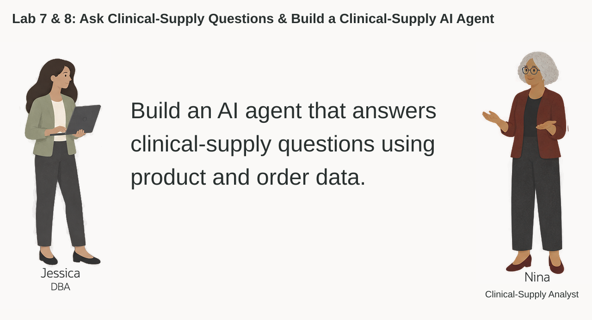
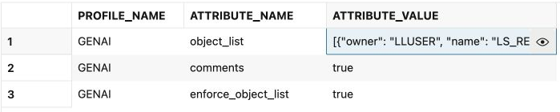
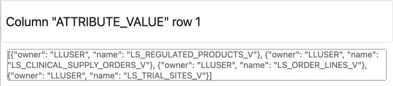
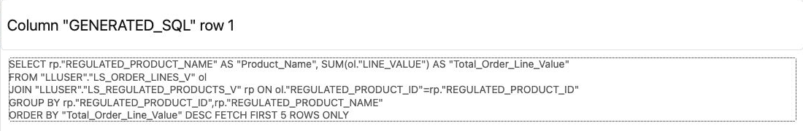
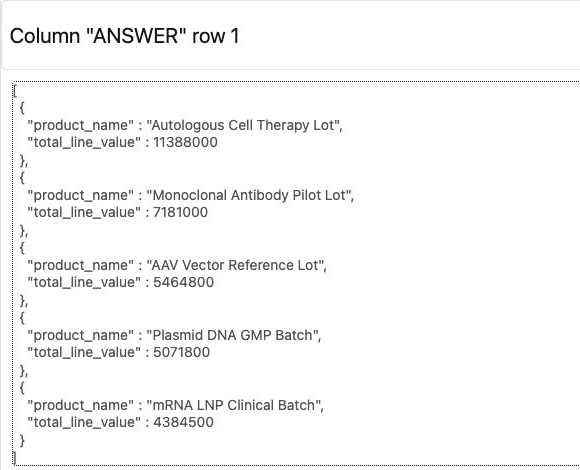
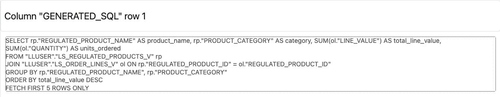
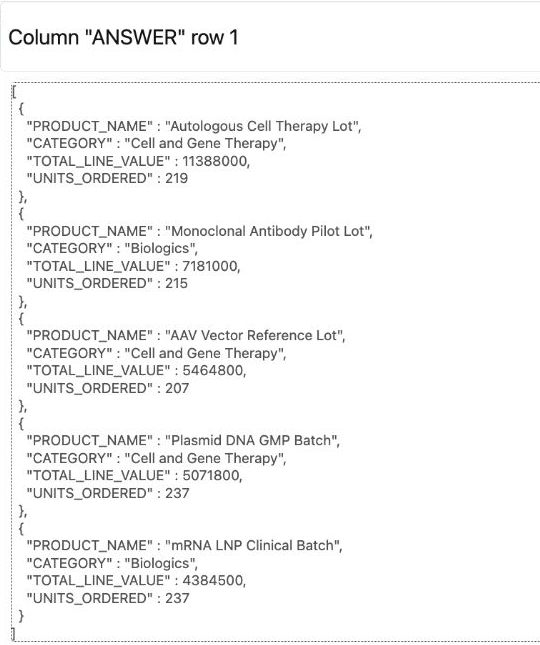
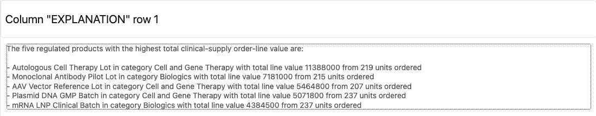

# Ask Life Sciences Questions with Select AI

## Introduction

Nina Patel is a clinical-supply analyst. She knows the business questions she wants to ask, but she does not want every answer to depend on finding the right table, column, join, and filter first.

Jessica, the DBA, has already configured a Select AI profile for the Life Sciences schema. Nina can ask a question in ordinary language. Select AI uses the profile and the database metadata to generate SQL, run it, or explain the result.

Nina still needs to review the generated SQL. The model can misunderstand a question or choose the wrong columns. The useful pattern is simple: ask a question, inspect the SQL, review the returned facts, and refine the question when the result is not what the business user needs.

In this lab, you check the available Select AI profile, ask a Life Sciences question, inspect the SQL behind the answer, and improve the question for a more useful business result.



<details>
<summary><strong>Key terms: Select AI, AI profile, generated SQL, and natural-language prompt</strong></summary>

> - **Select AI** lets a user work with database information through a natural-language question.
>
> - An **AI profile** connects Select AI to an AI provider and identifies the database objects that may be used for the question.
>
> - **Generated SQL** is the SQL statement created from the question. Nina should inspect it before relying on the result.
>
> - A **natural-language prompt** is the question sent to Select AI, such as `Which five regulated products have the highest total clinical-supply order-line value across all orders?`

</details>

### Objectives

- Check which Select AI profile is available in the schema.
- Add the Life Sciences views that Select AI may use to the profile.
- Generate SQL from a Life Sciences question and inspect it.
- Run a natural-language question through `DBMS_CLOUD_AI.GENERATE`.
- Improve a question so the result contains the business details Nina needs.
- Explain why generated SQL still requires review.

Estimated Time: **10 minutes**

### Hands-on Scenario

| Step                | Life Sciences focus                                                                                |
| ---------------------| ----------------------------------------------------------------------------------------------|
| Business Problem    | Nina needs answers from Life Sciences data without writing every query from scratch.               |
| Technical Challenge | The question must be translated into SQL against the governed Life Sciences schema.                |
| Persona Focus       | You follow Nina as she checks, reviews, and improves a Select AI question.                   |
| What You Will See   | A natural-language question becomes SQL that can be inspected and run in the database.       |
| Database Capability | Select AI, `DBMS_CLOUD_AI`, AI profiles, and natural-language-to-SQL generation.             |
| Outcome             | Nina gets a repeatable way to ask Life Sciences questions while keeping SQL review in the process. |

> **SQL Worksheet reminder:** Need a reminder on how to open and use the SQL Worksheet? Return to [Getting Started Task 2: Open SQL Worksheet](?lab=getting-started#Task2:OpenSQLWorksheet) for the step-by-step graphic showing where to paste and run SQL statements.

## Task 1: Check the Select AI profile

Select AI uses an AI profile to identify the AI provider and the database objects available for natural-language questions. The workshop database should already contain a profile for the `LLUSER` schema.

1. Run this query:

    ```sql
    <copy>
    SELECT profile_name,
           status,
           description
    FROM user_cloud_ai_profiles
    WHERE profile_name = 'GENAI';
    </copy>
    ```

    The workshop profile is expected to be named `GENAI`. Confirm that it is enabled. If it is missing or disabled, ask the workshop facilitator for help before continuing.

2. Review the profile attributes:
  
    ```sql
    <copy>
    SELECT profile_name,
           attribute_name,
           attribute_value
    FROM user_cloud_ai_profile_attributes
    WHERE profile_name = 'GENAI'
      AND attribute_name IN ('provider', 'model', 'region', 'object_list',
                             'object_list_mode', 'comments', 'enforce_object_list')
    ORDER BY attribute_name;
    </copy>
    ```

    The attributes show how the profile is configured and which database objects are available to Select AI. Tasks 3–6 explicitly select `xai.grok-4.3` for each request rather than relying on the profile's default model. The profile still supplies the provider, region, authentication, and object access settings. Do not copy credentials. In Task 2, you will configure the four-view object list, include its comments, and enable object-list enforcement.

## Task 2: Add the Life Sciences views to the profile

The profile needs a list of database objects that Select AI may use. Nina's questions require product, order, order-line, and trial-site data, so Jessica adds those four supplied views to the `GENAI` profile.

1. Add the Life Sciences views to the profile:

    ```sql
    <copy>
    BEGIN
      DBMS_CLOUD_AI.SET_ATTRIBUTE(
        profile_name    => 'genai',
        attribute_name  => 'object_list',
        attribute_value => '[{"owner": "' || USER || '", "name": "LS_REGULATED_PRODUCTS_V"}, {"owner": "' || USER || '", "name": "LS_CLINICAL_SUPPLY_ORDERS_V"}, {"owner": "' || USER || '", "name": "LS_ORDER_LINES_V"}, {"owner": "' || USER || '", "name": "LS_TRIAL_SITES_V"}]'
      );
      DBMS_CLOUD_AI.SET_ATTRIBUTE('GENAI', 'comments', 'true');
      DBMS_CLOUD_AI.SET_ATTRIBUTE('GENAI', 'enforce_object_list', 'true');
    END;
    /
    </copy>
    ```

2. Confirm the object list:

    ```sql
    <copy>
    SELECT profile_name,
           attribute_name,
           attribute_value
    FROM user_cloud_ai_profile_attributes
    WHERE profile_name = 'GENAI'
      AND attribute_name IN ('object_list', 'comments', 'enforce_object_list');
    </copy>
    ```

    The result should list `LS_REGULATED_PRODUCTS_V`, `LS_CLINICAL_SUPPLY_ORDERS_V`, `LS_ORDER_LINES_V`, and `LS_TRIAL_SITES_V`. Comments describe the join keys and the difference between order headers and lines. Object-list enforcement restricts generated queries to this scope; it does not grant or revoke database privileges.
  
    

    

## Task 3: Ask a question and inspect the SQL

Nina starts with a simple question: which products have the highest total clinical-supply order-line value across all orders? She first asks Select AI to show the SQL without running it.

Database Actions does not support the `SELECT AI` keyword. In SQL Worksheet, use `DBMS_CLOUD_AI.GENERATE` and provide the profile name directly.

1. Run the question with the `GENAI` profile:

    ```sql
    <copy>
    SELECT DBMS_CLOUD_AI.GENERATE(
             prompt       => 'Which five regulated products have the highest total clinical-supply order-line value across all orders?',
             profile_name => 'genai',
             action       => 'showsql',
             attributes   => '{"model":"xai.grok-4.3"}'
           ) AS generated_sql;
    </copy>
    ```
  
    

2. Read the generated SQL before running it.

    Check whether the statement uses the expected regulated-product and order-line data, returns five rows, and sums `LS_ORDER_LINES_V.LINE_VALUE` once per item. Join the product view on `REGULATED_PRODUCT_ID`. Do not sum order-header totals after joining their multiple lines. Select AI can generate a valid-looking statement that does not answer the question precisely, so the generated SQL is part of the result Nina reviews.

## Task 4: Run the question in the database

Nina has reviewed the SQL. She now asks Select AI to run the question and return the database result. This is a separate generation: `runsql` does not execute the saved `showsql` text, so compare the returned facts as well as the earlier SQL.

1. Run the same question with the `runsql` action:

    ```sql
    <copy>
    SELECT DBMS_CLOUD_AI.GENERATE(
             prompt       => 'Which five regulated products have the highest total clinical-supply order-line value across all orders?',
             profile_name => 'genai',
             action       => 'runsql',
             attributes   => '{"model":"xai.grok-4.3"}'
           ) AS answer;
    </copy>
      ```
  
    

2. Compare the answer with the SQL you inspected in Task 3.

    Select AI has generated and run SQL against the Life Sciences schema. The query still runs under Nina's database privileges, and the result comes from the database tables rather than from a separate copy of the Life Sciences data.

    > **Note:** Select AI can generate incorrect SQL or misunderstand a question. Use `showsql` when the exact query matters, and treat the generated answer as a starting point for review.

## Task 5: Improve the business question

Nina's first question gives her a product ranking, but she also needs enough detail to decide what to review. She changes the question to request the product category, total line value, and units ordered.

1. Use `showsql` to inspect this revised prompt:

    ```sql
    <copy>
    SELECT DBMS_CLOUD_AI.GENERATE(
             prompt       => 'Show the five regulated products with the highest total clinical-supply order-line value across all orders. Include the product name, category, total line value, and units ordered. Exclude shipping costs.',
             profile_name => 'genai',
             action       => 'showsql',
             attributes   => '{"model":"xai.grok-4.3"}'
           ) AS generated_sql;
    </copy>
    ```
  
    

2. Review the generated SQL, then run the revised question with `runsql`:

    ```sql
    <copy>
    SELECT DBMS_CLOUD_AI.GENERATE(
             prompt       => 'Show the five regulated products with the highest total clinical-supply order-line value across all orders. Include the product name, category, total line value, and units ordered. Exclude shipping costs.',
             profile_name => 'genai',
             action       => 'runsql',
             attributes   => '{"model":"xai.grok-4.3"}'
           ) AS answer;
    </copy>
    ```
  
    

3. Compare the first and second questions.

  The second prompt gives Nina a result she can take into a review meeting. The business user did not need to know the table names or write the joins, but Nina still checked the SQL and made the requested columns explicit.

## Task 6: Explain the result

Nina wants a short explanation of the revised result. Select AI can run the SQL and ask the AI provider to describe the returned rows.

1. Run the revised question with the `narrate` action:

    ```sql
    <copy>
    SELECT DBMS_CLOUD_AI.GENERATE(
             prompt       => 'Show the five regulated products with the highest total clinical-supply order-line value across all orders. Include the product name, category, total line value, and units ordered. Exclude shipping costs.',
             profile_name => 'genai',
             action       => 'narrate',
             attributes   => '{"model":"xai.grok-4.3"}'
           ) AS explanation;
    </copy>
    ```
  
    

2. Review the explanation against the SQL result.

  The explanation is a convenience for a business user. The SQL result remains the record Nina can inspect, repeat, and use to check whether the explanation is accurate. Wording and detail can vary: this example includes the five products, categories, line values, and quantities. Compare those facts with Task 5's result rather than expecting identical wording.

  > **Note:** The `narrate` action sends the query result to the AI provider configured in the profile. Use it only for data approved for that provider.

## Conclusion: Ask, Inspect, and Refine

Nina used Select AI to turn a Life Sciences question into SQL, reviewed the generated statement, ran it in Oracle AI Database, and refined the question when the first result lacked the details she needed. Select AI reduces the amount of SQL a business user has to write, while SQL review keeps the database operation visible.

This is the practical value of Select AI in Oracle AI Database. The question, generated SQL, and result stay connected to the governed Life Sciences schema. Nina can ask in ordinary language, but she does not have to give up database access controls or the ability to inspect the query behind the answer.

Select AI does not replace judgment. A good workflow is to show the SQL, check the tables and filters, run the statement, and compare the answer with the business question.

## Next Steps

For the full list of Select AI actions, profile attributes, and supported providers, see the [Oracle AI Database 26ai Select AI documentation](https://docs.oracle.com/en/database/oracle/oracle-database/26/selai/).

## Acknowledgements

* **Author** - Kevin Lazarz
* **Contributor** - Eugenio Galiano
* **Last Updated By/Date** - Joshua Pasaribu, October 2026
