# Assess Trial-Site Coverage Using Spatial SQL

## Introduction

Moon Kai is Seer Scientific's spatial specialist. The clinical-supply team asks Moon to review its service footprint around New York and Chicago: where are the trial sites, and how far are they from the depots that could support them?

The team already stores the required data in Oracle AI Database. Cold-chain depots and trial sites are stored as map points. Demand regions are stored as map areas, and each region has a demand score.

Moon wants operations users to answer a simple question with SQL that can power a business-user dashboard and map:

> We are reviewing support for a high-demand region. **Which trial sites are in that region, and how far is each one from its closest active cold-chain depot?**

In this lab, you follow Moon's approach. You start with a single point, measure distance to a region, find trial sites inside that region, and finish with a site-by-site view of geographic proximity. The result combines location and service data so the team can review its regional footprint before making service commitments.

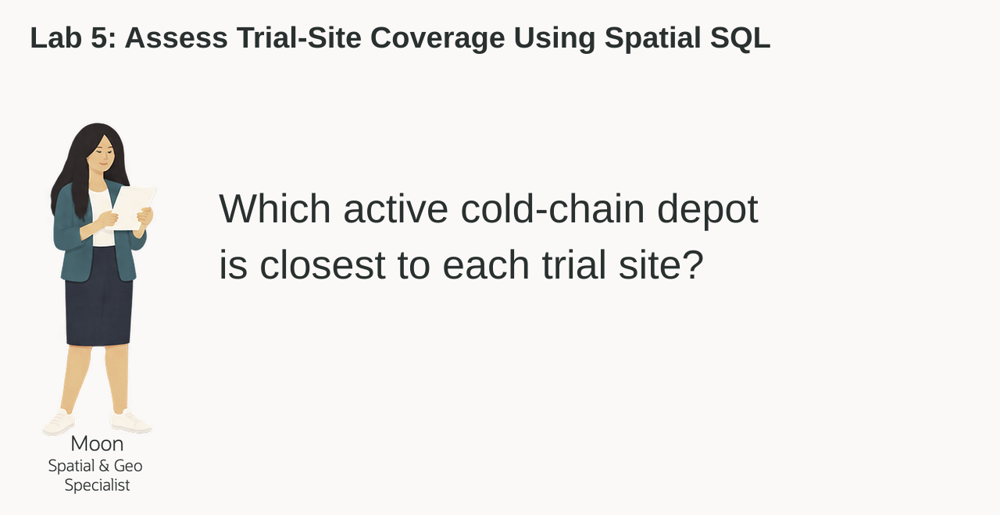

<details>
<summary><strong>Key terms: point, polygon, distance, spatial relationship, and GeoJSON</strong></summary>

> - A **point** is one location, represented by longitude and latitude. In this lab, a cold-chain depot is stored as an `SDO_GEOMETRY` point.
>
> - A **polygon** is an area made from connected points. Demand regions are stored as polygons.
>
> - **Distance** measures how far two spatial objects are from each other. Here, it shows how far a depot is from a demand-region polygon. A distance of zero means the point is inside or touching the region, within the calculation's tolerance.
>
> - A **spatial relationship** describes how two shapes relate to each other. `SDO_GEOM.RELATE` can test whether a trial-site point is inside or touches a demand region.
>
> - **GeoJSON** is a JSON format for map locations and shapes. `SDO_UTIL.TO_GEOJSON` lets an application display the same database location on a map.

</details>

The Life Sciences LiveStack Demo uses these kinds of spatial layers in its Cold-Chain Service Coverage page. The map helps users see the geography; the SQL in this lab shows how Oracle calculates proximity. The application image below provides context, not the expected output of the workshop queries.

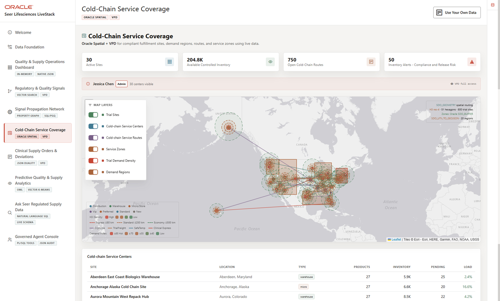

### Objectives

- Identify spatial points and polygons in the Life Sciences data.
- Convert a database point to GeoJSON for an application map.
- Measure which cold-chain depots are closest to a demand region.
- Find trial sites inside a demand region.
- Match each trial site to the closest active depot for further operational review.

Estimated Time: **10 minutes**

### Hands-on Scenario

| Step | Life Sciences focus |
| --- | --- |
| Business Problem | The clinical-supply team needs to understand how trial sites in a high-demand region are distributed relative to its cold-chain depots. |
| Technical Challenge | Moon needs to compare trial-site points with a region, then find the closest depot for each site. |
| Persona Focus | You review Moon's spatial approach and interpret the result for a supply operations user. |
| What You Will See | Oracle Spatial turns points and region polygons into a site-by-site view of geographic proximity with SQL. |
| Database Capability | `SDO_GEOMETRY`, `SDO_GEOM.SDO_DISTANCE`, `SDO_GEOM.RELATE`, and GeoJSON conversion support the analysis. |
| Outcome | An operations user can review the sites in a region, each site's nearest active depot, and the distance between them before making service commitments. |

> **SQL Worksheet reminder:** Need a reminder on how to open and use SQL Worksheet? Return to [Getting Started Task 2: Open SQL Worksheet](?lab=getting-started#Task2:OpenSQLWorksheet) for the step-by-step graphic showing where to paste and run SQL statements.

## Task 1: Look at the cold-chain locations as points

Moon starts with the simplest spatial question: **where are the cold-chain depots?** The database stores each depot as an `SDO_GEOMETRY` point, while the application can use the same point as GeoJSON.

An `SDO_GEOMETRY` point is Oracle Spatial's structured representation of one location. For example, the Edison depot is stored with a point type, the WGS84 coordinate system (SRID `4326`), and a coordinate pair: longitude `-74.4121` and latitude `40.5187`. Because Oracle stores the location as geometry, Spatial functions can calculate distance and test spatial relationships instead of treating the coordinates as two unrelated numbers.

`SDO_UTIL.TO_GEOJSON` converts that geometry into a standard JSON map object such as `{ "type": "Point", "coordinates": [-74.4121, 40.5187] }`. The application can send this object to a map without maintaining a second location format or a separate conversion service. Oracle uses the same stored geometry for SQL analysis and application display.

That is the Oracle AI Database advantage in this lab: one location supports spatial calculations, relational joins, and JSON map output without copying the data between systems.

1. Run this query:

    ```sql
    <copy>
    SELECT cold.cold_chain_site_id,
           cold.cold_chain_site_name,
           cold.city,
           cold.state_province,
           cold.latitude,
           cold.longitude,
           DBMS_LOB.SUBSTR(SDO_UTIL.TO_GEOJSON(fc.location), 120, 1) AS location_geojson
    FROM ls_cold_chain_sites_v cold
    JOIN fulfillment_centers fc ON fc.center_id = cold.cold_chain_site_id
    WHERE cold.cold_chain_site_id IN (1, 3, 16)
    ORDER BY cold.cold_chain_site_id;
    </copy>
    ```

    `LS_COLD_CHAIN_SITES_V` supplies the Life Sciences names and attributes. Its `COLD_CHAIN_SITE_ID` matches `FULFILLMENT_CENTERS.CENTER_ID`, where the point is stored. The join returns one row per depot, not a new copy of the location.

    `LATITUDE` and `LONGITUDE` make the value easy to read, and `LOCATION_GEOJSON` gives an application a map-ready representation of the same point. GeoJSON lists longitude first and latitude second. `SDO_UTIL.TO_GEOJSON` returns a CLOB, so `DBMS_LOB.SUBSTR` limits the displayed text to 120 characters; it does not change the stored geometry.

    **Expected output: Cold-Chain Depot Points**

    The three rows are Edison Northeast Cold Chain Depot (ID 1), Joliet Midwest Regulatory Hub (ID 3), and Middletown Mid-Atlantic Cold Chain Hub (ID 16).

    The companion panels show the same three rows: depot details first, then coordinates and GeoJSON.

    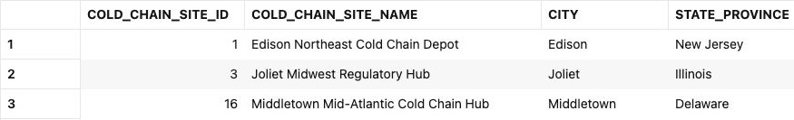

    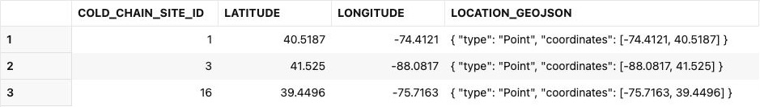

2. Review the point data.

    Moon has not created a second map database. The point used by the application and the point used by SQL are the same value. The database can calculate with it, and the application can display it.

    This is the converged-database advantage. Moon can keep the depot's location beside its name, capacity, operating status, and stored utilization. SQL can calculate distance and return those details, while `SDO_UTIL.TO_GEOJSON` gives the application the same location for a map.

## Task 2: Find the closest cold-chain sites to a demand region

New York Metro has a demand index of `91`, making it a useful region for the first coverage review. Moon now measures the distance from each depot point to the region polygon.

1. Run the distance query:

    ```sql
    <copy>
    SELECT cold.cold_chain_site_name,
           cold.city,
           cold.state_province,
           ROUND(SDO_GEOM.SDO_DISTANCE(
             fc.location, dr.boundary, 0.005, 'unit=KM'
           ), 2) AS region_distance_km,
           dr.region_name,
           dr.demand_index
    FROM ls_cold_chain_sites_v cold
    JOIN fulfillment_centers fc ON fc.center_id = cold.cold_chain_site_id
    CROSS JOIN demand_regions dr
    WHERE dr.region_name = 'New York Metro'
    ORDER BY SDO_GEOM.SDO_DISTANCE(
               fc.location, dr.boundary, 0.005, 'unit=KM'
             ), cold.cold_chain_site_id
    FETCH FIRST 10 ROWS ONLY;
    </copy>
    ```

    `SDO_GEOM.SDO_DISTANCE` compares the depot point with the demand-region polygon. The function returns the shortest distance between the two shapes. A value of zero means the point is inside or touching the region within tolerance; it does not mean the point is on the polygon's perimeter.

    The four arguments have simple roles:

    - `fc.location` is the first geometry: the depot point.
    - `dr.boundary` is the second geometry: the demand-region polygon.
    - `0.005` is the tolerance used when Oracle compares the geometries. For this geographic coordinate system it is measured in meters, not degrees. It is a calculation tolerance, not a claim that the source coordinates are accurate to five millimeters.
    - `'unit=KM'` tells Oracle to return the distance in kilometers. Use `'unit=MILE'` when the application needs miles.

    `ROUND(..., 2)` formats the displayed answer to two decimal places. The query orders by the unrounded distance, then depot ID, so rounding does not determine which depot comes first.

    The query also returns `DEMAND_INDEX`, so Moon can read location and demand together. This gives her a first view of how the depots sit around the selected region; it does not yet show how far individual trial sites are from them.

    **Expected output: New York Cold-Chain Proximity**

    Edison is first at **9.48 km** from the New York Metro polygon. The two panels show the same ten rows in the same order.

    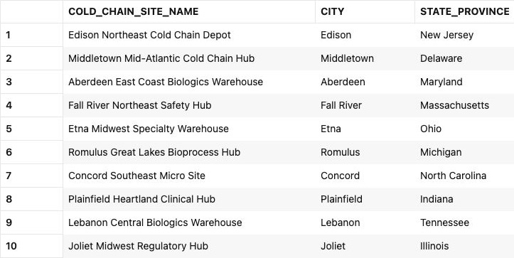

    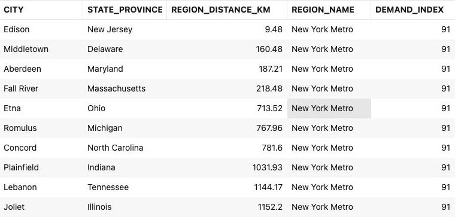

2. Try another region.

    Change the region to `Chicago Metro`, add a miles calculation, and run the modified query:

    ```sql
    <copy>
    SELECT cold.cold_chain_site_name,
           cold.city,
           cold.state_province,
           ROUND(SDO_GEOM.SDO_DISTANCE(
             fc.location, dr.boundary, 0.005, 'unit=KM'
           ), 2) AS region_distance_km,
           ROUND(SDO_GEOM.SDO_DISTANCE(
             fc.location, dr.boundary, 0.005, 'unit=MILE'
           ), 2) AS region_distance_miles,
           dr.region_name,
           dr.demand_index
    FROM ls_cold_chain_sites_v cold
    JOIN fulfillment_centers fc ON fc.center_id = cold.cold_chain_site_id
    CROSS JOIN demand_regions dr
    WHERE dr.region_name = 'Chicago Metro'
    ORDER BY SDO_GEOM.SDO_DISTANCE(
               fc.location, dr.boundary, 0.005, 'unit=KM'
             ), cold.cold_chain_site_id
    FETCH FIRST 10 ROWS ONLY;
    </copy>
    ```

    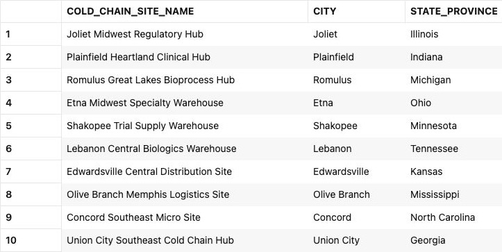

    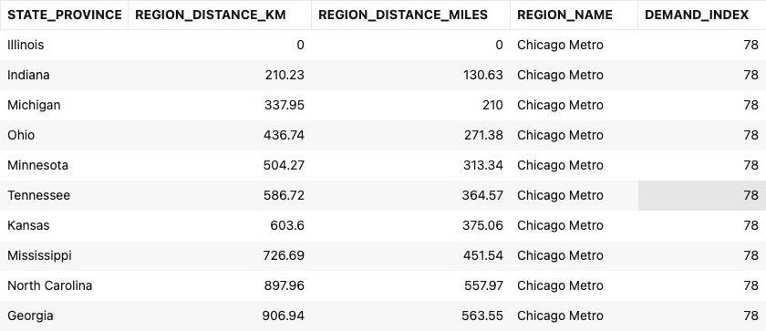

    The `unit` parameter controls the measurement unit. Joliet Midwest Regulatory Hub falls inside the Chicago Metro polygon, so its region distance is zero kilometers and zero miles. Chicago has a demand index of `78`.

    This is a useful regional result, but a depot near a region is not necessarily close to every trial site within it. Moon now uses the region polygon to find the trial sites and measures how far each one is from the active depots.

## Task 3: Match trial sites to the closest active cold-chain site

Moon now needs a result that an operations application can use to review the regional footprint: trial sites inside New York Metro, their closest active depot, and the distance to that depot. The query uses the trial-site point (`sites.location`) and demand-region polygon (`dr.boundary`) to find sites first. It then compares each point with every active depot and keeps the closest one.

1. Run the trial-site matching query:

    ```sql
    <copy>
    WITH regional_sites AS (
      SELECT dr.region_name,
             dr.demand_index,
             sites.trial_site_id,
             sites.trial_site_name,
             sites.site_contact_email,
             sites.trial_site_tier,
             sites.location
      FROM ls_trial_sites_v sites
      CROSS JOIN demand_regions dr
      WHERE dr.region_name = 'New York Metro'
        AND SDO_GEOM.RELATE(
              dr.boundary, 'ANYINTERACT', sites.location, 0.005
            ) = 'TRUE'
    ), ranked_centers AS (
      SELECT rs.region_name,
             rs.demand_index,
             rs.trial_site_id,
             rs.trial_site_name,
             rs.site_contact_email,
             rs.trial_site_tier,
             cold.cold_chain_site_name,
             cold.city AS cold_chain_city,
             cold.controlled_storage_capacity,
             cold.utilization_pct,
             SDO_GEOM.SDO_DISTANCE(
               rs.location, fc.location, 0.005, 'unit=KM'
             ) AS distance_km,
             ROW_NUMBER() OVER (
               PARTITION BY rs.trial_site_id
               ORDER BY SDO_GEOM.SDO_DISTANCE(
                          rs.location, fc.location, 0.005, 'unit=KM'
                        ), cold.cold_chain_site_id
             ) AS center_rank
      FROM regional_sites rs
      CROSS JOIN ls_cold_chain_sites_v cold
      JOIN fulfillment_centers fc ON fc.center_id = cold.cold_chain_site_id
      WHERE cold.is_active = 1
    )
    SELECT region_name,
           demand_index,
           trial_site_id,
           trial_site_name,
           site_contact_email,
           trial_site_tier,
           cold_chain_site_name,
           cold_chain_city,
           controlled_storage_capacity,
           utilization_pct,
           ROUND(distance_km, 2) AS site_center_distance_km
    FROM ranked_centers
    WHERE center_rank = 1
    ORDER BY distance_km, trial_site_id
    FETCH FIRST 25 ROWS ONLY;
    </copy>
    ```

    `LS_TRIAL_SITES_V` presents `CUSTOMERS` as the trial-site business shape and already exposes its geometry. The supplied sample retains person-style names and contact addresses; use `TRIAL_SITE_ID` to identify each distinct record.

    `SDO_GEOM.RELATE` keeps trial sites whose point falls inside or touches the New York Metro polygon. `SDO_GEOM.SDO_DISTANCE` then measures the distance from each matching site to every active depot. `ROW_NUMBER` keeps one nearest depot per trial site, using depot ID to break equal-distance ties.

2. Review the result as an operations planning decision.

    Each row gives a business user a trial site and contact, the closest active depot, and its capacity, stored utilization and geographic distance. The team can see how the region's trial sites relate to its depots without comparing a map with a separate site list. The query combines region demand, site details and depot details in one SQL result.

    The fixed dataset stores `UTILIZATION_PCT` as zero for every depot. This is the stored sample value, not proof of empty storage or available product stock. The demo application's calculated inventory load is a different measure.

    The query displays 25 of the 114 matching trial sites. These 25 rows all identify Edison Northeast Cold Chain Depot; the first site is ID `385` at **35.34 km** from Edison. The three panels show the same rows in the same order, with different columns visible to keep the text readable.

    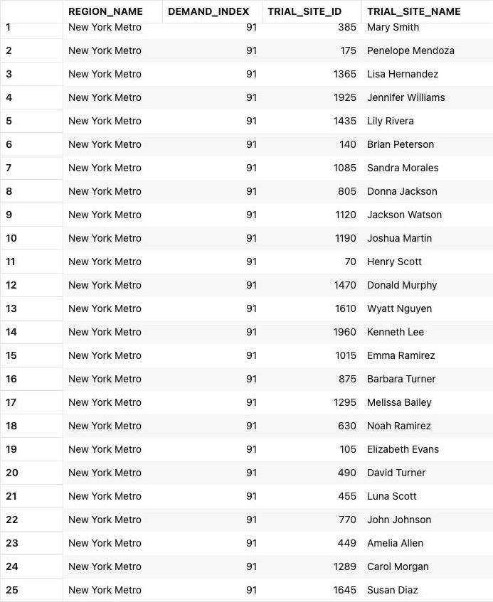

    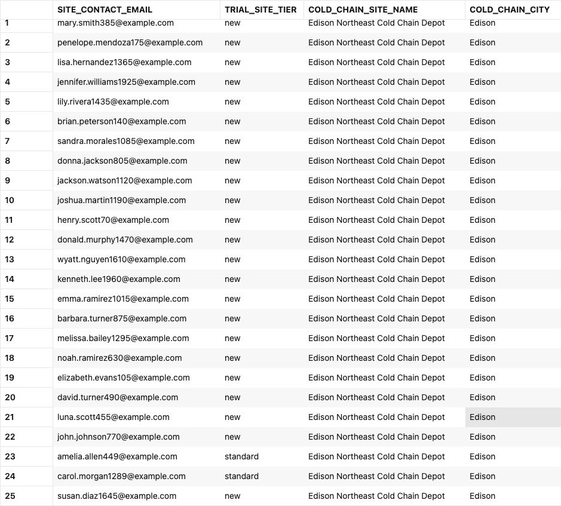

    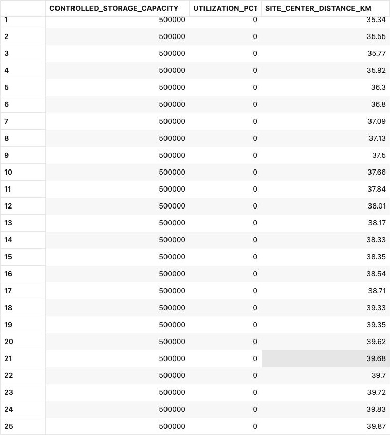

    A dashboard can let a user select a region and review these site-to-depot distances immediately. Geographic proximity alone does not establish temperature compliance, suitable product storage, available stock, an open road route or actual travel time. Operations must verify those conditions before making a cold-chain commitment. The query does not assign an order or reserve inventory.

3. Change the query to `Chicago Metro`.

    Replace only the region name in the query above and run it again. Compare the trial sites and nearest depots with the New York result. The spatial predicates stay the same; only the region changes.

    The query displays 25 of the 58 matching trial sites. These rows identify Joliet Midwest Regulatory Hub; the first site is ID `1717` at **49.51 km** from Joliet. Although Joliet's distance to the Chicago region is zero, its distance to an individual trial-site point is not zero.

    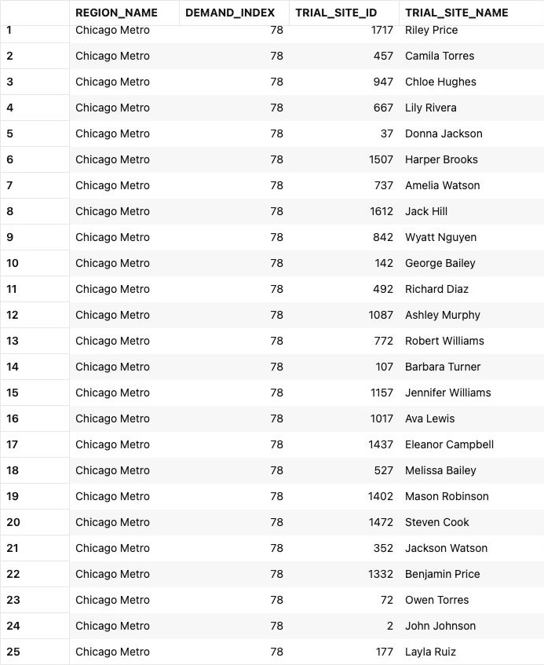

    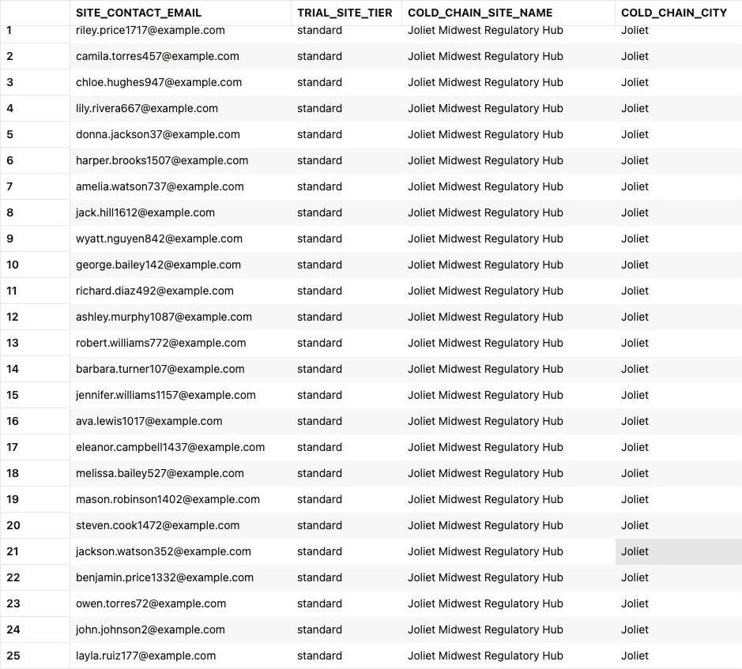

    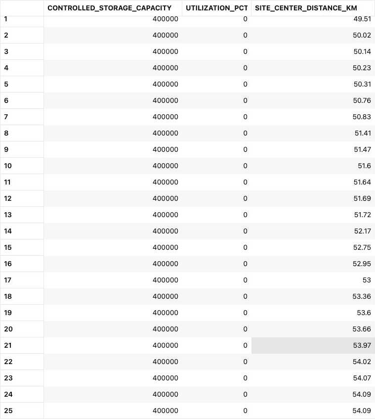

## Conclusion: Turn Location into a Service Decision

Moon's analysis moves from a point, to regional distance, to a site-by-site view of the service footprint. New York Metro and Chicago Metro contain different trial sites, and the closest depots sit at different distances from those sites. A business user can select a region and review those distances before making service commitments. The result supports geographic planning rather than guaranteeing cold-chain service.

This shows why Spatial in Oracle AI Database matters. One converged query can identify trial sites with spatial functions, join them to relational site and depot data, and include capacity and stored utilization in the same result. The dashboard can show map locations and business details from one database, without maintaining a separate copy of the geography.

## Next Steps

You used Oracle Spatial to turn points and polygons into a proximity-based planning result. For a deeper hands-on workshop focused on Oracle Spatial, open the [Oracle Spatial LiveLabs workshop](https://livelabs.oracle.com/ords/r/dbpm/livelabs/view-workshop?clear=RR,180&wid=800).

## Acknowledgements

* **Author** - Kevin Lazarz
* **Contributor** - Eugenio Galiano, Linda Foinding
* **Last Updated By/Date** - Joshua Pasaribu, October 2026
